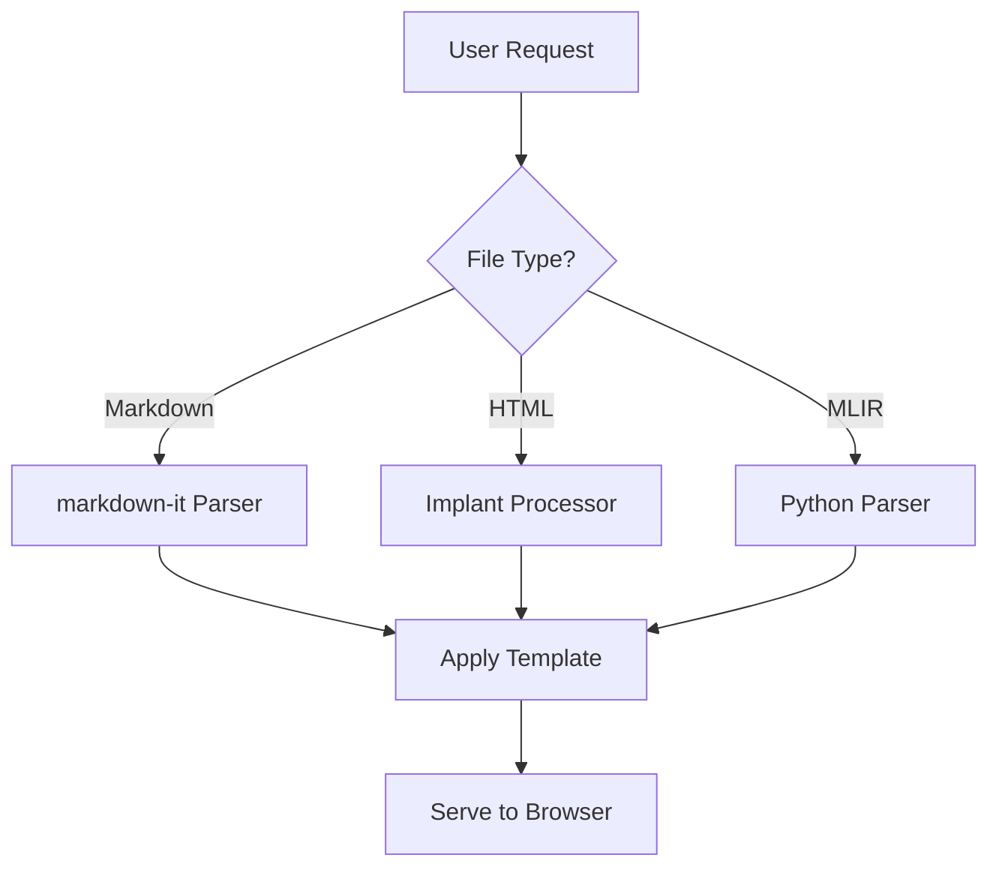

# CLAUDE.md

This file provides guidance to Claude Code (claude.ai/code) when working with code in this repository.

## Commands

### Development & Testing

```bash
# Run tests with code linting
npm test

# Run tests with coverage
npm run cover

# Linting only (uses XO)
npx xo

# Clean build artifacts
npm run clean              # Remove dist/ only
npm run clean:artifacts    # Remove all build artifacts (dist/, coverage/, Bazel artifacts)

# Start the server (from repository root)
./lib/cli.js [file-or-directory]

# Or using the global command (if installed globally)
markserv [file-or-directory]

# Start with specific options
./lib/cli.js -p 3000 -a 0.0.0.0 ./README.md  # Custom port and address
./lib/cli.js -s ./docs/                       # Silent mode
./lib/cli.js -v ./                            # Verbose mode
./lib/cli.js -w ./                            # Enable file watching (live reload)
```

### Running a Single Test

```bash
# Tests use AVA framework
npx ava tests/service.test.js              # Run specific test file
npx ava tests/*.test.js --match "*table*"  # Run tests matching pattern
```

### Setting Up Python Dependencies

```bash
# Install Python dependencies for ONNX and MLIR support
npm run setup:python

# This will:
# - Check if Python 3.9+ is available
# - Install onnx>=1.12.0 (for ONNX shape inference)
# - Install ai-edge-model-explorer-adapter>=0.1.13 (for MLIR parsing)
# - Work with conda environments automatically

# Note: These dependencies are optional and only needed for ONNX/MLIR features
```

### Building Model Explorer Adapter from Source (Advanced)

If the pre-built adapter has GLIBC compatibility issues on your Linux system:

```bash
# Build and install the ai-edge-model-explorer-adapter from source
npm run build:adapter

# Prerequisites:
# - Bazel (brew install bazelisk on macOS, or sudo apt install bazel on Ubuntu)
# - Python 3.9+
# - C++ build tools (Xcode on macOS, build-essential on Linux)

# Resource limits are automatically applied:
# - CPU cores limited to 50% of available cores (minimum 1)
# - RAM limited to 12GB
# - Build process runs with lower priority (nice -n 10)
```

## Documentation & Visualization Best Practices

### Mermaid Diagrams for Enhanced Understanding

**IMPORTANT:** When generating markdown documentation, use Mermaid diagrams to visualize complex concepts, relationships, and workflows for better understanding.

**Use Mermaid diagrams for:**

- **Architecture diagrams**: System components, microservices, layers
- **Flow charts**: Request flows, data pipelines, decision trees
- **Sequence diagrams**: API interactions, authentication flows, multi-step processes
- **State diagrams**: Application states, lifecycle transitions
- **Entity relationships**: Database schemas, data models
- **Class diagrams**: Object hierarchies, inheritance structures
- **Gantt charts**: Project timelines, development phases

**Example:**

````markdown

````

**CRITICAL - Mermaid Syntax Validation:**

**All generated Mermaid diagrams MUST be syntactically valid and render without errors.** Before including any Mermaid diagram:

1. **Verify syntax correctness** - Check node IDs, edge syntax, and proper escaping
2. **Test common issues**:
   - Node IDs must start with a letter and contain only alphanumeric characters, underscores, or hyphens
   - Text containing special characters (parentheses, brackets, quotes) must be properly escaped or quoted
   - Edge labels must use the correct syntax: `A -->|label| B` or `A -- label --> B`
   - Subgraphs must have valid syntax and proper indentation
3. **Follow diagram-specific rules**:
   - **Flowcharts**: Use valid node shapes `[ ]`, `( )`, `(( ))`, `{ }`, `[/ /]`, etc.
   - **Sequence diagrams**: Use correct participant syntax and message arrows
   - **State diagrams**: Use proper state transition syntax
   - **Class diagrams**: Follow UML class notation correctly

**Common syntax errors to avoid:**

- Using special characters in node IDs without quoting
- Incorrect edge syntax (missing arrows or wrong arrow types)
- Mismatched brackets or parentheses in node definitions
- Invalid subgraph syntax or nesting
- Improper escaping of special characters in labels

**Benefits:**
- Immediate visual comprehension of complex systems
- Self-documenting architecture and flows
- Easier onboarding for new developers
- Better technical communication in documentation

This server already supports Mermaid rendering through custom fence renderers, so diagrams will be automatically rendered when markdown files are served.

## Test Files Convention

**IMPORTANT:** All test files and test-related content should be generated in the `tests/` directory. This includes:
- Unit test files (*.test.js)
- Test fixtures and sample files
- Expected output files (*.expected.html)
- Any temporary test files for feature verification

When creating test examples or sample files for new features (like MLIR support), place them in the `tests/` directory to maintain consistency with the existing test structure.

## Architecture Overview

### Core Components

**Entry Points:**

- `lib/cli.js` - CLI entry point that parses command-line arguments and initializes the server
- `lib/readme.js` - Alternative entry point that finds and serves the nearest README.md
- `lib/server.js` - Main server logic containing all rendering and serving functionality

**Request Flow:**

1. **CLI Processing** (`cli.js`): Validates paths and passes flags to server initialization
2. **Server Initialization** (`server.js:init`): Sets up HTTP server, LiveReload server, and Connect middleware
3. **Request Handler** (`server.js:createRequestHandler`): Routes requests based on file type:
   - Markdown files → Convert to HTML using markdown-it → Apply template
   - HTML files → Process with implant system for includes
   - MLIR files → Apply syntax highlighting → Render as HTML
   - Directories → Generate index listing with icons
   - Other files → Serve directly using `send` module

### File Type Processing

**Markdown Rendering Pipeline:**

- Uses `markdown-it` with multiple plugins (anchor, TOC, emoji, MathJax, highlight.js)
- Custom fence renderers for Mermaid diagrams and MLIR code blocks
- Renders through Handlebars templates in `lib/templates/`

**Template System (Implant):**

- Just-in-time template processing for includes
- Supports nested content with `{markdown: path}`, `{html: path}`, `{less: path}` syntax
- Maximum nesting depth of 10 levels
- Templates are processed recursively when requested

**MLIR Support (Custom Addition):**

- `.mlir` files are recognized as a distinct file type
- Python-based graph parsing using Model Explorer's pre-built adapter
- Converts MLIR text to Model Explorer graph format via `lib/mlir-to-graph.ts`
- Executes `scripts/parse_mlir_with_adapter.py` for MLIR parsing
- Displays tensor shapes in node labels (input/output dimensions)
- Supports StableHLO, TensorFlow Lite, and other MLIR dialects
- Requires Python 3.9+ with `ai-edge-model-explorer-adapter` package

### LiveReload Integration

- Watches file changes in configured extensions (markdown, HTML, CSS, JS, images, MLIR)
- Excludes `node_modules/` and `.git/` directories
- Communicates on port 35729 by default
- Requires browser extension for automatic reloading

### Directory Indexing

- Material Design icons mapped to file extensions via `lib/icons/material-icons.json`
- Breadcrumb navigation generated for directory paths
- Icons determined by file extension or folder name patterns

### Key Dependencies and Their Roles

- `markdown-it` + plugins: Core markdown processing
- `handlebars`: Template rendering for HTML output
- `implant`: Recursive template inclusion system
- `connect` + `connect-livereload`: HTTP server middleware
- `livereload`: File watching and browser communication
- `send`: Static file serving with proper MIME types
- `less`: LESS to CSS compilation for includes
- `chalk`: Terminal output styling

## File Structure Patterns

**Template Files:** Located in `lib/templates/`

- `markdown.html` - Template for rendered markdown/MLIR files
- `directory.html` - Template for directory listings
- `error.html` - Template for error pages (404, 500)

**Static Resources:**

- CSS files use GitHub-like styling (`github.less`, `markserv.css`)
- Icons stored in `lib/icons/` with mapping in `material-icons.json`

**Test Structure:**

- Tests in `tests/` directory use AVA framework
- Each test creates a temporary server instance with `getPort()`
- Tests make HTTP requests to verify rendering output

## Important Implementation Details

**URL Handling:**

- Special `{markserv}` URLs resolve to library resources
- Path normalization handles various input formats (relative, absolute)
- URL parameters are stripped before file resolution

**Error Handling:**

- 404 errors show custom error page with referer link
- Favicon requests are handled specially to avoid 404 logs
- Errors during rendering fall back to error page template

**Security Considerations:**

- Path traversal prevention through normalization
- HTML escaping in templates and error messages
- Configurable address binding (default: localhost)

## Recent Modifications

**MLIR Support Implementation:**

- Added MLIR to recognized file types in `fileTypes` object
- Implemented Python-based MLIR parsing using Model Explorer's pre-built adapter
- Created `scripts/parse_mlir_with_adapter.py` for MLIR graph conversion
- Added tensor shape display in node labels (input/output shapes)
- Modified `lib/mlir-to-graph.ts` to use Python adapter exclusively
- Added MLIR files to watch list for live reload
- Requires Python 3.9+ and `ai-edge-model-explorer-adapter` package

**Dense Constant Removal (Segfault Prevention):**

- **Problem**: C++ adapter crashes (segfault) when parsing MLIR files containing dense constant tensors
- **Solution**: Automatic preprocessing in `scripts/parse_mlir_with_adapter.py`:
  - Removes ALL `dense<...>` constant values before passing to C++ adapter
  - Replaces with minimal placeholders: `dense<0.0>` with informative comment
  - Preserves tensor type information (shape, dtype) for graph structure
  - Handles both single-line and multi-line constants
  - Adds metadata to JSON output with count of removed constants
  - Rejects files >100MB with helpful error message
- **Impact**:
  - ✅ Complete elimination of segfault risk
  - ✅ Faster parsing (less data to process)
  - ✅ All graph structure and shape information preserved
  - ✅ Values not needed for visualization anyway
- **Example Transformations**:
  - `dense<[1.0, 2.0, ..., 1000 values]>` → `dense<0.0>  // VALUES_REMOVED (4KB, shape: 1000xf32)`
  - Large weights: `dense<[[...]]>` (5MB) → `dense<0.0>  // VALUES_REMOVED (5.0MB, shape: 1000x1000xf32)`

**Python Dependencies:**

MLIR graph parsing and ONNX shape inference require Python 3.9+ with these packages:
- `onnx>=1.12.0` - For ONNX model shape inference
- `ai-edge-model-explorer-adapter>=0.1.13` - Google's pre-built C++ MLIR parser

**Quick setup:**
```bash
npm run setup:python
```

This script will automatically check and install the required packages. It works with conda environments and provides helpful error messages.

**Manual installation:**
```bash
pip install onnx ai-edge-model-explorer-adapter
```

**Note on GLIBC Compatibility:**
The pre-built `ai-edge-model-explorer-adapter` requires GLIBC_2.33+ on Linux systems (Ubuntu 21.04+, Debian 11+, RHEL 9+). If you encounter GLIBC version errors, build from source using `npm run build:adapter`.
