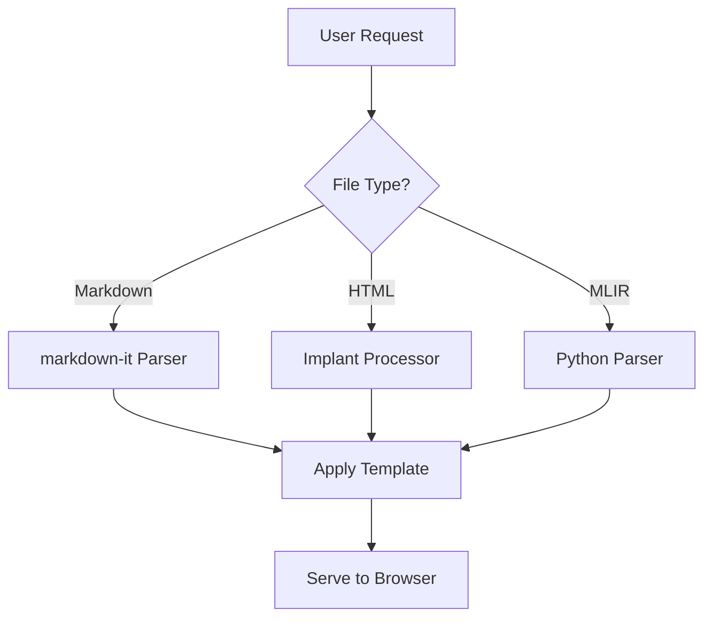

# CLAUDE.md

This file provides guidance to Claude Code (claude.ai/code) when working with code in this repository.

## Commands

### Development & Testing

```bash
# Run tests with code linting
npm test

# Run tests with coverage
npm run cover

# Linting only (uses XO)
npx xo

# Clean build artifacts
npm run clean              # Remove dist/ only
npm run clean:artifacts    # Remove all build artifacts (dist/, coverage/, Bazel artifacts)

# Start the server (from repository root)
./lib/cli.js [file-or-directory]

# Or using the global command (if installed globally)
devdoc [file-or-directory]

# Start with specific options
./lib/cli.js -p 3000 -a 0.0.0.0 ./README.md  # Custom port and address
./lib/cli.js -s ./docs/                       # Silent mode
./lib/cli.js -v ./                            # Verbose mode
./lib/cli.js -w ./                            # Enable file watching (live reload)
```

### Running a Single Test

```bash
# Tests use AVA framework
npx ava tests/service.test.js              # Run specific test file
npx ava tests/*.test.js --match "*table*"  # Run tests matching pattern
```

### Setting Up Python Dependencies

```bash
# Install Python dependencies for ONNX support (optional)
npm run setup:python

# This will:
# - Check if Python 3.9+ is available
# - Install onnx>=1.12.0 (for ONNX shape inference)
# - Work with conda environments automatically

# Note: MLIR parsing requires no external dependencies (Python 3.9+ only)
# Note: ONNX dependencies are optional and only needed for ONNX shape inference
```

## Documentation & Visualization Best Practices

### Mermaid Diagrams for Enhanced Understanding

**IMPORTANT:** When generating markdown documentation, use Mermaid diagrams to visualize complex concepts, relationships, and workflows for better understanding.

**Use Mermaid diagrams for:**

- **Architecture diagrams**: System components, microservices, layers
- **Flow charts**: Request flows, data pipelines, decision trees
- **Sequence diagrams**: API interactions, authentication flows, multi-step processes
- **State diagrams**: Application states, lifecycle transitions
- **Entity relationships**: Database schemas, data models
- **Class diagrams**: Object hierarchies, inheritance structures
- **Gantt charts**: Project timelines, development phases

**Example:**

````markdown

````

**CRITICAL - Mermaid Syntax Validation:**

**All generated Mermaid diagrams MUST be syntactically valid and render without errors.** Before including any Mermaid diagram:

1. **Verify syntax correctness** - Check node IDs, edge syntax, and proper escaping
2. **Test common issues**:
   - Node IDs must start with a letter and contain only alphanumeric characters, underscores, or hyphens
   - Text containing special characters (parentheses, brackets, quotes) must be properly escaped or quoted
   - Edge labels must use the correct syntax: `A -->|label| B` or `A -- label --> B`
   - Subgraphs must have valid syntax and proper indentation
3. **Follow diagram-specific rules**:
   - **Flowcharts**: Use valid node shapes `[ ]`, `( )`, `(( ))`, `{ }`, `[/ /]`, etc.
   - **Sequence diagrams**: Use correct participant syntax and message arrows
   - **State diagrams**: Use proper state transition syntax
   - **Class diagrams**: Follow UML class notation correctly

**Common syntax errors to avoid:**

- Using special characters in node IDs without quoting
- Incorrect edge syntax (missing arrows or wrong arrow types)
- Mismatched brackets or parentheses in node definitions
- Invalid subgraph syntax or nesting
- Improper escaping of special characters in labels

**Benefits:**

- Immediate visual comprehension of complex systems
- Self-documenting architecture and flows
- Easier onboarding for new developers
- Better technical communication in documentation

This server already supports Mermaid rendering through custom fence renderers, so diagrams will be automatically rendered when markdown files are served.

## Test Files Convention

**IMPORTANT:** All test files and test-related content should be generated in the `tests/` directory. This includes:

- Unit test files (\*.test.js)
- Test fixtures and sample files
- Expected output files (\*.expected.html)
- Any temporary test files for feature verification

When creating test examples or sample files for new features (like MLIR support), place them in the `tests/` directory to maintain consistency with the existing test structure.

## Architecture Overview

### Core Components

**Entry Points:**

- `lib/cli.js` - CLI entry point that parses command-line arguments and initializes the server
- `lib/readme.js` - Alternative entry point that finds and serves the nearest README.md
- `lib/server.js` - Main server logic containing all rendering and serving functionality

**Request Flow:**

1. **CLI Processing** (`cli.js`): Validates paths and passes flags to server initialization
2. **Server Initialization** (`server.js:init`): Sets up HTTP server, LiveReload server, and Connect middleware
3. **Request Handler** (`server.js:createRequestHandler`): Routes requests based on file type:
   - Markdown files → Convert to HTML using markdown-it → Apply template
   - HTML files → Process with implant system for includes
   - MLIR files → Apply syntax highlighting → Render as HTML
   - Directories → Generate index listing with icons
   - Other files → Serve directly using `send` module

### File Type Processing

**Markdown Rendering Pipeline:**

- Uses `markdown-it` with multiple plugins (anchor, TOC, emoji, MathJax, highlight.js)
- Custom fence renderers for Mermaid diagrams and MLIR code blocks
- Renders through Handlebars templates in `lib/templates/`

**Template System (Implant):**

- Just-in-time template processing for includes
- Supports nested content with `{markdown: path}`, `{html: path}`, `{less: path}` syntax
- Maximum nesting depth of 10 levels
- Templates are processed recursively when requested

**MLIR Support (Custom Addition):**

- `.mlir` files are recognized as a distinct file type
- Direct Python-based graph parsing using regex patterns
- Converts MLIR text to Model Explorer graph format via `lib/mlir-to-graph.ts`
- Executes `scripts/parse_mlir_regex.py` for MLIR parsing
- Displays tensor shapes in node labels (input/output dimensions)
- Supports ALL MLIR dialects by treating operations as generic graph nodes
- Requires Python 3.9+ (no external dependencies)

### LiveReload Integration

- Watches file changes in configured extensions (markdown, HTML, CSS, JS, images, MLIR)
- Excludes `node_modules/` and `.git/` directories
- Communicates on port 35729 by default
- Requires browser extension for automatic reloading

### Directory Indexing

- Material Design icons mapped to file extensions via `lib/icons/material-icons.json`
- Breadcrumb navigation generated for directory paths
- Icons determined by file extension or folder name patterns

### Key Dependencies and Their Roles

- `markdown-it` + plugins: Core markdown processing
- `handlebars`: Template rendering for HTML output
- `implant`: Recursive template inclusion system
- `connect` + `connect-livereload`: HTTP server middleware
- `livereload`: File watching and browser communication
- `send`: Static file serving with proper MIME types
- `less`: LESS to CSS compilation for includes
- `chalk`: Terminal output styling

## File Structure Patterns

**Template Files:** Located in `lib/templates/`

- `markdown.html` - Template for rendered markdown/MLIR files
- `directory.html` - Template for directory listings
- `error.html` - Template for error pages (404, 500)

**Static Resources:**

- CSS files use GitHub-like styling (`github.less`, `devdoc.css`)
- Icons stored in `lib/icons/` with mapping in `material-icons.json`

**Test Structure:**

- Tests in `tests/` directory use AVA framework
- Each test creates a temporary server instance with `getPort()`
- Tests make HTTP requests to verify rendering output

## Important Implementation Details

**URL Handling:**

- Special `{devdoc}` URLs resolve to library resources
- Path normalization handles various input formats (relative, absolute)
- URL parameters are stripped before file resolution

**Error Handling:**

- 404 errors show custom error page with referer link
- Favicon requests are handled specially to avoid 404 logs
- Errors during rendering fall back to error page template

**Security Considerations:**

- Path traversal prevention through normalization
- HTML escaping in templates and error messages
- Configurable address binding (default: localhost)

## Recent Modifications

**MLIR Support Implementation:**

- Added MLIR to recognized file types in `fileTypes` object
- Implemented direct Python-based MLIR parsing using regex patterns
- Created `scripts/parse_mlir_regex.py` for MLIR graph conversion
- Added tensor shape display in node labels (input/output shapes)
- Modified `lib/mlir-to-graph.ts` to use direct Python parser
- Added MLIR files to watch list for live reload
- Supports ALL MLIR dialects by treating operations as generic graph nodes
- Requires Python 3.9+ only (no external dependencies)

**Two-Tier MLIR Parser Architecture:**

Devdoc uses an intelligent two-tier parsing system with automatic fallback:

**1. C++ MLIR Context Parser (Primary, Optional)**

- ✅ Full implementation of the documented universal MLIR parser pipeline (see `devdocs/parser/universal-mlir-parser-design.md`)
- ✅ Proper MLIR context with dialect registration (`allowUnregisteredDialects(true)`)
- ✅ Parse to ModuleOp with full IR verification
- ✅ Region traversal and complete AST analysis
- ✅ 10-100x faster than regex parser
- 🚧 Conditional normalization (VHLO→StableHLO) - planned
- 🚧 CreateUniqueOpNamesPass for stable IDs - planned
- **Location**: `src/mlir/mlir_parser.cpp`
- **Requires**: LLVM/MLIR, C++17 compiler, CMake, nlohmann/json
- **Build**: See `src/mlir/BUILD.md`

**2. Python Regex Parser (Fallback, Always Available)**

- ✅ Lightweight, dependency-free parsing
- ✅ Handles arbitrary MLIR dialects as generic operations
- ✅ Multi-graph support (one per func.func)
- ✅ Dense constant preprocessing
- ✅ Extensibility hooks for dialect customization
- ✅ Location-based naming support
- **Location**: `scripts/parse_mlir_regex.py`
- **Requires**: Python 3.9+ only (no build needed)

**Automatic Parser Selection:**

The system uses `scripts/parse_mlir_cpp.py` to automatically select the best parser:

```
Try C++ Parser → Success? → Return result
       ↓ (if not found/fails)
Fallback to Regex Parser → Return result
```

You'll see one of these messages:

```bash
✓ Used C++ MLIR context parser       # Best performance
✓ Used regex-based parser (fallback) # No build required
```

**Quick Setup:**

```bash
# Option 1: Use regex parser (no setup needed)
npm test  # Just works!

# Option 2: Build C++ parser for 10-100x performance boost
cd src/mlir && mkdir build && cd build
cmake -DCMAKE_PREFIX_PATH=/usr/local/llvm ..
make
# Detailed instructions in src/mlir/BUILD.md
```

**Parser Comparison:**
| Feature | C++ Parser | Regex Parser |
|---------|-----------|--------------|
| MLIR Context | ✅ Full | ❌ Text-only |
| Verification | ✅ IR validation | ❌ None |
| Performance | ⚡ 10-100x faster | Standard |
| Build Required | ✅ Yes | ❌ No |
| Accuracy | ✅ Full IR | ⚠️ Best-effort |

**Architecture Documentation:**

- Overview: `src/mlir/README.md`
- Build Instructions: `src/mlir/BUILD.md`
- Design Compliance: `devdocs/parser/universal-mlir-parser-design.md`
- Design Gap Analysis: `devdocs/logs/mlir-parser-design-gap.md`

**Python Dependencies:**

ONNX shape inference requires Python 3.9+ with:

- `onnx>=1.12.0` - For ONNX model shape inference (optional)

**Quick setup:**

```bash
npm run setup:python
```

This script will automatically check and install ONNX if needed. MLIR parsing works without any Python dependencies beyond Python 3.9+.

### MCP Server Integration & Browser Coordination

**IMPORTANT:** When using dev3000 MCP server for browser automation and debugging, ensure chrome-devtools MCP connects to the same Chrome instance.

**dev3000 Browser Management:**

```bash
# Start dev3000 (provides browser automation and monitoring)
npx dev3000 --port 8642

# This will display:
# - App: http://localhost:8642
# - MCP: http://localhost:3684
# - Logs: http://localhost:3684/logs?project=devdoc
```

**Chrome DevTools Protocol (CDP) Coordination:**

When both dev3000 and chrome-devtools MCP servers are available:

- **dev3000** manages the Chrome instance via CDP
- **chrome-devtools MCP** should connect to the same browser instance
- Coordination happens automatically through CDP URL sharing
- This prevents browser conflicts and ensures consistent state

**Browser Action Routing:**

The system automatically routes browser actions to the optimal MCP server:

- **Screenshots** → chrome-devtools MCP (better quality)
- **Navigation** → chrome-devtools MCP (more reliable)
- **Clicks** → chrome-devtools MCP (precise coordinates)
- **JavaScript evaluation** → chrome-devtools MCP (enhanced debugging)
- **Scrolling & typing** → dev3000 fallback (specialized actions)

**Debugging and Error Detection:**

Use dev3000's capabilities for:

- Real-time error monitoring and detection
- Performance metrics and CLS (Cumulative Layout Shift) tracking
- Browser console log capture
- Visual diff analysis for layout debugging

**Configuration Verification:**

To verify proper MCP coordination:

1. Check that dev3000 is running and showing MCP endpoint
2. Confirm chrome-devtools MCP is configured in Claude Code settings
3. Browser actions should automatically use the appropriate server
4. Both servers share the same Chrome instance (no duplicate browsers)
