# Model Explorer Manual Editing Feature - Overview

**Date**: 2025-10-15
**Status**: Design Proposal
**Version**: 2.0
**Author**: Claude (AI Assistant)

📖 **Navigation**: [Next: Interactive Compiler Workflow →](01-interactive-compiler-workflow.md)

---

## Executive Summary

This document proposes a comprehensive **interactive compiler workflow feature** for Model Explorer that enables users to modify and optimize machine learning model computation graphs through a **human-in-the-loop** approach. Users can annotate nodes with domain insights, invoke compiler optimization logic, and iteratively refine models through visual feedback.

### Core Capabilities

The feature will support:

- **Human-in-the-Loop Compilation**: Annotate nodes → Invoke compiler → Transform graph → Iterate
- **Interactive Optimization**: Real-time feedback on compiler transformations with human guidance
- **Node Operations**: Add, remove, modify, and clone nodes with compiler-aware validation
- **Edge Operations**: Create, remove, and rewire connections with type/shape checking
- **Graph Validation**: Real-time integrity checking with compiler-specific rules
- **Export Capabilities**: Save edited graphs in multiple formats (JSON, ONNX, GraphDef, MLIR)
- **Undo/Redo**: Full history tracking for all editing and compilation operations
- **Compiler Integration**: Plugin architecture for custom compiler backends

### The Innovation: Interactive Compiler Workflows

```mermaid
graph TB
    subgraph "Human-in-the-Loop Compiler Workflow"
        User[👤 User Annotations<br/>Add optimization hints<br/>Mark nodes for fusion<br/>Specify constraints]

        Compiler[⚙️ Invoke Compiler Logic<br/>Apply transformations<br/>Optimize operations<br/>Fuse layers]

        Transform[🔄 Graph Transformation<br/>Generate new nodes<br/>Update connections<br/>Apply optimizations]

        NewGraph[📊 Generated Graph<br/>Visualize changes<br/>Compare before/after<br/>Analyze performance]

        Validate[✅ Validation<br/>Check correctness<br/>Verify constraints<br/>Test performance]

        User --> Compiler
        Compiler --> Transform
        Transform --> NewGraph
        NewGraph --> Validate
        Validate -->|Iterate| User
        Validate -->|Accept| Export[💾 Export Optimized Model]
    end

    style User fill:#e3f2fd,stroke:#1976d2,stroke-width:2px
    style Compiler fill:#fff9c4,stroke:#f57c00,stroke-width:2px
    style Transform fill:#f3e5f5,stroke:#7b1fa2,stroke-width:2px
    style NewGraph fill:#e8f5e9,stroke:#388e3c,stroke-width:2px
    style Validate fill:#fce4ec,stroke:#c2185b,stroke-width:2px
    style Export fill:#e0f7fa,stroke:#00796b,stroke-width:2px
```

### Key Benefits

1. **Rapid Prototyping**: Test compiler optimizations without rebuilding models
2. **Interactive Debugging**: Understand compiler behavior through visual feedback
3. **Human Expertise**: Combine compiler intelligence with domain knowledge
4. **Educational Tool**: Learn compiler transformations through hands-on experimentation
5. **Production Optimization**: Fine-tune models for deployment with expert guidance

---

## Motivation & Use Cases

### Problem Statement

Currently, Model Explorer is a **read-only visualization tool**. Users who need to experiment with compiler optimizations or model architecture must:

1. Return to their training/compilation framework
2. Modify code (Python/C++/MLIR)
3. Re-run compilation pipeline
4. Re-export the model
5. Re-load in Model Explorer to visualize changes

This workflow is **inefficient** for:

- **Compiler Development**: Testing optimization passes and transformations
- **Model Optimization**: Experimenting with layer fusion and quantization
- **Performance Tuning**: Trying different graph structures for target hardware
- **Debugging**: Understanding compiler behavior and transformation effects
- **Education**: Learning how compilers transform ML graphs

### The Solution: Interactive Compiler Integration

Enable users to:

1. **Annotate** nodes with optimization hints (e.g., "fuse with next layer", "quantize to int8")
2. **Invoke** compiler logic directly from the UI (e.g., "apply layer fusion", "optimize for inference")
3. **Visualize** the transformed graph side-by-side with the original
4. **Iterate** with additional annotations based on results
5. **Export** the optimized model for deployment

---

## Target Use Cases

### 1. Compiler Engineer: Testing Optimization Passes

**Scenario**: Develop and test a new graph fusion optimization pass

**Workflow**:
1. Load unoptimized model graph
2. Annotate target nodes for fusion (e.g., Conv2D + BatchNorm + ReLU)
3. Invoke fusion compiler pass through UI
4. Visualize fused graph and verify correctness
5. Compare performance metrics (node count, memory usage)
6. Iterate with different fusion strategies
7. Export validated optimization pass configuration

**Value**: Rapid iteration without full compilation pipeline rebuilds

---

### 2. ML Engineer: Interactive Model Optimization

**Scenario**: Optimize model for edge deployment with latency constraints

**Workflow**:
1. Load trained model graph
2. Annotate nodes with quantization hints (e.g., "int8 for Conv layers", "fp16 for attention")
3. Invoke quantization compiler logic
4. Visualize quantized graph with precision annotations
5. Validate accuracy degradation in integrated test environment
6. Adjust quantization strategy based on results
7. Export deployment-ready model

**Value**: Human expertise guides compiler optimization for real-world constraints

---

### 3. Hardware Vendor: Target-Specific Optimization

**Scenario**: Optimize graph for custom neural network accelerator

**Workflow**:
1. Load generic ONNX model
2. Annotate nodes with hardware-specific hints (e.g., "map to tensor core", "use custom op")
3. Invoke hardware-specific compiler backend
4. Visualize mapped graph with hardware utilization metrics
5. Identify bottlenecks and adjust mapping
6. Export hardware-optimized model

**Value**: Interactive exploration of hardware mapping strategies

---

### 4. Researcher: Understanding Compiler Behavior

**Scenario**: Study how different compilers transform the same model

**Workflow**:
1. Load reference model
2. Apply Compiler A optimizations → Save as Graph A
3. Revert to original
4. Apply Compiler B optimizations → Save as Graph B
5. Use diff visualization to compare transformations
6. Analyze performance trade-offs
7. Document findings in research paper

**Value**: Educational insight into compiler design choices

---

### 5. Model Architect: Interactive Architecture Search

**Scenario**: Explore alternative model architectures with compiler feedback

**Workflow**:
1. Start with baseline architecture
2. Add/modify layers based on design intuition
3. Invoke compiler analysis (shape inference, memory footprint, latency estimate)
4. Visualize compiler feedback on each variant
5. Select best architecture based on compiler metrics
6. Export for training

**Value**: Compiler-aware architecture exploration

---

## Feature Scope

### In Scope for Initial Release
- ✅ Manual node/edge editing with validation
- ✅ Annotation system for optimization hints
- ✅ Compiler plugin architecture
- ✅ Built-in fusion and quantization passes
- ✅ Before/after diff visualization
- ✅ JSON and ONNX export
- ✅ Undo/redo with operation history
- ✅ Real-time validation with compiler rules

### Future Enhancements
- ⏳ Real-time collaboration for team compiler development
- ⏳ Performance profiling integration
- ⏳ Auto-optimization suggestions via ML
- ⏳ Custom compiler backend registration
- ⏳ Graph template library for common patterns
- ⏳ Integration with training frameworks (PyTorch, TensorFlow)

---

## Success Criteria

### User Experience
- [ ] Users can complete a full annotation → compilation → export cycle in <5 minutes
- [ ] Validation errors are clear and actionable (95% user comprehension in testing)
- [ ] UI responsiveness maintained for graphs with 1000+ nodes

### Compiler Integration
- [ ] Plugin API supports major compiler backends (TVM, XLA, MLIR)
- [ ] Compilation transformations complete in <2 seconds for typical models
- [ ] Correctness validation catches 99% of invalid transformations

### Quality & Reliability
- [ ] Zero data loss with auto-save and session recovery
- [ ] 100% test coverage for core editing operations
- [ ] Accessibility compliance (WCAG 2.1 AA) for all UI components

---

## Related Documents

- **[Interactive Compiler Workflow](01-interactive-compiler-workflow.md)**: Deep dive into the human-in-the-loop pattern
- **[User Experience Design](02-user-experience.md)**: Detailed UI/UX specifications and workflows
- **[Technical Architecture](03-architecture.md)**: System design and implementation details
- **[Implementation Plan](04-implementation.md)**: Phase-by-phase development roadmap
- **[API Reference](05-api-reference.md)**: Complete API specifications and integration guide

---

**Document Metadata**:
- **Version**: 2.0 (focus on interactive compiler workflows)
- **Last Updated**: 2025-10-15
- **Target Audience**: Compiler Engineers, ML Engineers, Hardware Vendors, Researchers
- **Prerequisites**: Familiarity with ML model graphs and compiler optimization concepts

📖 **Navigation**: [Next: Interactive Compiler Workflow →](01-interactive-compiler-workflow.md)
