# Interactive Compiler Workflow

**Date**: 2025-10-15
**Version**: 2.0

📖 **Navigation**: [← Previous: Overview](00-overview.md) | [Next: User Experience →](02-user-experience.md)

---

## Table of Contents

- [Human-in-the-Loop Compiler Pattern](#human-in-the-loop-compiler-pattern)
- [The Annotation System](#the-annotation-system)
- [Compiler Integration Architecture](#compiler-integration-architecture)
- [Interactive Optimization Workflows](#interactive-optimization-workflows)
- [Concrete Use Case Examples](#concrete-use-case-examples)
- [Compiler Plugin API](#compiler-plugin-api)

---

## Human-in-the-Loop Compiler Pattern

### Core Concept

The **interactive compiler workflow** enables users to **guide compiler optimizations** through visual annotations, immediate feedback, and iterative refinement. Unlike traditional batch compilation, this approach combines:

- **Human Domain Expertise**: Users provide optimization hints based on real-world constraints
- **Compiler Intelligence**: Automated transformation and analysis algorithms
- **Visual Feedback**: Immediate visualization of compiler decisions
- **Iterative Refinement**: Multiple cycles of annotation and compilation

### The Feedback Loop


### Key Principles

1. **Transparency**: Users see exactly what the compiler does at each step
2. **Control**: Users maintain full control over optimization decisions
3. **Safety**: All transformations are validated and can be undone
4. **Learning**: Users learn compiler behavior through experimentation

---

## The Annotation System

### Annotation Types

#### 1. Optimization Hints

```typescript
interface OptimizationHint {
  targetNodes: string[];  // Node IDs to optimize
  hintType: 'fusion' | 'quantization' | 'layout' | 'scheduling' | 'custom';
  parameters: Record<string, any>;
  priority: 'required' | 'preferred' | 'optional';
  rationale?: string;  // Human explanation
}
```

**Example: Layer Fusion Hint**
```typescript
{
  targetNodes: ['conv_1', 'bn_1', 'relu_1'],
  hintType: 'fusion',
  parameters: {
    fusionStrategy: 'conv_bn_relu',
    preservePrecision: true
  },
  priority: 'preferred',
  rationale: 'Reduce memory bandwidth for inference'
}
```

#### 2. Constraint Annotations

```typescript
interface Constraint {
  targetNodes: string[];
  constraintType: 'latency' | 'memory' | 'precision' | 'hardware';
  value: any;
  enforcement: 'hard' | 'soft';
}
```

**Example: Latency Constraint**
```typescript
{
  targetNodes: ['attention_layer'],
  constraintType: 'latency',
  value: { maxMs: 10 },
  enforcement: 'hard'
}
```

#### 3. Hardware Mapping Hints

```typescript
interface HardwareMapping {
  targetNodes: string[];
  hardwareUnit: string;  // 'gpu_tensor_core', 'dsp', 'custom_accelerator'
  mappingStrategy: 'auto' | 'manual';
  configuration?: Record<string, any>;
}
```

### Annotation UI Workflow

```mermaid
sequenceDiagram
    actor User
    participant Canvas as Graph Canvas
    participant Panel as Annotation Panel
    participant Compiler as Compiler Backend
    participant Validator as Annotation Validator

    User->>Canvas: Select nodes (Shift+Click)
    Canvas->>Canvas: Highlight selected nodes

    User->>Canvas: Right-click context menu
    Canvas->>Panel: Open Annotation Panel

    Panel->>Panel: Show annotation form<br/>- Hint type dropdown<br/>- Parameter inputs<br/>- Priority selector

    User->>Panel: Fill annotation details
    Panel->>Validator: Validate annotation

    alt Annotation Valid
        Validator-->>Panel: ✅ Valid
        User->>Panel: Click "Add Annotation"
        Panel->>Canvas: Add annotation badge to nodes
        Canvas->>Canvas: Update visual indicators
    else Annotation Invalid
        Validator-->>Panel: ❌ Invalid (reason)
        Panel->>User: Show error message
    end

    User->>Panel: Click "Invoke Compiler"
    Panel->>Compiler: compileWithAnnotations(graph, annotations)
    Compiler->>Compiler: Apply optimization passes
    Compiler-->>Canvas: Return transformed graph
    Canvas->>Canvas: Show before/after comparison
```



---

## Compiler Integration Architecture

### Plugin Architecture


### Compiler Plugin Interface

```typescript
interface CompilerPlugin {
  name: string;
  version: string;
  description: string;
  supportedAnnotations: string[];

  // Validate if plugin can handle the graph
  canHandle(graph: Graph, annotations: Annotation[]): boolean;

  // Preview expected changes without executing
  preview(graph: Graph, annotations: Annotation[]): TransformationPreview;

  // Execute compilation with annotations
  compile(graph: Graph, annotations: Annotation[]): CompilationResult;

  // Estimate performance impact
  estimatePerformance(graph: Graph, result: CompilationResult): PerformanceMetrics;
}

interface CompilationResult {
  transformedGraph: Graph;
  appliedTransformations: Transformation[];
  warnings: Warning[];
  performanceEstimate?: PerformanceMetrics;
  metadata: Record<string, any>;
}

interface Transformation {
  id: string;
  type: 'fusion' | 'quantization' | 'layout_change' | 'node_replacement' | 'edge_rewiring';
  affectedNodes: string[];
  affectedEdges: string[];
  description: string;
  reversible: boolean;
}
```

---

## Interactive Optimization Workflows

### Workflow 1: Layer Fusion with Human Guidance


### Workflow 2: Interactive Quantization Strategy

```mermaid
flowchart TB
    Start([Load FP32 Model]) --> Profile[📊 Profile Model<br/>Identify quantization candidates]

    Profile --> Strategy{🎯 Choose<br/>Strategy}

    Strategy -->|Conservative| Selective[📝 Annotate Selected Layers<br/>- Conv: INT8<br/>- Attention: FP16<br/>- Output: FP32]

    Strategy -->|Aggressive| Global[📝 Annotate All Layers<br/>INT8 everywhere]

    Selective --> InvokeS[⚙️ Invoke Quantization Compiler]
    Global --> InvokeG[⚙️ Invoke Quantization Compiler]

    InvokeS --> Quant[🔄 Apply Quantization<br/>- Insert quantize/dequantize ops<br/>- Update tensor types]
    InvokeG --> Quant

    Quant --> Compare[📊 Compare Metrics<br/>- Model size<br/>- Inference latency<br/>- Accuracy drop]

    Compare --> Evaluate{✅ Acceptable<br/>Accuracy?}

    Evaluate -->|Yes: <1% drop| Accept[💾 Accept Quantization]
    Accept --> Export([📦 Export INT8 Model])

    Evaluate -->|No: >1% drop| Analyze[🔍 Analyze Sensitive Layers]
    Analyze --> Refine[🔧 Refine Strategy<br/>- Keep sensitive layers FP16<br/>- Re-annotate]

    Refine --> InvokeS

    style Start fill:#e3f2fd
    style Selective fill:#fff9c4
    style Global fill:#fff9c4
    style Quant fill:#f3e5f5
    style Compare fill:#e8f5e9
    style Evaluate fill:#fce4ec
    style Export fill:#e0f7fa
```



---

## Concrete Use Case Examples

### Example 1: Compiler Engineer Testing New Fusion Pass

**Context**: Developing a new optimization pass that fuses `Conv2D + Add + ReLU` patterns.

**Steps**:

1. **Load Test Model**: Import ONNX model with known Conv-Add-ReLU patterns
2. **Manual Annotation**: Mark 5 target patterns with `fusion_type: conv_add_relu`
3. **Invoke Test Pass**: Run new compiler pass through plugin interface
4. **Visualize Results**: Compare original vs fused graphs side-by-side
5. **Validate**: Check shape inference, type compatibility, memory layout
6. **Measure**: Estimate performance improvement (node count, latency)
7. **Iterate**: Adjust fusion logic based on visual feedback
8. **Document**: Export annotated graph as regression test case

**Benefits**:
- ✅ No need to rebuild entire compilation pipeline
- ✅ Visual debugging of transformation logic
- ✅ Quick iteration on edge cases
- ✅ Automated test case generation

---

### Example 2: ML Engineer Optimizing for Mobile Deployment

**Context**: Deploying image classification model to mobile device with 200ms latency budget.

**Steps**:

1. **Load Model**: Import PyTorch exported ONNX model (50 layers, 25MB)
2. **Profile Bottlenecks**: Identify latency-critical operations
   - `conv_5`: 50ms (largest bottleneck)
   - `attention_layer`: 40ms
   - `fc_layers`: 30ms
3. **Annotate Constraints**:
   - `conv_5`: Add latency constraint `max_ms: 20`, mark for INT8 quantization
   - `attention_layer`: Mark for kernel fusion
4. **Invoke Mobile Compiler**:
   - Apply INT8 quantization to conv layers
   - Fuse attention multi-head operations
   - Optimize memory layout for ARM NEON
5. **Visualize Optimizations**:
   - Graph reduced from 50 to 32 nodes
   - Model size: 25MB → 7MB
   - Estimated latency: 200ms → 150ms
6. **Validate Accuracy**:
   - Run sample inference in test environment
   - Accuracy drop: 0.3% (acceptable)
7. **Export**: Save optimized model for mobile deployment

**Benefits**:
- ✅ Interactive latency-driven optimization
- ✅ Real-time feedback on model size and performance
- ✅ Quick experimentation with different strategies
- ✅ Deployment-ready model in single session

---

### Example 3: Hardware Vendor Optimizing for Custom Accelerator

**Context**: Mapping neural network to custom NPU with specialized matrix multiply units.

**Steps**:

1. **Load Generic Model**: Import ONNX model with standard operators
2. **Identify Mappable Ops**: Highlight MatMul and Conv2D operations (hardware-accelerated)
3. **Annotate Hardware Hints**:
   - All `MatMul`: Map to `TensorCore_Unit_A`
   - Large `Conv2D` (>256 channels): Map to `TensorCore_Unit_B`
   - Small `Conv2D` (<256 channels): Keep on CPU
4. **Invoke Hardware Compiler**:
   - Replace mapped ops with custom NPU ops
   - Insert data transfer nodes (CPU ↔ NPU)
   - Optimize memory layout for NPU
5. **Visualize Hardware Mapping**:
   - Color-code nodes by execution unit (CPU=gray, NPU=green)
   - Show data transfer overhead
   - Display memory allocation
6. **Analyze Performance**:
   - Estimated speedup: 8x on MatMul, 5x on Conv2D
   - Data transfer overhead: 10% of total latency
7. **Refine Mapping**:
   - Reduce data transfers by fusing adjacent NPU ops
   - Re-run compiler, visualize improvements
8. **Export**: Generate NPU-optimized model binary

**Benefits**:
- ✅ Visual understanding of hardware utilization
- ✅ Quick identification of data transfer bottlenecks
- ✅ Iterative refinement of op mapping strategy
- ✅ Hardware-specific optimization without deep compiler knowledge

---

## Compiler Plugin API

### Registering a Custom Plugin

```typescript
// Example: Custom hardware-specific compiler plugin
class CustomAcceleratorPlugin implements CompilerPlugin {
  name = 'Custom Accelerator Optimizer';
  version = '1.0.0';
  description = 'Optimizes graphs for XYZ Neural Processing Unit';
  supportedAnnotations = ['hardware_mapping', 'latency_constraint'];

  canHandle(graph: Graph, annotations: Annotation[]): boolean {
    // Check if graph contains operations supported by accelerator
    const supportedOps = ['Conv2D', 'MatMul', 'BatchNorm', 'ReLU'];
    return graph.nodes.some(node => supportedOps.includes(node.type));
  }

  preview(graph: Graph, annotations: Annotation[]): TransformationPreview {
    // Analyze and return preview without modifying graph
    const mappableNodes = this.identifyMappableNodes(graph, annotations);

    return {
      transformationType: 'hardware_mapping',
      affectedNodes: mappableNodes.map(n => n.id),
      description: `Map ${mappableNodes.length} operations to Custom Accelerator`,
      estimatedSpeedup: this.estimateSpeedup(mappableNodes),
      warnings: this.checkCompatibility(graph, mappableNodes)
    };
  }

  compile(graph: Graph, annotations: Annotation[]): CompilationResult {
    // Execute actual graph transformation
    const transformedGraph = cloneDeep(graph);
    const transformations: Transformation[] = [];

    // 1. Identify nodes to map to accelerator
    const mappableNodes = this.identifyMappableNodes(graph, annotations);

    // 2. Replace standard ops with custom accelerator ops
    for (const node of mappableNodes) {
      const customOp = this.createCustomOp(node);
      transformedGraph.replaceNode(node.id, customOp);

      transformations.push({
        id: `transform_${node.id}`,
        type: 'node_replacement',
        affectedNodes: [node.id, customOp.id],
        affectedEdges: [],
        description: `Mapped ${node.type} to accelerator operation`,
        reversible: true
      });
    }

    // 3. Insert data transfer nodes
    this.insertDataTransferNodes(transformedGraph, transformations);

    // 4. Validate transformed graph
    const warnings = this.validate(transformedGraph);

    return {
      transformedGraph,
      appliedTransformations: transformations,
      warnings,
      performanceEstimate: this.estimatePerformance(graph, transformedGraph),
      metadata: {
        mappedOps: mappableNodes.length,
        acceleratorUtilization: this.calculateUtilization(transformedGraph)
      }
    };
  }

  estimatePerformance(original: Graph, optimized: Graph): PerformanceMetrics {
    // Estimate performance improvement
    return {
      latencyReduction: 0.60,  // 60% faster
      memorySaving: 0.30,      // 30% less memory
      powerEfficiency: 2.5      // 2.5x better power efficiency
    };
  }

  private identifyMappableNodes(graph: Graph, annotations: Annotation[]): Node[] {
    // Implementation details...
  }

  private createCustomOp(node: Node): Node {
    // Implementation details...
  }

  private insertDataTransferNodes(graph: Graph, transformations: Transformation[]): void {
    // Implementation details...
  }

  private validate(graph: Graph): Warning[] {
    // Implementation details...
  }
}

// Register plugin with Model Explorer
const pluginRegistry = CompilerPluginRegistry.getInstance();
pluginRegistry.register(new CustomAcceleratorPlugin());
```

### Using Plugins from UI

```typescript
// User invokes compiler through UI
async function invokeCompiler(
  graph: Graph,
  annotations: Annotation[],
  selectedPlugin: string
): Promise<CompilationResult> {
  const registry = CompilerPluginRegistry.getInstance();
  const plugin = registry.get(selectedPlugin);

  // 1. Validate plugin can handle this graph
  if (!plugin.canHandle(graph, annotations)) {
    throw new Error(`Plugin ${selectedPlugin} cannot handle this graph`);
  }

  // 2. Show preview to user
  const preview = plugin.preview(graph, annotations);
  const confirmed = await showPreviewDialog(preview);

  if (!confirmed) {
    return; // User cancelled
  }

  // 3. Execute compilation
  const result = await plugin.compile(graph, annotations);

  // 4. Validate result
  const validationReport = GraphValidator.validate(result.transformedGraph);

  if (validationReport.hasErrors) {
    throw new Error('Compilation produced invalid graph');
  }

  // 5. Update UI with results
  return result;
}
```

---

## Benefits Summary

### For Compiler Engineers
- **Rapid Prototyping**: Test optimization passes without full pipeline rebuilds
- **Visual Debugging**: See transformation effects immediately
- **Regression Testing**: Export annotated graphs as test cases

### For ML Engineers
- **Interactive Optimization**: Experiment with different strategies quickly
- **Constraint-Driven**: Optimize for specific latency/memory/accuracy targets
- **Learning**: Understand compiler behavior through experimentation

### For Hardware Vendors
- **Custom Mappings**: Visualize operation mappings to specialized hardware
- **Bottleneck Analysis**: Identify data transfer and memory overhead
- **Customer Enablement**: Help customers optimize for your hardware

### For Researchers
- **Comparative Analysis**: Study different compiler strategies side-by-side
- **Educational Tool**: Teach compiler optimization concepts visually
- **Publication**: Generate figures showing compiler transformations

---

**Next Steps**: See [User Experience Design](02-user-experience.md) for detailed UI/UX specifications.

📖 **Navigation**: [← Previous: Overview](00-overview.md) | [Next: User Experience →](02-user-experience.md)
