# Interactive Compiler Workflow

**Date**: 2025-10-15
**Version**: 2.0

📖 **Navigation**: [← Previous: Overview](00-overview.md) | [Next: User Experience →](02-user-experience.md)

---

## Table of Contents

- [Human-in-the-Loop Compiler Pattern](#human-in-the-loop-compiler-pattern)
- [The Annotation System](#the-annotation-system)
- [Compiler Integration Architecture](#compiler-integration-architecture)
- [Interactive Optimization Workflows](#interactive-optimization-workflows)
- [Concrete Use Case Examples](#concrete-use-case-examples)
- [Compiler Plugin API](#compiler-plugin-api)
- [Advanced Features](#advanced-features)
  - [Performance Analysis Visualization](#performance-analysis-visualization)
  - [Diff Visualization and Comparison](#diff-visualization-and-comparison)
  - [Debugging Compiler Transformations](#debugging-compiler-transformations)
  - [Batch Annotation Operations](#batch-annotation-operations)
- [Real-World Compiler Integrations](#real-world-compiler-integrations)
  - [TVM Integration Example](#tvm-integration-example)
  - [MLIR Integration Example](#mlir-integration-example)
  - [XLA Integration Example](#xla-integration-example)
- [Error Handling and Recovery](#error-handling-and-recovery)
- [Testing and Validation Strategies](#testing-and-validation-strategies)

---

## Human-in-the-Loop Compiler Pattern

### Core Concept

The **interactive compiler workflow** enables users to **guide compiler optimizations** through visual annotations, immediate feedback, and iterative refinement. Unlike traditional batch compilation, this approach combines:

- **Human Domain Expertise**: Users provide optimization hints based on real-world constraints
- **Compiler Intelligence**: Automated transformation and analysis algorithms
- **Visual Feedback**: Immediate visualization of compiler decisions
- **Iterative Refinement**: Multiple cycles of annotation and compilation

### The Feedback Loop

```mermaid
flowchart TB
    Start([Load Original Graph]) --> Analyze[🔍 Analyze Graph<br/>Identify optimization opportunities]

    Analyze --> Annotate[📝 Add Annotations<br/>- Fusion hints<br/>- Quantization targets<br/>- Hardware mappings<br/>- Performance constraints]

    Annotate --> Invoke[⚙️ Invoke Compiler Pass<br/>- Select optimization pass<br/>- Configure parameters<br/>- Preview expected changes]

    Invoke --> Compile[🔄 Execute Compilation<br/>- Apply transformations<br/>- Generate new graph<br/>- Preserve metadata]

    Compile --> Visualize[📊 Visualize Results<br/>- Side-by-side comparison<br/>- Highlight changes<br/>- Show performance metrics]

    Visualize --> Validate{✅ Validate<br/>Correctness?}

    Validate -->|Has Errors| ShowErrors[❌ Show Validation Errors<br/>- Type mismatches<br/>- Shape conflicts<br/>- Semantic violations]
    ShowErrors --> Annotate

    Validate -->|Correct| Evaluate{📈 Evaluate<br/>Performance?}

    Evaluate -->|Not Satisfactory| Annotate
    Evaluate -->|Satisfactory| Accept[💾 Accept Changes<br/>Update graph state]

    Accept --> Decision{🤔 Continue<br/>Optimization?}

    Decision -->|Yes| Analyze
    Decision -->|No| Export([💾 Export Optimized Model])

    style Start fill:#e3f2fd
    style Annotate fill:#fff9c4
    style Compile fill:#f3e5f5
    style Visualize fill:#e8f5e9
    style Validate fill:#fce4ec
    style Export fill:#e0f7fa
    style ShowErrors fill:#ffcdd2
```



### Key Principles

1. **Transparency**: Users see exactly what the compiler does at each step
2. **Control**: Users maintain full control over optimization decisions
3. **Safety**: All transformations are validated and can be undone
4. **Learning**: Users learn compiler behavior through experimentation

---

## The Annotation System

### Annotation Types

#### 1. Optimization Hints

```typescript
interface OptimizationHint {
  targetNodes: string[];  // Node IDs to optimize
  hintType: 'fusion' | 'quantization' | 'layout' | 'scheduling' | 'custom';
  parameters: Record<string, any>;
  priority: 'required' | 'preferred' | 'optional';
  rationale?: string;  // Human explanation
}
```

**Example: Layer Fusion Hint**
```typescript
{
  targetNodes: ['conv_1', 'bn_1', 'relu_1'],
  hintType: 'fusion',
  parameters: {
    fusionStrategy: 'conv_bn_relu',
    preservePrecision: true
  },
  priority: 'preferred',
  rationale: 'Reduce memory bandwidth for inference'
}
```

#### 2. Constraint Annotations

```typescript
interface Constraint {
  targetNodes: string[];
  constraintType: 'latency' | 'memory' | 'precision' | 'hardware';
  value: any;
  enforcement: 'hard' | 'soft';
}
```

**Example: Latency Constraint**
```typescript
{
  targetNodes: ['attention_layer'],
  constraintType: 'latency',
  value: { maxMs: 10 },
  enforcement: 'hard'
}
```

#### 3. Hardware Mapping Hints

```typescript
interface HardwareMapping {
  targetNodes: string[];
  hardwareUnit: string;  // 'gpu_tensor_core', 'dsp', 'custom_accelerator'
  mappingStrategy: 'auto' | 'manual';
  configuration?: Record<string, any>;
}
```

### Annotation UI Workflow

```mermaid
sequenceDiagram
    actor User
    participant Canvas as Graph Canvas
    participant Panel as Annotation Panel
    participant Compiler as Compiler Backend
    participant Validator as Annotation Validator

    User->>Canvas: Select nodes (Shift+Click)
    Canvas->>Canvas: Highlight selected nodes

    User->>Canvas: Right-click context menu
    Canvas->>Panel: Open Annotation Panel

    Panel->>Panel: Show annotation form<br/>- Hint type dropdown<br/>- Parameter inputs<br/>- Priority selector

    User->>Panel: Fill annotation details
    Panel->>Validator: Validate annotation

    alt Annotation Valid
        Validator-->>Panel: ✅ Valid
        User->>Panel: Click "Add Annotation"
        Panel->>Canvas: Add annotation badge to nodes
        Canvas->>Canvas: Update visual indicators
    else Annotation Invalid
        Validator-->>Panel: ❌ Invalid (reason)
        Panel->>User: Show error message
    end

    User->>Panel: Click "Invoke Compiler"
    Panel->>Compiler: compileWithAnnotations(graph, annotations)
    Compiler->>Compiler: Apply optimization passes
    Compiler-->>Canvas: Return transformed graph
    Canvas->>Canvas: Show before/after comparison
```



---

## Compiler Integration Architecture

### Plugin Architecture


### Compiler Plugin Interface

```typescript
interface CompilerPlugin {
  name: string;
  version: string;
  description: string;
  supportedAnnotations: string[];

  // Validate if plugin can handle the graph
  canHandle(graph: Graph, annotations: Annotation[]): boolean;

  // Preview expected changes without executing
  preview(graph: Graph, annotations: Annotation[]): TransformationPreview;

  // Execute compilation with annotations
  compile(graph: Graph, annotations: Annotation[]): CompilationResult;

  // Estimate performance impact
  estimatePerformance(graph: Graph, result: CompilationResult): PerformanceMetrics;
}

interface CompilationResult {
  transformedGraph: Graph;
  appliedTransformations: Transformation[];
  warnings: Warning[];
  performanceEstimate?: PerformanceMetrics;
  metadata: Record<string, any>;
}

interface Transformation {
  id: string;
  type: 'fusion' | 'quantization' | 'layout_change' | 'node_replacement' | 'edge_rewiring';
  affectedNodes: string[];
  affectedEdges: string[];
  description: string;
  reversible: boolean;
}
```

---

## Interactive Optimization Workflows

### Workflow 1: Layer Fusion with Human Guidance


### Workflow 2: Interactive Quantization Strategy


---

## Concrete Use Case Examples

### Example 1: Compiler Engineer Testing New Fusion Pass

**Context**: Developing a new optimization pass that fuses `Conv2D + Add + ReLU` patterns.

**Steps**:

1. **Load Test Model**: Import ONNX model with known Conv-Add-ReLU patterns
2. **Manual Annotation**: Mark 5 target patterns with `fusion_type: conv_add_relu`
3. **Invoke Test Pass**: Run new compiler pass through plugin interface
4. **Visualize Results**: Compare original vs fused graphs side-by-side
5. **Validate**: Check shape inference, type compatibility, memory layout
6. **Measure**: Estimate performance improvement (node count, latency)
7. **Iterate**: Adjust fusion logic based on visual feedback
8. **Document**: Export annotated graph as regression test case

**Benefits**:
- ✅ No need to rebuild entire compilation pipeline
- ✅ Visual debugging of transformation logic
- ✅ Quick iteration on edge cases
- ✅ Automated test case generation

---

### Example 2: ML Engineer Optimizing for Mobile Deployment

**Context**: Deploying image classification model to mobile device with 200ms latency budget.

**Steps**:

1. **Load Model**: Import PyTorch exported ONNX model (50 layers, 25MB)
2. **Profile Bottlenecks**: Identify latency-critical operations
   - `conv_5`: 50ms (largest bottleneck)
   - `attention_layer`: 40ms
   - `fc_layers`: 30ms
3. **Annotate Constraints**:
   - `conv_5`: Add latency constraint `max_ms: 20`, mark for INT8 quantization
   - `attention_layer`: Mark for kernel fusion
4. **Invoke Mobile Compiler**:
   - Apply INT8 quantization to conv layers
   - Fuse attention multi-head operations
   - Optimize memory layout for ARM NEON
5. **Visualize Optimizations**:
   - Graph reduced from 50 to 32 nodes
   - Model size: 25MB → 7MB
   - Estimated latency: 200ms → 150ms
6. **Validate Accuracy**:
   - Run sample inference in test environment
   - Accuracy drop: 0.3% (acceptable)
7. **Export**: Save optimized model for mobile deployment

**Benefits**:
- ✅ Interactive latency-driven optimization
- ✅ Real-time feedback on model size and performance
- ✅ Quick experimentation with different strategies
- ✅ Deployment-ready model in single session

---

### Example 3: Hardware Vendor Optimizing for Custom Accelerator

**Context**: Mapping neural network to custom NPU with specialized matrix multiply units.

**Steps**:

1. **Load Generic Model**: Import ONNX model with standard operators
2. **Identify Mappable Ops**: Highlight MatMul and Conv2D operations (hardware-accelerated)
3. **Annotate Hardware Hints**:
   - All `MatMul`: Map to `TensorCore_Unit_A`
   - Large `Conv2D` (>256 channels): Map to `TensorCore_Unit_B`
   - Small `Conv2D` (<256 channels): Keep on CPU
4. **Invoke Hardware Compiler**:
   - Replace mapped ops with custom NPU ops
   - Insert data transfer nodes (CPU ↔ NPU)
   - Optimize memory layout for NPU
5. **Visualize Hardware Mapping**:
   - Color-code nodes by execution unit (CPU=gray, NPU=green)
   - Show data transfer overhead
   - Display memory allocation
6. **Analyze Performance**:
   - Estimated speedup: 8x on MatMul, 5x on Conv2D
   - Data transfer overhead: 10% of total latency
7. **Refine Mapping**:
   - Reduce data transfers by fusing adjacent NPU ops
   - Re-run compiler, visualize improvements
8. **Export**: Generate NPU-optimized model binary

**Benefits**:
- ✅ Visual understanding of hardware utilization
- ✅ Quick identification of data transfer bottlenecks
- ✅ Iterative refinement of op mapping strategy
- ✅ Hardware-specific optimization without deep compiler knowledge

---

## Compiler Plugin API

### Registering a Custom Plugin

```typescript
// Example: Custom hardware-specific compiler plugin
class CustomAcceleratorPlugin implements CompilerPlugin {
  name = 'Custom Accelerator Optimizer';
  version = '1.0.0';
  description = 'Optimizes graphs for XYZ Neural Processing Unit';
  supportedAnnotations = ['hardware_mapping', 'latency_constraint'];

  canHandle(graph: Graph, annotations: Annotation[]): boolean {
    // Check if graph contains operations supported by accelerator
    const supportedOps = ['Conv2D', 'MatMul', 'BatchNorm', 'ReLU'];
    return graph.nodes.some(node => supportedOps.includes(node.type));
  }

  preview(graph: Graph, annotations: Annotation[]): TransformationPreview {
    // Analyze and return preview without modifying graph
    const mappableNodes = this.identifyMappableNodes(graph, annotations);

    return {
      transformationType: 'hardware_mapping',
      affectedNodes: mappableNodes.map(n => n.id),
      description: `Map ${mappableNodes.length} operations to Custom Accelerator`,
      estimatedSpeedup: this.estimateSpeedup(mappableNodes),
      warnings: this.checkCompatibility(graph, mappableNodes)
    };
  }

  compile(graph: Graph, annotations: Annotation[]): CompilationResult {
    // Execute actual graph transformation
    const transformedGraph = cloneDeep(graph);
    const transformations: Transformation[] = [];

    // 1. Identify nodes to map to accelerator
    const mappableNodes = this.identifyMappableNodes(graph, annotations);

    // 2. Replace standard ops with custom accelerator ops
    for (const node of mappableNodes) {
      const customOp = this.createCustomOp(node);
      transformedGraph.replaceNode(node.id, customOp);

      transformations.push({
        id: `transform_${node.id}`,
        type: 'node_replacement',
        affectedNodes: [node.id, customOp.id],
        affectedEdges: [],
        description: `Mapped ${node.type} to accelerator operation`,
        reversible: true
      });
    }

    // 3. Insert data transfer nodes
    this.insertDataTransferNodes(transformedGraph, transformations);

    // 4. Validate transformed graph
    const warnings = this.validate(transformedGraph);

    return {
      transformedGraph,
      appliedTransformations: transformations,
      warnings,
      performanceEstimate: this.estimatePerformance(graph, transformedGraph),
      metadata: {
        mappedOps: mappableNodes.length,
        acceleratorUtilization: this.calculateUtilization(transformedGraph)
      }
    };
  }

  estimatePerformance(original: Graph, optimized: Graph): PerformanceMetrics {
    // Estimate performance improvement
    return {
      latencyReduction: 0.60,  // 60% faster
      memorySaving: 0.30,      // 30% less memory
      powerEfficiency: 2.5      // 2.5x better power efficiency
    };
  }

  private identifyMappableNodes(graph: Graph, annotations: Annotation[]): Node[] {
    // Implementation details...
  }

  private createCustomOp(node: Node): Node {
    // Implementation details...
  }

  private insertDataTransferNodes(graph: Graph, transformations: Transformation[]): void {
    // Implementation details...
  }

  private validate(graph: Graph): Warning[] {
    // Implementation details...
  }
}

// Register plugin with Model Explorer
const pluginRegistry = CompilerPluginRegistry.getInstance();
pluginRegistry.register(new CustomAcceleratorPlugin());
```

### Using Plugins from UI

```typescript
// User invokes compiler through UI
async function invokeCompiler(
  graph: Graph,
  annotations: Annotation[],
  selectedPlugin: string
): Promise<CompilationResult> {
  const registry = CompilerPluginRegistry.getInstance();
  const plugin = registry.get(selectedPlugin);

  // 1. Validate plugin can handle this graph
  if (!plugin.canHandle(graph, annotations)) {
    throw new Error(`Plugin ${selectedPlugin} cannot handle this graph`);
  }

  // 2. Show preview to user
  const preview = plugin.preview(graph, annotations);
  const confirmed = await showPreviewDialog(preview);

  if (!confirmed) {
    return; // User cancelled
  }

  // 3. Execute compilation
  const result = await plugin.compile(graph, annotations);

  // 4. Validate result
  const validationReport = GraphValidator.validate(result.transformedGraph);

  if (validationReport.hasErrors) {
    throw new Error('Compilation produced invalid graph');
  }

  // 5. Update UI with results
  return result;
}
```

---

## Advanced Features

### Performance Analysis Visualization

After compilation, users need detailed performance metrics to evaluate optimization effectiveness. The UI provides multiple visualization modes:

#### Metrics Dashboard

```mermaid
flowchart TB
    subgraph Dashboard[" "]
        direction TB
        Original["📊 Original Model<br/>────────────<br/>Nodes: 150<br/>Parameters: 50M<br/>Memory: 200MB<br/>Latency: 45ms"]

        Optimized["📊 Optimized Model<br/>────────────<br/>Nodes: 87 (-42%)<br/>Parameters: 48M (-4%)<br/>Memory: 140MB (-30%)<br/>Latency: 28ms (-38%)"]

        subgraph PerLayer["Per-Layer Analysis"]
            direction TB
            Layer1["Conv Layer 1<br/>Original: 8.2ms<br/>Optimized: 3.1ms<br/>🎯 2.6x speedup"]

            Layer2["Attention Block<br/>Original: 15.4ms<br/>Optimized: 12.8ms<br/>🎯 1.2x speedup"]

            Layer3["Fused Conv-BN-ReLU<br/>Original: 12.3ms (3 ops)<br/>Optimized: 5.6ms (1 op)<br/>🎯 2.2x speedup"]
        end

        subgraph Transform["Transformation Impact"]
            direction TB
            T1["🔄 Layer Fusion<br/>Applied: 15 patterns<br/>Node reduction: 45<br/>Speedup: 2.1x"]

            T2["⚡ Quantization<br/>Applied: 25 layers<br/>Memory saved: 60MB<br/>Accuracy: -0.2%"]

            T3["🎯 Hardware Mapping<br/>Mapped: 35 ops to NPU<br/>Speedup: 3.5x<br/>CPU utilization: 15%"]
        end
    end

    Original -.->|Compare| Optimized
    Optimized --> Layer1
    Optimized --> Layer2
    Optimized --> Layer3
    Optimized --> T1
    Optimized --> T2
    Optimized --> T3

    style Original fill:#ffebee,stroke:#c62828
    style Optimized fill:#e8f5e9,stroke:#2e7d32
    style Layer1 fill:#e3f2fd
    style Layer2 fill:#e3f2fd
    style Layer3 fill:#e3f2fd
    style T1 fill:#fff9c4
    style T2 fill:#fff9c4
    style T3 fill:#fff9c4
```



#### Visualization Features

**1. Node-Level Performance Overlay**
```typescript
interface NodePerformanceMetrics {
  nodeId: string;
  originalLatency: number;  // ms
  optimizedLatency: number; // ms
  speedup: number;
  memoryOriginal: number;   // bytes
  memoryOptimized: number;  // bytes
  flops: number;
  hardwareUnit: string;     // 'cpu', 'gpu', 'npu', 'dsp'
}

// Visual indicators on graph canvas
function renderPerformanceOverlay(node: Node, metrics: NodePerformanceMetrics) {
  // Color-code nodes by speedup
  const color = getSpeedupColor(metrics.speedup);
  // Add performance badge
  const badge = `${metrics.speedup.toFixed(1)}x`;
  // Show latency breakdown on hover
  const tooltip = `
    Original: ${metrics.originalLatency}ms
    Optimized: ${metrics.optimizedLatency}ms
    Memory: ${formatBytes(metrics.memoryOptimized)}
    Hardware: ${metrics.hardwareUnit}
  `;
}

function getSpeedupColor(speedup: number): string {
  if (speedup > 3.0) return '#2e7d32';  // Dark green (excellent)
  if (speedup > 2.0) return '#66bb6a';  // Green (good)
  if (speedup > 1.5) return '#fdd835';  // Yellow (moderate)
  if (speedup > 1.0) return '#ff9800';  // Orange (minor)
  return '#d32f2f';                     // Red (regression)
}
```

**2. Memory Layout Visualization**
```typescript
interface MemoryLayoutVisualization {
  totalMemory: number;
  allocations: MemoryBlock[];
  fragmentationPercentage: number;
}

interface MemoryBlock {
  tensorName: string;
  size: number;
  offset: number;
  lifetime: [number, number];  // [startTime, endTime]
  hardwareLocation: 'cpu' | 'gpu' | 'npu';
}

// Render memory timeline
function renderMemoryTimeline(layout: MemoryLayoutVisualization) {
  // Show memory allocations over time
  // Highlight memory peaks and fragmentation
  // Color-code by hardware location
}
```

---

### Diff Visualization and Comparison

Visualizing graph transformations is critical for understanding compiler behavior:

#### Side-by-Side Comparison

```mermaid
flowchart LR
    subgraph "Original Graph"
        direction TB
        O1[Conv2D<br/>256 channels<br/>3x3 kernel]
        O2[BatchNorm<br/>256 channels]
        O3[ReLU<br/>activation]
        O4[Conv2D<br/>256 channels<br/>3x3 kernel]

        O1 --> O2
        O2 --> O3
        O3 --> O4
    end

    subgraph "Transformation"
        T[🔄 Fusion Pass<br/>────────<br/>3 ops → 1 op<br/>Memory: -40%<br/>Latency: -60%]
    end

    subgraph "Optimized Graph"
        direction TB
        N1[FusedConv2D<br/>────────<br/>Conv + BN + ReLU<br/>256 channels<br/>3x3 kernel<br/>────────<br/>✅ Optimized]
        N2[Conv2D<br/>256 channels<br/>3x3 kernel]

        N1 --> N2
    end

    O3 -.->|Fusion| T
    T -.->|Generates| N1

    style O1 fill:#ffebee,stroke:#c62828
    style O2 fill:#ffebee,stroke:#c62828
    style O3 fill:#ffebee,stroke:#c62828
    style T fill:#fff9c4,stroke:#f57c00,stroke-width:3px
    style N1 fill:#e8f5e9,stroke:#2e7d32,stroke-width:3px
```



#### Diff Highlighting System

```typescript
interface GraphDiff {
  addedNodes: Node[];
  deletedNodes: Node[];
  modifiedNodes: NodeModification[];
  addedEdges: Edge[];
  deletedEdges: Edge[];
  rewiredEdges: EdgeModification[];
}

interface NodeModification {
  nodeId: string;
  changes: {
    type?: { from: string; to: string };
    attributes?: { [key: string]: { from: any; to: any } };
    label?: { from: string; to: string };
  };
  transformationReason: string;
}

// Visual diff rendering
function renderGraphDiff(diff: GraphDiff) {
  // Deleted nodes: red with strikethrough
  diff.deletedNodes.forEach(node => {
    renderNode(node, { color: '#d32f2f', strikethrough: true, opacity: 0.5 });
  });

  // Added nodes: green with glow
  diff.addedNodes.forEach(node => {
    renderNode(node, { color: '#2e7d32', glow: true, badge: 'NEW' });
  });

  // Modified nodes: yellow outline with change indicator
  diff.modifiedNodes.forEach(mod => {
    const node = getNode(mod.nodeId);
    renderNode(node, {
      outline: '#fdd835',
      badge: 'MODIFIED',
      tooltip: formatChanges(mod.changes)
    });
  });

  // Edge changes
  diff.deletedEdges.forEach(edge => {
    renderEdge(edge, { style: 'dashed', color: '#d32f2f', opacity: 0.3 });
  });

  diff.addedEdges.forEach(edge => {
    renderEdge(edge, { style: 'solid', color: '#2e7d32', width: 3 });
  });
}
```

---

### Debugging Compiler Transformations

When transformations fail or produce unexpected results, debugging tools help identify the root cause:

#### Transformation Trace Viewer


#### Debug Features

**1. Transformation Step-by-Step Playback**
```typescript
interface TransformationTrace {
  steps: TransformationStep[];
  totalDuration: number;
  success: boolean;
  errors: CompilerError[];
}

interface TransformationStep {
  stepNumber: number;
  description: string;
  inputGraph: GraphSnapshot;
  outputGraph: GraphSnapshot;
  affectedNodes: string[];
  duration: number;
  decision: 'applied' | 'skipped' | 'failed';
  reason?: string;
}

// Playback transformation step-by-step
function playbackTransformation(trace: TransformationTrace) {
  let currentStep = 0;

  function nextStep() {
    if (currentStep >= trace.steps.length) return;

    const step = trace.steps[currentStep];

    // Highlight affected nodes
    highlightNodes(step.affectedNodes);

    // Show before/after comparison
    showSideBySide(step.inputGraph, step.outputGraph);

    // Display decision and reason
    showStepInfo({
      step: `${currentStep + 1}/${trace.steps.length}`,
      description: step.description,
      decision: step.decision,
      reason: step.reason,
      duration: `${step.duration}ms`
    });

    currentStep++;
  }

  // User controls: Next, Previous, Jump to step
  return { nextStep, prevStep: () => currentStep--, jumpTo: (n) => currentStep = n };
}
```

**2. Compiler Warning and Error Details**
```typescript
interface CompilerError {
  errorCode: string;
  severity: 'error' | 'warning' | 'info';
  message: string;
  affectedNodes: string[];
  suggestedFixes: SuggestedFix[];
  stackTrace?: string;
  compilerPhase: string;
}

interface SuggestedFix {
  description: string;
  autoApplicable: boolean;
  action: () => void;
}

// Example compiler error display
const fusionError: CompilerError = {
  errorCode: 'FUSION_001',
  severity: 'warning',
  message: 'Cannot fuse BatchNorm: node has multiple consumers',
  affectedNodes: ['bn_4'],
  suggestedFixes: [
    {
      description: 'Clone BatchNorm for each consumer (increases model size)',
      autoApplicable: true,
      action: () => cloneBatchNormNode('bn_4')
    },
    {
      description: 'Skip fusion for this pattern',
      autoApplicable: true,
      action: () => skipFusion(['conv_4', 'bn_4', 'relu_4'])
    }
  ],
  compilerPhase: 'FusionPass'
};
```

---

### Batch Annotation Operations

For large models, applying annotations one-by-one is inefficient. Batch operations enable pattern-based annotation:

#### Pattern-Based Batch Annotation

```typescript
interface BatchAnnotationPattern {
  patternType: 'sequence' | 'subgraph' | 'node_type' | 'custom';
  selector: PatternSelector;
  annotation: Annotation;
  previewBefore: boolean;
}

interface PatternSelector {
  // Match node sequences (e.g., Conv → BN → ReLU)
  sequencePattern?: string[];

  // Match by node type
  nodeType?: string | string[];

  // Match by attribute criteria
  attributeCriteria?: Record<string, (value: any) => boolean>;

  // Custom matching function
  customMatcher?: (node: Node, graph: Graph) => boolean;
}

// Example: Annotate all Conv-BN-ReLU sequences for fusion
const batchFusionAnnotation: BatchAnnotationPattern = {
  patternType: 'sequence',
  selector: {
    sequencePattern: ['Conv2D', 'BatchNorm', 'ReLU']
  },
  annotation: {
    hintType: 'fusion',
    parameters: {
      fusionStrategy: 'conv_bn_relu',
      preservePrecision: true
    },
    priority: 'preferred'
  },
  previewBefore: true
};

// Find and annotate all matching patterns
function applyBatchAnnotation(
  graph: Graph,
  pattern: BatchAnnotationPattern
): BatchAnnotationResult {
  // 1. Find all matching patterns
  const matches = findPatterns(graph, pattern.selector);

  console.log(`Found ${matches.length} matching patterns`);

  // 2. Preview if requested
  if (pattern.previewBefore) {
    const preview = showBatchPreview(matches, pattern.annotation);
    if (!preview.confirmed) {
      return { applied: 0, skipped: matches.length };
    }
  }

  // 3. Apply annotation to all matches
  const results = matches.map(match => {
    return annotatePattern(match, pattern.annotation);
  });

  return {
    applied: results.filter(r => r.success).length,
    skipped: results.filter(r => !r.success).length,
    errors: results.filter(r => r.error).map(r => r.error)
  };
}
```

#### Batch Annotation UI Workflow


---

## Real-World Compiler Integrations

### TVM Integration Example

[TVM](https://tvm.apache.org/) is an open-source machine learning compiler framework. Here's how to integrate TVM optimization passes:

```typescript
class TVMCompilerPlugin implements CompilerPlugin {
  name = 'TVM Optimizer';
  version = '0.12.0';
  description = 'Apache TVM compiler integration for ML optimization';
  supportedAnnotations = ['fusion', 'quantization', 'layout', 'scheduling'];

  private tvmBackend: TVMBackend;

  constructor() {
    // Initialize TVM Python backend via WASM or HTTP API
    this.tvmBackend = new TVMBackend({
      endpoint: 'http://localhost:9090/tvm',
      target: 'llvm',  // or 'cuda', 'rocm', 'vulkan'
      optLevel: 3
    });
  }

  async compile(graph: Graph, annotations: Annotation[]): Promise<CompilationResult> {
    // 1. Convert Model Explorer graph to TVM Relay IR
    const relayModule = this.convertToRelay(graph);

    // 2. Apply TVM optimization passes based on annotations
    const optimizedModule = await this.applyTVMPasses(relayModule, annotations);

    // 3. Convert back to Model Explorer format
    const transformedGraph = this.convertFromRelay(optimizedModule);

    // 4. Extract transformation metadata
    const transformations = this.extractTransformations(graph, transformedGraph);

    return {
      transformedGraph,
      appliedTransformations: transformations,
      warnings: [],
      performanceEstimate: await this.benchmark(optimizedModule),
      metadata: {
        tvmVersion: '0.12.0',
        target: 'llvm',
        passesApplied: this.getAppliedPasses(annotations)
      }
    };
  }

  private async applyTVMPasses(
    module: RelayModule,
    annotations: Annotation[]
  ): Promise<RelayModule> {
    // Map annotations to TVM passes
    const passes: TVMPass[] = [];

    for (const annotation of annotations) {
      switch (annotation.hintType) {
        case 'fusion':
          passes.push(tvm.transform.FuseOps());
          break;
        case 'layout':
          passes.push(tvm.transform.ConvertLayout('NCHW'));
          break;
        case 'quantization':
          passes.push(tvm.quantization.QuantizeRelay());
          break;
      }
    }

    // Apply pass pipeline
    const pipeline = tvm.transform.Sequential(passes);
    return pipeline(module);
  }

  private async benchmark(module: RelayModule): Promise<PerformanceMetrics> {
    // Run TVM auto-tuning or use cost model
    const result = await this.tvmBackend.profile(module);

    return {
      latencyReduction: result.speedup,
      memorySaving: result.memorySaving,
      powerEfficiency: result.powerEfficiency
    };
  }

  private convertToRelay(graph: Graph): RelayModule {
    // Convert Model Explorer graph to TVM Relay IR
    // Implementation details...
  }

  private convertFromRelay(module: RelayModule): Graph {
    // Convert TVM Relay IR back to Model Explorer graph
    // Implementation details...
  }
}
```

**Usage Example:**
```typescript
// Register TVM plugin
const tvm = new TVMCompilerPlugin();
CompilerPluginRegistry.getInstance().register(tvm);

// User workflow
const annotations: Annotation[] = [
  {
    targetNodes: ['conv_*'],  // All conv layers
    hintType: 'fusion',
    parameters: { level: 'aggressive' },
    priority: 'required'
  },
  {
    targetNodes: ['*'],
    hintType: 'layout',
    parameters: { target_layout: 'NCHW' },
    priority: 'preferred'
  }
];

const result = await tvm.compile(graph, annotations);
// Result: Graph optimized with TVM fusion and layout transformation
```

---

### MLIR Integration Example

[MLIR](https://mlir.llvm.org/) (Multi-Level Intermediate Representation) enables building reusable compiler infrastructure. Here's an MLIR integration:

```typescript
class MLIRCompilerPlugin implements CompilerPlugin {
  name = 'MLIR Compiler';
  version = '1.0.0';
  description = 'MLIR-based multi-level optimization';
  supportedAnnotations = ['fusion', 'lowering', 'dialect_conversion'];

  private mlirContext: MLIRContext;

  async compile(graph: Graph, annotations: Annotation[]): Promise<CompilationResult> {
    // 1. Convert to MLIR representation
    const mlirModule = this.convertToMLIR(graph);

    // 2. Apply passes based on annotations
    const passManager = this.createPassManager(annotations);
    await passManager.run(mlirModule);

    // 3. Convert back
    const transformedGraph = this.convertFromMLIR(mlirModule);

    return {
      transformedGraph,
      appliedTransformations: this.extractTransformations(mlirModule),
      warnings: [],
      metadata: {
        mlirDialects: ['linalg', 'tosa', 'affine'],
        passesRun: passManager.getPasses()
      }
    };
  }

  private createPassManager(annotations: Annotation[]): MLIRPassManager {
    const pm = new MLIRPassManager(this.mlirContext);

    for (const annotation of annotations) {
      switch (annotation.hintType) {
        case 'fusion':
          // Add linalg fusion pass
          pm.addPass(createLinalgFusionPass());
          break;

        case 'lowering':
          // Add progressive lowering passes
          pm.addPass(createTOSAToLinalgPass());
          pm.addPass(createLinalgToLoopsPass());
          break;

        case 'dialect_conversion':
          // Convert between MLIR dialects
          const targetDialect = annotation.parameters.targetDialect;
          pm.addPass(createDialectConversionPass(targetDialect));
          break;
      }
    }

    // Always canonicalize at the end
    pm.addPass(createCanonicalizerPass());

    return pm;
  }

  private convertToMLIR(graph: Graph): MLIRModule {
    // Convert Model Explorer graph to MLIR module
    const builder = new MLIRModuleBuilder(this.mlirContext);

    // Create function for the graph
    const func = builder.createFunc('main', graph.inputs, graph.outputs);

    // Add operations
    for (const node of graph.nodes) {
      const op = this.convertNodeToMLIROp(node, builder);
      func.addOperation(op);
    }

    return builder.build();
  }

  private convertNodeToMLIROp(node: Node, builder: MLIRModuleBuilder): MLIROperation {
    // Map Model Explorer node types to MLIR operations
    switch (node.type) {
      case 'Conv2D':
        return builder.createLinalgConv2D(node.attributes);
      case 'MatMul':
        return builder.createLinalgMatMul(node.attributes);
      case 'ReLU':
        return builder.createMathReLU();
      default:
        return builder.createGenericOp(node.type, node.attributes);
    }
  }
}
```

**Advanced MLIR Pass Example:**
```typescript
// Custom MLIR pass for specialized fusion
class CustomFusionPass implements MLIRPass {
  name = 'custom-fusion';

  run(module: MLIRModule): void {
    // Find Conv + BiasAdd + ReLU patterns
    const patterns = [
      {
        ops: ['linalg.conv_2d', 'linalg.bias_add', 'math.relu'],
        fusion: this.fuseConvBiasReLU
      }
    ];

    for (const pattern of patterns) {
      const matches = this.findPattern(module, pattern.ops);

      for (const match of matches) {
        if (this.canFuse(match)) {
          pattern.fusion(match);
        }
      }
    }
  }

  private fuseConvBiasReLU(ops: MLIROperation[]): MLIROperation {
    // Create fused operation
    const [conv, bias, relu] = ops;

    const fusedOp = createFusedOp('linalg.conv_2d_bias_relu', {
      ...conv.attributes,
      bias: bias.operands[1],
      // ReLU is implicit in fused op
    });

    // Replace original ops
    replaceOps(ops, fusedOp);

    return fusedOp;
  }
}
```

---

### XLA Integration Example

[XLA](https://www.tensorflow.org/xla) (Accelerated Linear Algebra) is TensorFlow's domain-specific compiler:

```typescript
class XLACompilerPlugin implements CompilerPlugin {
  name = 'XLA Compiler';
  version = '2.12.0';
  description = 'TensorFlow XLA optimization';
  supportedAnnotations = ['fusion', 'layout', 'device_placement'];

  async compile(graph: Graph, annotations: Annotation[]): Promise<CompilationResult> {
    // 1. Convert to XLA HLO (High-Level Optimizer) format
    const hloModule = this.convertToHLO(graph);

    // 2. Apply XLA optimization passes
    const optimizer = new XLAOptimizer({
      target: 'gpu',  // or 'cpu', 'tpu'
      fusionLevel: 'aggressive',
      layoutOptimization: true
    });

    const optimizedHLO = await optimizer.optimize(hloModule, annotations);

    // 3. Convert back to graph
    const transformedGraph = this.convertFromHLO(optimizedHLO);

    return {
      transformedGraph,
      appliedTransformations: this.extractXLATransformations(optimizedHLO),
      warnings: [],
      performanceEstimate: await this.estimateXLAPerformance(optimizedHLO),
      metadata: {
        xlaVersion: '2.12.0',
        targetPlatform: 'gpu',
        hloOptimizations: optimizedHLO.getAppliedOptimizations()
      }
    };
  }

  private convertToHLO(graph: Graph): HLOModule {
    const hloBuilder = new HLOModuleBuilder();

    // Create HLO computation
    const computation = hloBuilder.createComputation('main');

    // Map nodes to HLO instructions
    for (const node of graph.nodes) {
      const hloInstruction = this.nodeToHLOInstruction(node);
      computation.addInstruction(hloInstruction);
    }

    return hloBuilder.build();
  }

  private nodeToHLOInstruction(node: Node): HLOInstruction {
    // Map Model Explorer nodes to XLA HLO instructions
    switch (node.type) {
      case 'Conv2D':
        return HLOInstruction.createConvolution(node.attributes);
      case 'MatMul':
        return HLOInstruction.createDot(node.attributes);
      case 'ReLU':
        return HLOInstruction.createMaximum(node.inputs[0], 0.0);
      default:
        return HLOInstruction.createCustomCall(node.type, node.attributes);
    }
  }

  private async estimateXLAPerformance(hlo: HLOModule): Promise<PerformanceMetrics> {
    // Use XLA cost model for estimation
    const costAnalysis = await XLACostAnalyzer.analyze(hlo);

    return {
      latencyReduction: costAnalysis.speedupVsUnoptimized,
      memorySaving: costAnalysis.memorySaving,
      flops: costAnalysis.totalFlops,
      memoryBandwidth: costAnalysis.memoryBandwidth
    };
  }
}
```

---

## Error Handling and Recovery

Robust error handling ensures users can recover from compiler failures gracefully:

### Error Categories and Handling Strategies

```typescript
enum CompilerErrorType {
  // Pre-compilation errors
  INVALID_ANNOTATION = 'invalid_annotation',
  UNSUPPORTED_OPERATION = 'unsupported_operation',
  INCOMPATIBLE_GRAPH = 'incompatible_graph',

  // Compilation errors
  TRANSFORMATION_FAILED = 'transformation_failed',
  VALIDATION_FAILED = 'validation_failed',
  TYPE_MISMATCH = 'type_mismatch',
  SHAPE_INFERENCE_FAILED = 'shape_inference_failed',

  // Post-compilation errors
  EXPORT_FAILED = 'export_failed',
  PERFORMANCE_REGRESSION = 'performance_regression',

  // System errors
  COMPILER_CRASH = 'compiler_crash',
  TIMEOUT = 'timeout',
  OUT_OF_MEMORY = 'out_of_memory'
}

interface ErrorRecoveryStrategy {
  errorType: CompilerErrorType;
  autoRecoverable: boolean;
  recoveryActions: RecoveryAction[];
}

interface RecoveryAction {
  description: string;
  action: () => Promise<void>;
  safetyLevel: 'safe' | 'moderate' | 'risky';
}

// Error recovery strategies
const recoveryStrategies: Map<CompilerErrorType, ErrorRecoveryStrategy> = new Map([
  [CompilerErrorType.TRANSFORMATION_FAILED, {
    errorType: CompilerErrorType.TRANSFORMATION_FAILED,
    autoRecoverable: true,
    recoveryActions: [
      {
        description: 'Rollback to last valid state',
        action: async () => await rollbackLastOperation(),
        safetyLevel: 'safe'
      },
      {
        description: 'Skip failed transformation and continue',
        action: async () => await skipTransformationAndContinue(),
        safetyLevel: 'moderate'
      },
      {
        description: 'Reduce optimization aggressiveness',
        action: async () => await reduceOptimizationLevel(),
        safetyLevel: 'safe'
      }
    ]
  }],

  [CompilerErrorType.SHAPE_INFERENCE_FAILED, {
    errorType: CompilerErrorType.SHAPE_INFERENCE_FAILED,
    autoRecoverable: false,
    recoveryActions: [
      {
        description: 'Manually specify shapes for problematic tensors',
        action: async () => await promptUserForShapes(),
        safetyLevel: 'safe'
      },
      {
        description: 'Use dynamic shapes (may impact performance)',
        action: async () => await useDynamicShapes(),
        safetyLevel: 'moderate'
      }
    ]
  }],

  [CompilerErrorType.COMPILER_CRASH, {
    errorType: CompilerErrorType.COMPILER_CRASH,
    autoRecoverable: false,
    recoveryActions: [
      {
        description: 'Restart compiler backend',
        action: async () => await restartCompiler(),
        safetyLevel: 'safe'
      },
      {
        description: 'Fall back to safe mode compilation',
        action: async () => await fallbackToSafeMode(),
        safetyLevel: 'safe'
      },
      {
        description: 'Export current state and report bug',
        action: async () => await exportStateAndReportBug(),
        safetyLevel: 'safe'
      }
    ]
  }]
]);
```

### Automatic Rollback on Failure

```typescript
class CompilerWithRollback {
  private stateHistory: GraphSnapshot[] = [];
  private maxHistorySize = 50;

  async compileWithRollback(
    graph: Graph,
    annotations: Annotation[],
    plugin: CompilerPlugin
  ): Promise<CompilationResult> {
    // Save current state before compilation
    this.saveSnapshot(graph);

    try {
      const result = await plugin.compile(graph, annotations);

      // Validate result
      const validation = await this.validateResult(result);

      if (!validation.success) {
        throw new CompilerError(
          CompilerErrorType.VALIDATION_FAILED,
          validation.errors
        );
      }

      return result;

    } catch (error) {
      // Automatic rollback on error
      console.error('Compilation failed, rolling back:', error);

      const rolledBackGraph = this.rollback();

      // Attempt error recovery
      const recovered = await this.attemptRecovery(error, graph, annotations, plugin);

      if (recovered) {
        return recovered;
      }

      // If recovery failed, return to rolled-back state
      return {
        transformedGraph: rolledBackGraph,
        appliedTransformations: [],
        warnings: [{
          type: 'error',
          message: `Compilation failed: ${error.message}`,
          suggestion: 'Try reducing optimization level or simplifying annotations'
        }],
        metadata: {
          rollbackPerformed: true,
          originalError: error.message
        }
      };
    }
  }

  private saveSnapshot(graph: Graph): void {
    const snapshot: GraphSnapshot = {
      timestamp: Date.now(),
      graph: cloneDeep(graph),
      hash: this.computeGraphHash(graph)
    };

    this.stateHistory.push(snapshot);

    // Maintain history size limit
    if (this.stateHistory.length > this.maxHistorySize) {
      this.stateHistory.shift();
    }
  }

  private rollback(): Graph {
    if (this.stateHistory.length < 2) {
      throw new Error('Cannot rollback: no previous state available');
    }

    // Remove failed state
    this.stateHistory.pop();

    // Return previous valid state
    return this.stateHistory[this.stateHistory.length - 1].graph;
  }
}
```

---

## Testing and Validation Strategies

### Compiler Transformation Testing Framework

```typescript
interface CompilerTestCase {
  name: string;
  description: string;
  inputGraph: Graph;
  annotations: Annotation[];
  expectedTransformations: Transformation[];
  validationChecks: ValidationCheck[];
}

interface ValidationCheck {
  name: string;
  check: (result: CompilationResult) => Promise<ValidationResult>;
}

class CompilerTestRunner {
  async runTestSuite(
    plugin: CompilerPlugin,
    testCases: CompilerTestCase[]
  ): Promise<TestResults> {
    const results: TestResult[] = [];

    for (const testCase of testCases) {
      const result = await this.runTest(plugin, testCase);
      results.push(result);
    }

    return this.summarizeResults(results);
  }

  private async runTest(
    plugin: CompilerPlugin,
    testCase: CompilerTestCase
  ): Promise<TestResult> {
    try {
      // Execute compilation
      const result = await plugin.compile(testCase.inputGraph, testCase.annotations);

      // Run validation checks
      const validationResults = await Promise.all(
        testCase.validationChecks.map(check => check.check(result))
      );

      // Check expected transformations
      const transformationMatch = this.verifyTransformations(
        result.appliedTransformations,
        testCase.expectedTransformations
      );

      return {
        name: testCase.name,
        passed: validationResults.every(v => v.valid) && transformationMatch,
        validationResults,
        transformationMatch,
        error: null
      };

    } catch (error) {
      return {
        name: testCase.name,
        passed: false,
        error: error.message
      };
    }
  }
}

// Example test case
const fusionTestCase: CompilerTestCase = {
  name: 'Conv-BN-ReLU Fusion',
  description: 'Test basic convolution fusion pattern',
  inputGraph: createConvBNReLUGraph(),
  annotations: [{
    targetNodes: ['conv_1', 'bn_1', 'relu_1'],
    hintType: 'fusion',
    parameters: { strategy: 'conv_bn_relu' },
    priority: 'required'
  }],
  expectedTransformations: [{
    type: 'fusion',
    affectedNodes: ['conv_1', 'bn_1', 'relu_1'],
    description: 'Fused Conv-BN-ReLU into single operation'
  }],
  validationChecks: [
    {
      name: 'Node count reduced',
      check: async (result) => ({
        valid: result.transformedGraph.nodes.length < fusionTestCase.inputGraph.nodes.length,
        message: 'Expected node count reduction after fusion'
      })
    },
    {
      name: 'Output shape preserved',
      check: async (result) => {
        const originalOutput = getOutputShape(fusionTestCase.inputGraph);
        const optimizedOutput = getOutputShape(result.transformedGraph);
        return {
          valid: areShapesEqual(originalOutput, optimizedOutput),
          message: 'Output shapes must match after fusion'
        };
      }
    },
    {
      name: 'Fused node created',
      check: async (result) => ({
        valid: result.transformedGraph.nodes.some(n => n.type === 'FusedConv2D'),
        message: 'Expected fused operation node'
      })
    }
  ]
};
```

---

## MCP Integration and AI Agent Automation

The interactive compiler workflow described in this document forms the foundation for a **dual-mode optimization platform** that supports both **human-driven** and **AI agent-driven** optimization.

### Extending to AI Agent Automation

While this document focuses on **human-in-the-loop** workflows, the same annotation system, compiler plugin architecture, and transformation APIs enable **fully automated AI agent optimization**:

```mermaid
graph TB
    HumanMode[👤 Human Mode<br/>Interactive Workflow] --> CoreSystem[Core Compiler Infrastructure<br/>────────<br/>• Annotation System<br/>• Compiler Plugins<br/>• Validation System<br/>• Transformation Engine]

    AIMode[🤖 AI Agent Mode<br/>Automated Workflow] --> CoreSystem

    CoreSystem --> Results[Optimized Models]

    style HumanMode fill:#e3f2fd,stroke:#1976d2
    style AIMode fill:#f3e5f5,stroke:#7b1fa2
    style CoreSystem fill:#fff9c4,stroke:#f57c00,stroke-width:3px
    style Results fill:#e8f5e9,stroke:#388e3c
```



### AI Agent Capabilities

AI agents can leverage the same infrastructure to:

1. **Automated Analysis**: Analyze graphs to identify optimization opportunities automatically
2. **Strategy Generation**: Generate annotation strategies based on optimization targets
3. **Autonomous Compilation**: Invoke compiler transformations without human intervention
4. **Results Evaluation**: Evaluate results against constraints and iterate automatically
5. **24/7 Optimization**: Run continuous optimization pipelines in production

### MCP (Model Context Protocol) Integration

**Model Context Protocol** provides a standardized interface for AI agents to interact with the compiler system:

- **MCP Server API**: RESTful and WebSocket interfaces for graph operations
- **Agent Coordination**: Multi-agent orchestration for complex optimizations
- **Automated Workflows**: End-to-end optimization without human intervention
- **Hybrid Mode**: Combine human expertise with AI exploration

**Example AI Agent Workflow**:
```typescript
// AI agent automatically optimizes model
const agent = new OptimizationAgent();
const result = await agent.optimize(
  modelGraph,
  { primaryGoal: 'latency', targetValue: 50 }, // 50ms target
  { maxLatency: 100, minAccuracy: 0.98 }        // Constraints
);

console.log(`Optimized in ${result.iteration} iterations`);
console.log(`Final latency: ${result.metrics.latency}ms`);
```

### Complete MCP Documentation

For comprehensive documentation on MCP integration, AI agent APIs, automated optimization workflows, and implementation examples, see:

**[06-mcp-integration.md](06-mcp-integration.md) - MCP Integration: AI Agent Automation for Graph Optimization**

Topics covered:
- MCP protocol architecture and API specifications
- AI agent interfaces (Analysis, Optimization, Evaluation, Decision)
- Automated optimization workflows with examples
- Multi-agent collaboration patterns
- Continuous optimization pipelines
- Security and safety mechanisms
- Testing and validation strategies

---

## Benefits Summary

### For Compiler Engineers
- **Rapid Prototyping**: Test optimization passes without full pipeline rebuilds
- **Visual Debugging**: See transformation effects immediately
- **Regression Testing**: Export annotated graphs as test cases

### For ML Engineers
- **Interactive Optimization**: Experiment with different strategies quickly
- **Constraint-Driven**: Optimize for specific latency/memory/accuracy targets
- **Learning**: Understand compiler behavior through experimentation

### For Hardware Vendors
- **Custom Mappings**: Visualize operation mappings to specialized hardware
- **Bottleneck Analysis**: Identify data transfer and memory overhead
- **Customer Enablement**: Help customers optimize for your hardware

### For Researchers
- **Comparative Analysis**: Study different compiler strategies side-by-side
- **Educational Tool**: Teach compiler optimization concepts visually
- **Publication**: Generate figures showing compiler transformations

---

**Next Steps**: See [User Experience Design](02-user-experience.md) for detailed UI/UX specifications.

📖 **Navigation**: [← Previous: Overview](00-overview.md) | [Next: User Experience →](02-user-experience.md)
