# Model Explorer Interactive Compiler Workflow - User Experience Design

**Date**: 2025-10-15
**Status**: Design Proposal
**Version**: 2.0
**Author**: Claude (AI Assistant)

📖 **Navigation**: [← Previous: Interactive Compiler Workflow](01-interactive-compiler-workflow.md) | [Next: Technical Architecture →](03-architecture.md)

---

## Table of Contents

1. [Overview](#overview)
2. [User Stories](#user-stories)
3. [User Workflows](#user-workflows)
4. [UI Component Design](#ui-component-design)
5. [Visual Feedback System](#visual-feedback-system)
6. [Interaction Patterns](#interaction-patterns)
7. [Keyboard Shortcuts](#keyboard-shortcuts)
8. [Accessibility Features](#accessibility-features)

---

## Overview

This document describes the user experience design for the **Interactive Compiler Workflow** feature in Model Explorer. The design prioritizes:

- **Intuitive Interactions**: Natural workflows that follow ML engineer mental models
- **Immediate Feedback**: Real-time visual indicators for validation and compilation results
- **Progressive Disclosure**: Simple default views with advanced options available when needed
- **Keyboard-First**: Comprehensive shortcuts for power users
- **Accessibility**: WCAG 2.1 AA compliance for inclusive design

### Key UX Principles

1. **Human-in-the-Loop Pattern**: UI supports iterative annotation → compilation → refinement cycles
2. **Visual Clarity**: Clear distinction between read-only and edit modes
3. **Error Prevention**: Validation before actions, with helpful error messages
4. **Reversibility**: All operations can be undone with comprehensive history
5. **Performance**: Responsive interactions even with large graphs (1000+ nodes)

---

## User Stories

This section documents user needs through detailed user stories organized into epics.

### Epic 1: Basic Editing Operations

**US-1.1**: As a user, I want to **enable editing mode** so that I can modify the graph

**Acceptance Criteria**:
- Toolbar has "Edit Mode" toggle button
- Visual indicator shows editing is active (border color, cursor change)
- All editing operations are disabled by default and enabled only in edit mode

**US-1.2**: As a user, I want to **select nodes for editing** so that I can perform operations on them

**Acceptance Criteria**:
- Single-click selects a node (shows selection highlight)
- Ctrl/Cmd+click allows multi-selection
- Shift+drag creates selection box for multiple nodes
- Selected nodes show context menu with available operations

**US-1.3**: As a user, I want to **delete nodes** so that I can remove unwanted operations

**Acceptance Criteria**:
- Delete key or context menu removes selected nodes
- Connected edges are automatically removed
- Confirmation dialog warns about downstream impact
- Undo operation restores deleted nodes with all connections

**US-1.4**: As a user, I want to **add new nodes** so that I can expand the graph

**Acceptance Criteria**:
- Node palette shows available operation types
- Drag-and-drop or click-to-place adds nodes to canvas
- New nodes have default attributes based on type
- New nodes are initially disconnected (no edges)

---

### Epic 2: Connection Management

**US-2.1**: As a user, I want to **create edges** so that I can wire data flow

**Acceptance Criteria**:
- Drag from output port to input port creates edge
- Visual feedback shows compatible ports (green) and incompatible (red)
- Type validation prevents incompatible connections
- Multi-output nodes can connect to multiple inputs

**US-2.2**: As a user, I want to **remove edges** so that I can rewire connections

**Acceptance Criteria**:
- Click on edge selects it (highlight)
- Delete key or context menu removes edge
- Confirmation for removing edges from critical nodes
- Undo restores removed edges

**US-2.3**: As a user, I want to **rewire connections** so that I can change data flow

**Acceptance Criteria**:
- Drag existing edge endpoint to new port
- Visual feedback during drag operation
- Validation prevents invalid rewiring
- Old connection is removed, new one is created atomically

---

### Epic 3: Node Modification

**US-3.1**: As a user, I want to **edit node attributes** so that I can configure operations

**Acceptance Criteria**:
- Double-click node opens attribute editor panel
- Form fields for all editable attributes
- Type-specific inputs (number, string, enum, tensor shape)
- Real-time validation with error messages
- Save/Cancel buttons with keyboard shortcuts

**US-3.2**: As a user, I want to **clone nodes** so that I can duplicate operations

**Acceptance Criteria**:
- Ctrl+D or context menu clones selected nodes
- Cloned nodes appear offset from originals
- All attributes are copied
- Connections are NOT copied (user must rewire)

**US-3.3**: As a user, I want to **rename nodes** so that I can improve readability

**Acceptance Criteria**:
- Click on node label enters rename mode
- ESC cancels, Enter saves
- Duplicate name validation
- Names must follow identifier rules (no special chars)

---

### Epic 4: Validation & Feedback

**US-4.1**: As a user, I want to **see validation errors** so that I can fix graph issues

**Acceptance Criteria**:
- Real-time validation during editing
- Error indicators on invalid nodes/edges (red border, icon)
- Side panel shows list of all validation errors
- Click error jumps to problem location
- Export is blocked when errors exist

**US-4.2**: As a user, I want to **validate tensor shapes** so that I ensure data compatibility

**Acceptance Criteria**:
- Automatic shape inference for connected nodes
- Warning for shape mismatches
- Visual display of tensor shapes on edges
- Manual shape override option with warning

**US-4.3**: As a user, I want to **check graph connectivity** so that I ensure valid data flow

**Acceptance Criteria**:
- Detect disconnected subgraphs (orphaned nodes)
- Highlight nodes with missing inputs/outputs
- Validate cycles in non-recurrent graphs
- Report missing graph inputs/outputs

---

### Epic 5: History & Undo

**US-5.1**: As a user, I want to **undo operations** so that I can revert mistakes

**Acceptance Criteria**:
- Ctrl+Z undoes last operation
- Undo stack supports 50+ operations
- Undo state shown in history panel
- All operations are undoable (node add/delete, edge changes, attribute edits)

**US-5.2**: As a user, I want to **redo operations** so that I can restore undone changes

**Acceptance Criteria**:
- Ctrl+Shift+Z redoes last undo
- Redo stack cleared when new operation is performed
- Redo available for all undone operations

**US-5.3**: As a user, I want to **view edit history** so that I can track changes

**Acceptance Criteria**:
- History panel shows timestamped list of operations
- Click history item jumps to affected nodes
- Clear history option with confirmation
- Export history as change log

---

### Epic 6: Export & Save

**US-6.1**: As a user, I want to **export edited graphs** so that I can save my work

**Acceptance Criteria**:
- Export button in toolbar (disabled in read-only mode)
- Format selection: JSON (default), ONNX, GraphDef, MLIR
- Validation check before export (errors block export)
- Success notification with file download

**US-6.2**: As a user, I want to **export edit patches** so that I can share changes

**Acceptance Criteria**:
- "Export Patch" option exports only changes (diff format)
- Patch includes: added nodes, deleted nodes, modified attributes, edge changes
- Patch can be applied to original graph
- Use for version control and collaboration

**US-6.3**: As a user, I want to **save edit sessions** so that I can continue later

**Acceptance Criteria**:
- Auto-save to browser localStorage every 30 seconds
- Manual save option in toolbar
- Load previous session on page reload
- Clear session option

---

## User Workflows

This section illustrates complete user workflows with detailed sequence diagrams showing the human-in-the-loop compiler pattern.

### Workflow 1: Compiler Engineer Testing Optimization Pass

**Scenario**: A compiler engineer wants to test a new fusion optimization pass on a ResNet model.

```mermaid
sequenceDiagram
    actor Engineer as Compiler Engineer
    participant ME as Model Explorer
    participant Canvas as Graph Canvas
    participant AP as Annotation Panel
    participant CP as Compiler Plugin
    participant VP as Validation Panel

    Note over Engineer,VP: Phase 1: Load and Analyze Model
    Engineer->>ME: Load ResNet ONNX model
    ME->>Canvas: Render computation graph
    Canvas-->>Engineer: Display 150 nodes

    Engineer->>Canvas: Inspect Conv-BN-ReLU sequences
    Note right of Engineer: Identifies 12 fusion opportunities

    Note over Engineer,VP: Phase 2: Annotate Nodes
    Engineer->>Canvas: Select Conv2D_5, BatchNorm_5, ReLU_5
    Canvas->>AP: Show annotation interface
    Engineer->>AP: Add fusion hint "conv_bn_relu"
    AP->>AP: Validate hint parameters
    AP-->>Engineer: Hint saved ✅

    loop For each fusion opportunity
        Engineer->>Canvas: Select node sequence
        Engineer->>AP: Apply fusion annotation
    end

    Note over Engineer,VP: Phase 3: Invoke Compiler
    Engineer->>ME: Click "Compile with Annotations"
    ME->>CP: compile(graph, annotations)
    CP->>CP: Apply fusion transformations
    CP-->>ME: Return optimized graph

    ME->>Canvas: Show side-by-side comparison
    Canvas-->>Engineer: Visualize: 150 → 120 nodes (20% reduction)

    Note over Engineer,VP: Phase 4: Validate Results
    Engineer->>VP: Review transformation report
    VP-->>Engineer: ✅ 12 fusions applied<br/>⚠️ 2 skipped (shape mismatch)

    Engineer->>Canvas: Inspect fused nodes
    Canvas-->>Engineer: Show FusedConvBNReLU operations

    Note over Engineer,VP: Phase 5: Iterate or Export
    alt Satisfactory
        Engineer->>ME: Export optimized model
        ME-->>Engineer: Download optimized_resnet.onnx
    else Needs refinement
        Engineer->>AP: Adjust fusion parameters
        Engineer->>ME: Recompile with new annotations
    end
```



---

### Workflow 2: ML Engineer Optimizing for Mobile Deployment

**Scenario**: An ML engineer needs to optimize a model for mobile deployment with latency constraints.


---

### Workflow 3: Hardware Vendor Mapping to Custom NPU

**Scenario**: A hardware vendor helps a customer optimize their model for a custom Neural Processing Unit (NPU).


---

## UI Component Design

This section describes the layout and behavior of all UI components supporting the interactive compiler workflow.

### System Architecture Diagram


---

### Core Components Layout

```mermaid
graph TB
    subgraph UI["Model Explorer UI"]
        Toolbar["🎛️ Toolbar Extended"]

        subgraph MainContent["Main Content Area"]
            NodePalette["📦 Node Palette"]
            Canvas["🎨 Graph Canvas"]
            AnnotationPanel["📝 Annotation Panel"]
            PropsPanel["⚙️ Properties Panel"]
        end

        subgraph ValidationPanel["🚨 Validation Panel"]
            ValTitle["⚠️ Errors and Warnings"]
            Err1["❌ Missing required input"]
            Err2["❌ Shape mismatch"]
            Warn1["⚠️ Orphaned node"]

            ValTitle -.-> Err1
            Err1 -.-> Err2
            Err2 -.-> Warn1
        end

        subgraph HistoryPanel["📜 History Panel"]
            HistTitle["Recent Operations"]
            H1["Added annotation"]
            H2["Compiled with TVM"]
            H3["Modified constraint"]

            HistTitle -.-> H1
            H1 -.-> H2
            H2 -.-> H3
        end
    end

    Toolbar --> MainContent
    MainContent --> ValidationPanel
    ValidationPanel --> HistoryPanel

    NodePalette -.->|"Drag Drop"| Canvas
    Canvas -.->|"Select"| AnnotationPanel
    Canvas -.->|"Select"| PropsPanel
    Canvas -.->|"Validate"| ValidationPanel
    AnnotationPanel -.->|"Compile"| Canvas
    PropsPanel -.->|"Modify"| Canvas

    style UI fill:#f8f9fa,stroke:#333,stroke-width:2px
    style Toolbar fill:#e3f2fd,stroke:#1976d2,stroke-width:2px
    style Canvas fill:#e8f5e9,stroke:#388e3c,stroke-width:2px
    style NodePalette fill:#fff3e0,stroke:#f57c00,stroke-width:2px
    style AnnotationPanel fill:#f3e5f5,stroke:#7b1fa2,stroke-width:2px
    style PropsPanel fill:#fce4ec,stroke:#c2185b,stroke-width:2px
    style ValidationPanel fill:#ffebee,stroke:#d32f2f,stroke-width:2px
    style HistoryPanel fill:#e1f5fe,stroke:#0288d1,stroke-width:2px
```



**Component Details:**

- **🎛️ Toolbar Extended**: Edit Mode toggle, Compiler selection, Compile button, Validate and Export actions
- **📦 Node Palette (Left Sidebar)**: Draggable operation templates (Convolution, Pooling, Normalization, Activation, Tensor Ops)
- **🎨 Graph Canvas (Center)**: WebGL-rendered interactive graph with drag-drop support, node selection, edge creation, and side-by-side diff view
- **📝 Annotation Panel (Right Sidebar)**: Annotation interface for adding optimization hints, constraints, and hardware mappings
- **⚙️ Properties Panel (Right Sidebar)**: Selected node details, editable attributes, action buttons (Save, Cancel, Delete, Clone)
- **🚨 Validation Panel (Collapsible Bottom)**: Real-time error/warning display with click-to-locate and auto-fix options
- **📜 History Panel (Collapsible Bottom)**: Operation history with timestamps for undo/redo navigation

**User Interactions:**

1. Drag operations from Node Palette → Drop on Canvas
2. Select nodes on Canvas → Annotate in Annotation Panel or view/edit in Properties Panel
3. Add annotations → Invoke compiler → Visualize results on Canvas
4. Modify attributes in Properties Panel → Auto-validate → Update Canvas
5. Click errors in Validation Panel → Highlight affected nodes on Canvas

---

### Edit Mode State Machine


---

### State Management

```typescript
interface EditState {
  // Editing mode
  mode: 'view' | 'edit' | 'annotate' | 'compile' | 'validate';

  // Selection
  selectedNodes: Set<string>;
  selectedEdges: Set<string>;

  // Annotations
  annotations: Map<string, Annotation[]>;  // nodeId -> annotations
  activeCompiler: string | null;            // Selected compiler plugin

  // History
  undoStack: Operation[];
  redoStack: Operation[];

  // Validation
  errors: ValidationError[];
  warnings: ValidationWarning[];

  // Graph state
  originalGraph: Graph;
  modifiedGraph: Graph;
  compiledGraph: Graph | null;              // Result of compilation
  isDirty: boolean;

  // Compilation state
  compilationInProgress: boolean;
  compilationResult: CompilationResult | null;
  performanceMetrics: PerformanceMetrics | null;

  // Session
  lastSaved: Date;
  autoSaveEnabled: boolean;
}

interface Annotation {
  id: string;
  nodeId: string;
  type: 'optimization_hint' | 'constraint' | 'hardware_mapping';
  hintType?: 'fusion' | 'quantization' | 'layout' | 'scheduling';
  parameters: Record<string, any>;
  priority: 'required' | 'preferred' | 'optional';
  rationale?: string;
  createdAt: Date;
}
```

---

## Visual Feedback System

This section describes visual indicators that guide users through the interactive compiler workflow.

### Edit Mode Indicators

**Canvas Appearance**:
- Blue border around canvas when in edit mode
- Cursor changes: crosshair (add), pointer (select), grab (move), copy (clone)
- Node hover shows connection ports and annotation badges
- Compatible ports glow green, incompatible glow red during edge creation

**Node States**:

| State | Visual Indicator | Description |
|-------|-----------------|-------------|
| **Normal** | Default appearance | No special state |
| **Selected** | Blue border, resize handles | User has selected this node |
| **Annotated** | Purple badge with hint icon | Node has optimization annotations |
| **Error** | Red border, error icon overlay | Validation error detected |
| **Warning** | Orange border, warning icon | Non-critical issue |
| **Modified** | Small blue dot indicator | Node was modified in this session |
| **New** | Dashed border (until first save) | Recently added node |
| **Compiled** | Green outline | Node resulted from compilation |
| **Deleted** | Strikethrough with red background | Node will be removed (in diff view) |

**Edge States**:

| State | Visual Indicator | Description |
|-------|-----------------|-------------|
| **Normal** | Gray line | No special state |
| **Selected** | Blue thick line | User has selected this edge |
| **Error** | Red dashed line | Validation error (type/shape mismatch) |
| **Warning** | Orange dashed line | Non-critical issue |
| **Creating** | Yellow animated line following cursor | Edge being created |
| **Compiled** | Green line | Edge resulted from compilation |
| **Modified** | Blue line | Edge was modified (in diff view) |

---

### Annotation Visual Indicators

**Node Annotations**:

```mermaid
graph LR
    subgraph "Annotated Node Display"
        Node["Conv2D_5<br/>────────<br/>🏷️ fusion<br/>🎯 quantize: INT8<br/>⚡ max_latency: 20ms"]
    end

    style Node fill:#f3e5f5,stroke:#7b1fa2,stroke-width:3px
```



**Badge System**:
- 🏷️ Optimization hint badge (purple)
- 🎯 Constraint badge (orange)
- 🔧 Hardware mapping badge (blue)
- ⚡ Performance constraint badge (yellow)
- ✅ Validated annotation (green checkmark)
- ❌ Invalid annotation (red X)

---

### Validation Panel Design

```mermaid
graph TB
    subgraph ValidationPanel["🚨 Validation Panel (Collapsible)"]
        Header["📊 Validation Results<br/>───────────────────<br/>❌ 2 Errors  ⚠️ 1 Warning  ✅ Graph Structure OK<br/><br/>[🔄 Revalidate] [🧹 Clear] [📥 Export Report]"]

        subgraph ErrorsSection["Critical Errors (Block Export)"]
            Error1["❌ ERROR #1<br/>──────────<br/>📍 Location: Node 'conv_3' (Conv2D) - Line 45<br/>🔍 Issue: Missing required input 'input'<br/>💡 Suggestion: Add connection from previous layer<br/><br/>[🔍 Locate] [🔧 Auto-fix]"]

            Error2["❌ ERROR #2<br/>──────────<br/>📍 Location: Edge 'conv_2' → 'pool_1' - Line 38<br/>🔍 Issue: Shape mismatch [1,32,32,64] → [1,16,16,32]<br/>💡 Suggestion: Expected [1,32,32,X] or adjust stride<br/><br/>[🔍 Locate] [📊 Debug Shapes]"]
        end

        subgraph WarningsSection["Warnings (Allow Export)"]
            Warning1["⚠️ WARNING #1<br/>──────────<br/>📍 Location: Node 'relu_4' (ReLU) - Line 52<br/>🔍 Issue: No outgoing connections (orphaned)<br/>💡 Suggestion: Connect to downstream layer or remove<br/><br/>[🔍 Locate] [🗑️ Remove]"]
        end

        subgraph InfoSection["Additional Information"]
            Info1["ℹ️ INFO<br/>──────────<br/>✅ Type compatibility: All edges validated<br/>✅ Shape inference: Completed successfully<br/>✅ Graph connectivity: 1 connected component<br/>✅ Cycle detection: No cycles found<br/>✅ Annotations: 15 applied, 2 pending compilation"]
        end

        Header --> ErrorsSection
        ErrorsSection --> WarningsSection
        WarningsSection --> InfoSection

        Error1 -.->|Click| GraphCanvas1[Jump to Node]
        Error2 -.->|Click| GraphCanvas2[Jump to Edge]
        Warning1 -.->|Click| GraphCanvas3[Jump to Node]

        style Header fill:#fff9c4,stroke:#f57f17,stroke-width:3px
        style ErrorsSection fill:#ffebee,stroke:#c62828,stroke-width:2px
        style WarningsSection fill:#fff3e0,stroke:#ef6c00,stroke-width:2px
        style InfoSection fill:#e8f5e9,stroke:#2e7d32,stroke-width:2px

        style Error1 fill:#ffcdd2,stroke:#d32f2f,stroke-width:2px
        style Error2 fill:#ffcdd2,stroke:#d32f2f,stroke-width:2px
        style Warning1 fill:#ffe0b2,stroke:#f57c00,stroke-width:2px
        style Info1 fill:#c8e6c9,stroke:#388e3c,stroke-width:2px
    end
```



**Validation Categories & Behaviors**:

| Category | Symbol | Impact | Actions | Description |
|----------|--------|--------|---------|-------------|
| **Error** | ❌ | Blocks export | Locate, Auto-fix | Critical issues that prevent graph execution |
| **Warning** | ⚠️ | Allows export | Locate, Remove, Ignore | Non-critical issues that may affect performance |
| **Info** | ℹ️ | No impact | View details | Informational messages about validation status |

---

### Real-time Validation Flow


---

## Interaction Patterns

This section describes detailed interaction flows for key user operations.

### Edge Creation Interaction


---

### Annotation Workflow


---

### Validation Panel Interaction


---

## Keyboard Shortcuts

Comprehensive keyboard shortcuts for power users:

```typescript
const SHORTCUTS = {
  // Mode Control
  'E': 'Toggle edit mode',
  'ESC': 'Exit edit mode / Cancel operation',

  // Selection
  'Ctrl+A': 'Select all nodes',
  'Ctrl+Shift+A': 'Deselect all',

  // Editing
  'Delete': 'Delete selected nodes/edges',
  'Ctrl+D': 'Duplicate selected nodes',
  'Ctrl+X': 'Cut selected nodes',
  'Ctrl+C': 'Copy selected nodes',
  'Ctrl+V': 'Paste nodes',

  // History
  'Ctrl+Z': 'Undo',
  'Ctrl+Shift+Z': 'Redo',
  'Ctrl+Y': 'Redo (alternate)',

  // Annotation
  'A': 'Add annotation to selected node(s)',
  'Ctrl+A': 'Open annotation panel',
  'Ctrl+Shift+C': 'Compile with annotations',

  // Validation
  'Ctrl+Shift+V': 'Run validation',

  // Save/Export
  'Ctrl+S': 'Save session',
  'Ctrl+E': 'Export graph',
  'Ctrl+Shift+E': 'Export patch',

  // Navigation
  'Space': 'Fit to screen',
  'F': 'Focus on selected',
  '+': 'Zoom in',
  '-': 'Zoom out',

  // Node Editing
  'F2': 'Rename selected node',
  'Enter': 'Edit node attributes (when selected)',
  'Shift+Enter': 'Quick add node at cursor',

  // Compiler
  'Ctrl+Shift+C': 'Invoke compiler',
  'Ctrl+Shift+R': 'Reset to original graph',
  'Ctrl+Shift+D': 'Show diff comparison',
};
```

### Keyboard Shortcut Reference Card

| Category | Shortcut | Action |
|----------|----------|--------|
| **Mode** | E | Toggle edit mode |
| | ESC | Exit / Cancel |
| **Selection** | Click | Select node |
| | Ctrl+Click | Multi-select |
| | Shift+Drag | Box select |
| | Ctrl+A | Select all |
| **Editing** | Delete | Delete selected |
| | Ctrl+D | Duplicate |
| | Ctrl+Z | Undo |
| | Ctrl+Shift+Z | Redo |
| **Annotation** | A | Add annotation |
| | Ctrl+Shift+C | Compile |
| **Validation** | Ctrl+Shift+V | Validate |
| **Export** | Ctrl+E | Export graph |

---

## Accessibility Features

Ensuring the interactive compiler workflow is accessible to all users:

### WCAG 2.1 AA Compliance

**Keyboard Navigation**:
- ✅ All operations accessible via keyboard shortcuts
- ✅ Tab navigation through all interactive elements
- ✅ Focus indicators visible on all controls
- ✅ Modal dialogs can be closed with ESC

**Screen Reader Support**:
- ✅ ARIA labels on all buttons and panels
- ✅ ARIA live regions for validation updates
- ✅ Semantic HTML5 elements (nav, main, aside)
- ✅ Alternative text for all visual indicators

**Color Contrast**:
- ✅ 4.5:1 contrast ratio for text
- ✅ 3:1 contrast ratio for UI components
- ✅ Color not the only means of conveying information (icons + text)

**Visual Feedback**:
- ✅ Error states indicated by icon + color + text
- ✅ Animation can be disabled via user preference
- ✅ Focus indicators 2px solid border
- ✅ High contrast mode supported

### Internationalization (i18n)

**Supported Languages** (Phase 1):
- English (en-US)
- Chinese (zh-CN)
- Japanese (ja-JP)

**Translation Coverage**:
- All UI labels and buttons
- Error messages and validation feedback
- Help documentation
- Keyboard shortcut descriptions

---

## Performance Considerations

### Large Graph Handling

**Optimization Strategies**:

1. **Virtualized Rendering**: Only render visible nodes (viewport culling)
2. **Level of Detail (LOD)**: Simplified rendering for distant nodes
3. **Debounced Validation**: 300ms debounce on real-time validation
4. **Lazy Loading**: Load graph data in chunks for large models (1000+ nodes)
5. **WebGL Optimizations**: Batch rendering, texture atlases, instanced drawing

**Performance Targets**:

| Operation | Target | Maximum |
|-----------|--------|---------|
| **Initial Load** | <2 seconds | <5 seconds |
| **Node Selection** | <50ms | <100ms |
| **Validation** | <500ms | <2 seconds |
| **Compilation** | <5 seconds | <30 seconds |
| **Diff Rendering** | <1 second | <3 seconds |
| **Frame Rate** | 60 FPS | 30 FPS |

### Memory Management

- **Session Cleanup**: Clear undo/redo stacks after 50 operations
- **Graph Snapshot**: Use structural sharing for undo history
- **Compilation Cache**: Cache compiler results for 15 minutes
- **Annotation Cleanup**: Remove orphaned annotations on node deletion

---

## Related Documents

- **[Overview](00-overview.md)**: Executive summary and motivation
- **[Interactive Compiler Workflow](01-interactive-compiler-workflow.md)**: Core feature specification and compiler integration
- **[Technical Architecture](03-architecture.md)**: System design and implementation details
- **[Implementation Plan](04-implementation.md)**: Phase-by-phase development roadmap
- **[API Reference](05-api-reference.md)**: Complete API specifications and integration guide

---

**Document Metadata**:

- **Version**: 2.0 (focus on interactive compiler workflows)
- **Last Updated**: 2025-10-15
- **Target Audience**: UI/UX Designers, Frontend Engineers, ML Engineers
- **Prerequisites**: Familiarity with [Interactive Compiler Workflow](01-interactive-compiler-workflow.md)

📖 **Navigation**: [← Previous: Interactive Compiler Workflow](01-interactive-compiler-workflow.md) | [Next: Technical Architecture →](03-architecture.md)
