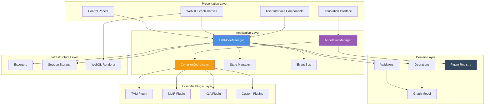
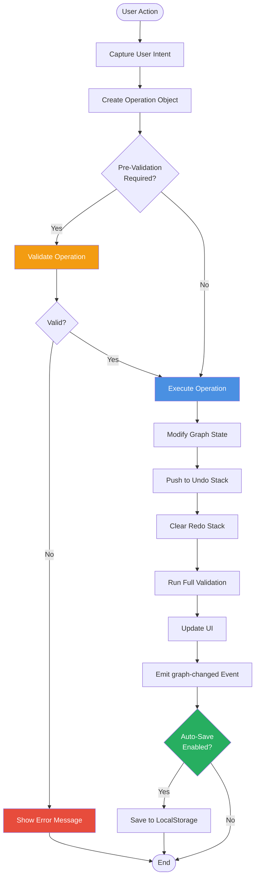
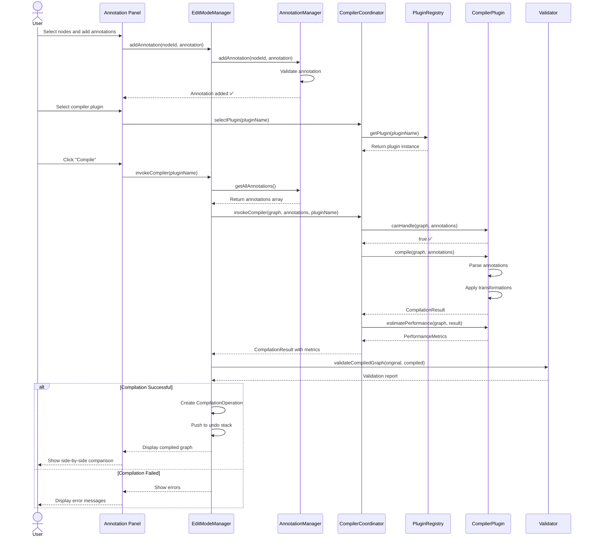
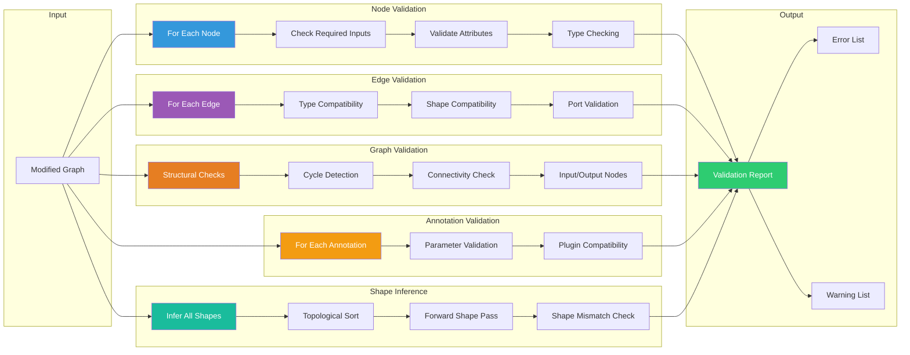

# Model Explorer Interactive Compiler Workflow - Technical Architecture

**Date**: 2025-10-15
**Status**: Design Proposal
**Version**: 2.0
**Author**: Claude (AI Assistant)

📖 **Navigation**: [← Previous: User Experience Design](02-user-experience.md) | [Next: Implementation Plan →](04-implementation.md)

---

## Table of Contents

1. [Overview](#overview)
2. [System Architecture](#system-architecture)
3. [Component Structure](#component-structure)
4. [Core Classes](#core-classes)
5. [Data Flow](#data-flow)
6. [Compiler Integration Architecture](#compiler-integration-architecture)
7. [Validation System](#validation-system)
8. [State Management](#state-management)
9. [Export System](#export-system)
10. [Performance Optimization](#performance-optimization)

---

## Overview

This document describes the technical architecture for the **Interactive Compiler Workflow** feature in Model Explorer. The architecture supports:

- **Human-in-the-Loop Pattern**: Interactive annotation → compilation → visualization cycle
- **Extensible Compiler Integration**: Plugin architecture for multiple compiler backends
- **Real-time Validation**: Comprehensive validation system with immediate feedback
- **Undo/Redo System**: Complete operation history with reversibility
- **Multi-format Export**: Support for JSON, ONNX, GraphDef, MLIR, and patches

### Architecture Principles

1. **Separation of Concerns**: Clear separation between UI, business logic, and compiler integration
2. **Command Pattern**: All operations are reversible commands in the undo/redo stack
3. **Plugin Architecture**: Compiler backends are pluggable and extensible
4. **Event-Driven**: State changes propagate through event system
5. **Validation First**: All operations go through validation before execution

---

## System Architecture

### High-Level Architecture Diagram



---

### Layer Responsibilities

**Presentation Layer**:
- Renders UI components and handles user interactions
- Delegates business logic to Application Layer
- Receives state updates through event system

**Application Layer**:
- Coordinates between UI and Domain Layer
- Manages application state and session lifecycle
- Orchestrates compiler plugin execution

**Domain Layer**:
- Implements core business logic (operations, validation)
- Maintains graph model and integrity
- Provides compiler plugin interface

**Compiler Plugin Layer**:
- Implements compiler-specific transformations
- Handles annotation parsing and application
- Returns transformed graphs with metrics

**Infrastructure Layer**:
- Provides persistence, export, and rendering capabilities
- No business logic, only technical services

---

## Component Structure

### Directory Structure

```
src/ui/src/components/visualizer/
├── editing/
│   ├── edit-mode-manager.ts              // Central state management
│   ├── edit-mode-manager.service.ts      // Angular service
│   │
│   ├── annotation/
│   │   ├── annotation-manager.ts         // Annotation lifecycle
│   │   ├── annotation-panel.ts           // UI component
│   │   ├── annotation-panel.ng.html
│   │   ├── annotation-panel.scss
│   │   └── annotation-validator.ts       // Annotation validation
│   │
│   ├── compiler/
│   │   ├── compiler-coordinator.ts       // Compilation orchestration
│   │   ├── plugin-registry.ts            // Plugin management
│   │   ├── plugin-interface.ts           // Plugin contract
│   │   ├── compilation-result.ts         // Result types
│   │   ├── performance-metrics.ts        // Metrics collection
│   │   └── plugins/
│   │       ├── tvm-plugin.ts             // Apache TVM integration
│   │       ├── mlir-plugin.ts            // MLIR integration
│   │       ├── xla-plugin.ts             // XLA integration
│   │       └── custom-plugin-template.ts // Plugin template
│   │
│   ├── node-palette/
│   │   ├── node-palette.ts
│   │   ├── node-palette.ng.html
│   │   ├── node-palette.scss
│   │   └── node-templates.ts             // Node type definitions
│   │
│   ├── properties-panel/
│   │   ├── properties-panel.ts
│   │   ├── properties-panel.ng.html
│   │   ├── properties-panel.scss
│   │   └── attribute-editors/           // Type-specific editors
│   │       ├── number-editor.ts
│   │       ├── shape-editor.ts
│   │       └── enum-editor.ts
│   │
│   ├── validation-panel/
│   │   ├── validation-panel.ts
│   │   ├── validation-panel.ng.html
│   │   └── validation-panel.scss
│   │
│   ├── history-panel/
│   │   ├── history-panel.ts
│   │   ├── history-panel.ng.html
│   │   └── history-panel.scss
│   │
│   ├── diff-viewer/
│   │   ├── diff-viewer.ts               // Side-by-side comparison
│   │   ├── diff-viewer.ng.html
│   │   ├── diff-viewer.scss
│   │   └── diff-calculator.ts           // Compute differences
│   │
│   ├── operations/
│   │   ├── operation.ts                 // Base operation interface
│   │   ├── node-operations.ts           // Add, delete, modify nodes
│   │   ├── edge-operations.ts           // Add, delete edges
│   │   ├── annotation-operations.ts     // Annotation CRUD
│   │   ├── compilation-operations.ts    // Compilation invocation
│   │   └── composite-operations.ts      // Multi-step operations
│   │
│   ├── validation/
│   │   ├── validator.ts                 // Main validation orchestrator
│   │   ├── node-validator.ts
│   │   ├── edge-validator.ts
│   │   ├── graph-validator.ts
│   │   ├── annotation-validator.ts      // Annotation validation
│   │   ├── compiler-validator.ts        // Compiled graph validation
│   │   └── shape-inference.ts
│   │
│   └── export/
│       ├── exporter.ts                  // Base exporter
│       ├── json-exporter.ts
│       ├── onnx-exporter.ts
│       ├── graphdef-exporter.ts
│       ├── mlir-exporter.ts
│       └── patch-exporter.ts
│
├── renderer_wrapper.ts                   // Modified to support editing
├── webgl_renderer.ts                     // Modified for edit interactions
└── app_service.ts                        // Extended with edit state
```

---

## Core Classes

### Class Diagram

```mermaid
classDiagram
    class EditModeManager {
        -graph: Graph
        -originalGraph: Graph
        -compiledGraph: Graph
        -undoStack: Operation[]
        -redoStack: Operation[]
        -validator: GraphValidator
        -annotationManager: AnnotationManager
        -compilerCoordinator: CompilerCoordinator
        +enableEditMode()
        +disableEditMode()
        +addNode(type, position, attributes)
        +deleteNodes(nodeIds)
        +modifyNodeAttributes(nodeId, attributes)
        +cloneNodes(nodeIds)
        +addEdge(source, target)
        +deleteEdges(edgeIds)
        +undo()
        +redo()
        +runValidation()
        +exportGraph(format)
        +exportPatch()
    }

    class AnnotationManager {
        -annotations: Map~string, Annotation[]~
        -validator: AnnotationValidator
        +addAnnotation(nodeId, annotation)
        +removeAnnotation(annotationId)
        +getAnnotationsForNode(nodeId)
        +getAllAnnotations()
        +validateAnnotation(annotation)
        +clearAnnotations()
    }

    class CompilerCoordinator {
        -pluginRegistry: PluginRegistry
        -activePlugin: CompilerPlugin
        -compilationCache: Map
        +selectPlugin(pluginName)
        +invokeCompiler(graph, annotations)
        +previewTransformation(graph, annotations)
        +getAvailablePlugins()
        +getPerformanceMetrics()
    }

    class PluginRegistry {
        -plugins: Map~string, CompilerPlugin~
        +register(plugin)
        +unregister(pluginName)
        +getPlugin(name)
        +listPlugins()
    }

    class CompilerPlugin {
        <<interface>>
        +name: string
        +version: string
        +supportedAnnotations: string[]
        +canHandle(graph, annotations)
        +preview(graph, annotations)
        +compile(graph, annotations)
        +estimatePerformance(graph, result)
    }

    class TVMPlugin {
        +name: "TVM Optimizer"
        +compile(graph, annotations)
        -convertToRelay(graph)
        -applyTVMPasses(module, annotations)
        -convertFromRelay(module)
    }

    class MLIRPlugin {
        +name: "MLIR Compiler"
        +compile(graph, annotations)
        -convertToMLIR(graph)
        -createPassManager(annotations)
        -applyPasses(module)
    }

    class XLAPlugin {
        +name: "XLA Compiler"
        +compile(graph, annotations)
        -convertToHLO(graph)
        -applyXLAOptimizations(computation, annotations)
    }

    class Operation {
        <<interface>>
        +type: string
        +timestamp: Date
        +execute(graph)
        +undo(graph)
        +getDescription()
    }

    class BaseOperation {
        <<abstract>>
        +type: string
        +timestamp: Date
        +execute(graph)*
        +undo(graph)*
        +getDescription()*
    }

    class AddNodeOperation {
        -node: Node
        +execute(graph)
        +undo(graph)
        +getDescription()
    }

    class DeleteNodesOperation {
        -nodeIds: string[]
        -deletedNodes: Node[]
        -deletedEdges: Edge[]
        +execute(graph)
        +undo(graph)
        +getDescription()
    }

    class ModifyNodeOperation {
        -nodeId: string
        -oldAttributes: any
        -newAttributes: any
        +execute(graph)
        +undo(graph)
        +getDescription()
    }

    class AnnotationOperation {
        -nodeId: string
        -annotation: Annotation
        +execute(graph)
        +undo(graph)
        +getDescription()
    }

    class CompilationOperation {
        -originalGraph: Graph
        -compiledGraph: Graph
        -pluginName: string
        -annotations: Annotation[]
        +execute(graph)
        +undo(graph)
        +getDescription()
    }

    class GraphValidator {
        -nodeValidator: NodeValidator
        -edgeValidator: EdgeValidator
        -annotationValidator: AnnotationValidator
        -compilerValidator: CompilerValidator
        -shapeInference: ShapeInference
        +validate(graph)
        +validateConnection(source, target)
        +validateAnnotations(annotations)
        +validateCompiledGraph(original, compiled)
        -validateGraphStructure(graph)
        -findConnectedComponents(graph)
    }

    class NodeValidator {
        +validate(node, graph)
    }

    class EdgeValidator {
        +validate(edge, graph)
    }

    class AnnotationValidator {
        +validateAnnotation(annotation, node)
        +validateCompatibility(annotations, plugin)
    }

    class CompilerValidator {
        +validateCompilationResult(result)
        +validateTransformations(original, compiled)
    }

    class ShapeInference {
        +inferShapes(graph)
        +validateShapes(graph)
        -topologicalSort(graph)
    }

    class Exporter {
        <<interface>>
        +export(graph)
    }

    class JsonExporter {
        +export(graph)
    }

    class OnnxExporter {
        +export(graph)
        -convertToOnnx(graph)
        -convertNode(node)
        -mapToOnnxOpType(type)
    }

    class PatchExporter {
        +exportDiff(original, modified)
        +applyPatch(graph, patch)
        -findModifiedNodes(original, modified)
    }

    Operation <|.. BaseOperation
    BaseOperation <|-- AddNodeOperation
    BaseOperation <|-- DeleteNodesOperation
    BaseOperation <|-- ModifyNodeOperation
    BaseOperation <|-- AnnotationOperation
    BaseOperation <|-- CompilationOperation

    EditModeManager --> Operation
    EditModeManager --> GraphValidator
    EditModeManager --> AnnotationManager
    EditModeManager --> CompilerCoordinator
    EditModeManager --> Exporter

    AnnotationManager --> AnnotationValidator

    CompilerCoordinator --> PluginRegistry
    PluginRegistry --> CompilerPlugin

    CompilerPlugin <|.. TVMPlugin
    CompilerPlugin <|.. MLIRPlugin
    CompilerPlugin <|.. XLAPlugin

    GraphValidator --> NodeValidator
    GraphValidator --> EdgeValidator
    GraphValidator --> AnnotationValidator
    GraphValidator --> CompilerValidator
    GraphValidator --> ShapeInference

    Exporter <|.. JsonExporter
    Exporter <|.. OnnxExporter
    Exporter <|.. PatchExporter
```



---

### EditModeManager

Central controller for all editing operations and compiler invocations.

```typescript
// src/ui/src/components/visualizer/editing/edit-mode-manager.ts

export class EditModeManager {
  private graph: Graph;
  private originalGraph: Graph;
  private compiledGraph: Graph | null = null;
  private undoStack: Operation[] = [];
  private redoStack: Operation[] = [];
  private validator: GraphValidator;
  private annotationManager: AnnotationManager;
  private compilerCoordinator: CompilerCoordinator;

  constructor(
    private appService: AppService,
    private webglRenderer: WebglRenderer
  ) {
    this.validator = new GraphValidator();
    this.annotationManager = new AnnotationManager();
    this.compilerCoordinator = new CompilerCoordinator();
  }

  // State management
  enableEditMode(): void {
    this.originalGraph = cloneDeep(this.graph);
    this.emit('edit-mode-enabled');
  }

  disableEditMode(): void {
    // Optional: prompt to save changes
    this.emit('edit-mode-disabled');
  }

  // Node operations
  addNode(type: string, position: Point, attributes?: any): void {
    const node = this.createNode(type, position, attributes);
    const operation = new AddNodeOperation(node);
    this.executeOperation(operation);
  }

  deleteNodes(nodeIds: string[]): void {
    const operation = new DeleteNodesOperation(nodeIds, this.graph);
    this.executeOperation(operation);
  }

  modifyNodeAttributes(nodeId: string, attributes: any): void {
    const operation = new ModifyNodeOperation(nodeId, attributes, this.graph);
    this.executeOperation(operation);
  }

  cloneNodes(nodeIds: string[]): void {
    const operation = new CloneNodesOperation(nodeIds, this.graph);
    this.executeOperation(operation);
  }

  // Edge operations
  addEdge(
    sourceId: string,
    sourcePort: number,
    targetId: string,
    targetPort: number
  ): ValidationResult {
    // Pre-validate connection
    const validationResult = this.validator.validateConnection(
      this.graph.getNode(sourceId),
      sourcePort,
      this.graph.getNode(targetId),
      targetPort
    );

    if (!validationResult.isValid) {
      return validationResult;
    }

    const operation = new AddEdgeOperation(sourceId, sourcePort, targetId, targetPort);
    this.executeOperation(operation);
    return { isValid: true };
  }

  deleteEdges(edgeIds: string[]): void {
    const operation = new DeleteEdgesOperation(edgeIds);
    this.executeOperation(operation);
  }

  // Annotation operations
  addAnnotation(nodeId: string, annotation: Annotation): void {
    const operation = new AnnotationOperation(nodeId, annotation, 'add');
    this.executeOperation(operation);
    this.annotationManager.addAnnotation(nodeId, annotation);
  }

  removeAnnotation(annotationId: string): void {
    const annotation = this.annotationManager.getAnnotation(annotationId);
    const operation = new AnnotationOperation(annotation.nodeId, annotation, 'remove');
    this.executeOperation(operation);
    this.annotationManager.removeAnnotation(annotationId);
  }

  // Compiler invocation
  async invokeCompiler(pluginName: string): Promise<CompilationResult> {
    const annotations = this.annotationManager.getAllAnnotations();
    const result = await this.compilerCoordinator.invokeCompiler(
      this.graph,
      annotations,
      pluginName
    );

    if (result.success) {
      const operation = new CompilationOperation(
        this.graph,
        result.transformedGraph,
        pluginName,
        annotations
      );
      this.executeOperation(operation);
      this.compiledGraph = result.transformedGraph;
    }

    return result;
  }

  // History management
  undo(): void {
    if (this.undoStack.length === 0) return;

    const operation = this.undoStack.pop()!;
    operation.undo(this.graph);
    this.redoStack.push(operation);

    this.emit('graph-changed');
    this.runValidation();
  }

  redo(): void {
    if (this.redoStack.length === 0) return;

    const operation = this.redoStack.pop()!;
    operation.execute(this.graph);
    this.undoStack.push(operation);

    this.emit('graph-changed');
    this.runValidation();
  }

  // Validation
  runValidation(): ValidationReport {
    const report = this.validator.validate(this.graph);

    // Also validate annotations
    const annotations = this.annotationManager.getAllAnnotations();
    const annotationErrors = this.validator.validateAnnotations(annotations);
    report.errors.push(...annotationErrors.errors);
    report.warnings.push(...annotationErrors.warnings);

    this.emit('validation-updated', report);
    return report;
  }

  // Export
  exportGraph(format: ExportFormat): Blob {
    const validationReport = this.runValidation();

    if (validationReport.hasErrors) {
      throw new Error('Cannot export graph with validation errors');
    }

    const exporter = this.getExporter(format);
    return exporter.export(this.graph);
  }

  exportPatch(): Blob {
    const patchExporter = new PatchExporter();
    return patchExporter.exportDiff(this.originalGraph, this.graph);
  }

  // Private methods
  private executeOperation(operation: Operation): void {
    operation.execute(this.graph);
    this.undoStack.push(operation);
    this.redoStack = []; // Clear redo stack

    this.emit('graph-changed');
    this.runValidation();
  }

  private createNode(type: string, position: Point, attributes?: any): Node {
    const template = NodeTemplates.get(type);
    if (!template) {
      throw new Error(`Unknown node type: ${type}`);
    }

    return {
      id: this.generateNodeId(type),
      type: type,
      label: template.defaultLabel,
      namespace: this.getCurrentNamespace(),
      attributes: { ...template.defaultAttributes, ...attributes },
      inputs: template.inputs.map(i => ({ ...i })),
      outputs: template.outputs.map(o => ({ ...o })),
      position: position
    };
  }

  private getExporter(format: ExportFormat): Exporter {
    switch (format) {
      case 'json': return new JsonExporter();
      case 'onnx': return new OnnxExporter();
      case 'graphdef': return new GraphDefExporter();
      case 'mlir': return new MlirExporter();
      default: throw new Error(`Unsupported format: ${format}`);
    }
  }

  private emit(event: string, data?: any): void {
    this.appService.editEvents$.next({ type: event, data });
  }
}
```

---

### AnnotationManager

Manages annotation lifecycle and validation.

```typescript
// src/ui/src/components/visualizer/editing/annotation/annotation-manager.ts

export interface Annotation {
  id: string;
  nodeId: string;
  type: 'optimization_hint' | 'constraint' | 'hardware_mapping';
  hintType?: 'fusion' | 'quantization' | 'layout' | 'scheduling';
  parameters: Record<string, any>;
  priority: 'required' | 'preferred' | 'optional';
  rationale?: string;
  createdAt: Date;
}

export class AnnotationManager {
  private annotations: Map<string, Annotation[]> = new Map();
  private validator: AnnotationValidator = new AnnotationValidator();

  addAnnotation(nodeId: string, annotation: Annotation): void {
    const validationResult = this.validator.validateAnnotation(annotation);
    if (!validationResult.isValid) {
      throw new Error(`Invalid annotation: ${validationResult.error}`);
    }

    if (!this.annotations.has(nodeId)) {
      this.annotations.set(nodeId, []);
    }

    this.annotations.get(nodeId)!.push(annotation);
  }

  removeAnnotation(annotationId: string): void {
    for (const [nodeId, nodeAnnotations] of this.annotations.entries()) {
      const index = nodeAnnotations.findIndex(a => a.id === annotationId);
      if (index >= 0) {
        nodeAnnotations.splice(index, 1);
        if (nodeAnnotations.length === 0) {
          this.annotations.delete(nodeId);
        }
        return;
      }
    }
  }

  getAnnotationsForNode(nodeId: string): Annotation[] {
    return this.annotations.get(nodeId) || [];
  }

  getAllAnnotations(): Annotation[] {
    const all: Annotation[] = [];
    for (const annotations of this.annotations.values()) {
      all.push(...annotations);
    }
    return all;
  }

  getAnnotation(annotationId: string): Annotation | null {
    for (const annotations of this.annotations.values()) {
      const annotation = annotations.find(a => a.id === annotationId);
      if (annotation) return annotation;
    }
    return null;
  }

  clearAnnotations(): void {
    this.annotations.clear();
  }

  validateAnnotation(annotation: Annotation): ValidationResult {
    return this.validator.validateAnnotation(annotation);
  }
}
```

---

### CompilerCoordinator

Orchestrates compiler plugin execution and manages compilation lifecycle.

```typescript
// src/ui/src/components/visualizer/editing/compiler/compiler-coordinator.ts

export interface CompilationResult {
  success: boolean;
  transformedGraph: Graph;
  appliedTransformations: Transformation[];
  performanceMetrics: PerformanceMetrics;
  warnings: string[];
  errors?: string[];
}

export interface PerformanceMetrics {
  nodeCountBefore: number;
  nodeCountAfter: number;
  nodeReductionPercent: number;
  estimatedSpeedup: number;
  memoryReduction: number;
  layerLatencies: Map<string, number>;
}

export class CompilerCoordinator {
  private pluginRegistry: PluginRegistry;
  private activePlugin: CompilerPlugin | null = null;
  private compilationCache: Map<string, CompilationResult> = new Map();

  constructor() {
    this.pluginRegistry = new PluginRegistry();
    this.registerDefaultPlugins();
  }

  private registerDefaultPlugins(): void {
    this.pluginRegistry.register(new TVMPlugin());
    this.pluginRegistry.register(new MLIRPlugin());
    this.pluginRegistry.register(new XLAPlugin());
  }

  selectPlugin(pluginName: string): void {
    const plugin = this.pluginRegistry.getPlugin(pluginName);
    if (!plugin) {
      throw new Error(`Plugin not found: ${pluginName}`);
    }
    this.activePlugin = plugin;
  }

  async invokeCompiler(
    graph: Graph,
    annotations: Annotation[],
    pluginName?: string
  ): Promise<CompilationResult> {
    // Select plugin if specified
    if (pluginName) {
      this.selectPlugin(pluginName);
    }

    if (!this.activePlugin) {
      throw new Error('No compiler plugin selected');
    }

    // Check if plugin can handle this graph
    if (!this.activePlugin.canHandle(graph, annotations)) {
      throw new Error(`Plugin ${this.activePlugin.name} cannot handle this graph`);
    }

    // Check cache
    const cacheKey = this.getCacheKey(graph, annotations, this.activePlugin.name);
    if (this.compilationCache.has(cacheKey)) {
      return this.compilationCache.get(cacheKey)!;
    }

    // Invoke compilation
    try {
      const result = await this.activePlugin.compile(graph, annotations);

      // Estimate performance
      const metrics = await this.activePlugin.estimatePerformance(graph, result);
      result.performanceMetrics = metrics;

      // Cache result
      this.compilationCache.set(cacheKey, result);

      return result;
    } catch (error) {
      return {
        success: false,
        transformedGraph: graph,
        appliedTransformations: [],
        performanceMetrics: this.createEmptyMetrics(),
        warnings: [],
        errors: [error.message]
      };
    }
  }

  async previewTransformation(
    graph: Graph,
    annotations: Annotation[]
  ): Promise<TransformationPreview> {
    if (!this.activePlugin) {
      throw new Error('No compiler plugin selected');
    }

    return this.activePlugin.preview(graph, annotations);
  }

  getAvailablePlugins(): CompilerPlugin[] {
    return this.pluginRegistry.listPlugins();
  }

  getPerformanceMetrics(): PerformanceMetrics | null {
    return this.activePlugin ? null : null; // TODO: Implement metrics tracking
  }

  private getCacheKey(graph: Graph, annotations: Annotation[], pluginName: string): string {
    const graphHash = this.hashGraph(graph);
    const annotationHash = this.hashAnnotations(annotations);
    return `${pluginName}_${graphHash}_${annotationHash}`;
  }

  private hashGraph(graph: Graph): string {
    // Simple hash based on node/edge counts and types
    const nodeTypes = graph.nodes.map(n => n.type).sort().join(',');
    return `${graph.nodes.length}_${graph.edges.length}_${nodeTypes}`;
  }

  private hashAnnotations(annotations: Annotation[]): string {
    return annotations.map(a => `${a.nodeId}_${a.type}_${a.hintType}`).join('|');
  }

  private createEmptyMetrics(): PerformanceMetrics {
    return {
      nodeCountBefore: 0,
      nodeCountAfter: 0,
      nodeReductionPercent: 0,
      estimatedSpeedup: 1.0,
      memoryReduction: 0,
      layerLatencies: new Map()
    };
  }
}
```

---

### PluginRegistry

Manages compiler plugin registration and discovery.

```typescript
// src/ui/src/components/visualizer/editing/compiler/plugin-registry.ts

export class PluginRegistry {
  private plugins: Map<string, CompilerPlugin> = new Map();

  register(plugin: CompilerPlugin): void {
    if (this.plugins.has(plugin.name)) {
      console.warn(`Plugin '${plugin.name}' is already registered. Overwriting.`);
    }
    this.plugins.set(plugin.name, plugin);
  }

  unregister(pluginName: string): void {
    this.plugins.delete(pluginName);
  }

  getPlugin(name: string): CompilerPlugin | null {
    return this.plugins.get(name) || null;
  }

  listPlugins(): CompilerPlugin[] {
    return Array.from(this.plugins.values());
  }

  hasPlugin(name: string): boolean {
    return this.plugins.has(name);
  }
}
```

---

## Data Flow

### Operation Execution Flow



---

### Compilation Flow



---

## Compiler Integration Architecture

### Compiler Plugin Interface

```typescript
// src/ui/src/components/visualizer/editing/compiler/plugin-interface.ts

export interface CompilerPlugin {
  // Metadata
  name: string;
  version: string;
  description: string;
  supportedAnnotations: string[];

  // Capability check
  canHandle(graph: Graph, annotations: Annotation[]): boolean;

  // Preview transformation without executing
  preview(graph: Graph, annotations: Annotation[]): TransformationPreview;

  // Execute compilation
  compile(graph: Graph, annotations: Annotation[]): Promise<CompilationResult>;

  // Estimate performance impact
  estimatePerformance(graph: Graph, result: CompilationResult): Promise<PerformanceMetrics>;
}

export interface TransformationPreview {
  nodeChanges: {
    added: Node[];
    removed: Node[];
    modified: Node[];
  };
  edgeChanges: {
    added: Edge[];
    removed: Edge[];
  };
  estimatedImpact: {
    nodeReduction: number;
    speedupFactor: number;
    memoryReduction: number;
  };
}

export interface Transformation {
  type: string;
  description: string;
  affectedNodes: string[];
  parameters: Record<string, any>;
}
```

---

### Plugin Implementation Example (TVM)

See [01-interactive-compiler-workflow.md](01-interactive-compiler-workflow.md#tvm-integration-example) for complete TVM plugin implementation.

---

## Validation System

### Validation Pipeline



---

### GraphValidator Implementation

```typescript
// src/ui/src/components/visualizer/editing/validation/validator.ts

export interface ValidationError {
  type: 'error' | 'warning';
  message: string;
  nodeId?: string;
  edgeId?: string;
  annotationId?: string;
  suggestion?: string;
}

export interface ValidationReport {
  isValid: boolean;
  hasErrors: boolean;
  hasWarnings: boolean;
  errors: ValidationError[];
  warnings: ValidationError[];
}

export class GraphValidator {
  private nodeValidator = new NodeValidator();
  private edgeValidator = new EdgeValidator();
  private annotationValidator = new AnnotationValidator();
  private compilerValidator = new CompilerValidator();
  private shapeInference = new ShapeInference();

  validate(graph: Graph): ValidationReport {
    const errors: ValidationError[] = [];
    const warnings: ValidationError[] = [];

    // 1. Validate nodes
    graph.nodes.forEach(node => {
      const nodeErrors = this.nodeValidator.validate(node, graph);
      errors.push(...nodeErrors.filter(e => e.type === 'error'));
      warnings.push(...nodeErrors.filter(e => e.type === 'warning'));
    });

    // 2. Validate edges
    graph.edges.forEach(edge => {
      const edgeErrors = this.edgeValidator.validate(edge, graph);
      errors.push(...edgeErrors.filter(e => e.type === 'error'));
      warnings.push(...edgeErrors.filter(e => e.type === 'warning'));
    });

    // 3. Validate graph structure
    const structureErrors = this.validateGraphStructure(graph);
    errors.push(...structureErrors.filter(e => e.type === 'error'));
    warnings.push(...structureErrors.filter(e => e.type === 'warning'));

    // 4. Infer and validate shapes
    try {
      const shapeErrors = this.shapeInference.validateShapes(graph);
      errors.push(...shapeErrors.filter(e => e.type === 'error'));
      warnings.push(...shapeErrors.filter(e => e.type === 'warning'));
    } catch (e) {
      errors.push({
        type: 'error',
        message: `Shape inference failed: ${e.message}`,
        suggestion: 'Check for cycles or invalid connections'
      });
    }

    return {
      isValid: errors.length === 0,
      hasErrors: errors.length > 0,
      hasWarnings: warnings.length > 0,
      errors,
      warnings
    };
  }

  validateAnnotations(annotations: Annotation[]): ValidationReport {
    const errors: ValidationError[] = [];
    const warnings: ValidationError[] = [];

    annotations.forEach(annotation => {
      const result = this.annotationValidator.validateAnnotation(annotation);
      if (!result.isValid) {
        errors.push({
          type: 'error',
          message: result.error!,
          annotationId: annotation.id,
          suggestion: result.suggestion
        });
      }
    });

    return {
      isValid: errors.length === 0,
      hasErrors: errors.length > 0,
      hasWarnings: warnings.length > 0,
      errors,
      warnings
    };
  }

  validateCompiledGraph(original: Graph, compiled: Graph): ValidationReport {
    return this.compilerValidator.validateCompilationResult(original, compiled);
  }

  validateConnection(
    sourceNode: Node,
    sourcePort: number,
    targetNode: Node,
    targetPort: number
  ): ValidationResult {
    // Type compatibility check
    const sourceOutput = sourceNode.outputs[sourcePort];
    const targetInput = targetNode.inputs[targetPort];

    if (!this.areTypesCompatible(sourceOutput.type, targetInput.type)) {
      return {
        isValid: false,
        error: `Type mismatch: ${sourceOutput.type} → ${targetInput.type}`
      };
    }

    // Shape compatibility check
    if (sourceOutput.shape && targetInput.shape) {
      if (!this.areShapesCompatible(sourceOutput.shape, targetInput.shape)) {
        return {
          isValid: false,
          error: `Shape mismatch: ${sourceOutput.shape} → ${targetInput.shape}`
        };
      }
    }

    // Check for cycles (if graph is non-recurrent)
    if (this.wouldCreateCycle(sourceNode, targetNode)) {
      return {
        isValid: false,
        error: 'Connection would create a cycle'
      };
    }

    return { isValid: true };
  }

  private validateGraphStructure(graph: Graph): ValidationError[] {
    const errors: ValidationError[] = [];

    // Find disconnected subgraphs
    const components = this.findConnectedComponents(graph);
    if (components.length > 1) {
      errors.push({
        type: 'warning',
        message: `Graph has ${components.length} disconnected subgraphs`,
        suggestion: 'Connect all components or remove unused nodes'
      });
    }

    // Find orphaned nodes
    const orphanedNodes = graph.nodes.filter(node => {
      const hasInputs = graph.edges.some(e => e.targetNodeId === node.id);
      const hasOutputs = graph.edges.some(e => e.sourceNodeId === node.id);
      return !hasInputs && !hasOutputs && !node.isGraphInput && !node.isGraphOutput;
    });

    orphanedNodes.forEach(node => {
      errors.push({
        type: 'warning',
        message: `Node '${node.label}' is orphaned (no connections)`,
        nodeId: node.id,
        suggestion: 'Connect to other nodes or remove'
      });
    });

    // Validate graph inputs/outputs
    const graphInputs = graph.nodes.filter(n => n.isGraphInput);
    const graphOutputs = graph.nodes.filter(n => n.isGraphOutput);

    if (graphInputs.length === 0) {
      errors.push({
        type: 'error',
        message: 'Graph has no input nodes',
        suggestion: 'Add at least one input node'
      });
    }

    if (graphOutputs.length === 0) {
      errors.push({
        type: 'error',
        message: 'Graph has no output nodes',
        suggestion: 'Add at least one output node'
      });
    }

    return errors;
  }

  // Additional validation methods...
}
```

---

## State Management

### State Structure

```typescript
interface EditState {
  // Editing mode
  mode: 'view' | 'edit' | 'annotate' | 'compile' | 'validate';

  // Selection
  selectedNodes: Set<string>;
  selectedEdges: Set<string>;

  // Annotations
  annotations: Map<string, Annotation[]>;  // nodeId -> annotations
  activeCompiler: string | null;            // Selected compiler plugin

  // History
  undoStack: Operation[];
  redoStack: Operation[];

  // Validation
  errors: ValidationError[];
  warnings: ValidationWarning[];

  // Graph state
  originalGraph: Graph;
  modifiedGraph: Graph;
  compiledGraph: Graph | null;              // Result of compilation
  isDirty: boolean;

  // Compilation state
  compilationInProgress: boolean;
  compilationResult: CompilationResult | null;
  performanceMetrics: PerformanceMetrics | null;

  // Session
  lastSaved: Date;
  autoSaveEnabled: boolean;
}
```

---

## Export System

### Exporter Interface

```typescript
export interface Exporter {
  export(graph: Graph): Blob;
}

export class JsonExporter implements Exporter {
  export(graph: Graph): Blob {
    const json = JSON.stringify(graph, null, 2);
    return new Blob([json], { type: 'application/json' });
  }
}

export class PatchExporter implements Exporter {
  exportDiff(original: Graph, modified: Graph): Blob {
    const patch = this.computeDiff(original, modified);
    const json = JSON.stringify(patch, null, 2);
    return new Blob([json], { type: 'application/json' });
  }

  private computeDiff(original: Graph, modified: Graph): GraphPatch {
    // Implementation details...
  }
}
```

---

## Performance Optimization

### Optimization Strategies

1. **Virtualized Rendering**: Only render visible nodes (viewport culling)
2. **Level of Detail (LOD)**: Simplified rendering for distant nodes
3. **Debounced Validation**: 300ms debounce on real-time validation
4. **Lazy Loading**: Load graph data in chunks for large models (1000+ nodes)
5. **WebGL Optimizations**: Batch rendering, texture atlases, instanced drawing
6. **Compilation Caching**: Cache compiler results for 15 minutes
7. **Structural Sharing**: Use structural sharing for undo history

### Performance Targets

| Operation | Target | Maximum |
|-----------|--------|---------|
| **Initial Load** | <2 seconds | <5 seconds |
| **Node Selection** | <50ms | <100ms |
| **Validation** | <500ms | <2 seconds |
| **Compilation** | <5 seconds | <30 seconds |
| **Diff Rendering** | <1 second | <3 seconds |
| **Frame Rate** | 60 FPS | 30 FPS |

---

## Related Documents

- **[Overview](00-overview.md)**: Executive summary and motivation
- **[Interactive Compiler Workflow](01-interactive-compiler-workflow.md)**: Core feature specification and compiler integration
- **[User Experience Design](02-user-experience.md)**: User stories, workflows, and UI/UX design
- **[Implementation Plan](04-implementation.md)**: Phase-by-phase development roadmap
- **[API Reference](05-api-reference.md)**: Complete API specifications and integration guide

---

**Document Metadata**:

- **Version**: 2.0 (focus on interactive compiler workflows)
- **Last Updated**: 2025-10-15
- **Target Audience**: Software Engineers, System Architects, Technical Leads
- **Prerequisites**: Familiarity with TypeScript, Angular, WebGL, and compiler concepts

📖 **Navigation**: [← Previous: User Experience Design](02-user-experience.md) | [Next: Implementation Plan →](04-implementation.md)
