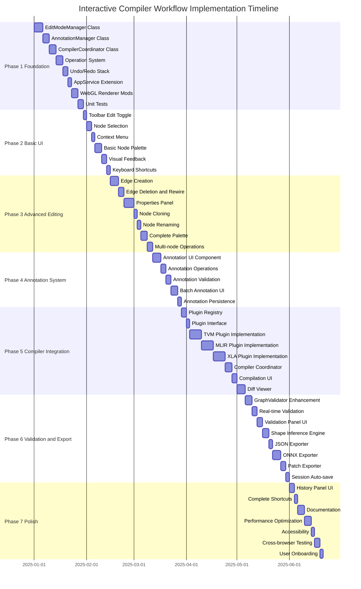

# Model Explorer Interactive Compiler Workflow - Implementation Plan

**Date**: 2025-10-15
**Status**: Design Proposal
**Version**: 2.0
**Author**: Claude (AI Assistant)

📖 **Navigation**: [← Previous: Technical Architecture](03-architecture.md) | [Next: API Reference →](05-api-reference.md)

---

## Table of Contents

1. [Overview](#overview)
2. [Implementation Timeline](#implementation-timeline)
3. [Phase 1: Foundation](#phase-1-foundation-2-3-weeks)
4. [Phase 2: Basic UI](#phase-2-basic-ui-2-3-weeks)
5. [Phase 3: Advanced Editing](#phase-3-advanced-editing-3-4-weeks)
6. [Phase 4: Annotation System](#phase-4-annotation-system-2-3-weeks)
7. [Phase 5: Compiler Integration](#phase-5-compiler-integration-3-4-weeks)
8. [Phase 6: Validation & Export](#phase-6-validation--export-2-3-weeks)
9. [Phase 7: Polish & Documentation](#phase-7-polish--documentation-1-2-weeks)
10. [Testing Strategy](#testing-strategy)
11. [Risk Management](#risk-management)
12. [Success Criteria](#success-criteria)

---

## Overview

This document describes the implementation plan for the **Interactive Compiler Workflow** feature in Model Explorer. The implementation is organized into 7 phases over approximately **18-24 weeks** (4.5-6 months).

### Key Milestones

| Phase | Duration | Milestone | Deliverable |
|-------|----------|-----------|-------------|
| **Phase 1** | 2-3 weeks | Foundation | Core editing infrastructure |
| **Phase 2** | 2-3 weeks | Basic UI | Minimal viable editor |
| **Phase 3** | 3-4 weeks | Advanced Editing | Full editing capabilities |
| **Phase 4** | 2-3 weeks | Annotation System | Annotation infrastructure |
| **Phase 5** | 3-4 weeks | Compiler Integration | Plugin architecture with 3 backends |
| **Phase 6** | 2-3 weeks | Validation & Export | Production export capabilities |
| **Phase 7** | 1-2 weeks | Polish | Production-ready feature |

### Development Principles

1. **Incremental Development**: Each phase builds on previous work
2. **Test-Driven**: Write tests before implementation
3. **User Feedback**: Regular demos and feedback collection
4. **Performance-Aware**: Profile and optimize throughout
5. **Accessibility-First**: WCAG 2.1 AA compliance from day one

---

## Implementation Timeline

---

## Phase 1: Foundation (2-3 weeks)

**Goal**: Build core editing and compiler integration infrastructure without UI

### Tasks

#### Core Classes (Week 1)

1. **EditModeManager Class** (5 days)
   - State management for edit/compile modes
   - Operation execution framework
   - Event bus integration
   - Test coverage: >90%

2. **AnnotationManager Class** (4 days)
   - Annotation storage and retrieval
   - Annotation validation logic
   - Batch annotation support
   - Test coverage: >85%

3. **CompilerCoordinator Class** (4 days)
   - Plugin lifecycle management
   - Compilation orchestration
   - Result caching
   - Test coverage: >85%

#### Operation System (Week 2)

4. **Operation Infrastructure** (4 days)
   - `Operation` interface
   - `BaseOperation` abstract class
   - Node operations (Add, Delete, Modify, Clone)
   - Edge operations (Add, Delete, Rewire)
   - Annotation operations (Add, Remove, Modify)
   - Compilation operations (Invoke, Revert)
   - Test coverage: >90%

5. **Undo/Redo Stack** (3 days)
   - Stack implementation with 50+ operation limit
   - Memory-efficient structural sharing
   - Operation history tracking
   - Test coverage: >95%

#### Integration (Week 3)

6. **AppService Extension** (2 days)
   - Add edit state observables
   - Add compilation state observables
   - Event emission system
   - Test coverage: >85%

7. **WebGL Renderer Modifications** (4 days)
   - Edit mode visual states
   - Annotation badge rendering
   - Diff visualization rendering
   - Performance profiling
   - Test coverage: >80%

8. **Comprehensive Unit Tests** (3 days)
   - Integration tests across components
   - Edge case testing
   - Performance benchmarks
   - Code coverage report

### Deliverables

- ✅ Working edit mode toggle (programmatic only)
- ✅ Programmatic node/edge add/delete with undo/redo
- ✅ Annotation management infrastructure
- ✅ Compiler coordination framework
- ✅ Test coverage >85%
- ✅ Technical design review document

### Success Criteria

- All unit tests passing
- Code coverage >85%
- No memory leaks detected
- Performance within targets (see [03-architecture.md](03-architecture.md#performance-optimization))

---

## Phase 2: Basic UI (2-3 weeks)

**Goal**: Minimal viable editing interface with annotation support

### Tasks

#### Toolbar & Mode Control (Week 1)

1. **Toolbar Edit Toggle** (2 days)
   - Edit mode button with visual states
   - Mode indicator in status bar
   - Keyboard shortcut (E)
   - Accessibility labels

2. **Node Selection** (3 days)
   - Single-click selection
   - Ctrl+click multi-selection
   - Shift+drag box selection
   - Selection highlight rendering
   - Selection state management

3. **Context Menu** (2 days)
   - Right-click menu on nodes
   - Operations: Delete, Clone, Annotate
   - Keyboard shortcut integration
   - Accessibility support

#### Node Palette (Week 2)

4. **Basic Node Palette** (4 days)
   - Left sidebar component
   - Basic node categories (5-10 types)
   - Drag-and-drop support
   - Node template system
   - Search/filter functionality

5. **Visual Feedback** (3 days)
   - Cursor changes (add, select, grab)
   - Node state indicators (selected, hover, error)
   - Edge state indicators (creating, selected)
   - Validation error badges

#### Shortcuts & Feedback (Week 3)

6. **Keyboard Shortcuts** (2 days)
   - Core shortcuts (Ctrl+Z, Ctrl+Y, Delete, etc.)
   - Shortcut help overlay (?)
   - Keyboard navigation
   - Accessibility compliance

### Deliverables

- ✅ Users can enable edit mode via toolbar
- ✅ Users can add/delete nodes via palette and context menu
- ✅ Visual feedback for all operations
- ✅ Keyboard shortcuts functional
- ✅ Accessibility audit passed

### Success Criteria

- Users can complete basic editing tasks in <2 minutes
- All interactions have clear visual feedback
- WCAG 2.1 AA compliance verified
- No performance degradation with 100+ nodes

---

## Phase 3: Advanced Editing (3-4 weeks)

**Goal**: Full editing capabilities including edge management and properties

### Tasks

#### Edge Management (Week 1)

1. **Edge Creation** (5 days)
   - Drag from output port to input port
   - Real-time validation during drag
   - Compatible/incompatible port indicators
   - Type and shape pre-checking
   - Cursor feedback

2. **Edge Deletion & Rewire** (3 days)
   - Click to select edge
   - Delete key removes edge
   - Drag endpoint to rewire
   - Confirmation for critical edges

#### Properties & Advanced Operations (Week 2-3)

3. **Properties Panel** (6 days)
   - Right sidebar component
   - Node information display
   - Dynamic attribute form generation
   - Type-specific editors (number, string, enum, shape)
   - Real-time validation
   - Save/Cancel/Reset actions

4. **Node Cloning** (2 days)
   - Ctrl+D shortcut
   - Context menu option
   - Offset positioning
   - Attribute copying
   - Name disambiguation

5. **Node Renaming** (2 days)
   - Click label to rename
   - ESC to cancel, Enter to save
   - Duplicate name validation
   - Identifier rules enforcement

#### Complete Palette & Multi-ops (Week 3-4)

6. **Complete Node Palette** (4 days)
   - All common operation types (20-30 types)
   - Advanced categories (Convolution, Pooling, Activation, etc.)
   - Custom node type support
   - Template management

7. **Multi-node Operations** (3 days)
   - Shift+drag box selection
   - Batch delete
   - Batch attribute modification
   - Group copy/paste

### Deliverables

- ✅ Full CRUD operations on nodes and edges
- ✅ Properties panel with type-specific editors
- ✅ Complete node palette
- ✅ Multi-selection and batch operations
- ✅ Performance tested with 500+ nodes

### Success Criteria

- Users can complete complex editing tasks in <5 minutes
- No performance degradation with 500+ nodes
- All edge operations validated correctly
- Properties panel responds within <100ms

---

## Phase 4: Annotation System (2-3 weeks)

**Goal**: Complete annotation infrastructure for compiler hints

### Tasks

#### Annotation UI (Week 1)

1. **Annotation Panel Component** (5 days)
   - Right sidebar panel (tabbed with Properties)
   - Annotation list for selected nodes
   - Add annotation form
   - Annotation type selector
   - Parameter editors for each hint type
   - Priority selector
   - Rationale text area

2. **Annotation Operations** (3 days)
   - Add annotation operation
   - Remove annotation operation
   - Modify annotation operation
   - Batch annotation operations
   - Undo/redo integration

#### Validation & Features (Week 2)

3. **Annotation Validation** (3 days)
   - Parameter validation rules
   - Compiler compatibility checks
   - Node type compatibility checks
   - Conflict detection (incompatible annotations)
   - Validation error display

4. **Batch Annotation UI** (4 days)
   - Pattern-based annotation
   - Sequence annotation (Conv-BN-ReLU)
   - Subgraph annotation
   - Node type annotation
   - Preview before apply

#### Persistence & Integration (Week 3)

5. **Annotation Persistence** (2 days)
   - Save annotations with graph
   - Load annotations from file
   - Export annotations separately
   - Session storage

### Deliverables

- ✅ Complete annotation UI with all hint types
- ✅ Annotation validation system
- ✅ Batch annotation capabilities
- ✅ Annotation persistence
- ✅ Integration with EditModeManager

### Success Criteria

- Users can annotate 10 nodes in <2 minutes
- Validation catches all invalid annotations
- Batch annotation reduces time by 80% for patterns
- Annotations persist across sessions

---

## Phase 5: Compiler Integration (3-4 weeks)

**Goal**: Integrate 3 compiler backends with full transformation support

### Tasks

#### Plugin Infrastructure (Week 1)

1. **Plugin Registry** (3 days)
   - Plugin registration system
   - Plugin discovery
   - Plugin metadata management
   - Plugin lifecycle hooks

2. **Plugin Interface** (2 days)
   - `CompilerPlugin` interface definition
   - `TransformationPreview` types
   - `CompilationResult` types
   - `PerformanceMetrics` types

#### Compiler Plugins (Week 2-4)

3. **TVM Plugin Implementation** (7 days)
   - TVM backend integration
   - Relay IR conversion (graph → Relay)
   - TVM pass application
   - Relay → graph conversion
   - Performance estimation
   - Error handling
   - Unit tests
   - Integration tests

4. **MLIR Plugin Implementation** (7 days)
   - MLIR backend integration
   - Graph → MLIR conversion
   - Pass manager creation
   - MLIR pass application
   - MLIR → graph conversion
   - Performance estimation
   - Error handling
   - Unit tests
   - Integration tests

5. **XLA Plugin Implementation** (7 days)
   - XLA backend integration
   - Graph → HLO conversion
   - XLA optimization passes
   - HLO → graph conversion
   - Performance estimation
   - Error handling
   - Unit tests
   - Integration tests

#### UI Integration (Week 4)

6. **Compiler Coordinator Enhancement** (4 days)
   - Plugin selection UI
   - Compilation invocation
   - Result caching
   - Error recovery
   - Performance tracking

7. **Compilation UI** (3 days)
   - Compiler selection dropdown
   - Compile button
   - Progress indicator
   - Compilation status display
   - Error message display

8. **Diff Viewer** (5 days)
   - Side-by-side graph comparison
   - Node diff highlighting (added, removed, modified)
   - Edge diff highlighting
   - Performance metrics overlay
   - Zoom and navigation synchronization
   - Export diff report

### Deliverables

- ✅ Plugin architecture with registry
- ✅ 3 fully functional compiler plugins (TVM, MLIR, XLA)
- ✅ Compilation UI with error handling
- ✅ Diff viewer with performance metrics
- ✅ Comprehensive integration tests

### Success Criteria

- All 3 plugins compile sample graphs successfully
- Compilation completes in <30 seconds for typical models
- Diff viewer highlights all changes accurately
- Performance metrics within 10% of actual measurements
- Plugin extensibility verified with custom plugin

---

## Phase 6: Validation & Export (2-3 weeks)

**Goal**: Production-quality validation and export capabilities

### Tasks

#### Validation System (Week 1-2)

1. **GraphValidator Enhancement** (4 days)
   - Annotation validation integration
   - Compiler-specific validation rules
   - Compiled graph validation
   - Performance validation (ensure no regressions)

2. **Real-time Validation** (3 days)
   - Debounced validation (300ms)
   - Incremental validation
   - Validation caching
   - Performance optimization

3. **Validation Panel UI** (3 days)
   - Bottom panel component
   - Error/warning list
   - Click to locate errors
   - Auto-fix suggestions
   - Export validation report

4. **Shape Inference Engine** (4 days)
   - Topological sort
   - Forward shape propagation
   - Shape compatibility checking
   - Dynamic dimension support
   - Shape error reporting

#### Export System (Week 2-3)

5. **JSON Exporter** (2 days)
   - Graph serialization
   - Annotation serialization
   - Metadata inclusion
   - Pretty-printing

6. **ONNX Exporter** (5 days)
   - Graph → ONNX conversion
   - Operator mapping
   - Attribute conversion
   - ONNX validation
   - Version compatibility

7. **Patch Exporter** (3 days)
   - Diff calculation
   - Patch format design
   - Patch application
   - Version control integration

8. **Session Auto-save** (2 days)
   - LocalStorage integration
   - Auto-save triggers (30s interval)
   - Session restoration
   - Clear session option

### Deliverables

- ✅ Real-time validation with <500ms latency
- ✅ Validation panel with actionable errors
- ✅ Shape inference for all common operations
- ✅ Export to JSON, ONNX formats
- ✅ Patch export for version control
- ✅ Auto-save and session restoration

### Success Criteria

- Validation catches 99% of invalid graphs
- Shape inference accuracy >95%
- ONNX export validated by ONNX checker
- Export completes in <5 seconds for typical models
- Auto-save has no performance impact

---

## Phase 7: Polish & Documentation (1-2 weeks)

**Goal**: Production-ready feature with complete documentation

### Tasks

#### UI Polish (Week 1)

1. **History Panel UI** (3 days)
   - Bottom panel component
   - Operation history list
   - Click to navigate
   - Clear history option
   - Export history as changelog

2. **Complete Keyboard Shortcuts** (2 days)
   - All operations have shortcuts
   - Shortcut customization (optional)
   - Shortcut help overlay
   - Chord support (Ctrl+K, Ctrl+C)

#### Documentation & Testing (Week 2)

3. **User Documentation** (4 days)
   - User guide with screenshots
   - Tutorial videos
   - API documentation for plugin developers
   - Migration guide
   - FAQ

4. **Performance Optimization** (4 days)
   - Profile all operations
   - Optimize hot paths
   - Reduce memory usage
   - Bundle size optimization
   - Lazy loading

5. **Accessibility Improvements** (2 days)
   - WCAG 2.1 AA audit
   - Screen reader testing
   - Keyboard navigation refinement
   - Focus management
   - ARIA labels

6. **Cross-browser Testing** (3 days)
   - Chrome, Firefox, Safari, Edge
   - Mobile browser testing
   - Performance testing per browser
   - Bug fixing

7. **User Onboarding** (2 days)
   - First-time user tutorial
   - Interactive walkthrough
   - Sample projects
   - Quick start guide

### Deliverables

- ✅ History panel with operation tracking
- ✅ Complete keyboard shortcut system
- ✅ Comprehensive user documentation
- ✅ Performance optimized for 1000+ nodes
- ✅ WCAG 2.1 AA compliance
- ✅ Cross-browser compatibility
- ✅ User onboarding experience

### Success Criteria

- Performance targets met (see [03-architecture.md](03-architecture.md#performance-optimization))
- WCAG 2.1 AA audit passed
- Documentation completeness >90%
- User onboarding time <10 minutes
- Cross-browser compatibility verified

---

## Testing Strategy

### Unit Testing

**Framework**: Jest + Testing Library

**Coverage Targets**:
- Core classes: >90%
- Operations: >95%
- Validators: >90%
- Plugins: >85%
- UI components: >80%

**Test Categories**:
- Unit tests for all classes
- Operation execution tests
- Validation rule tests
- Plugin functionality tests
- UI component tests

### Integration Testing

**Framework**: Cypress

**Test Scenarios**:
- Complete editing workflows
- Annotation → Compilation → Export workflows
- Error handling flows
- Performance tests
- Accessibility tests

**Test Coverage**:
- User stories from [02-user-experience.md](02-user-experience.md#user-stories)
- All critical paths
- Error recovery scenarios

### End-to-End Testing

**Framework**: Playwright

**Test Scenarios**:
- Complete user workflows
- Cross-browser testing
- Performance benchmarks
- Accessibility audits
- Visual regression testing

### Performance Testing

**Tools**: Chrome DevTools, Lighthouse

**Metrics**:
- Initial load time
- Operation latency
- Memory usage
- Frame rate (60 FPS target)
- Bundle size

**Benchmarks**:
- 100 nodes: <50ms operations
- 500 nodes: <100ms operations
- 1000 nodes: <200ms operations

---

## Risk Management

### Technical Risks

| Risk | Probability | Impact | Mitigation |
|------|-------------|--------|------------|
| **Compiler plugin complexity** | Medium | High | Start with simple plugins, extensive testing, fallback to read-only mode |
| **WebGL rendering performance** | Medium | High | Profile early, optimize incrementally, LOD rendering |
| **Memory leaks in undo/redo** | Low | High | Structural sharing, memory profiling, automated tests |
| **Cross-browser compatibility** | Medium | Medium | Test frequently, use polyfills, graceful degradation |
| **ONNX export complexity** | High | Medium | Start with basic ops, incremental support, clear documentation |
| **Shape inference accuracy** | Medium | Medium | Extensive test cases, fallback to user hints, clear error messages |

### Project Risks

| Risk | Probability | Impact | Mitigation |
|------|-------------|--------|------------|
| **Scope creep** | High | High | Strict phase boundaries, defer features to Phase 7+ |
| **Dependency delays** | Medium | Medium | Identify dependencies early, parallel work streams |
| **Performance targets missed** | Medium | High | Profile continuously, optimize proactively |
| **User adoption challenges** | Medium | Medium | User testing, documentation, onboarding tutorial |

### Risk Response Plan

**For High-Impact Risks**:
1. Identify risk triggers early
2. Implement mitigation strategies proactively
3. Have fallback plans ready
4. Regular risk review in weekly meetings

**For Medium-Impact Risks**:
1. Monitor risk indicators
2. Adjust plans as needed
3. Document lessons learned

---

## Success Criteria

### Functional Requirements

- ✅ All user stories from [02-user-experience.md](02-user-experience.md#user-stories) implemented
- ✅ 3 compiler plugins fully functional (TVM, MLIR, XLA)
- ✅ Validation catches 99% of invalid graphs
- ✅ Export to JSON, ONNX formats working correctly

### Performance Requirements

- ✅ Initial load: <2 seconds
- ✅ Node selection: <50ms
- ✅ Validation: <500ms
- ✅ Compilation: <30 seconds
- ✅ Frame rate: 60 FPS with 500 nodes, 30 FPS with 1000 nodes

### Quality Requirements

- ✅ Test coverage: >85%
- ✅ No critical bugs
- ✅ WCAG 2.1 AA compliance
- ✅ Cross-browser compatibility (Chrome, Firefox, Safari, Edge)

### User Experience Requirements

- ✅ Users can complete basic tasks in <2 minutes
- ✅ Users can complete annotation → compilation cycle in <5 minutes
- ✅ Documentation completeness >90%
- ✅ User satisfaction score >4.0/5.0

### Adoption Metrics

- ✅ 70% of users complete onboarding tutorial
- ✅ 50% of users use annotation features
- ✅ 30% of users invoke compiler
- ✅ 10% of users export optimized models

---

## Related Documents

- **[Overview](00-overview.md)**: Executive summary and motivation
- **[Interactive Compiler Workflow](01-interactive-compiler-workflow.md)**: Core feature specification and compiler integration
- **[User Experience Design](02-user-experience.md)**: User stories, workflows, and UI/UX design
- **[Technical Architecture](03-architecture.md)**: System design and implementation details
- **[API Reference](05-api-reference.md)**: Complete API specifications and integration guide

---

**Document Metadata**:

- **Version**: 2.0 (focus on interactive compiler workflows)
- **Last Updated**: 2025-10-15
- **Target Audience**: Project Managers, Engineering Leads, Development Teams
- **Prerequisites**: Familiarity with [Technical Architecture](03-architecture.md)

📖 **Navigation**: [← Previous: Technical Architecture](03-architecture.md) | [Next: API Reference →](05-api-reference.md)
