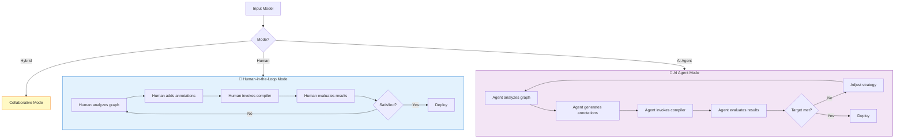
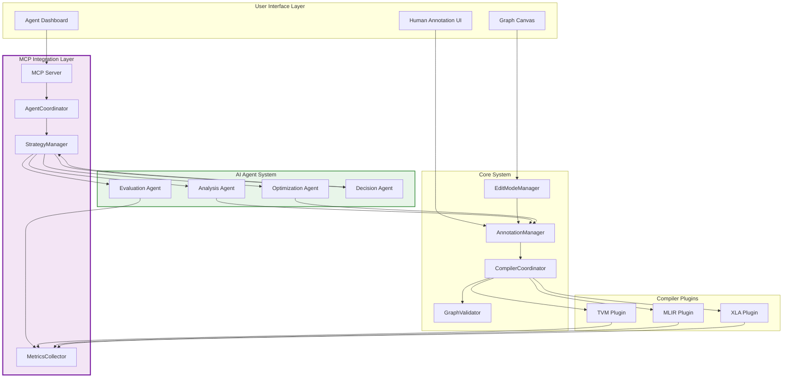

# MCP Integration: AI Agent Automation for Graph Optimization

**Enabling AI-Driven Compiler Optimization Through Model Context Protocol**

---

## Table of Contents

1. [Overview](#overview)
2. [Architecture](#architecture)
3. [Human vs. AI Agent Modes](#human-vs-ai-agent-modes)
4. [MCP Protocol Integration](#mcp-protocol-integration)
5. [AI Agent API Specification](#ai-agent-api-specification)
6. [Automated Optimization Workflows](#automated-optimization-workflows)
7. [Agent Implementation Examples](#agent-implementation-examples)
8. [Integration Patterns](#integration-patterns)
9. [Security and Safety](#security-and-safety)
10. [Performance and Scalability](#performance-and-scalability)
11. [Testing and Validation](#testing-and-validation)

---

## Overview

### What is MCP Integration?

**Model Context Protocol (MCP)** integration extends the interactive compiler workflow to support **AI agent automation**. Instead of requiring human experts to manually iterate through optimization cycles, AI agents can now:

- **Analyze** model graphs automatically
- **Generate** optimization annotations intelligently
- **Invoke** compiler transformations programmatically
- **Evaluate** results against performance targets
- **Iterate** through multiple optimization cycles autonomously

### Key Innovation: Dual-Mode Optimization



### Benefits of AI Agent Automation

**For Compiler Engineers**:
- ✅ Automated testing of optimization passes across diverse models
- ✅ Discovery of non-obvious optimization opportunities
- ✅ Rapid iteration through large search spaces
- ✅ Continuous optimization as models evolve

**For ML Engineers**:
- ✅ Hands-free optimization to deployment targets
- ✅ Automated constraint satisfaction (latency, memory, accuracy)
- ✅ 24/7 optimization without human intervention
- ✅ Reproducible optimization pipelines

**For Hardware Vendors**:
- ✅ Automated customer model optimization
- ✅ Scalable optimization services
- ✅ Continuous benchmarking and tuning
- ✅ Customer enablement without deep expertise requirements

---

## Architecture

### System Architecture with MCP Integration



### Component Responsibilities

**MCP Server**:
- Exposes graph operations via MCP protocol
- Manages agent sessions and authentication
- Routes agent requests to appropriate handlers
- Maintains agent state and context

**AgentCoordinator**:
- Orchestrates multi-agent workflows
- Manages agent lifecycle and resource allocation
- Coordinates between analysis, optimization, and evaluation agents
- Handles agent communication and synchronization

**StrategyManager**:
- Maintains optimization strategies and heuristics
- Selects appropriate strategies based on graph characteristics
- Adapts strategies based on feedback from evaluation results
- Implements search algorithms (greedy, beam search, reinforcement learning)

**MetricsCollector**:
- Collects performance metrics from compiler plugins
- Aggregates results across optimization iterations
- Provides metrics to evaluation agents for decision-making
- Generates reports and visualizations

---

## Human vs. AI Agent Modes

### Mode Comparison

| Aspect | Human-in-the-Loop | AI Agent Mode | Hybrid Mode |
|--------|-------------------|---------------|-------------|
| **Decision Making** | Expert human judgment | ML-based heuristics | Collaborative |
| **Speed** | Minutes to hours | Seconds to minutes | Variable |
| **Scope** | Targeted optimizations | Exhaustive search | Focused + broad |
| **Creativity** | High (novel insights) | Medium (learned patterns) | Very high |
| **Reproducibility** | Low (subjective) | High (deterministic) | Medium |
| **Learning** | Slow (manual) | Fast (automated) | Continuous |
| **Cost** | High (expert time) | Low (compute) | Medium |
| **Best For** | Novel problems | Production pipelines | Research |

### When to Use Each Mode

**Human-in-the-Loop Mode**:
- Novel compiler passes requiring expert validation
- Research prototyping with exploratory workflows
- Models with unique architectural patterns
- High-stakes deployments requiring human oversight
- Educational and training scenarios

**AI Agent Mode**:
- Production optimization pipelines
- Continuous integration and deployment
- Large-scale model optimization
- Constraint-driven compilation (latency, memory budgets)
- Overnight or batch optimization runs

**Hybrid Mode**:
- Human provides initial strategy, agent refines details
- Agent performs broad search, human validates results
- Iterative collaboration for complex optimizations
- Human-in-the-loop for critical decisions with agent assistance

---

## MCP Protocol Integration

### MCP Server API

The MCP server exposes graph operations through a RESTful API and WebSocket interface for real-time communication.

#### Core Endpoints

**Graph Operations**:

```typescript
// Get current graph state
GET /api/v1/graph

// Load a new graph
POST /api/v1/graph
Body: { format: 'onnx' | 'mlir' | 'json', data: string | Blob }

// Get graph metadata
GET /api/v1/graph/metadata
Response: {
  nodeCount: number;
  edgeCount: number;
  inputNodes: string[];
  outputNodes: string[];
  estimatedComplexity: number;
}
```

**Annotation Operations**:

```typescript
// Add annotations to nodes
POST /api/v1/annotations
Body: {
  annotations: Array<{
    nodeId: string;
    type: 'fusion' | 'quantization' | 'layout' | 'scheduling';
    parameters: Record<string, any>;
    priority: 'required' | 'preferred' | 'optional';
    rationale?: string;
  }>;
}

// Get annotations for specific nodes
GET /api/v1/annotations?nodeIds=node1,node2

// Batch annotate based on patterns
POST /api/v1/annotations/batch
Body: {
  pattern: {
    nodeType?: string;
    attributes?: Record<string, any>;
    connections?: {
      predecessors?: number;
      successors?: number;
    };
  };
  annotation: { /* same as above */ };
}
```

**Compilation Operations**:

```typescript
// Invoke compiler with current annotations
POST /api/v1/compile
Body: {
  pluginName?: string; // Auto-select if not provided
  options?: {
    optimizationLevel: 0 | 1 | 2 | 3;
    targetHardware?: string;
    constraints?: {
      maxLatency?: number;
      maxMemory?: number;
      minAccuracy?: number;
    };
  };
}

// Preview transformation without applying
POST /api/v1/compile/preview
Body: { /* same as compile */ }
Response: {
  previewGraph: Graph;
  estimatedMetrics: {
    nodeCountChange: number;
    estimatedSpeedup: number;
    estimatedMemorySavings: number;
  };
  warnings: string[];
}
```

**Evaluation Operations**:

```typescript
// Get performance metrics for current graph
GET /api/v1/metrics

// Compare two graphs
POST /api/v1/metrics/compare
Body: {
  baselineGraphId: string;
  candidateGraphId: string;
}
Response: {
  nodeCountChange: number;
  edgeCountChange: number;
  performanceImprovement: number;
  memorySavings: number;
  accuracyDelta: number;
  improvements: string[];
  regressions: string[];
}
```

**Session Management**:

```typescript
// Create agent session
POST /api/v1/sessions
Body: {
  agentId: string;
  mode: 'analysis' | 'optimization' | 'evaluation';
  config?: Record<string, any>;
}

// Get session state
GET /api/v1/sessions/:sessionId

// Close session
DELETE /api/v1/sessions/:sessionId
```

### WebSocket Interface

Real-time bidirectional communication for live optimization feedback.

```typescript
// Connect to WebSocket
ws://localhost:8080/api/v1/ws/:sessionId

// Message Types
type MCPMessage =
  | { type: 'graph-updated'; graph: Graph }
  | { type: 'annotation-added'; annotations: Annotation[] }
  | { type: 'compilation-started'; pluginName: string }
  | { type: 'compilation-progress'; progress: number; stage: string }
  | { type: 'compilation-completed'; result: CompilationResult }
  | { type: 'metrics-updated'; metrics: PerformanceMetrics }
  | { type: 'agent-decision'; decision: AgentDecision }
  | { type: 'error'; error: string };

// Example: Agent receives compilation updates
socket.on('message', (msg: MCPMessage) => {
  switch (msg.type) {
    case 'compilation-completed':
      agent.evaluateResults(msg.result);
      break;
    case 'metrics-updated':
      agent.updateStrategy(msg.metrics);
      break;
  }
});
```

### Authentication and Security

```typescript
// API Key Authentication
Headers: {
  'Authorization': 'Bearer <api_key>',
  'X-Agent-ID': '<unique_agent_id>'
}

// Rate Limiting
// - 100 requests/minute per agent for analysis endpoints
// - 10 requests/minute per agent for compilation endpoints
// - Unlimited WebSocket messages within session

// Access Control
interface AgentPermissions {
  canReadGraph: boolean;
  canAnnotate: boolean;
  canCompile: boolean;
  canExport: boolean;
  allowedPlugins: string[];
  resourceLimits: {
    maxConcurrentCompilations: number;
    maxGraphSize: number;
    maxSessionDuration: number;
  };
}
```

---

## AI Agent API Specification

### Agent Interface

```typescript
/**
 * Base interface for AI agents that can optimize ML model graphs
 */
interface MCPAgent {
  /**
   * Unique identifier for this agent instance
   */
  readonly id: string;

  /**
   * Human-readable name for the agent
   */
  readonly name: string;

  /**
   * Agent type/specialization
   */
  readonly type: 'analysis' | 'optimization' | 'evaluation' | 'decision';

  /**
   * Initialize agent with configuration
   */
  initialize(config: AgentConfig): Promise<void>;

  /**
   * Execute agent's primary task
   */
  execute(context: AgentContext): Promise<AgentResult>;

  /**
   * Clean up resources
   */
  cleanup(): Promise<void>;
}

interface AgentConfig {
  mcpServerUrl: string;
  apiKey: string;
  sessionId: string;
  optimizationTarget: OptimizationTarget;
  constraints?: OptimizationConstraints;
  strategy?: OptimizationStrategy;
}

interface AgentContext {
  graph: Graph;
  currentMetrics: PerformanceMetrics;
  optimizationHistory: OptimizationStep[];
  availablePlugins: CompilerPlugin[];
  budget?: {
    maxIterations: number;
    maxTimeMs: number;
    currentIteration: number;
  };
}

interface AgentResult {
  success: boolean;
  annotations?: Annotation[];
  compilationRequest?: CompilationRequest;
  metrics?: PerformanceMetrics;
  decision?: AgentDecision;
  reasoning?: string;
  confidenceScore: number;
}

interface AgentDecision {
  action: 'continue' | 'stop' | 'rollback' | 'branch' | 'escalate';
  reason: string;
  nextSteps?: string[];
}
```

### Specialized Agent Types

#### 1. Analysis Agent

```typescript
/**
 * Analyzes graphs to identify optimization opportunities
 */
class AnalysisAgent implements MCPAgent {
  readonly type = 'analysis';

  async execute(context: AgentContext): Promise<AgentResult> {
    const opportunities = await this.identifyOptimizationOpportunities(
      context.graph
    );

    const prioritized = this.prioritizeOpportunities(
      opportunities,
      context.optimizationTarget,
      context.constraints
    );

    return {
      success: true,
      annotations: this.generateInitialAnnotations(prioritized),
      reasoning: this.explainAnalysis(prioritized),
      confidenceScore: this.calculateConfidence(prioritized)
    };
  }

  private async identifyOptimizationOpportunities(
    graph: Graph
  ): Promise<OptimizationOpportunity[]> {
    const opportunities: OptimizationOpportunity[] = [];

    // Identify fusion opportunities
    const fusionCandidates = this.findFusionCandidates(graph);
    opportunities.push(...fusionCandidates);

    // Identify quantization opportunities
    const quantizationCandidates = this.findQuantizationCandidates(graph);
    opportunities.push(...quantizationCandidates);

    // Identify layout optimization opportunities
    const layoutCandidates = this.findLayoutOptimizations(graph);
    opportunities.push(...layoutCandidates);

    // Identify memory optimization opportunities
    const memoryCandidates = this.findMemoryOptimizations(graph);
    opportunities.push(...memoryCandidates);

    return opportunities;
  }

  private findFusionCandidates(graph: Graph): OptimizationOpportunity[] {
    const candidates: OptimizationOpportunity[] = [];

    // Pattern 1: Conv2D -> BatchNorm -> ReLU
    const convBnReluPattern = this.findPattern(graph, [
      { type: 'Conv2D' },
      { type: 'BatchNorm' },
      { type: 'ReLU' }
    ]);

    for (const match of convBnReluPattern) {
      candidates.push({
        type: 'fusion',
        nodes: match.nodes,
        estimatedBenefit: {
          speedup: 1.6,
          memorySavings: 0.3,
          description: 'Fuse Conv2D-BatchNorm-ReLU into single operation'
        },
        priority: 'high'
      });
    }

    // Pattern 2: MatMul -> Add (bias)
    const matmulBiasPattern = this.findPattern(graph, [
      { type: 'MatMul' },
      { type: 'Add' }
    ]);

    for (const match of matmulBiasPattern) {
      if (this.isBiasAddition(match)) {
        candidates.push({
          type: 'fusion',
          nodes: match.nodes,
          estimatedBenefit: {
            speedup: 1.2,
            memorySavings: 0.1,
            description: 'Fuse MatMul with bias addition'
          },
          priority: 'medium'
        });
      }
    }

    return candidates;
  }

  private findQuantizationCandidates(graph: Graph): OptimizationOpportunity[] {
    const candidates: OptimizationOpportunity[] = [];

    for (const node of graph.nodes) {
      if (this.isQuantizationCandidate(node)) {
        const sensitivity = this.estimateQuantizationSensitivity(node);

        candidates.push({
          type: 'quantization',
          nodes: [node.id],
          estimatedBenefit: {
            speedup: 2.0,
            memorySavings: 0.75,
            accuracyImpact: sensitivity,
            description: `Quantize ${node.type} to INT8`
          },
          priority: sensitivity < 0.01 ? 'high' : 'medium'
        });
      }
    }

    return candidates;
  }
}
```

#### 2. Optimization Agent

```typescript
/**
 * Generates optimization annotations based on analysis and strategy
 */
class OptimizationAgent implements MCPAgent {
  readonly type = 'optimization';

  async execute(context: AgentContext): Promise<AgentResult> {
    const strategy = this.selectStrategy(
      context.graph,
      context.optimizationTarget,
      context.optimizationHistory
    );

    const annotations = await this.generateAnnotations(
      context.graph,
      strategy,
      context.constraints
    );

    const compilationRequest = this.buildCompilationRequest(
      annotations,
      strategy
    );

    return {
      success: true,
      annotations,
      compilationRequest,
      reasoning: this.explainStrategy(strategy),
      confidenceScore: strategy.confidence
    };
  }

  private selectStrategy(
    graph: Graph,
    target: OptimizationTarget,
    history: OptimizationStep[]
  ): OptimizationStrategy {
    // Learn from history
    const successfulPatterns = this.analyzeSuccessfulOptimizations(history);

    // Match graph characteristics to strategies
    const graphProfile = this.profileGraph(graph);

    // Select strategy based on target
    switch (target.primaryGoal) {
      case 'latency':
        return this.latencyOptimizationStrategy(
          graphProfile,
          successfulPatterns,
          target.constraints
        );

      case 'memory':
        return this.memoryOptimizationStrategy(
          graphProfile,
          successfulPatterns,
          target.constraints
        );

      case 'throughput':
        return this.throughputOptimizationStrategy(
          graphProfile,
          successfulPatterns,
          target.constraints
        );

      case 'accuracy':
        return this.accuracyPreservingStrategy(
          graphProfile,
          successfulPatterns,
          target.constraints
        );

      default:
        return this.balancedStrategy(graphProfile, successfulPatterns);
    }
  }

  private latencyOptimizationStrategy(
    profile: GraphProfile,
    patterns: SuccessfulPattern[],
    constraints?: OptimizationConstraints
  ): OptimizationStrategy {
    return {
      name: 'Latency-Focused Optimization',
      tactics: [
        {
          type: 'aggressive-fusion',
          weight: 1.0,
          parameters: {
            fuseConvBnRelu: true,
            fuseMatMulBias: true,
            fuseElementwise: true,
            maxFusionDepth: 5
          }
        },
        {
          type: 'layout-optimization',
          weight: 0.8,
          parameters: {
            preferredLayout: this.selectOptimalLayout(profile),
            minimizeTransposes: true
          }
        },
        {
          type: 'quantization',
          weight: constraints?.minAccuracy ? 0.5 : 0.9,
          parameters: {
            targetPrecision: 'int8',
            selectiveLayers: constraints?.minAccuracy !== undefined,
            accuracyThreshold: constraints?.minAccuracy || 0.99
          }
        }
      ],
      confidence: this.calculateStrategyConfidence(profile, patterns)
    };
  }

  private async generateAnnotations(
    graph: Graph,
    strategy: OptimizationStrategy,
    constraints?: OptimizationConstraints
  ): Promise<Annotation[]> {
    const annotations: Annotation[] = [];

    for (const tactic of strategy.tactics) {
      const tacticAnnotations = await this.applyTactic(
        graph,
        tactic,
        constraints
      );

      annotations.push(...tacticAnnotations);
    }

    return annotations;
  }
}
```

#### 3. Evaluation Agent

```typescript
/**
 * Evaluates optimization results against targets and constraints
 */
class EvaluationAgent implements MCPAgent {
  readonly type = 'evaluation';

  async execute(context: AgentContext): Promise<AgentResult> {
    const evaluation = await this.evaluateOptimization(
      context.graph,
      context.currentMetrics,
      context.optimizationTarget,
      context.constraints
    );

    const decision = this.makeDecision(
      evaluation,
      context.budget,
      context.optimizationHistory
    );

    return {
      success: true,
      metrics: evaluation.metrics,
      decision,
      reasoning: this.explainEvaluation(evaluation),
      confidenceScore: evaluation.confidence
    };
  }

  private async evaluateOptimization(
    graph: Graph,
    metrics: PerformanceMetrics,
    target: OptimizationTarget,
    constraints?: OptimizationConstraints
  ): Promise<OptimizationEvaluation> {
    // Check constraint satisfaction
    const constraintsSatisfied = this.checkConstraints(metrics, constraints);

    // Calculate target achievement
    const targetAchievement = this.calculateTargetAchievement(
      metrics,
      target
    );

    // Assess quality of optimization
    const qualityScore = this.assessQuality(
      metrics,
      target,
      constraintsSatisfied
    );

    // Identify issues or regressions
    const issues = this.identifyIssues(metrics, constraints);

    return {
      metrics,
      constraintsSatisfied,
      targetAchievement,
      qualityScore,
      issues,
      confidence: this.calculateEvaluationConfidence(metrics)
    };
  }

  private makeDecision(
    evaluation: OptimizationEvaluation,
    budget?: OptimizationBudget,
    history?: OptimizationStep[]
  ): AgentDecision {
    // Check if target is met
    if (evaluation.targetAchievement >= 1.0 && evaluation.constraintsSatisfied) {
      return {
        action: 'stop',
        reason: 'Target achieved and constraints satisfied',
        nextSteps: ['Export optimized model', 'Deploy to production']
      };
    }

    // Check if budget exhausted
    if (budget && budget.currentIteration >= budget.maxIterations) {
      return {
        action: 'stop',
        reason: 'Iteration budget exhausted',
        nextSteps: ['Review best result', 'Consider manual refinement']
      };
    }

    // Check for diminishing returns
    if (history && this.detectDiminishingReturns(history)) {
      return {
        action: 'stop',
        reason: 'Diminishing returns detected',
        nextSteps: ['Use current best result', 'Try different strategy']
      };
    }

    // Check for constraint violations
    if (!evaluation.constraintsSatisfied) {
      return {
        action: 'rollback',
        reason: 'Constraints violated',
        nextSteps: ['Revert to previous state', 'Adjust optimization strategy']
      };
    }

    // Check for regressions
    if (evaluation.qualityScore < 0.8) {
      return {
        action: 'branch',
        reason: 'Quality degradation detected',
        nextSteps: ['Try alternative approach', 'Adjust parameters']
      };
    }

    // Continue optimization
    return {
      action: 'continue',
      reason: 'Making progress toward target',
      nextSteps: ['Apply next optimization iteration']
    };
  }
}
```

#### 4. Decision Agent

```typescript
/**
 * High-level coordinator that orchestrates other agents
 */
class DecisionAgent implements MCPAgent {
  readonly type = 'decision';

  private analysisAgent: AnalysisAgent;
  private optimizationAgent: OptimizationAgent;
  private evaluationAgent: EvaluationAgent;

  async execute(context: AgentContext): Promise<AgentResult> {
    const plan = await this.createOptimizationPlan(context);

    for (const step of plan.steps) {
      const result = await this.executeStep(step, context);

      if (!result.success || result.decision?.action === 'stop') {
        break;
      }

      if (result.decision?.action === 'rollback') {
        await this.rollbackToCheckpoint(step.checkpoint);
        continue;
      }

      // Update context with results
      context = this.updateContext(context, result);
    }

    return {
      success: true,
      decision: {
        action: 'stop',
        reason: 'Optimization plan completed',
        nextSteps: ['Export optimized model']
      },
      reasoning: this.summarizeOptimizationRun(context),
      confidenceScore: this.calculateOverallConfidence(context)
    };
  }

  private async createOptimizationPlan(
    context: AgentContext
  ): Promise<OptimizationPlan> {
    // Analyze graph to understand optimization space
    const analysis = await this.analysisAgent.execute(context);

    // Create multi-stage plan
    const stages: OptimizationStage[] = [
      {
        name: 'Quick Wins',
        tactics: ['obvious-fusion', 'simple-quantization'],
        estimatedImprovement: 0.3,
        duration: '1-2 iterations'
      },
      {
        name: 'Deep Optimization',
        tactics: ['advanced-fusion', 'layout-optimization'],
        estimatedImprovement: 0.5,
        duration: '3-5 iterations'
      },
      {
        name: 'Fine-Tuning',
        tactics: ['selective-quantization', 'memory-optimization'],
        estimatedImprovement: 0.2,
        duration: '2-3 iterations'
      }
    ];

    return {
      stages,
      estimatedTotalIterations: 10,
      estimatedTotalImprovement: 1.0,
      checkpoints: this.identifyCheckpoints(stages)
    };
  }
}
```

---

## Automated Optimization Workflows

### End-to-End Automated Workflow

```typescript
/**
 * Complete automated optimization workflow
 */
class AutomatedOptimizationWorkflow {
  private mcpClient: MCPClient;
  private agentCoordinator: AgentCoordinator;

  async optimize(
    inputModel: string | Blob,
    target: OptimizationTarget,
    constraints?: OptimizationConstraints
  ): Promise<OptimizationResult> {
    // 1. Initialize session
    const session = await this.mcpClient.createSession({
      agentId: 'auto-optimizer',
      mode: 'optimization'
    });

    try {
      // 2. Load model
      await this.mcpClient.loadGraph({
        format: 'onnx',
        data: inputModel
      });

      // 3. Initialize agents
      const analysisAgent = new AnalysisAgent();
      const optimizationAgent = new OptimizationAgent();
      const evaluationAgent = new EvaluationAgent();
      const decisionAgent = new DecisionAgent();

      await this.agentCoordinator.registerAgents([
        analysisAgent,
        optimizationAgent,
        evaluationAgent,
        decisionAgent
      ]);

      // 4. Execute optimization loop
      const context: AgentContext = {
        graph: await this.mcpClient.getGraph(),
        currentMetrics: await this.mcpClient.getMetrics(),
        optimizationHistory: [],
        availablePlugins: await this.mcpClient.getAvailablePlugins(),
        budget: {
          maxIterations: 20,
          maxTimeMs: 300000, // 5 minutes
          currentIteration: 0
        }
      };

      let iteration = 0;
      let bestResult: OptimizationResult | null = null;

      while (iteration < context.budget!.maxIterations) {
        console.log(`\n=== Iteration ${iteration + 1} ===`);

        // Analysis phase
        console.log('Analyzing graph...');
        const analysisResult = await analysisAgent.execute(context);

        if (!analysisResult.success) {
          break;
        }

        // Optimization phase
        console.log('Generating optimization annotations...');
        const optimizationResult = await optimizationAgent.execute({
          ...context,
          annotations: analysisResult.annotations
        });

        if (!optimizationResult.success) {
          break;
        }

        // Apply annotations and compile
        console.log('Applying optimizations...');
        await this.mcpClient.addAnnotations(optimizationResult.annotations!);

        const compilationResult = await this.mcpClient.compile(
          optimizationResult.compilationRequest
        );

        // Evaluation phase
        console.log('Evaluating results...');
        const evaluationResult = await evaluationAgent.execute({
          ...context,
          graph: compilationResult.transformedGraph,
          currentMetrics: compilationResult.metrics
        });

        // Update best result
        if (this.isBetterThan(evaluationResult, bestResult, target)) {
          bestResult = {
            graph: compilationResult.transformedGraph,
            metrics: compilationResult.metrics,
            annotations: optimizationResult.annotations!,
            iteration
          };
        }

        // Decision phase
        console.log('Making decision...');
        const decision = evaluationResult.decision!;

        console.log(`Decision: ${decision.action}`);
        console.log(`Reason: ${decision.reason}`);

        if (decision.action === 'stop') {
          console.log('Optimization completed successfully!');
          break;
        }

        if (decision.action === 'rollback') {
          console.log('Rolling back to previous state...');
          await this.mcpClient.undo();
          continue;
        }

        // Update context for next iteration
        context = {
          ...context,
          graph: compilationResult.transformedGraph,
          currentMetrics: compilationResult.metrics,
          optimizationHistory: [
            ...context.optimizationHistory,
            {
              iteration,
              annotations: optimizationResult.annotations!,
              metrics: compilationResult.metrics,
              decision
            }
          ],
          budget: {
            ...context.budget!,
            currentIteration: iteration + 1
          }
        };

        iteration++;
      }

      // 5. Export best result
      console.log('\n=== Optimization Summary ===');
      console.log(`Best result from iteration ${bestResult!.iteration}`);
      console.log(`Metrics:`, bestResult!.metrics);

      const exportedModel = await this.mcpClient.exportGraph({
        format: 'onnx'
      });

      return {
        ...bestResult!,
        exportedModel
      };

    } finally {
      // 6. Cleanup
      await this.mcpClient.closeSession(session.id);
    }
  }

  private isBetterThan(
    current: AgentResult,
    best: OptimizationResult | null,
    target: OptimizationTarget
  ): boolean {
    if (!best) {
      return true;
    }

    const currentScore = this.calculateScore(current.metrics!, target);
    const bestScore = this.calculateScore(best.metrics, target);

    return currentScore > bestScore;
  }

  private calculateScore(
    metrics: PerformanceMetrics,
    target: OptimizationTarget
  ): number {
    switch (target.primaryGoal) {
      case 'latency':
        return 1.0 / metrics.latency;
      case 'memory':
        return 1.0 / metrics.memoryUsage;
      case 'throughput':
        return metrics.throughput;
      case 'accuracy':
        return metrics.accuracy;
      default:
        // Balanced score
        return (
          (1.0 / metrics.latency) * 0.3 +
          (1.0 / metrics.memoryUsage) * 0.3 +
          metrics.throughput * 0.2 +
          metrics.accuracy * 0.2
        );
    }
  }
}
```

### Usage Example

```typescript
// Example 1: Latency-focused optimization
const workflow = new AutomatedOptimizationWorkflow(mcpClient, coordinator);

const result = await workflow.optimize(
  'path/to/model.onnx',
  {
    primaryGoal: 'latency',
    targetValue: 50, // 50ms target latency
    weight: 1.0
  },
  {
    maxLatency: 100, // Hard constraint
    minAccuracy: 0.98 // Must maintain 98% accuracy
  }
);

console.log('Optimization completed!');
console.log('Final metrics:', result.metrics);
console.log('Total iterations:', result.iteration);

// Export optimized model
fs.writeFileSync('optimized_model.onnx', result.exportedModel);

// Example 2: Memory-focused optimization with strict accuracy
const result2 = await workflow.optimize(
  mobilenet,
  {
    primaryGoal: 'memory',
    targetValue: 5 * 1024 * 1024, // 5MB target
    weight: 1.0
  },
  {
    maxMemory: 10 * 1024 * 1024, // 10MB hard limit
    minAccuracy: 0.99 // Very strict accuracy requirement
  }
);
```

---

## Agent Implementation Examples

### Example 1: Simple Greedy Optimization Agent

```typescript
/**
 * Simple greedy agent that always applies the optimization
 * with highest estimated benefit
 */
class GreedyOptimizationAgent implements MCPAgent {
  readonly id = 'greedy-optimizer';
  readonly name = 'Greedy Optimization Agent';
  readonly type = 'optimization';

  private mcpClient: MCPClient;

  async execute(context: AgentContext): Promise<AgentResult> {
    // Get all optimization opportunities
    const opportunities = await this.identifyOpportunities(context.graph);

    if (opportunities.length === 0) {
      return {
        success: true,
        decision: {
          action: 'stop',
          reason: 'No more optimization opportunities found'
        },
        confidenceScore: 1.0
      };
    }

    // Sort by estimated benefit
    opportunities.sort((a, b) =>
      b.estimatedBenefit.speedup - a.estimatedBenefit.speedup
    );

    // Apply top opportunity
    const bestOp = opportunities[0];
    const annotation = this.createAnnotation(bestOp);

    return {
      success: true,
      annotations: [annotation],
      reasoning: `Applying ${bestOp.type} optimization to nodes ${bestOp.nodes.join(', ')} (estimated ${bestOp.estimatedBenefit.speedup}x speedup)`,
      confidenceScore: 0.8
    };
  }
}
```

### Example 2: Beam Search Optimization Agent

```typescript
/**
 * Beam search agent that explores multiple optimization paths
 * in parallel and selects the best one
 */
class BeamSearchAgent implements MCPAgent {
  readonly id = 'beam-search-optimizer';
  readonly name = 'Beam Search Optimization Agent';
  readonly type = 'decision';

  private beamWidth = 5;

  async execute(context: AgentContext): Promise<AgentResult> {
    // Generate initial candidates
    let beamCandidates = await this.generateInitialCandidates(
      context.graph,
      this.beamWidth
    );

    const maxDepth = 3;

    for (let depth = 0; depth < maxDepth; depth++) {
      console.log(`Beam search depth ${depth + 1}`);

      const nextGeneration: BeamCandidate[] = [];

      // Expand each candidate
      for (const candidate of beamCandidates) {
        const expansions = await this.expandCandidate(candidate, context);
        nextGeneration.push(...expansions);
      }

      // Evaluate all candidates
      const evaluated = await Promise.all(
        nextGeneration.map(c => this.evaluateCandidate(c, context))
      );

      // Keep top beamWidth candidates
      evaluated.sort((a, b) => b.score - a.score);
      beamCandidates = evaluated.slice(0, this.beamWidth);
    }

    // Select best candidate
    const best = beamCandidates[0];

    return {
      success: true,
      annotations: best.annotations,
      reasoning: `Selected optimization path with score ${best.score.toFixed(2)}`,
      confidenceScore: best.score / beamCandidates[0].score
    };
  }
}
```

### Example 3: Reinforcement Learning Agent

```typescript
/**
 * RL agent that learns optimal optimization strategies
 * through trial and error
 */
class RLOptimizationAgent implements MCPAgent {
  readonly id = 'rl-optimizer';
  readonly name = 'Reinforcement Learning Optimization Agent';
  readonly type = 'optimization';

  private policy: NeuralNetwork;
  private replayBuffer: Experience[] = [];

  async execute(context: AgentContext): Promise<AgentResult> {
    // Encode current state
    const state = this.encodeState(context.graph, context.currentMetrics);

    // Select action using policy network
    const action = await this.selectAction(state);

    // Convert action to annotations
    const annotations = this.actionToAnnotations(action, context.graph);

    return {
      success: true,
      annotations,
      reasoning: `RL policy selected action ${action.type} with value ${action.value.toFixed(2)}`,
      confidenceScore: action.confidence
    };
  }

  async learn(experience: Experience): Promise<void> {
    // Add to replay buffer
    this.replayBuffer.push(experience);

    // Sample mini-batch
    const batch = this.sampleBatch(32);

    // Update policy network
    await this.updatePolicy(batch);
  }
}
```

---

## Integration Patterns

### Pattern 1: Hybrid Human-AI Collaboration

```typescript
/**
 * Hybrid mode where humans provide initial strategy
 * and AI agent refines details
 */
class HybridOptimizationController {
  async optimizeWithHumanGuidance(
    model: Graph,
    humanStrategy: HighLevelStrategy,
    agent: MCPAgent
  ): Promise<OptimizationResult> {
    // 1. Human provides high-level strategy
    console.log('Human strategy:', humanStrategy);

    // 2. Agent translates strategy to detailed annotations
    const detailedPlan = await agent.elaborateStrategy(
      model,
      humanStrategy
    );

    // 3. Human reviews and approves plan
    const approved = await this.requestHumanApproval(detailedPlan);

    if (!approved) {
      console.log('Plan rejected by human, requesting revisions...');
      return this.optimizeWithHumanGuidance(
        model,
        humanStrategy,
        agent
      );
    }

    // 4. Agent executes approved plan
    const result = await agent.execute({
      graph: model,
      plan: detailedPlan
    });

    // 5. Human validates results
    const validation = await this.requestHumanValidation(result);

    if (!validation.approved) {
      console.log('Results rejected, agent adjusting approach...');
      return this.optimizeWithHumanGuidance(
        model,
        validation.feedback,
        agent
      );
    }

    return result;
  }
}
```

### Pattern 2: Multi-Agent Collaboration

```typescript
/**
 * Multiple specialized agents working together
 */
class MultiAgentOptimizer {
  private agents: Map<string, MCPAgent> = new Map();

  async optimize(model: Graph, target: OptimizationTarget): Promise<OptimizationResult> {
    // 1. Analysis agent identifies opportunities
    const analysisAgent = this.agents.get('analysis')!;
    const opportunities = await analysisAgent.execute({
      graph: model,
      target
    });

    // 2. Multiple optimization agents work on different aspects
    const results = await Promise.all([
      this.agents.get('fusion-expert')!.execute({
        graph: model,
        focus: 'fusion',
        opportunities: opportunities.fusion
      }),
      this.agents.get('quantization-expert')!.execute({
        graph: model,
        focus: 'quantization',
        opportunities: opportunities.quantization
      }),
      this.agents.get('memory-expert')!.execute({
        graph: model,
        focus: 'memory',
        opportunities: opportunities.memory
      })
    ]);

    // 3. Coordination agent merges results
    const coordinationAgent = this.agents.get('coordinator')!;
    const mergedPlan = await coordinationAgent.mergeOptimizations(results);

    // 4. Evaluation agent validates merged plan
    const evaluationAgent = this.agents.get('evaluation')!;
    const validation = await evaluationAgent.validate(mergedPlan);

    if (!validation.safe) {
      console.log('Merged plan has conflicts, resolving...');
      return this.resolveConflicts(results, target);
    }

    // 5. Apply optimizations
    return this.applyOptimizations(model, mergedPlan);
  }
}
```

### Pattern 3: Continuous Optimization Pipeline

```typescript
/**
 * CI/CD integration for continuous model optimization
 */
class ContinuousOptimizationPipeline {
  async setupPipeline(config: PipelineConfig): Promise<void> {
    // 1. Watch for new models
    this.watchModelRepository(config.modelRepo);

    // 2. On new model, trigger optimization
    this.on('new-model', async (modelPath: string) => {
      console.log(`New model detected: ${modelPath}`);

      // 3. Run automated optimization
      const agent = new AutomatedOptimizationWorkflow(
        this.mcpClient,
        this.coordinator
      );

      const result = await agent.optimize(
        modelPath,
        config.target,
        config.constraints
      );

      // 4. Run validation tests
      const tests = await this.runValidationTests(result);

      if (tests.allPassed) {
        // 5. Deploy optimized model
        await this.deployModel(result.exportedModel, config.deployTarget);

        // 6. Monitor performance
        await this.monitorDeployment(result.exportedModel);
      } else {
        console.error('Validation tests failed:', tests.failures);
        await this.notifyTeam(tests);
      }
    });
  }

  private async runValidationTests(
    result: OptimizationResult
  ): Promise<TestResults> {
    return {
      accuracyTest: await this.testAccuracy(result),
      performanceTest: await this.testPerformance(result),
      regressionTest: await this.testRegression(result),
      allPassed: true
    };
  }
}
```

---

## Security and Safety

### Security Considerations

**API Authentication**:
- API keys with expiration
- Agent identity verification
- Rate limiting per agent
- Resource quotas

**Graph Safety**:
- Validation before compilation
- Sandbox execution for transformations
- Rollback on errors
- State checkpointing

**Data Privacy**:
- Model anonymization options
- Secure storage of optimization history
- No model data leakage between sessions

### Safety Mechanisms

```typescript
/**
 * Safety validator that prevents dangerous optimizations
 */
class SafetyValidator {
  validateOptimization(
    original: Graph,
    optimized: Graph,
    metrics: PerformanceMetrics
  ): ValidationResult {
    const issues: string[] = [];

    // Check accuracy degradation
    if (metrics.accuracyDelta < -0.05) {
      issues.push('Accuracy degradation >5% detected');
    }

    // Check for graph corruption
    if (!this.validateGraphStructure(optimized)) {
      issues.push('Graph structure validation failed');
    }

    // Check for numerical instability
    if (this.detectNumericalIssues(optimized)) {
      issues.push('Potential numerical instability detected');
    }

    // Check for excessive simplification
    const nodeReduction = (original.nodes.length - optimized.nodes.length) / original.nodes.length;
    if (nodeReduction > 0.7) {
      issues.push('Excessive node reduction (>70%) may indicate over-simplification');
    }

    return {
      safe: issues.length === 0,
      issues,
      recommendation: issues.length > 0 ? 'rollback' : 'proceed'
    };
  }
}
```

---

## Performance and Scalability

### Performance Optimization

**Caching Strategies**:
- Cache graph analysis results
- Cache compilation results for similar annotations
- Cache performance metrics

**Parallel Execution**:
- Parallel candidate evaluation in beam search
- Concurrent agent execution for multi-agent systems
- Async compilation with progress streaming

**Resource Management**:
```typescript
class ResourceManager {
  private maxConcurrentCompilations = 3;
  private compilationQueue: CompilationRequest[] = [];

  async enqueueCompilation(request: CompilationRequest): Promise<CompilationResult> {
    if (this.activeCompilations < this.maxConcurrentCompilations) {
      return this.executeCompilation(request);
    }

    // Queue request
    this.compilationQueue.push(request);

    return new Promise((resolve) => {
      this.on('compilation-slot-available', async () => {
        const result = await this.executeCompilation(request);
        resolve(result);
      });
    });
  }
}
```

### Scalability

**Horizontal Scaling**:
- Stateless MCP server design
- Load balancing across multiple servers
- Distributed agent execution

**Graph Size Handling**:
- Chunked graph processing for large models
- Progressive optimization (optimize subgraphs independently)
- Hierarchical optimization strategies

---

## Testing and Validation

### Agent Testing Framework

```typescript
/**
 * Framework for testing AI agents
 */
class AgentTestFramework {
  async testAgent(
    agent: MCPAgent,
    testCases: TestCase[]
  ): Promise<TestReport> {
    const results: TestResult[] = [];

    for (const testCase of testCases) {
      const result = await this.runTestCase(agent, testCase);
      results.push(result);
    }

    return this.generateReport(results);
  }

  private async runTestCase(
    agent: MCPAgent,
    testCase: TestCase
  ): Promise<TestResult> {
    const startTime = Date.now();

    try {
      const result = await agent.execute(testCase.context);

      const metrics = await this.evaluateResult(
        result,
        testCase.expectedOutcome
      );

      return {
        testCase: testCase.name,
        passed: metrics.accuracy >= testCase.threshold,
        metrics,
        duration: Date.now() - startTime
      };
    } catch (error) {
      return {
        testCase: testCase.name,
        passed: false,
        error: error.message,
        duration: Date.now() - startTime
      };
    }
  }
}
```

### Example Test Cases

```typescript
const testCases: TestCase[] = [
  {
    name: 'Conv-BN-ReLU Fusion',
    context: {
      graph: loadTestGraph('conv_bn_relu.json'),
      target: { primaryGoal: 'latency' }
    },
    expectedOutcome: {
      annotationType: 'fusion',
      targetNodes: ['conv', 'bn', 'relu'],
      minSpeedup: 1.5
    },
    threshold: 0.9
  },
  {
    name: 'INT8 Quantization',
    context: {
      graph: loadTestGraph('resnet50.json'),
      target: { primaryGoal: 'memory' },
      constraints: { minAccuracy: 0.98 }
    },
    expectedOutcome: {
      annotationType: 'quantization',
      memorySavings: 0.75,
      accuracyDelta: { min: -0.02, max: 0.0 }
    },
    threshold: 0.85
  }
];
```

---

## Next Steps

### Implementation Roadmap

**Phase 1: Foundation (Weeks 1-3)**
- Implement MCP server with core endpoints
- Create base agent interfaces
- Set up WebSocket communication
- Implement session management

**Phase 2: Basic Agents (Weeks 4-6)**
- Implement AnalysisAgent with pattern detection
- Implement GreedyOptimizationAgent
- Implement EvaluationAgent
- Create agent testing framework

**Phase 3: Advanced Agents (Weeks 7-9)**
- Implement DecisionAgent for orchestration
- Add BeamSearchAgent for exploration
- Implement multi-agent coordination
- Add safety validators

**Phase 4: Integration (Weeks 10-12)**
- Integrate with existing UI
- Add agent dashboard and monitoring
- Implement CI/CD pipeline integration
- Create comprehensive documentation

**Phase 5: Advanced Features (Weeks 13-15)**
- Add RL-based optimization agent
- Implement hybrid human-AI mode
- Add distributed execution support
- Performance optimization

### Getting Started

**For Users**:
1. Install Model Explorer with MCP support
2. Configure MCP server endpoint
3. Select "AI Agent Mode" in UI
4. Set optimization target and constraints
5. Let the agent optimize your model

**For Developers**:
1. Review agent interfaces in this document
2. Implement custom agent for your use case
3. Register agent with AgentCoordinator
4. Test using AgentTestFramework
5. Deploy to MCP server

**For Researchers**:
1. Use provided baseline agents as starting point
2. Implement novel optimization strategies
3. Compare against human optimization
4. Publish results and share insights

---

## Conclusion

MCP integration transforms Model Explorer from an interactive human-in-the-loop tool into a **dual-mode optimization platform** that supports both human expertise and AI automation. This enables:

- **Faster optimization** through automated iteration
- **Broader exploration** of optimization space
- **Scalable deployment** for production pipelines
- **Continuous improvement** through learning from results

The combination of human creativity and AI efficiency creates a powerful platform for advancing ML model optimization.

---

**Document Version**: 1.0
**Last Updated**: 2025-10-15
**Status**: Design Proposal
**Next Review**: After Phase 1 Implementation
