# Model Explorer Interactive Compiler Workflow

**Human-in-the-Loop & AI Agent Automation for Graph Optimization**

This documentation describes a comprehensive feature for Model Explorer that enables both **interactive human-driven** and **automated AI agent** compiler workflows. Users and AI agents can annotate ML model graphs with optimization hints, invoke compiler transformations, and iteratively refine models through visual feedback or autonomous optimization.

---

## 🎯 What is This?

The **Interactive Compiler Workflow** feature transforms Model Explorer from a read-only visualization tool into a **dual-mode optimization platform** where:

- **Compiler Engineers** can test optimization passes with immediate visual feedback OR deploy AI agents for automated testing
- **ML Engineers** can interactively optimize models OR use AI agents for hands-free optimization pipelines
- **Hardware Vendors** can help customers map models to specialized accelerators OR provide automated optimization services
- **Researchers** can study compiler strategies through human insight OR AI agent exploration

### Key Innovation: Dual-Mode Optimization (Human & AI Agent)

```mermaid
graph LR
    A[📝 Annotate Nodes<br/>Add optimization hints] --> B[⚙️ Invoke Compiler<br/>Apply transformations]
    B --> C[📊 Visualize Results<br/>Compare before/after]
    C --> D{✅ Satisfactory?}
    D -->|Yes| E[💾 Export<br/>Optimized Model]
    D -->|No| A

    style A fill:#fff9c4,stroke:#f57c00
    style B fill:#f3e5f5,stroke:#7b1fa2
    style C fill:#e8f5e9,stroke:#388e3c
    style D fill:#fce4ec,stroke:#c2185b
    style E fill:#e0f7fa,stroke:#00796b
```



---

## 📚 Documentation Structure

### Getting Started

1. **[00-overview.md](00-overview.md)** - Start here
   - Executive summary and motivation
   - Target use cases and benefits
   - Success criteria

### Core Concepts

2. **[01-interactive-compiler-workflow.md](01-interactive-compiler-workflow.md)** - The heart of the feature
   - Human-in-the-loop compiler pattern
   - Annotation system design
   - Compiler plugin architecture
   - Real-world examples: TVM, MLIR, XLA integration
   - Performance visualization and debugging
   - Error handling and testing strategies
   - **⚠️ This is the most important document**

### Implementation Details

3. **[02-user-experience.md](02-user-experience.md)** - UI/UX design
   - User stories and workflows
   - Interface mockups and interactions
   - Visual feedback patterns

4. **[03-architecture.md](03-architecture.md)** - Technical design
   - System architecture diagrams
   - Component structure and class diagrams
   - State management and data flow

5. **[04-implementation.md](04-implementation.md)** - Development roadmap
   - Phase-by-phase implementation plan
   - Timeline (Gantt chart)
   - Task lists and deliverables

6. **[05-api-reference.md](05-api-reference.md)** - Integration guide
   - API specifications
   - Validation rules
   - Export functionality
   - Security considerations

6. **[06-mcp-integration.md](06-mcp-integration.md)** - MCP/AI agent automation
   - Model Context Protocol integration
   - AI agent automation for graph optimization
   - Dual-mode operation (human + AI agent)
   - Agent implementation examples

### Supporting Documents

7. **[STRUCTURE.md](STRUCTURE.md)** - Navigation guide
   - Document relationships
   - Cross-references
   - Reading order recommendations

---

## 🚀 Quick Start

### For Compiler Engineers

**Goal**: Test a new fusion optimization pass

```typescript
// 1. Create your compiler plugin
class MyFusionPlugin implements CompilerPlugin {
  name = 'My Fusion Pass';

  compile(graph: Graph, annotations: Annotation[]): CompilationResult {
    // Your fusion logic here
    return { transformedGraph, appliedTransformations, warnings };
  }
}

// 2. Register with Model Explorer
CompilerPluginRegistry.getInstance().register(new MyFusionPlugin());

// 3. Users can now:
// - Load a model in Model Explorer
// - Annotate target nodes for fusion
// - Invoke your plugin
// - See results immediately with side-by-side comparison
```

**Benefits**:
- ✅ No need to rebuild entire compilation pipeline
- ✅ Visual debugging of transformation effects
- ✅ Immediate feedback on edge cases
- ✅ Export annotated graphs as regression tests

---

### For ML Engineers

**Goal**: Optimize model for mobile deployment with 200ms latency budget

**Workflow**:
1. Load your trained model (ONNX, TensorFlow, PyTorch)
2. Profile to identify bottlenecks (e.g., `conv_5`: 50ms)
3. Annotate nodes:
   - `conv_5`: Add constraint `max_latency: 20ms`, mark for INT8 quantization
   - `attention_layer`: Mark for kernel fusion
4. Invoke mobile compiler (e.g., TFLite, NNAPI)
5. Visualize optimized graph:
   - Nodes: 50 → 32 (36% reduction)
   - Model size: 25MB → 7MB (72% reduction)
   - Estimated latency: 200ms → 150ms ✅
6. Validate accuracy drop (<1%)
7. Export for deployment

**Benefits**:
- ✅ Interactive optimization with real-time feedback
- ✅ Constraint-driven compilation
- ✅ Deploy-ready model in single session

---

### For Hardware Vendors

**Goal**: Help customers optimize for your custom NPU

**Workflow**:
1. Customer loads their model
2. Model Explorer highlights operations that map to your NPU
3. Customer annotates:
   - `MatMul` operations → Map to NPU Tensor Core A
   - Large `Conv2D` → Map to NPU Tensor Core B
   - Small `Conv2D` → Keep on CPU
4. Invoke your hardware compiler plugin
5. Visualize hardware mapping:
   - Color-code nodes by execution unit (CPU vs NPU)
   - Show data transfer overhead
   - Display memory allocation
6. Customer sees:
   - Estimated speedup: 8x on MatMul, 5x on Conv2D
   - Data transfer overhead: 10% (identified bottleneck)
7. Refine mapping to reduce transfers
8. Export NPU-optimized model

**Benefits**:
- ✅ Visual understanding of hardware utilization
- ✅ Quick identification of data transfer bottlenecks
- ✅ Customer enablement without deep compiler knowledge

---

### For AI Agents & Automation

**Goal**: Automated hands-free model optimization

**Workflow**:
1. Configure MCP server endpoint
2. Set optimization target (latency, memory, throughput)
3. Define constraints (max latency: 100ms, min accuracy: 0.98)
4. Let AI agent optimize automatically:
   - Agent analyzes graph for opportunities
   - Generates and applies annotations
   - Invokes compiler transformations
   - Evaluates results against targets
   - Iterates until target achieved
5. Export optimized model

**Example**:
```typescript
const workflow = new AutomatedOptimizationWorkflow(mcpClient, coordinator);

const result = await workflow.optimize(
  'model.onnx',
  { primaryGoal: 'latency', targetValue: 50 }, // 50ms target
  { maxLatency: 100, minAccuracy: 0.98 }        // Constraints
);

console.log('Optimization completed!');
console.log('Iterations:', result.iteration);
console.log('Final latency:', result.metrics.latency);
```

**Benefits**:
- ✅ Hands-free optimization for production pipelines
- ✅ 24/7 automated optimization without human intervention
- ✅ Explore larger optimization search spaces
- ✅ Reproducible optimization workflows

See [06-mcp-integration.md](06-mcp-integration.md) for complete AI agent documentation.

---

## 🏗️ Architecture Overview

### High-Level System Design


---

## 🔑 Key Concepts

### 1. Annotations

User-provided hints that guide compiler optimizations:

- **Optimization Hints**: "Fuse these layers", "Quantize to INT8"
- **Constraints**: "Max latency: 10ms", "Memory budget: 100MB"
- **Hardware Mappings**: "Run on GPU Tensor Core", "Use custom accelerator"

### 2. Compiler Plugins

Extensible architecture for integrating any compiler backend:

```typescript
interface CompilerPlugin {
  name: string;
  supportedAnnotations: string[];

  // Preview changes without executing
  preview(graph: Graph, annotations: Annotation[]): TransformationPreview;

  // Execute compilation
  compile(graph: Graph, annotations: Annotation[]): CompilationResult;

  // Estimate performance impact
  estimatePerformance(graph: Graph, result: CompilationResult): PerformanceMetrics;
}
```

### 3. Validation System

Real-time checking ensures graph correctness:

- **Type Compatibility**: Verify tensor types match across connections
- **Shape Inference**: Automatically infer tensor shapes through the graph
- **Graph Structure**: Detect cycles, orphaned nodes, missing inputs/outputs
- **Compiler-Specific**: Custom validation rules per compiler backend

### 4. Diff Visualization

Side-by-side comparison shows exactly what changed:

- **Deleted Nodes**: Red with strikethrough
- **Added Nodes**: Green with "NEW" badge
- **Modified Nodes**: Yellow outline with change details
- **Performance Overlay**: Color-coded speedup indicators

---

## 💡 Real-World Examples

### Example 1: Conv-BN-ReLU Fusion

**Before Optimization**:
```
Conv2D (256 channels) → BatchNorm → ReLU → Conv2D (256 channels)
```

**After Fusion**:
```
FusedConv2D (Conv + BN + ReLU, 256 channels) → Conv2D (256 channels)
```

**Results**:
- Nodes: 4 → 2 (50% reduction)
- Memory bandwidth: -40%
- Latency: -60%

### Example 2: Hardware Mapping to Custom NPU

**Original Graph**: 150 nodes, all on CPU

**After Mapping**:
- 35 MatMul/Conv2D nodes → NPU Tensor Cores (8x speedup)
- 115 other nodes → CPU
- Data transfer overhead identified and optimized

**Results**:
- Overall speedup: 4.5x
- NPU utilization: 87%
- CPU utilization: 15%

---

## 🎓 Learning Path

### For Beginners

1. Read [00-overview.md](00-overview.md) to understand the motivation
2. Skim [01-interactive-compiler-workflow.md](01-interactive-compiler-workflow.md) focusing on:
   - The Feedback Loop diagram
   - Example 1: Compiler Engineer Testing New Fusion Pass
3. Review [02-user-experience.md](02-user-experience.md) for UI interactions

### For Implementers

1. Deep dive into [01-interactive-compiler-workflow.md](01-interactive-compiler-workflow.md):
   - Annotation System
   - Compiler Plugin API
   - TVM/MLIR/XLA integration examples
2. Study [03-architecture.md](03-architecture.md) for system design
3. Follow [04-implementation.md](04-implementation.md) for development phases
4. Reference [05-api-reference.md](05-api-reference.md) for API details

### For Plugin Developers

1. Read "Compiler Plugin API" section in [01-interactive-compiler-workflow.md](01-interactive-compiler-workflow.md)
2. Study real-world integration examples:
   - TVM Integration Example
   - MLIR Integration Example
   - XLA Integration Example
3. Review "Testing and Validation Strategies" section
4. Reference [05-api-reference.md](05-api-reference.md) for full API specifications

### For AI Agent Developers

1. Read [06-mcp-integration.md](06-mcp-integration.md):
   - MCP Protocol Integration
   - AI Agent API Specification
   - Automated Optimization Workflows
2. Study agent implementation examples:
   - AnalysisAgent (opportunity detection)
   - OptimizationAgent (strategy selection)
   - EvaluationAgent (results assessment)
   - DecisionAgent (orchestration)
3. Review integration patterns and security considerations
4. Reference MCP server API endpoints and WebSocket interface

---

## 📊 Project Status

**Current Phase**: Design Proposal

**Completed**:
- ✅ Comprehensive design documentation
- ✅ Compiler plugin architecture specification
- ✅ Real-world integration examples (TVM, MLIR, XLA)
- ✅ Error handling and testing strategies
- ✅ MCP integration design for AI agent automation
- ✅ Dual-mode architecture (human + AI agent)

**Next Steps**:
1. Review and approve design with stakeholders
2. Begin Phase 1 implementation (Foundation + MCP Server)
3. Implement baseline AI agents (Analysis, Optimization, Evaluation)
4. Set up CI/CD for automated testing
5. Create user documentation and examples

See [04-implementation.md](04-implementation.md) for detailed implementation timeline.

---

## 🤝 Contributing

### Adding a Compiler Plugin

1. Implement the `CompilerPlugin` interface
2. Register your plugin with `CompilerPluginRegistry`
3. Provide example usage and test cases
4. Document supported annotations and transformations

See "Compiler Plugin API" section in [01-interactive-compiler-workflow.md](01-interactive-compiler-workflow.md#compiler-plugin-api) for details.

### Suggesting Improvements

- Open issues for bug reports or feature requests
- Submit pull requests with documentation improvements
- Share real-world use cases and workflows

---

## 📖 Related Resources

### External Documentation

- [Apache TVM Compiler Framework](https://tvm.apache.org/)
- [MLIR: Multi-Level Intermediate Representation](https://mlir.llvm.org/)
- [XLA: Accelerated Linear Algebra](https://www.tensorflow.org/xla)
- [ONNX: Open Neural Network Exchange](https://onnx.ai/)

### Model Explorer Documentation

- [Model Explorer Main Repository](https://github.com/google-ai-edge/model-explorer)
- [Model Explorer User Guide](https://github.com/google-ai-edge/model-explorer/wiki)

---

## 📝 Document Metadata

- **Version**: 2.0
- **Last Updated**: 2025-10-15
- **Authors**: Claude (AI Assistant)
- **Status**: Design Proposal
- **Target Audience**: Compiler Engineers, ML Engineers, Hardware Vendors, Researchers

---

## 🔗 Quick Links

| Document | Purpose | Priority |
|----------|---------|----------|
| [00-overview.md](00-overview.md) | Start here - Executive summary | ⭐️⭐️⭐️ |
| [01-interactive-compiler-workflow.md](01-interactive-compiler-workflow.md) | Core feature specification | ⭐️⭐️⭐️⭐️⭐️ |
| [02-user-experience.md](02-user-experience.md) | UI/UX design | ⭐️⭐️⭐️ |
| [03-architecture.md](03-architecture.md) | Technical architecture | ⭐️⭐️⭐️⭐️ |
| [04-implementation.md](04-implementation.md) | Development roadmap | ⭐️⭐️⭐️ |
| [05-api-reference.md](05-api-reference.md) | API specifications | ⭐️⭐️⭐️⭐️ |
| [06-mcp-integration.md](06-mcp-integration.md) | MCP & AI agent automation | ⭐️⭐️⭐️⭐️ |
| [STRUCTURE.md](STRUCTURE.md) | Navigation guide | ⭐️⭐️ |

---

**Getting Started**: Read [00-overview.md](00-overview.md), then dive into [01-interactive-compiler-workflow.md](01-interactive-compiler-workflow.md) for the full story.

**Questions?** Open an issue or contribute to the documentation.

---

*This documentation was generated to support the development of interactive compiler integration in Model Explorer, enabling human-in-the-loop optimization workflows for machine learning model graphs.*
