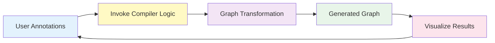

# Model Explorer Manual Editing Feature - Document Structure

**Goal**: Enable interactive human-in-the-loop compiler workflows where users can:
1. Annotate nodes with human insights
2. Invoke compiler compilation logic
3. Process and transform the graph
4. Generate new graphs based on human input
5. Iterate through multiple cycles of annotation and compilation

## Document Organization

### 00-overview.md
**Purpose**: High-level vision and motivation
**Content**:
- Executive Summary
- Key Benefits
- Problem Statement
- Target Use Cases

### 01-interactive-compiler-workflow.md
**Purpose**: Core human-in-the-loop pattern (THE KEY FEATURE)
**Content**:
- Human-in-the-Loop Compiler Pattern
- Annotation → Compilation → Transformation Cycle
- Interactive Optimization Workflows
- Compiler Integration Points
- Use Case Examples:
  - Interactive model optimization
  - Progressive quantization with human feedback
  - Graph fusion with manual hints
  - Performance tuning with annotations

### 02-user-experience.md
**Purpose**: User-facing design and workflows
**Content**:
- User Stories
- Workflow Sequences (3 detailed diagrams)
- UI/UX Design
- Visual Feedback
- Keyboard Shortcuts
- Validation Panel
- Properties Panel

### 03-architecture.md
**Purpose**: Technical design and implementation
**Content**:
- System Architecture Diagram
- Component Structure
- Class Diagrams
- State Management
- Operation Execution Flow
- Validation Pipeline
- Edge Creation Interaction

### 04-implementation.md
**Purpose**: Development roadmap
**Content**:
- Implementation Timeline (Gantt chart)
- Phase-by-Phase Plan (6 phases)
- Task Lists
- Deliverables
- Testing Strategy

### 05-api-reference.md
**Purpose**: API specifications and integration
**Content**:
- EditModeManager API
- Configuration API
- Events API
- Validation Rules
- Shape Inference
- Export Functionality (JSON, ONNX, Patch)
- Security Considerations

## Key Innovation: Interactive Compiler Workflow

The core innovation is **document 01** which focuses on the human-in-the-loop compiler pattern:



## Navigation Between Documents

Each document will include:
- **Previous/Next Navigation**: Links to related documents
- **Cross-References**: Explicit references to related sections
- **Standalone Readability**: Can be read independently with context

## Mermaid Diagram Distribution

- **00-overview.md**: 1 diagram (high-level workflow)
- **01-interactive-compiler-workflow.md**: 3-4 diagrams (annotation cycles, compilation flow)
- **02-user-experience.md**: 6 diagrams (user workflows, UI structure, validation panel)
- **03-architecture.md**: 5 diagrams (system architecture, class diagram, pipelines)
- **04-implementation.md**: 1 diagram (Gantt chart)
- **05-api-reference.md**: 1 diagram (export workflow)

## Document Relationships

```
00-overview.md (Start here)
    ↓
01-interactive-compiler-workflow.md (Core concept)
    ↓
02-user-experience.md (How users interact)
    ↓
03-architecture.md (Technical implementation)
    ↓
04-implementation.md (Development plan)
    ↓
05-api-reference.md (Integration details)
```

---

**Last Updated**: 2025-10-15
