# Model Explorer Manual Graph Editing Feature Design

**Date**: 2025-10-14
**Status**: Design Proposal
**Version**: 1.0
**Author**: Claude (AI Assistant)

---

## Table of Contents

- [Executive Summary](#executive-summary)
- [Motivation & Use Cases](#motivation--use-cases)
- [User Stories](#user-stories)
- [Feature Overview](#feature-overview)
- [UI/UX Design](#uiux-design)
- [Technical Architecture](#technical-architecture)
- [Implementation Plan](#implementation-plan)
- [API Specifications](#api-specifications)
- [Validation & Integrity](#validation--integrity)
- [Export Functionality](#export-functionality)
- [Security Considerations](#security-considerations)
- [Future Enhancements](#future-enhancements)

---

## Executive Summary

This document proposes a comprehensive manual graph editing feature for Model Explorer that enables users to modify machine learning model computation graphs directly within the visualization interface. The feature will support:

- **Node Operations**: Add, remove, modify, and clone nodes
- **Edge Operations**: Create, remove, and rewire connections
- **Graph Validation**: Real-time integrity checking and error reporting
- **Export Capabilities**: Save edited graphs in multiple formats (JSON, ONNX, GraphDef, MLIR)
- **Undo/Redo**: Full history tracking for all editing operations
- **Collaborative Features**: Export/import of edit patches for team collaboration

**Key Benefits**:
- Rapid prototyping of model architectures without retraining
- Graph optimization and pruning for deployment
- Educational tool for understanding model structure
- Debugging and experimentation workflow enhancement

---

## Motivation & Use Cases

### Problem Statement

Currently, Model Explorer is a read-only visualization tool. Users who need to modify model architectures must:
1. Return to their training code
2. Modify Python/framework code
3. Re-export the model
4. Re-load in Model Explorer to visualize changes

This workflow is inefficient for:
- Quick architectural experiments
- Model pruning and optimization
- Teaching and learning scenarios
- Graph repair and debugging

### Target Use Cases

#### 1. Model Optimization Engineer
**Scenario**: Remove redundant nodes from a quantized model
**Workflow**: Select nodes → Analyze performance impact → Delete unused branches → Validate graph → Export optimized model

#### 2. ML Researcher/Student
**Scenario**: Experiment with different layer configurations
**Workflow**: Clone existing layer → Modify attributes → Rewire connections → Compare performance → Save variants

#### 3. Production ML Engineer
**Scenario**: Fix broken model graph from conversion pipeline
**Workflow**: Identify invalid connections → Remove/recreate edges → Validate data flow → Export corrected model

#### 4. Model Architect
**Scenario**: Design new model architecture visually
**Workflow**: Add nodes from palette → Configure attributes → Wire connections → Validate → Export as template

### User Workflow Sequences

#### Workflow 1: Model Optimization (Remove Redundant Nodes)

```mermaid
sequenceDiagram
    actor User
    participant UI as UI Canvas
    participant EM as EditModeManager
    participant Val as Validator
    participant Exp as Exporter

    User->>UI: Enable Edit Mode
    UI->>EM: enableEditMode()
    EM->>EM: Save originalGraph

    User->>UI: Select redundant nodes
    UI->>EM: selectNodes(nodeIds)

    User->>UI: Analyze connections
    UI->>UI: Highlight input/output edges

    User->>UI: Delete nodes (Delete key)
    UI->>EM: deleteNodes(nodeIds)
    EM->>EM: Execute DeleteNodesOperation
    EM->>EM: Add to undoStack
    EM->>Val: runValidation()
    Val-->>UI: Display validation results

    alt Validation Passed
        User->>UI: Export optimized model
        UI->>EM: exportGraph('onnx')
        EM->>Val: Final validation
        Val-->>EM: Valid
        EM->>Exp: export(graph)
        Exp-->>User: Download optimized.onnx
    else Validation Failed
        UI->>User: Show errors in panel
        User->>UI: Fix errors or Undo
    end
```

#### Workflow 2: Experiment with Layer Configurations

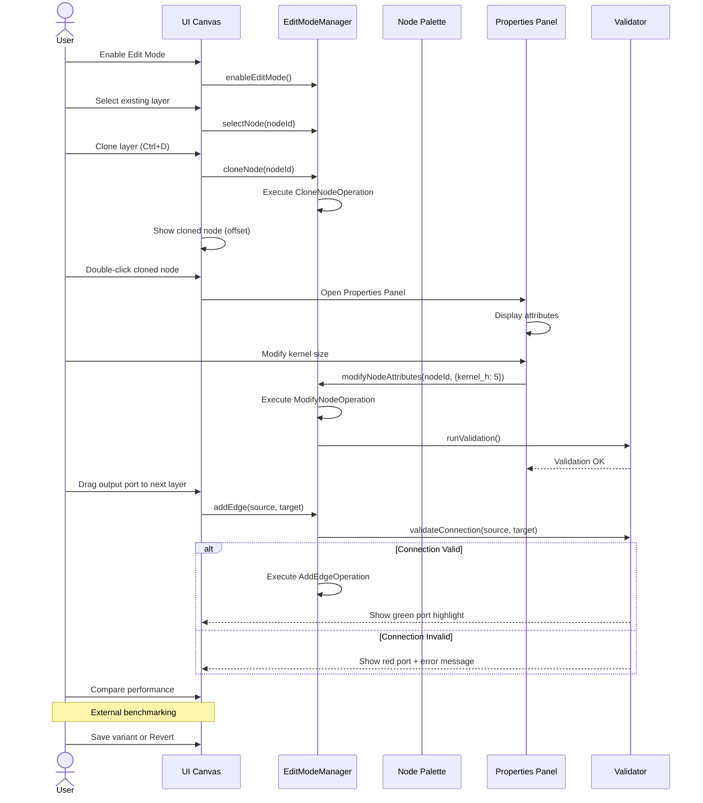

#### Workflow 3: Fix Broken Graph from Conversion

```mermaid
sequenceDiagram
    actor User
    participant UI as UI Canvas
    participant Val as Validator
    participant EM as EditModeManager
    participant ValPanel as Validation Panel

    User->>UI: Open broken model
    UI->>UI: Load and display graph
    UI->>Val: Auto-validate on load
    Val-->>ValPanel: Show 3 errors

    User->>ValPanel: Click first error
    ValPanel->>UI: Jump to problematic edge
    UI->>UI: Highlight edge in red

    User->>UI: Select and delete invalid edge
    UI->>EM: deleteEdge(edgeId)
    EM->>Val: runValidation()
    Val-->>ValPanel: Update errors (2 remaining)

    User->>UI: Drag from source to correct target
    UI->>EM: addEdge(source, correctedTarget)
    EM->>Val: validateConnection()
    Val-->>UI: Valid connection

    EM->>EM: Execute AddEdgeOperation
    EM->>Val: runValidation()
    Val-->>ValPanel: Update errors (1 remaining)

    User->>ValPanel: Click remaining error
    User->>UI: Fix final issue

    Val-->>ValPanel: All errors resolved ✅

    User->>UI: Export corrected model
    UI->>EM: exportGraph('onnx')
    EM-->>User: Download fixed_model.onnx
```

---

## User Stories

### Epic 1: Basic Editing Operations

**US-1.1**: As a user, I want to **enable editing mode** so that I can modify the graph
**Acceptance Criteria**:
- Toolbar has "Edit Mode" toggle button
- Visual indicator shows editing is active (border color, cursor change)
- All editing operations are disabled by default and enabled only in edit mode

**US-1.2**: As a user, I want to **select nodes for editing** so that I can perform operations on them
**Acceptance Criteria**:
- Single-click selects a node (shows selection highlight)
- Ctrl/Cmd+click allows multi-selection
- Shift+drag creates selection box for multiple nodes
- Selected nodes show context menu with available operations

**US-1.3**: As a user, I want to **delete nodes** so that I can remove unwanted operations
**Acceptance Criteria**:
- Delete key or context menu removes selected nodes
- Connected edges are automatically removed
- Confirmation dialog warns about downstream impact
- Undo operation restores deleted nodes with all connections

**US-1.4**: As a user, I want to **add new nodes** so that I can expand the graph
**Acceptance Criteria**:
- Node palette shows available operation types
- Drag-and-drop or click-to-place adds nodes to canvas
- New nodes have default attributes based on type
- New nodes are initially disconnected (no edges)

### Epic 2: Connection Management

**US-2.1**: As a user, I want to **create edges** so that I can wire data flow
**Acceptance Criteria**:
- Drag from output port to input port creates edge
- Visual feedback shows compatible ports (green) and incompatible (red)
- Type validation prevents incompatible connections
- Multi-output nodes can connect to multiple inputs

**US-2.2**: As a user, I want to **remove edges** so that I can rewire connections
**Acceptance Criteria**:
- Click on edge selects it (highlight)
- Delete key or context menu removes edge
- Confirmation for removing edges from critical nodes
- Undo restores removed edges

**US-2.3**: As a user, I want to **rewire connections** so that I can change data flow
**Acceptance Criteria**:
- Drag existing edge endpoint to new port
- Visual feedback during drag operation
- Validation prevents invalid rewiring
- Old connection is removed, new one is created atomically

### Epic 3: Node Modification

**US-3.1**: As a user, I want to **edit node attributes** so that I can configure operations
**Acceptance Criteria**:
- Double-click node opens attribute editor panel
- Form fields for all editable attributes
- Type-specific inputs (number, string, enum, tensor shape)
- Real-time validation with error messages
- Save/Cancel buttons with keyboard shortcuts

**US-3.2**: As a user, I want to **clone nodes** so that I can duplicate operations
**Acceptance Criteria**:
- Ctrl+D or context menu clones selected nodes
- Cloned nodes appear offset from originals
- All attributes are copied
- Connections are NOT copied (user must rewire)

**US-3.3**: As a user, I want to **rename nodes** so that I can improve readability
**Acceptance Criteria**:
- Click on node label enters rename mode
- ESC cancels, Enter saves
- Duplicate name validation
- Names must follow identifier rules (no special chars)

### Epic 4: Validation & Feedback

**US-4.1**: As a user, I want to **see validation errors** so that I can fix graph issues
**Acceptance Criteria**:
- Real-time validation during editing
- Error indicators on invalid nodes/edges (red border, icon)
- Side panel shows list of all validation errors
- Click error jumps to problem location
- Export is blocked when errors exist

**US-4.2**: As a user, I want to **validate tensor shapes** so that I ensure data compatibility
**Acceptance Criteria**:
- Automatic shape inference for connected nodes
- Warning for shape mismatches
- Visual display of tensor shapes on edges
- Manual shape override option with warning

**US-4.3**: As a user, I want to **check graph connectivity** so that I ensure valid data flow
**Acceptance Criteria**:
- Detect disconnected subgraphs (orphaned nodes)
- Highlight nodes with missing inputs/outputs
- Validate cycles in non-recurrent graphs
- Report missing graph inputs/outputs

### Epic 5: History & Undo

**US-5.1**: As a user, I want to **undo operations** so that I can revert mistakes
**Acceptance Criteria**:
- Ctrl+Z undoes last operation
- Undo stack supports 50+ operations
- Undo state shown in history panel
- All operations are undoable (node add/delete, edge changes, attribute edits)

**US-5.2**: As a user, I want to **redo operations** so that I can restore undone changes
**Acceptance Criteria**:
- Ctrl+Shift+Z redoes last undo
- Redo stack cleared when new operation is performed
- Redo available for all undone operations

**US-5.3**: As a user, I want to **view edit history** so that I can track changes
**Acceptance Criteria**:
- History panel shows timestamped list of operations
- Click history item jumps to affected nodes
- Clear history option with confirmation
- Export history as change log

### Epic 6: Export & Save

**US-6.1**: As a user, I want to **export edited graphs** so that I can save my work
**Acceptance Criteria**:
- Export button in toolbar (disabled in read-only mode)
- Format selection: JSON (default), ONNX, GraphDef, MLIR
- Validation check before export (errors block export)
- Success notification with file download

**US-6.2**: As a user, I want to **export edit patches** so that I can share changes
**Acceptance Criteria**:
- "Export Patch" option exports only changes (diff format)
- Patch includes: added nodes, deleted nodes, modified attributes, edge changes
- Patch can be applied to original graph
- Use for version control and collaboration

**US-6.3**: As a user, I want to **save edit sessions** so that I can continue later
**Acceptance Criteria**:
- Auto-save to browser localStorage every 30 seconds
- Manual save option in toolbar
- Load previous session on page reload
- Clear session option

---

## Feature Overview

### System Architecture Diagram

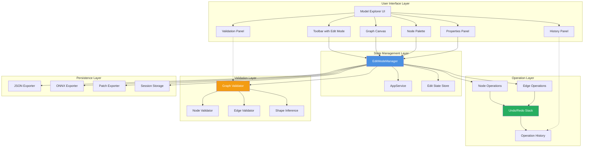

### Core Components Layout

```mermaid
graph TB
    subgraph UI["Model Explorer UI"]
        Toolbar["🎛️ Toolbar Extended"]

        subgraph MainContent["Main Content Area"]
            NodePalette["📦 Node Palette"]
            Canvas["🎨 Graph Canvas"]
            PropsPanel["⚙️ Properties Panel"]
        end

        subgraph ValidationPanel["🚨 Validation Panel"]
            ValTitle["⚠️ Errors and Warnings"]
            Err1["❌ Missing required input"]
            Err2["❌ Shape mismatch"]
            Warn1["⚠️ Orphaned node"]

            ValTitle -.-> Err1
            Err1 -.-> Err2
            Err2 -.-> Warn1
        end

        subgraph HistoryPanel["📜 History Panel"]
            HistTitle["Recent Operations"]
            H1["Added node"]
            H2["Modified kernel"]
            H3["Deleted edge"]

            HistTitle -.-> H1
            H1 -.-> H2
            H2 -.-> H3
        end
    end

    Toolbar --> MainContent
    MainContent --> ValidationPanel
    ValidationPanel --> HistoryPanel

    NodePalette -.->|"Drag Drop"| Canvas
    Canvas -.->|"Select"| PropsPanel
    Canvas -.->|"Validate"| ValidationPanel
    PropsPanel -.->|"Modify"| Canvas

    style UI fill:#f8f9fa,stroke:#333,stroke-width:2px
    style Toolbar fill:#e3f2fd,stroke:#1976d2,stroke-width:2px
    style Canvas fill:#e8f5e9,stroke:#388e3c,stroke-width:2px
    style NodePalette fill:#fff3e0,stroke:#f57c00,stroke-width:2px
    style PropsPanel fill:#fce4ec,stroke:#c2185b,stroke-width:2px
    style ValidationPanel fill:#ffebee,stroke:#d32f2f,stroke-width:2px
    style HistoryPanel fill:#e1f5fe,stroke:#0288d1,stroke-width:2px
```

**Component Details:**

- **🎛️ Toolbar Extended**: Edit Mode toggle, Undo/Redo buttons, Validate and Export actions
- **📦 Node Palette (Left Sidebar)**: Draggable operation templates (Convolution, Pooling, Normalization, Activation, Tensor Ops)
- **🎨 Graph Canvas (Center)**: WebGL-rendered interactive graph with drag-drop support, node selection, and edge creation
- **⚙️ Properties Panel (Right Sidebar)**: Selected node details, editable attributes, action buttons (Save, Cancel, Delete, Clone)
- **🚨 Validation Panel (Collapsible Bottom)**: Real-time error/warning display with click-to-locate and auto-fix options
- **📜 History Panel (Collapsible Bottom)**: Operation history with timestamps for undo/redo navigation

**User Interactions:**
1. Drag operations from Node Palette → Drop on Canvas
2. Select nodes on Canvas → View/edit in Properties Panel
3. Modify attributes in Properties Panel → Auto-validate → Update Canvas
4. Click errors in Validation Panel → Highlight affected nodes on Canvas

### Edit Mode State Machine

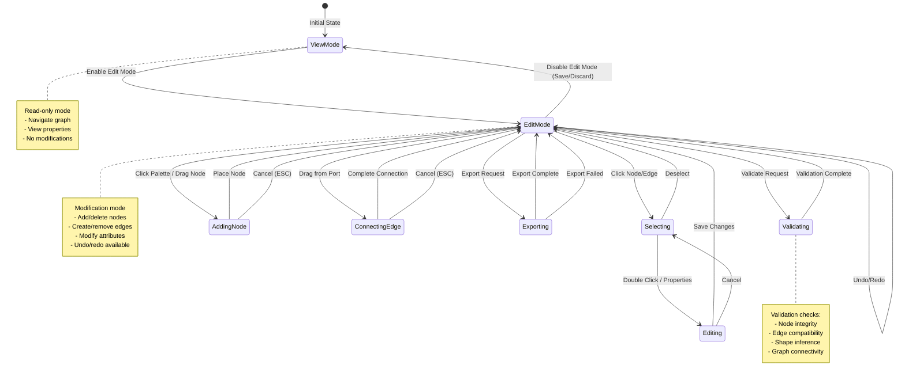

### State Management

```typescript
interface EditState {
  // Editing mode
  mode: 'view' | 'edit' | 'validate';

  // Selection
  selectedNodes: Set<string>;
  selectedEdges: Set<string>;

  // History
  undoStack: Operation[];
  redoStack: Operation[];

  // Validation
  errors: ValidationError[];
  warnings: ValidationWarning[];

  // Graph state
  originalGraph: Graph;
  modifiedGraph: Graph;
  isDirty: boolean;

  // Session
  lastSaved: Date;
  autoSaveEnabled: boolean;
}
```

---

## UI/UX Design

### 1. Toolbar Extensions

**New Toolbar Items** (following existing architecture pattern from `renderer_wrapper.ts`):

```typescript
// Add to renderer_wrapper.ts

get showEditModeToggle(): boolean {
  return !this.inPopup &&
         this.appService.config()?.toolbarConfig?.enableEditMode === true;
}

get showNodePalette(): boolean {
  return this.editMode && !this.inPopup;
}

get showValidationPanel(): boolean {
  return this.editMode && !this.inPopup;
}

get disableExportButton(): boolean {
  return !this.editMode || this.hasValidationErrors();
}
```

**Toolbar Configuration Extension**:

```typescript
// Add to common/types.ts

interface ToolbarConfig {
  // ... existing properties

  /** Whether to enable graph editing features. */
  enableEditMode?: boolean;

  /** Whether to hide the node palette in edit mode. */
  hideNodePalette?: boolean;

  /** Whether to hide the validation panel. */
  hideValidationPanel?: boolean;

  /** Whether to allow export of edited graphs. */
  allowExport?: boolean;
}
```

### 2. Node Palette

**Location**: Left sidebar (collapsible)
**Categories**:

```typescript
interface NodeCategory {
  name: string;
  icon: string;
  nodes: NodeTemplate[];
}

const nodePalette: NodeCategory[] = [
  {
    name: 'Convolution',
    icon: 'conv',
    nodes: [
      { type: 'Conv2D', label: 'Conv 2D', defaultAttrs: {...} },
      { type: 'DepthwiseConv2D', label: 'Depthwise Conv', defaultAttrs: {...} },
      { type: 'Conv3D', label: 'Conv 3D', defaultAttrs: {...} }
    ]
  },
  {
    name: 'Pooling',
    icon: 'pool',
    nodes: [
      { type: 'MaxPool2D', label: 'Max Pool', defaultAttrs: {...} },
      { type: 'AvgPool2D', label: 'Avg Pool', defaultAttrs: {...} },
      { type: 'GlobalAvgPool', label: 'Global Avg Pool', defaultAttrs: {...} }
    ]
  },
  {
    name: 'Activation',
    icon: 'activation',
    nodes: [
      { type: 'ReLU', label: 'ReLU', defaultAttrs: {} },
      { type: 'Sigmoid', label: 'Sigmoid', defaultAttrs: {} },
      { type: 'Tanh', label: 'Tanh', defaultAttrs: {} }
    ]
  },
  {
    name: 'Normalization',
    icon: 'normalize',
    nodes: [
      { type: 'BatchNorm', label: 'Batch Norm', defaultAttrs: {...} },
      { type: 'LayerNorm', label: 'Layer Norm', defaultAttrs: {...} }
    ]
  },
  {
    name: 'Arithmetic',
    icon: 'math',
    nodes: [
      { type: 'Add', label: 'Add', defaultAttrs: {} },
      { type: 'Multiply', label: 'Multiply', defaultAttrs: {} },
      { type: 'MatMul', label: 'Matrix Multiply', defaultAttrs: {} }
    ]
  },
  {
    name: 'Tensor',
    icon: 'tensor',
    nodes: [
      { type: 'Reshape', label: 'Reshape', defaultAttrs: {...} },
      { type: 'Transpose', label: 'Transpose', defaultAttrs: {...} },
      { type: 'Concat', label: 'Concatenate', defaultAttrs: {...} },
      { type: 'Split', label: 'Split', defaultAttrs: {...} }
    ]
  }
];
```

**Interaction Pattern**:
1. Click node type in palette → cursor changes to "add" mode
2. Click on canvas → node is placed at click location
3. Drag from palette → node follows cursor, placed on release
4. ESC key cancels add mode

### 3. Properties Panel

**Location**: Right sidebar (replaces/extends existing side panel)
**Sections**:

```typescript
interface PropertiesPanel {
  // Node Information (read-only)
  nodeInfo: {
    id: string;
    type: string;
    namespace: string;
  };

  // Editable Attributes
  attributes: {
    [key: string]: {
      value: any;
      type: 'string' | 'number' | 'boolean' | 'enum' | 'shape';
      required: boolean;
      validation?: (value: any) => ValidationResult;
    };
  };

  // Input/Output Configuration
  inputs: IOPort[];
  outputs: IOPort[];

  // Actions
  actions: {
    save: () => void;
    cancel: () => void;
    reset: () => void;
    delete: () => void;
    clone: () => void;
  };
}
```

**Dynamic Form Generation**:
- Number inputs for numeric attributes (with min/max validation)
- Dropdowns for enum attributes
- Text inputs for strings
- Checkboxes for booleans
- Custom shape editor for tensor dimensions

### 4. Validation Panel

**Location**: Bottom panel (collapsible, similar to IDE error panels)

**Validation Panel Structure**:

```mermaid
graph TB
    subgraph ValidationPanel["🚨 Validation Panel (Collapsible)"]
        Header["📊 Validation Results<br/>───────────────────<br/>❌ 2 Errors  ⚠️ 1 Warning  ✅ Graph Structure OK<br/><br/>[🔄 Revalidate] [🧹 Clear] [📥 Export Report]"]

        subgraph ErrorsSection["Critical Errors (Block Export)"]
            Error1["❌ ERROR #1<br/>──────────<br/>📍 Location: Node 'conv_3' (Conv2D) - Line 45<br/>🔍 Issue: Missing required input 'input'<br/>💡 Suggestion: Add connection from previous layer<br/><br/>[🔍 Locate] [🔧 Auto-fix]"]

            Error2["❌ ERROR #2<br/>──────────<br/>📍 Location: Edge 'conv_2' → 'pool_1' - Line 38<br/>🔍 Issue: Shape mismatch [1,32,32,64] → [1,16,16,32]<br/>💡 Suggestion: Expected [1,32,32,X] or adjust stride<br/><br/>[🔍 Locate] [📊 Debug Shapes]"]
        end

        subgraph WarningsSection["Warnings (Allow Export)"]
            Warning1["⚠️ WARNING #1<br/>──────────<br/>📍 Location: Node 'relu_4' (ReLU) - Line 52<br/>🔍 Issue: No outgoing connections (orphaned)<br/>💡 Suggestion: Connect to downstream layer or remove<br/><br/>[🔍 Locate] [🗑️ Remove]"]
        end

        subgraph InfoSection["Additional Information"]
            Info1["ℹ️ INFO<br/>──────────<br/>✅ Type compatibility: All edges validated<br/>✅ Shape inference: Completed successfully<br/>✅ Graph connectivity: 1 connected component<br/>✅ Cycle detection: No cycles found"]
        end

        Header --> ErrorsSection
        ErrorsSection --> WarningsSection
        WarningsSection --> InfoSection

        Error1 -.->|Click| GraphCanvas1[Jump to Node]
        Error2 -.->|Click| GraphCanvas2[Jump to Edge]
        Warning1 -.->|Click| GraphCanvas3[Jump to Node]

        style Header fill:#fff9c4,stroke:#f57f17,stroke-width:3px
        style ErrorsSection fill:#ffebee,stroke:#c62828,stroke-width:2px
        style WarningsSection fill:#fff3e0,stroke:#ef6c00,stroke-width:2px
        style InfoSection fill:#e8f5e9,stroke:#2e7d32,stroke-width:2px

        style Error1 fill:#ffcdd2,stroke:#d32f2f,stroke-width:2px
        style Error2 fill:#ffcdd2,stroke:#d32f2f,stroke-width:2px
        style Warning1 fill:#ffe0b2,stroke:#f57c00,stroke-width:2px
        style Info1 fill:#c8e6c9,stroke:#388e3c,stroke-width:2px
    end
```

**Validation Categories & Behaviors**:

| Category | Symbol | Impact | Actions | Description |
|----------|--------|--------|---------|-------------|
| **Error** | ❌ | Blocks export | Locate, Auto-fix | Critical issues that prevent graph execution |
| **Warning** | ⚠️ | Allows export | Locate, Remove, Ignore | Non-critical issues that may affect performance |
| **Info** | ℹ️ | No impact | View details | Informational messages about validation status |

**Interactive Features**:

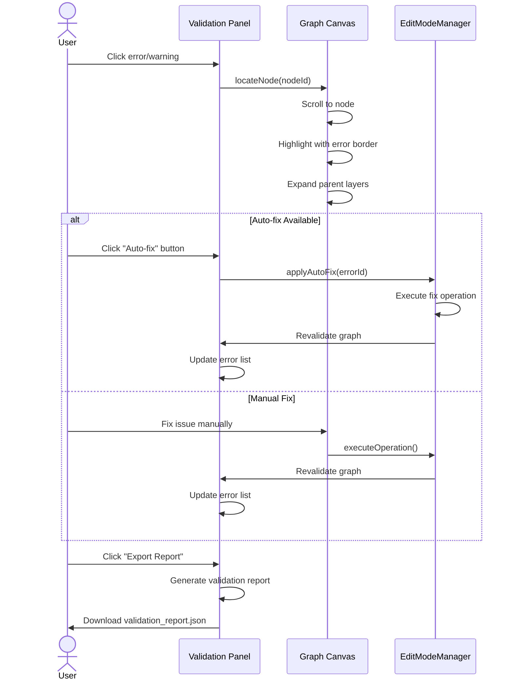

**Real-time Validation Flow**:

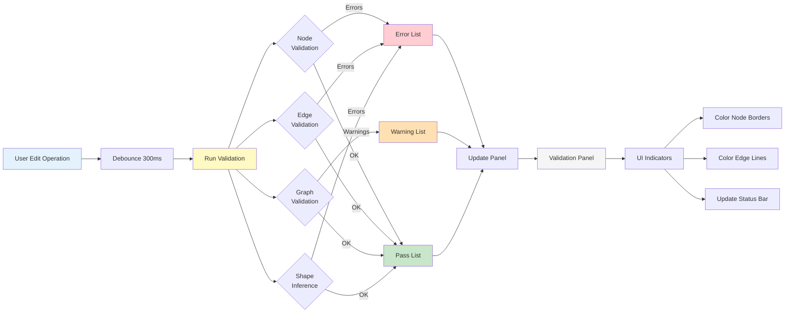

### 5. Visual Feedback

**Edit Mode Indicators**:
- Blue border around canvas when in edit mode
- Cursor changes: crosshair (add), pointer (select), grab (move), copy (clone)
- Node hover shows connection ports
- Compatible ports glow green, incompatible glow red during edge creation

**Node States**:
- **Normal**: Default appearance
- **Selected**: Blue border, resize handles visible
- **Error**: Red border, error icon overlay
- **Warning**: Orange border, warning icon overlay
- **Modified**: Small blue dot indicator
- **New**: Dashed border (until first save)

**Edge States**:
- **Normal**: Gray line
- **Selected**: Blue thick line
- **Error**: Red dashed line
- **Warning**: Orange dashed line
- **Creating**: Yellow animated line following cursor

### Edge Creation Interaction

```mermaid
sequenceDiagram
    actor User
    participant Canvas
    participant Renderer
    participant EM as EditModeManager
    participant Val as Validator

    Note over User,Val: Edge Creation Flow

    User->>Canvas: Hover over source node
    Canvas->>Canvas: Show output ports
    Note right of Canvas: Ports appear on hover<br/>in edit mode

    User->>Canvas: MouseDown on output port
    Canvas->>EM: Begin edge creation
    EM->>Canvas: Enable edge creation mode

    User->>Canvas: Drag mouse
    loop While Dragging
        Canvas->>Canvas: Draw temporary edge
        Canvas->>Renderer: Render edge from port to cursor
        Canvas->>Canvas: Detect hover over nodes

        alt Hovering over compatible node
            Canvas->>Canvas: Highlight target node (green)
            Canvas->>Canvas: Show input ports
            Canvas->>Val: Pre-check compatibility
            Val-->>Canvas: Compatible ports (green glow)
        else Hovering over incompatible node
            Canvas->>Canvas: Highlight target node (red)
            Val-->>Canvas: Incompatible (red glow)
        else Hovering over empty space
            Canvas->>Canvas: Show yellow trailing edge
        end
    end

    User->>Canvas: MouseUp on input port

    alt On Valid Port
        Canvas->>EM: Attempt to create edge
        EM->>Val: validateConnection(source, target)

        alt Connection Valid
            Val-->>EM: Valid ✅
            EM->>EM: Execute AddEdgeOperation
            EM->>EM: Push to undo stack
            EM->>Val: runValidation()
            Val-->>Canvas: Update validation state
            Canvas->>Renderer: Render new edge
            Canvas->>User: Show success feedback
        else Connection Invalid
            Val-->>EM: Invalid (reason)
            EM-->>Canvas: Validation error
            Canvas->>User: Show error tooltip
            Note right of Canvas: "Type mismatch:<br/>float32 → int8"
        end
    else On Invalid Target
        Canvas->>User: Cancel operation
        Note right of Canvas: Edge disappears
    end

    Canvas->>EM: End edge creation mode
```

### 6. Keyboard Shortcuts

```typescript
const SHORTCUTS = {
  // Mode
  'E': 'Toggle edit mode',
  'ESC': 'Exit edit mode / Cancel operation',

  // Selection
  'Ctrl+A': 'Select all nodes',
  'Ctrl+Shift+A': 'Deselect all',

  // Editing
  'Delete': 'Delete selected nodes/edges',
  'Ctrl+D': 'Duplicate selected nodes',
  'Ctrl+X': 'Cut selected nodes',
  'Ctrl+C': 'Copy selected nodes',
  'Ctrl+V': 'Paste nodes',

  // History
  'Ctrl+Z': 'Undo',
  'Ctrl+Shift+Z': 'Redo',
  'Ctrl+Y': 'Redo (alternate)',

  // Validation
  'Ctrl+Shift+V': 'Run validation',

  // Save/Export
  'Ctrl+S': 'Save session',
  'Ctrl+E': 'Export graph',

  // Navigation
  'Space': 'Fit to screen',
  'F': 'Focus on selected',

  // Node Editing
  'F2': 'Rename selected node',
  'Enter': 'Edit node attributes (when selected)',
  'Shift+Enter': 'Quick add node at cursor'
};
```

---

## Technical Architecture

### Operation Execution Flow

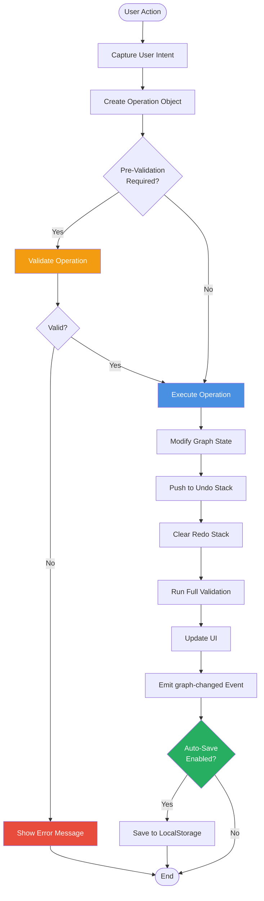

### Validation Pipeline

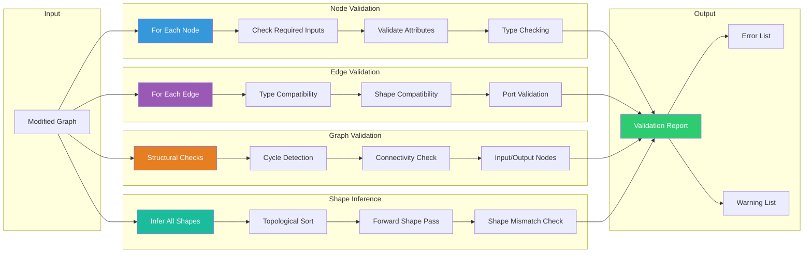

### Component Structure

```
src/ui/src/components/visualizer/
├── editing/
│   ├── edit-mode-manager.ts          // Central state management
│   ├── edit-mode-manager.service.ts  // Angular service
│   ├── node-palette/
│   │   ├── node-palette.ts
│   │   ├── node-palette.ng.html
│   │   ├── node-palette.scss
│   │   └── node-templates.ts         // Node type definitions
│   ├── properties-panel/
│   │   ├── properties-panel.ts
│   │   ├── properties-panel.ng.html
│   │   ├── properties-panel.scss
│   │   └── attribute-editors/       // Type-specific editors
│   │       ├── number-editor.ts
│   │       ├── shape-editor.ts
│   │       └── enum-editor.ts
│   ├── validation-panel/
│   │   ├── validation-panel.ts
│   │   ├── validation-panel.ng.html
│   │   └── validation-panel.scss
│   ├── history-panel/
│   │   ├── history-panel.ts
│   │   ├── history-panel.ng.html
│   │   └── history-panel.scss
│   ├── operations/
│   │   ├── operation.ts              // Base operation interface
│   │   ├── node-operations.ts        // Add, delete, modify nodes
│   │   ├── edge-operations.ts        // Add, delete edges
│   │   └── composite-operations.ts   // Multi-step operations
│   ├── validation/
│   │   ├── validator.ts              // Main validation orchestrator
│   │   ├── node-validator.ts
│   │   ├── edge-validator.ts
│   │   ├── graph-validator.ts
│   │   └── shape-inference.ts
│   └── export/
│       ├── exporter.ts               // Base exporter
│       ├── json-exporter.ts
│       ├── onnx-exporter.ts
│       ├── graphdef-exporter.ts
│       ├── mlir-exporter.ts
│       └── patch-exporter.ts
├── renderer_wrapper.ts               // Modified to support editing
├── webgl_renderer.ts                 // Modified for edit interactions
└── app_service.ts                    // Extended with edit state
```

### Class Diagram

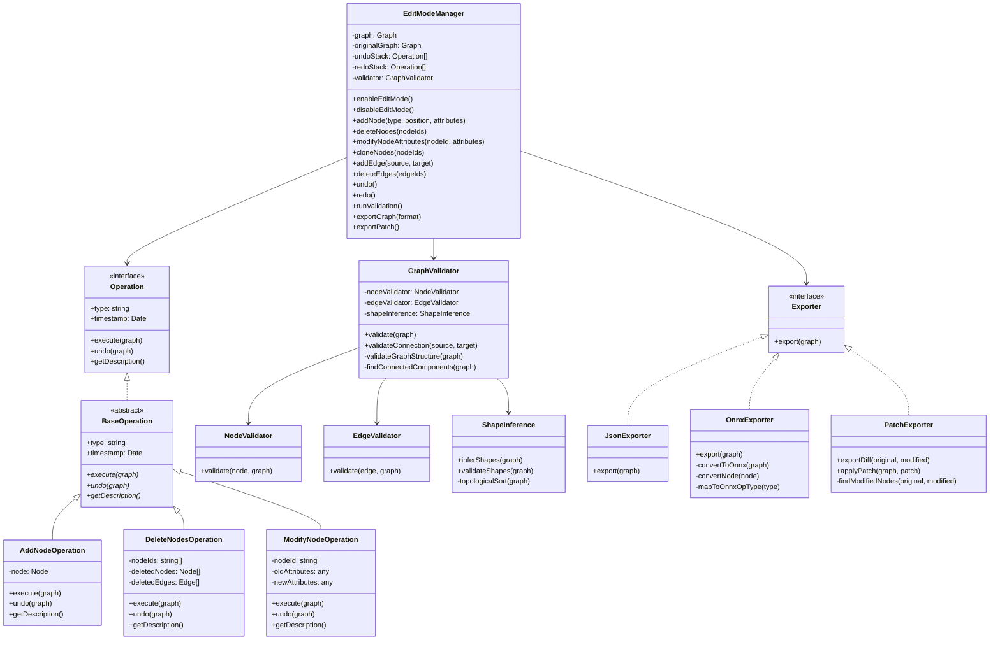

### Core Classes

#### EditModeManager

```typescript
// src/ui/src/components/visualizer/editing/edit-mode-manager.ts

export class EditModeManager {
  private graph: Graph;
  private originalGraph: Graph;
  private undoStack: Operation[] = [];
  private redoStack: Operation[] = [];
  private validator: GraphValidator;

  constructor(
    private appService: AppService,
    private webglRenderer: WebglRenderer
  ) {
    this.validator = new GraphValidator();
  }

  // State management
  enableEditMode(): void {
    this.originalGraph = cloneDeep(this.graph);
    this.emit('edit-mode-enabled');
  }

  disableEditMode(): void {
    // Optional: prompt to save changes
    this.emit('edit-mode-disabled');
  }

  // Node operations
  addNode(type: string, position: Point, attributes?: any): void {
    const node = this.createNode(type, position, attributes);
    const operation = new AddNodeOperation(node);
    this.executeOperation(operation);
  }

  deleteNodes(nodeIds: string[]): void {
    const operation = new DeleteNodesOperation(nodeIds, this.graph);
    this.executeOperation(operation);
  }

  modifyNodeAttributes(nodeId: string, attributes: any): void {
    const operation = new ModifyNodeOperation(nodeId, attributes);
    this.executeOperation(operation);
  }

  cloneNodes(nodeIds: string[]): void {
    const operation = new CloneNodesOperation(nodeIds, this.graph);
    this.executeOperation(operation);
  }

  // Edge operations
  addEdge(sourceId: string, sourcePort: number, targetId: string, targetPort: number): ValidationResult {
    // Pre-validate connection
    const validationResult = this.validator.validateConnection(
      this.graph.getNode(sourceId),
      sourcePort,
      this.graph.getNode(targetId),
      targetPort
    );

    if (!validationResult.isValid) {
      return validationResult;
    }

    const operation = new AddEdgeOperation(sourceId, sourcePort, targetId, targetPort);
    this.executeOperation(operation);
    return { isValid: true };
  }

  deleteEdges(edgeIds: string[]): void {
    const operation = new DeleteEdgesOperation(edgeIds);
    this.executeOperation(operation);
  }

  // History management
  undo(): void {
    if (this.undoStack.length === 0) return;

    const operation = this.undoStack.pop()!;
    operation.undo(this.graph);
    this.redoStack.push(operation);

    this.emit('graph-changed');
    this.runValidation();
  }

  redo(): void {
    if (this.redoStack.length === 0) return;

    const operation = this.redoStack.pop()!;
    operation.execute(this.graph);
    this.undoStack.push(operation);

    this.emit('graph-changed');
    this.runValidation();
  }

  // Validation
  runValidation(): ValidationReport {
    const report = this.validator.validate(this.graph);
    this.emit('validation-updated', report);
    return report;
  }

  // Export
  exportGraph(format: ExportFormat): Blob {
    const validationReport = this.runValidation();

    if (validationReport.hasErrors) {
      throw new Error('Cannot export graph with validation errors');
    }

    const exporter = this.getExporter(format);
    return exporter.export(this.graph);
  }

  exportPatch(): Blob {
    const patchExporter = new PatchExporter();
    return patchExporter.exportDiff(this.originalGraph, this.graph);
  }

  // Private methods
  private executeOperation(operation: Operation): void {
    operation.execute(this.graph);
    this.undoStack.push(operation);
    this.redoStack = []; // Clear redo stack

    this.emit('graph-changed');
    this.runValidation();
  }

  private createNode(type: string, position: Point, attributes?: any): Node {
    const template = NodeTemplates.get(type);
    if (!template) {
      throw new Error(`Unknown node type: ${type}`);
    }

    return {
      id: this.generateNodeId(type),
      type: type,
      label: template.defaultLabel,
      namespace: this.getCurrentNamespace(),
      attributes: { ...template.defaultAttributes, ...attributes },
      inputs: template.inputs.map(i => ({ ...i })),
      outputs: template.outputs.map(o => ({ ...o })),
      position: position
    };
  }

  private getExporter(format: ExportFormat): Exporter {
    switch (format) {
      case 'json': return new JsonExporter();
      case 'onnx': return new OnnxExporter();
      case 'graphdef': return new GraphDefExporter();
      case 'mlir': return new MlirExporter();
      default: throw new Error(`Unsupported format: ${format}`);
    }
  }

  private emit(event: string, data?: any): void {
    this.appService.editEvents$.next({ type: event, data });
  }
}
```

#### Operation Interface

```typescript
// src/ui/src/components/visualizer/editing/operations/operation.ts

export interface Operation {
  readonly type: string;
  readonly timestamp: Date;

  execute(graph: Graph): void;
  undo(graph: Graph): void;
  getDescription(): string;
}

export abstract class BaseOperation implements Operation {
  readonly timestamp: Date;

  constructor(public readonly type: string) {
    this.timestamp = new Date();
  }

  abstract execute(graph: Graph): void;
  abstract undo(graph: Graph): void;
  abstract getDescription(): string;
}
```

#### Node Operations

```typescript
// src/ui/src/components/visualizer/editing/operations/node-operations.ts

export class AddNodeOperation extends BaseOperation {
  constructor(private node: Node) {
    super('add-node');
  }

  execute(graph: Graph): void {
    graph.addNode(this.node);
  }

  undo(graph: Graph): void {
    graph.removeNode(this.node.id);
  }

  getDescription(): string {
    return `Added node '${this.node.label}' (${this.node.type})`;
  }
}

export class DeleteNodesOperation extends BaseOperation {
  private deletedNodes: Node[];
  private deletedEdges: Edge[];

  constructor(
    private nodeIds: string[],
    graph: Graph
  ) {
    super('delete-nodes');

    // Store nodes and affected edges for undo
    this.deletedNodes = nodeIds.map(id => graph.getNode(id));
    this.deletedEdges = graph.getEdges().filter(e =>
      nodeIds.includes(e.sourceNodeId) || nodeIds.includes(e.targetNodeId)
    );
  }

  execute(graph: Graph): void {
    // Remove edges first
    this.deletedEdges.forEach(e => graph.removeEdge(e.id));

    // Then remove nodes
    this.nodeIds.forEach(id => graph.removeNode(id));
  }

  undo(graph: Graph): void {
    // Restore nodes first
    this.deletedNodes.forEach(n => graph.addNode(n));

    // Then restore edges
    this.deletedEdges.forEach(e => graph.addEdge(e));
  }

  getDescription(): string {
    return `Deleted ${this.nodeIds.length} node(s)`;
  }
}

export class ModifyNodeOperation extends BaseOperation {
  private oldAttributes: any;
  private newAttributes: any;

  constructor(
    private nodeId: string,
    newAttributes: any,
    graph: Graph
  ) {
    super('modify-node');
    this.oldAttributes = { ...graph.getNode(nodeId).attributes };
    this.newAttributes = newAttributes;
  }

  execute(graph: Graph): void {
    const node = graph.getNode(this.nodeId);
    node.attributes = { ...node.attributes, ...this.newAttributes };
  }

  undo(graph: Graph): void {
    const node = graph.getNode(this.nodeId);
    node.attributes = this.oldAttributes;
  }

  getDescription(): string {
    const keys = Object.keys(this.newAttributes).join(', ');
    return `Modified node '${this.nodeId}' attributes: ${keys}`;
  }
}

export class CloneNodesOperation extends BaseOperation {
  private clonedNodes: Node[];
  private offset = { x: 50, y: 50 }; // Offset for cloned nodes

  constructor(
    private nodeIds: string[],
    graph: Graph
  ) {
    super('clone-nodes');

    this.clonedNodes = nodeIds.map(id => {
      const original = graph.getNode(id);
      return {
        ...original,
        id: this.generateCloneId(original.id),
        label: `${original.label}_copy`,
        position: {
          x: original.position.x + this.offset.x,
          y: original.position.y + this.offset.y
        }
      };
    });
  }

  execute(graph: Graph): void {
    this.clonedNodes.forEach(node => graph.addNode(node));
  }

  undo(graph: Graph): void {
    this.clonedNodes.forEach(node => graph.removeNode(node.id));
  }

  getDescription(): string {
    return `Cloned ${this.nodeIds.length} node(s)`;
  }

  private generateCloneId(originalId: string): string {
    return `${originalId}_clone_${Date.now()}`;
  }
}
```

#### Validator

```typescript
// src/ui/src/components/visualizer/editing/validation/validator.ts

export interface ValidationError {
  type: 'error' | 'warning';
  message: string;
  nodeId?: string;
  edgeId?: string;
  suggestion?: string;
}

export interface ValidationReport {
  isValid: boolean;
  hasErrors: boolean;
  hasWarnings: boolean;
  errors: ValidationError[];
  warnings: ValidationError[];
}

export class GraphValidator {
  private nodeValidator = new NodeValidator();
  private edgeValidator = new EdgeValidator();
  private shapeInference = new ShapeInference();

  validate(graph: Graph): ValidationReport {
    const errors: ValidationError[] = [];
    const warnings: ValidationError[] = [];

    // 1. Validate nodes
    graph.nodes.forEach(node => {
      const nodeErrors = this.nodeValidator.validate(node);
      errors.push(...nodeErrors.filter(e => e.type === 'error'));
      warnings.push(...nodeErrors.filter(e => e.type === 'warning'));
    });

    // 2. Validate edges
    graph.edges.forEach(edge => {
      const edgeErrors = this.edgeValidator.validate(edge, graph);
      errors.push(...edgeErrors.filter(e => e.type === 'error'));
      warnings.push(...edgeErrors.filter(e => e.type === 'warning'));
    });

    // 3. Validate graph structure
    const structureErrors = this.validateGraphStructure(graph);
    errors.push(...structureErrors.filter(e => e.type === 'error'));
    warnings.push(...structureErrors.filter(e => e.type === 'warning'));

    // 4. Infer and validate shapes
    try {
      const shapeErrors = this.shapeInference.validateShapes(graph);
      errors.push(...shapeErrors.filter(e => e.type === 'error'));
      warnings.push(...shapeErrors.filter(e => e.type === 'warning'));
    } catch (e) {
      errors.push({
        type: 'error',
        message: `Shape inference failed: ${e.message}`,
        suggestion: 'Check for cycles or invalid connections'
      });
    }

    return {
      isValid: errors.length === 0,
      hasErrors: errors.length > 0,
      hasWarnings: warnings.length > 0,
      errors,
      warnings
    };
  }

  validateConnection(
    sourceNode: Node,
    sourcePort: number,
    targetNode: Node,
    targetPort: number
  ): ValidationResult {
    // Type compatibility check
    const sourceOutput = sourceNode.outputs[sourcePort];
    const targetInput = targetNode.inputs[targetPort];

    if (!this.areTypesCompatible(sourceOutput.type, targetInput.type)) {
      return {
        isValid: false,
        error: `Type mismatch: ${sourceOutput.type} → ${targetInput.type}`
      };
    }

    // Shape compatibility check
    if (sourceOutput.shape && targetInput.shape) {
      if (!this.areShapesCompatible(sourceOutput.shape, targetInput.shape)) {
        return {
          isValid: false,
          error: `Shape mismatch: ${sourceOutput.shape} → ${targetInput.shape}`
        };
      }
    }

    // Check for cycles (if graph is non-recurrent)
    if (this.wouldCreateCycle(sourceNode, targetNode)) {
      return {
        isValid: false,
        error: 'Connection would create a cycle'
      };
    }

    return { isValid: true };
  }

  private validateGraphStructure(graph: Graph): ValidationError[] {
    const errors: ValidationError[] = [];

    // Find disconnected subgraphs
    const components = this.findConnectedComponents(graph);
    if (components.length > 1) {
      errors.push({
        type: 'warning',
        message: `Graph has ${components.length} disconnected subgraphs`,
        suggestion: 'Connect all components or remove unused nodes'
      });
    }

    // Find orphaned nodes
    const orphanedNodes = graph.nodes.filter(node => {
      const hasInputs = graph.edges.some(e => e.targetNodeId === node.id);
      const hasOutputs = graph.edges.some(e => e.sourceNodeId === node.id);
      return !hasInputs && !hasOutputs && !node.isGraphInput && !node.isGraphOutput;
    });

    orphanedNodes.forEach(node => {
      errors.push({
        type: 'warning',
        message: `Node '${node.label}' is orphaned (no connections)`,
        nodeId: node.id,
        suggestion: 'Connect to other nodes or remove'
      });
    });

    // Validate graph inputs/outputs
    const graphInputs = graph.nodes.filter(n => n.isGraphInput);
    const graphOutputs = graph.nodes.filter(n => n.isGraphOutput);

    if (graphInputs.length === 0) {
      errors.push({
        type: 'error',
        message: 'Graph has no input nodes',
        suggestion: 'Add at least one input node'
      });
    }

    if (graphOutputs.length === 0) {
      errors.push({
        type: 'error',
        message: 'Graph has no output nodes',
        suggestion: 'Add at least one output node'
      });
    }

    return errors;
  }

  private areTypesCompatible(sourceType: string, targetType: string): boolean {
    // Exact match
    if (sourceType === targetType) return true;

    // Any type accepts all
    if (targetType === 'any' || sourceType === 'any') return true;

    // Tensor types are compatible if base types match
    if (sourceType.startsWith('tensor<') && targetType.startsWith('tensor<')) {
      return true; // More sophisticated shape checking happens separately
    }

    return false;
  }

  private areShapesCompatible(sourceShape: number[], targetShape: number[]): boolean {
    // Exact match
    if (JSON.stringify(sourceShape) === JSON.stringify(targetShape)) return true;

    // Dynamic dimensions (-1) are compatible with any value
    if (sourceShape.length !== targetShape.length) return false;

    for (let i = 0; i < sourceShape.length; i++) {
      if (sourceShape[i] === -1 || targetShape[i] === -1) continue;
      if (sourceShape[i] !== targetShape[i]) return false;
    }

    return true;
  }

  private wouldCreateCycle(sourceNode: Node, targetNode: Node): boolean {
    // DFS to check if targetNode can reach sourceNode
    // If yes, adding edge from source to target would create cycle
    const visited = new Set<string>();
    const stack = [targetNode.id];

    while (stack.length > 0) {
      const currentId = stack.pop()!;
      if (currentId === sourceNode.id) return true;

      if (visited.has(currentId)) continue;
      visited.add(currentId);

      // Add all nodes that current node connects to
      const outgoingEdges = this.graph.edges.filter(e => e.sourceNodeId === currentId);
      outgoingEdges.forEach(e => stack.push(e.targetNodeId));
    }

    return false;
  }

  private findConnectedComponents(graph: Graph): Set<string>[] {
    const visited = new Set<string>();
    const components: Set<string>[] = [];

    graph.nodes.forEach(node => {
      if (visited.has(node.id)) return;

      // BFS to find connected component
      const component = new Set<string>();
      const queue = [node.id];

      while (queue.length > 0) {
        const currentId = queue.shift()!;
        if (component.has(currentId)) continue;

        component.add(currentId);
        visited.add(currentId);

        // Add neighbors (both directions)
        graph.edges.forEach(e => {
          if (e.sourceNodeId === currentId && !component.has(e.targetNodeId)) {
            queue.push(e.targetNodeId);
          }
          if (e.targetNodeId === currentId && !component.has(e.sourceNodeId)) {
            queue.push(e.sourceNodeId);
          }
        });
      }

      components.push(component);
    });

    return components;
  }
}
```

---

## Implementation Plan

### Implementation Timeline

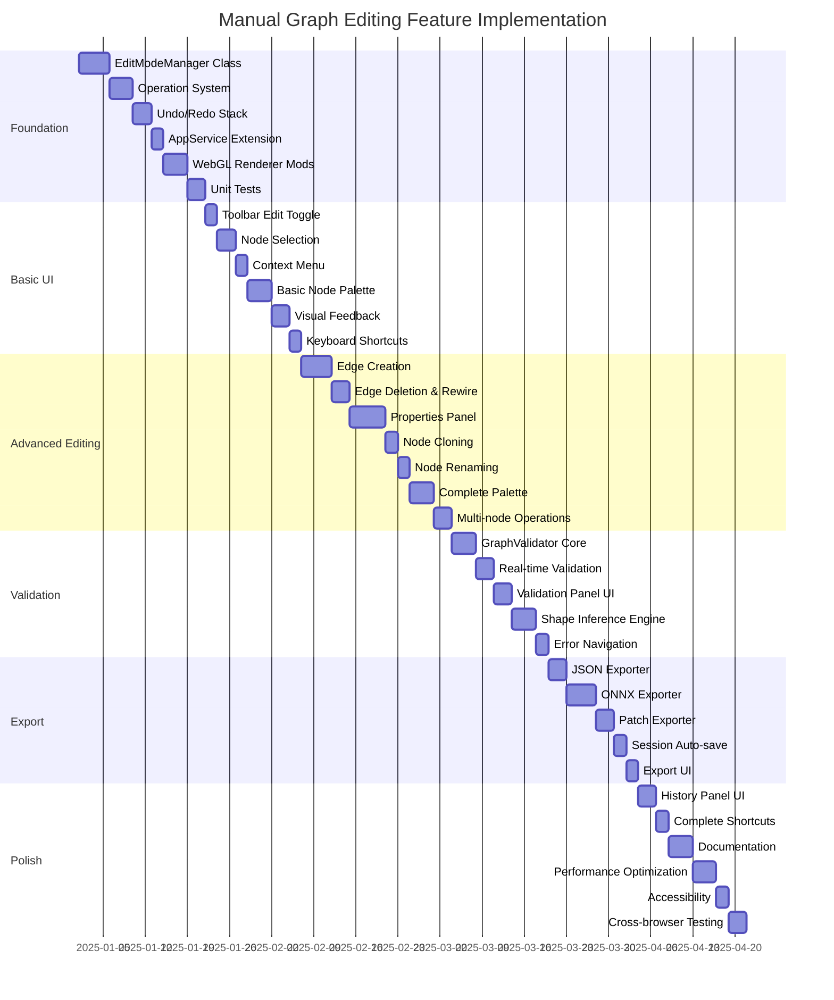

### Phase 1: Foundation (2-3 weeks)

**Goal**: Basic editing infrastructure without UI

**Tasks**:
1. ✅ Create `EditModeManager` class with state management
2. ✅ Implement operation interface and base operations (add/delete node)
3. ✅ Add undo/redo stack implementation
4. ✅ Extend `AppService` with edit state management
5. ✅ Modify `WebglRenderer` to support edit mode interactions
6. ✅ Write unit tests for core operations

**Deliverables**:
- Working edit mode toggle (programmatic only)
- Programmatic node add/delete with undo/redo
- Test coverage >80%

### Phase 2: Basic UI (2-3 weeks)

**Goal**: Minimal viable editing interface

**Tasks**:
1. ✅ Add "Edit Mode" toggle button to toolbar
2. ✅ Implement node selection (single and multi-select)
3. ✅ Add context menu for selected nodes (delete, clone)
4. ✅ Implement basic node palette (limited node types)
5. ✅ Add visual feedback for edit mode (cursor changes, highlights)
6. ✅ Integrate keyboard shortcuts

**Deliverables**:
- Users can enable edit mode via toolbar
- Users can add/delete nodes via palette and context menu
- Visual feedback for all operations
- Keyboard shortcuts functional

### Phase 3: Advanced Editing (3-4 weeks)

**Goal**: Full editing capabilities

**Tasks**:
1. ✅ Implement edge creation (drag from port to port)
2. ✅ Add edge deletion and rewiring
3. ✅ Implement properties panel for attribute editing
4. ✅ Add node cloning and copy/paste
5. ✅ Implement node renaming
6. ✅ Expand node palette with all common types
7. ✅ Add multi-node operations (group select and delete)

**Deliverables**:
- Full CRUD operations on nodes and edges
- Properties panel with type-specific editors
- Complete node palette
- Multi-selection and batch operations

### Phase 4: Validation (2 weeks)

**Goal**: Comprehensive validation system

**Tasks**:
1. ✅ Implement `GraphValidator` with rule engine
2. ✅ Add real-time validation during editing
3. ✅ Create validation panel UI component
4. ✅ Implement shape inference engine
5. ✅ Add validation error navigation (click to jump)
6. ✅ Implement validation error suggestions

**Deliverables**:
- Real-time validation with error/warning reporting
- Validation panel with clickable errors
- Shape inference and compatibility checking
- Helpful error messages and suggestions

### Phase 5: Export & Persistence (2 weeks)

**Goal**: Save and export edited graphs

**Tasks**:
1. ✅ Implement JSON exporter
2. ✅ Implement ONNX exporter (priority for ML workflows)
3. ✅ Implement patch exporter (diff format)
4. ✅ Add session auto-save to localStorage
5. ✅ Add export UI with format selection
6. ✅ Implement export validation check

**Deliverables**:
- Export to JSON, ONNX formats
- Patch export for version control
- Auto-save and session restoration
- Export blocked if validation errors exist

### Phase 6: Polish & Documentation (1-2 weeks)

**Goal**: Production-ready feature

**Tasks**:
1. ✅ Add history panel UI
2. ✅ Implement comprehensive keyboard shortcuts
3. ✅ Add onboarding tutorial (optional)
4. ✅ Write user documentation
5. ✅ Performance optimization (large graphs)
6. ✅ Accessibility improvements (keyboard navigation)
7. ✅ Cross-browser testing

**Deliverables**:
- History panel with clickable operations
- Complete keyboard shortcut system
- User guide and documentation
- Performance tested with 1000+ node graphs
- Accessibility compliance

### Optional Phase 7: Advanced Features (Future)

**Goal**: Enhanced collaboration and productivity

**Tasks**:
1. ⏳ Implement GraphDef and MLIR exporters
2. ⏳ Add collaborative editing (patch sharing)
3. ⏳ Implement graph templates and snippets
4. ⏳ Add custom node type registration
5. ⏳ Implement graph diff visualization
6. ⏳ Add performance profiling integration

---

## API Specifications

### EditModeManager API

```typescript
class EditModeManager {
  // State
  readonly editMode$: Observable<boolean>;
  readonly isDirty$: Observable<boolean>;
  readonly validationReport$: Observable<ValidationReport>;

  // Mode control
  enableEditMode(): void;
  disableEditMode(saveChanges?: boolean): void;
  isEditMode(): boolean;

  // Node operations
  addNode(type: string, position: Point, attributes?: any): string;
  deleteNode(nodeId: string): void;
  deleteNodes(nodeIds: string[]): void;
  modifyNode(nodeId: string, updates: Partial<Node>): void;
  cloneNode(nodeId: string): string;
  cloneNodes(nodeIds: string[]): string[];
  renameNode(nodeId: string, newLabel: string): void;

  // Edge operations
  addEdge(source: EdgeEndpoint, target: EdgeEndpoint): string | ValidationError;
  deleteEdge(edgeId: string): void;
  deleteEdges(edgeIds: string[]): void;
  rewireEdge(edgeId: string, newTarget: EdgeEndpoint): ValidationResult;

  // Selection
  selectNode(nodeId: string, addToSelection?: boolean): void;
  selectNodes(nodeIds: string[]): void;
  selectEdge(edgeId: string): void;
  deselectAll(): void;
  getSelection(): { nodes: string[], edges: string[] };

  // History
  undo(): boolean;
  redo(): boolean;
  canUndo(): boolean;
  canRedo(): boolean;
  getHistory(): Operation[];
  clearHistory(): void;

  // Validation
  validate(): ValidationReport;
  validateConnection(source: EdgeEndpoint, target: EdgeEndpoint): ValidationResult;
  hasErrors(): boolean;
  hasWarnings(): boolean;

  // Export
  exportGraph(format: ExportFormat): Blob;
  exportPatch(): Blob;

  // Session
  saveSession(): void;
  loadSession(): boolean;
  clearSession(): void;
  autoSave(enabled: boolean, intervalSeconds?: number): void;
}
```

### Configuration API

```typescript
interface VisualizerConfig {
  // ... existing properties

  /** Edit mode configuration */
  editConfig?: {
    /** Enable edit mode features */
    enabled: boolean;

    /** Start in edit mode by default */
    startInEditMode?: boolean;

    /** Auto-save interval in seconds (0 = disabled) */
    autoSaveInterval?: number;

    /** Maximum undo/redo stack size */
    maxHistorySize?: number;

    /** Validation level: 'strict' | 'lenient' | 'off' */
    validationLevel?: 'strict' | 'lenient' | 'off';

    /** Show validation panel by default */
    showValidationPanel?: boolean;

    /** Available node types in palette */
    nodeTypes?: string[];

    /** Available export formats */
    exportFormats?: ExportFormat[];

    /** Custom validation rules */
    customValidators?: ValidationRule[];
  };
}
```

### Events API

```typescript
interface EditEvents {
  // Mode events
  'edit-mode-enabled': void;
  'edit-mode-disabled': void;

  // Graph change events
  'node-added': { nodeId: string, node: Node };
  'node-deleted': { nodeId: string };
  'node-modified': { nodeId: string, changes: Partial<Node> };
  'edge-added': { edgeId: string, edge: Edge };
  'edge-deleted': { edgeId: string };
  'graph-changed': void;

  // Selection events
  'selection-changed': { nodes: string[], edges: string[] };

  // Validation events
  'validation-started': void;
  'validation-completed': ValidationReport;

  // History events
  'operation-executed': Operation;
  'operation-undone': Operation;
  'operation-redone': Operation;

  // Export events
  'export-started': { format: ExportFormat };
  'export-completed': { format: ExportFormat, blob: Blob };
  'export-failed': { format: ExportFormat, error: Error };
}
```

---

## Validation & Integrity

### Validation Rules

#### 1. Node Validation

```typescript
interface NodeValidationRule {
  name: string;
  validate(node: Node, graph: Graph): ValidationError[];
}

class RequiredInputsRule implements NodeValidationRule {
  name = 'required-inputs';

  validate(node: Node, graph: Graph): ValidationError[] {
    const errors: ValidationError[] = [];

    node.inputs.forEach((input, index) => {
      if (input.required) {
        const hasConnection = graph.edges.some(e =>
          e.targetNodeId === node.id && e.targetPort === index
        );

        if (!hasConnection) {
          errors.push({
            type: 'error',
            message: `Node '${node.label}' missing required input '${input.name}'`,
            nodeId: node.id,
            suggestion: `Connect to output port of type '${input.type}'`
          });
        }
      }
    });

    return errors;
  }
}

class ValidAttributesRule implements NodeValidationRule {
  name = 'valid-attributes';

  validate(node: Node, graph: Graph): ValidationError[] {
    const errors: ValidationError[] = [];
    const template = NodeTemplates.get(node.type);

    if (!template) {
      errors.push({
        type: 'error',
        message: `Unknown node type '${node.type}'`,
        nodeId: node.id
      });
      return errors;
    }

    // Check required attributes
    template.requiredAttributes.forEach(attr => {
      if (!(attr in node.attributes)) {
        errors.push({
          type: 'error',
          message: `Node '${node.label}' missing required attribute '${attr}'`,
          nodeId: node.id
        });
      }
    });

    // Validate attribute types and values
    Object.entries(node.attributes).forEach(([key, value]) => {
      const attrDef = template.attributes[key];
      if (!attrDef) {
        errors.push({
          type: 'warning',
          message: `Node '${node.label}' has unknown attribute '${key}'`,
          nodeId: node.id
        });
        return;
      }

      // Type validation
      if (!this.validateType(value, attrDef.type)) {
        errors.push({
          type: 'error',
          message: `Attribute '${key}' has invalid type (expected ${attrDef.type})`,
          nodeId: node.id
        });
      }

      // Range validation
      if (attrDef.min !== undefined && value < attrDef.min) {
        errors.push({
          type: 'error',
          message: `Attribute '${key}' below minimum value (${attrDef.min})`,
          nodeId: node.id
        });
      }

      if (attrDef.max !== undefined && value > attrDef.max) {
        errors.push({
          type: 'error',
          message: `Attribute '${key}' above maximum value (${attrDef.max})`,
          nodeId: node.id
        });
      }
    });

    return errors;
  }

  private validateType(value: any, expectedType: string): boolean {
    switch (expectedType) {
      case 'number': return typeof value === 'number';
      case 'string': return typeof value === 'string';
      case 'boolean': return typeof value === 'boolean';
      case 'shape': return Array.isArray(value) && value.every(v => typeof v === 'number');
      default: return true;
    }
  }
}
```

#### 2. Edge Validation

```typescript
class EdgeTypeCompatibilityRule implements ValidationRule {
  name = 'edge-type-compatibility';

  validate(edge: Edge, graph: Graph): ValidationError[] {
    const errors: ValidationError[] = [];

    const sourceNode = graph.getNode(edge.sourceNodeId);
    const targetNode = graph.getNode(edge.targetNodeId);

    const sourceOutput = sourceNode.outputs[edge.sourcePort];
    const targetInput = targetNode.inputs[edge.targetPort];

    if (!this.areTypesCompatible(sourceOutput.type, targetInput.type)) {
      errors.push({
        type: 'error',
        message: `Type mismatch: ${sourceOutput.type} → ${targetInput.type}`,
        edgeId: edge.id,
        suggestion: 'Add type conversion node or choose compatible ports'
      });
    }

    return errors;
  }

  private areTypesCompatible(sourceType: string, targetType: string): boolean {
    // Implementation as in GraphValidator
  }
}

class ShapeCompatibilityRule implements ValidationRule {
  name = 'shape-compatibility';

  validate(edge: Edge, graph: Graph): ValidationError[] {
    const errors: ValidationError[] = [];

    const sourceNode = graph.getNode(edge.sourceNodeId);
    const targetNode = graph.getNode(edge.targetNodeId);

    const sourceOutput = sourceNode.outputs[edge.sourcePort];
    const targetInput = targetNode.inputs[edge.targetPort];

    if (sourceOutput.shape && targetInput.shape) {
      if (!this.areShapesCompatible(sourceOutput.shape, targetInput.shape)) {
        errors.push({
          type: 'error',
          message: `Shape mismatch: [${sourceOutput.shape.join(',')}] → [${targetInput.shape.join(',')}]`,
          edgeId: edge.id,
          suggestion: this.suggestShapeFix(sourceOutput.shape, targetInput.shape)
        });
      }
    }

    return errors;
  }

  private areShapesCompatible(sourceShape: number[], targetShape: number[]): boolean {
    // Implementation as in GraphValidator
  }

  private suggestShapeFix(sourceShape: number[], targetShape: number[]): string {
    // Provide helpful suggestion based on mismatch
    if (sourceShape.length !== targetShape.length) {
      return 'Add Reshape node to adjust tensor dimensions';
    }

    for (let i = 0; i < sourceShape.length; i++) {
      if (sourceShape[i] !== targetShape[i] &&
          sourceShape[i] !== -1 &&
          targetShape[i] !== -1) {
        return `Dimension ${i}: expected ${targetShape[i]}, got ${sourceShape[i]}. Check previous layer output or add Pad/Crop.`;
      }
    }

    return 'Adjust layer parameters or add conversion node';
  }
}
```

#### 3. Graph Structure Validation

```typescript
class CyclicGraphRule implements ValidationRule {
  name = 'cyclic-graph';

  validate(graph: Graph): ValidationError[] {
    const cycles = this.findCycles(graph);

    if (cycles.length > 0 && !graph.allowsCycles) {
      return cycles.map(cycle => ({
        type: 'error',
        message: `Cycle detected: ${cycle.join(' → ')}`,
        suggestion: 'Remove one connection in the cycle or enable recurrent mode'
      }));
    }

    return [];
  }

  private findCycles(graph: Graph): string[][] {
    // Tarjan's algorithm or DFS-based cycle detection
    const visited = new Set<string>();
    const recStack = new Set<string>();
    const cycles: string[][] = [];

    const dfs = (nodeId: string, path: string[]) => {
      visited.add(nodeId);
      recStack.add(nodeId);
      path.push(nodeId);

      const outEdges = graph.edges.filter(e => e.sourceNodeId === nodeId);

      for (const edge of outEdges) {
        const targetId = edge.targetNodeId;

        if (!visited.has(targetId)) {
          dfs(targetId, [...path]);
        } else if (recStack.has(targetId)) {
          // Found cycle
          const cycleStart = path.indexOf(targetId);
          cycles.push([...path.slice(cycleStart), targetId]);
        }
      }

      recStack.delete(nodeId);
    };

    graph.nodes.forEach(node => {
      if (!visited.has(node.id)) {
        dfs(node.id, []);
      }
    });

    return cycles;
  }
}
```

### Shape Inference

```typescript
class ShapeInference {
  inferShapes(graph: Graph): Map<string, TensorShape> {
    const shapes = new Map<string, TensorShape>();

    // Initialize with known shapes (graph inputs, constants)
    graph.nodes.forEach(node => {
      if (node.isGraphInput || node.type === 'Constant') {
        node.outputs.forEach((output, idx) => {
          if (output.shape) {
            shapes.set(`${node.id}:${idx}`, output.shape);
          }
        });
      }
    });

    // Topological sort for forward pass
    const sortedNodes = this.topologicalSort(graph);

    // Infer shapes in topological order
    for (const node of sortedNodes) {
      const inferFunc = ShapeInferenceFunctions[node.type];

      if (!inferFunc) {
        console.warn(`No shape inference for node type: ${node.type}`);
        continue;
      }

      // Gather input shapes
      const inputShapes = node.inputs.map((input, idx) => {
        const edge = graph.edges.find(e =>
          e.targetNodeId === node.id && e.targetPort === idx
        );

        if (!edge) return undefined;

        return shapes.get(`${edge.sourceNodeId}:${edge.sourcePort}`);
      });

      // Infer output shapes
      const outputShapes = inferFunc(inputShapes, node.attributes);

      // Store output shapes
      outputShapes.forEach((shape, idx) => {
        if (shape) {
          shapes.set(`${node.id}:${idx}`, shape);
        }
      });
    }

    return shapes;
  }

  private topologicalSort(graph: Graph): Node[] {
    // Kahn's algorithm
    const inDegree = new Map<string, number>();
    const result: Node[] = [];

    // Initialize in-degrees
    graph.nodes.forEach(node => {
      inDegree.set(node.id, 0);
    });

    graph.edges.forEach(edge => {
      const degree = inDegree.get(edge.targetNodeId) || 0;
      inDegree.set(edge.targetNodeId, degree + 1);
    });

    // Find nodes with no incoming edges
    const queue = graph.nodes.filter(node => inDegree.get(node.id) === 0);

    while (queue.length > 0) {
      const node = queue.shift()!;
      result.push(node);

      // Reduce in-degree for neighbors
      const outEdges = graph.edges.filter(e => e.sourceNodeId === node.id);
      outEdges.forEach(edge => {
        const degree = inDegree.get(edge.targetNodeId)!;
        inDegree.set(edge.targetNodeId, degree - 1);

        if (degree - 1 === 0) {
          queue.push(graph.getNode(edge.targetNodeId));
        }
      });
    }

    if (result.length !== graph.nodes.length) {
      throw new Error('Graph contains cycles, cannot perform topological sort');
    }

    return result;
  }
}

// Shape inference functions for common operations
const ShapeInferenceFunctions = {
  Conv2D: (inputs: TensorShape[], attrs: any): TensorShape[] => {
    const [batchSize, height, width, inChannels] = inputs[0] || [-1, -1, -1, -1];
    const { kernel_h, kernel_w, stride_h, stride_w, padding, out_channels } = attrs;

    let outHeight = Math.floor((height + 2 * padding - kernel_h) / stride_h + 1);
    let outWidth = Math.floor((width + 2 * padding - kernel_w) / stride_w + 1);

    return [[batchSize, outHeight, outWidth, out_channels]];
  },

  MaxPool2D: (inputs: TensorShape[], attrs: any): TensorShape[] => {
    const [batchSize, height, width, channels] = inputs[0] || [-1, -1, -1, -1];
    const { pool_h, pool_w, stride_h, stride_w } = attrs;

    let outHeight = Math.floor((height - pool_h) / stride_h + 1);
    let outWidth = Math.floor((width - pool_w) / stride_w + 1);

    return [[batchSize, outHeight, outWidth, channels]];
  },

  Reshape: (inputs: TensorShape[], attrs: any): TensorShape[] => {
    return [attrs.target_shape];
  },

  MatMul: (inputs: TensorShape[], attrs: any): TensorShape[] => {
    const shapeA = inputs[0] || [];
    const shapeB = inputs[1] || [];

    if (shapeA.length < 2 || shapeB.length < 2) {
      return [[-1]]; // Unknown shape
    }

    // [..., M, K] × [..., K, N] → [..., M, N]
    const result = [...shapeA];
    result[result.length - 1] = shapeB[shapeB.length - 1];

    return [result];
  },

  Add: (inputs: TensorShape[], attrs: any): TensorShape[] => {
    // Broadcast shapes
    const shape1 = inputs[0] || [];
    const shape2 = inputs[1] || [];

    return [this.broadcastShapes(shape1, shape2)];
  }
};
```

---

## Export Functionality

### Export Workflow

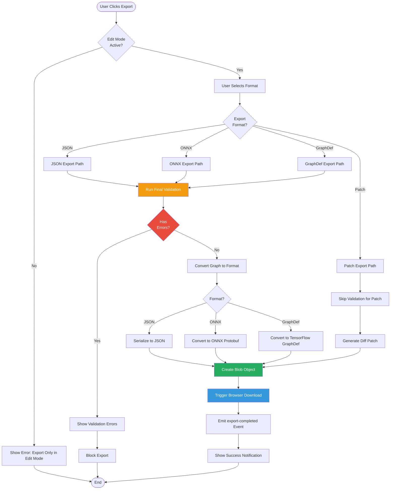

### JSON Exporter

```typescript
class JsonExporter implements Exporter {
  export(graph: Graph): Blob {
    const json = {
      version: '1.0',
      modelExplorerFormat: true,
      graphs: [{
        id: graph.id,
        nodes: graph.nodes.map(node => ({
          id: node.id,
          type: node.type,
          label: node.label,
          namespace: node.namespace,
          attributes: node.attributes,
          inputs: node.inputs,
          outputs: node.outputs,
          metadata: {
            position: node.position,
            isGraphInput: node.isGraphInput,
            isGraphOutput: node.isGraphOutput
          }
        })),
        edges: graph.edges.map(edge => ({
          id: edge.id,
          sourceNodeId: edge.sourceNodeId,
          sourcePort: edge.sourcePort,
          targetNodeId: edge.targetNodeId,
          targetPort: edge.targetPort,
          label: edge.label
        }))
      }]
    };

    const jsonString = JSON.stringify(json, null, 2);
    return new Blob([jsonString], { type: 'application/json' });
  }
}
```

### ONNX Exporter

```typescript
class OnnxExporter implements Exporter {
  export(graph: Graph): Blob {
    // Convert to ONNX protobuf format
    const onnxGraph = this.convertToOnnx(graph);
    const buffer = this.serializeToProtobuf(onnxGraph);

    return new Blob([buffer], { type: 'application/octet-stream' });
  }

  private convertToOnnx(graph: Graph): OnnxGraph {
    return {
      name: graph.id,
      node: graph.nodes.map(node => this.convertNode(node)),
      input: this.getGraphInputs(graph),
      output: this.getGraphOutputs(graph),
      valueInfo: this.inferValueInfo(graph),
      initializer: this.getInitializers(graph)
    };
  }

  private convertNode(node: Node): OnnxNode {
    return {
      name: node.id,
      opType: this.mapToOnnxOpType(node.type),
      input: node.inputs.map((_, idx) => `${node.id}_input_${idx}`),
      output: node.outputs.map((_, idx) => `${node.id}_output_${idx}`),
      attribute: this.convertAttributes(node.attributes, node.type)
    };
  }

  private mapToOnnxOpType(nodeType: string): string {
    const mapping: Record<string, string> = {
      'Conv2D': 'Conv',
      'MaxPool2D': 'MaxPool',
      'ReLU': 'Relu',
      'BatchNorm': 'BatchNormalization',
      'Add': 'Add',
      'MatMul': 'MatMul',
      // ... more mappings
    };

    return mapping[nodeType] || nodeType;
  }

  private convertAttributes(attrs: any, nodeType: string): OnnxAttribute[] {
    // Convert attributes based on ONNX op specifications
    const converter = OnnxAttributeConverters[nodeType];
    return converter ? converter(attrs) : [];
  }
}
```

### Patch Exporter (Diff Format)

```typescript
class PatchExporter {
  exportDiff(originalGraph: Graph, modifiedGraph: Graph): Blob {
    const patch = {
      version: '1.0',
      format: 'model-explorer-patch',
      timestamp: new Date().toISOString(),

      // Added nodes
      addedNodes: modifiedGraph.nodes.filter(node =>
        !originalGraph.nodes.find(n => n.id === node.id)
      ),

      // Deleted nodes
      deletedNodes: originalGraph.nodes
        .filter(node => !modifiedGraph.nodes.find(n => n.id === node.id))
        .map(node => node.id),

      // Modified nodes
      modifiedNodes: this.findModifiedNodes(originalGraph, modifiedGraph),

      // Added edges
      addedEdges: modifiedGraph.edges.filter(edge =>
        !originalGraph.edges.find(e => this.edgesEqual(e, edge))
      ),

      // Deleted edges
      deletedEdges: originalGraph.edges
        .filter(edge => !modifiedGraph.edges.find(e => this.edgesEqual(e, edge)))
        .map(edge => edge.id),

      // Statistics
      stats: {
        nodesAdded: 0,
        nodesDeleted: 0,
        nodesModified: 0,
        edgesAdded: 0,
        edgesDeleted: 0
      }
    };

    // Update statistics
    patch.stats.nodesAdded = patch.addedNodes.length;
    patch.stats.nodesDeleted = patch.deletedNodes.length;
    patch.stats.nodesModified = patch.modifiedNodes.length;
    patch.stats.edgesAdded = patch.addedEdges.length;
    patch.stats.edgesDeleted = patch.deletedEdges.length;

    const jsonString = JSON.stringify(patch, null, 2);
    return new Blob([jsonString], { type: 'application/json' });
  }

  private findModifiedNodes(original: Graph, modified: Graph): any[] {
    const modifiedNodes: any[] = [];

    modified.nodes.forEach(modNode => {
      const origNode = original.nodes.find(n => n.id === modNode.id);

      if (!origNode) return; // New node, not modified

      const changes: any = {
        id: modNode.id,
        changes: {}
      };

      // Compare attributes
      if (JSON.stringify(origNode.attributes) !== JSON.stringify(modNode.attributes)) {
        changes.changes.attributes = {
          old: origNode.attributes,
          new: modNode.attributes
        };
      }

      // Compare label
      if (origNode.label !== modNode.label) {
        changes.changes.label = {
          old: origNode.label,
          new: modNode.label
        };
      }

      if (Object.keys(changes.changes).length > 0) {
        modifiedNodes.push(changes);
      }
    });

    return modifiedNodes;
  }

  private edgesEqual(e1: Edge, e2: Edge): boolean {
    return e1.sourceNodeId === e2.sourceNodeId &&
           e1.sourcePort === e2.sourcePort &&
           e1.targetNodeId === e2.targetNodeId &&
           e1.targetPort === e2.targetPort;
  }

  applyPatch(graph: Graph, patch: any): Graph {
    const modifiedGraph = cloneDeep(graph);

    // Delete nodes
    patch.deletedNodes.forEach((nodeId: string) => {
      modifiedGraph.removeNode(nodeId);
    });

    // Delete edges
    patch.deletedEdges.forEach((edgeId: string) => {
      modifiedGraph.removeEdge(edgeId);
    });

    // Add nodes
    patch.addedNodes.forEach((node: Node) => {
      modifiedGraph.addNode(node);
    });

    // Add edges
    patch.addedEdges.forEach((edge: Edge) => {
      modifiedGraph.addEdge(edge);
    });

    // Modify nodes
    patch.modifiedNodes.forEach((mod: any) => {
      const node = modifiedGraph.getNode(mod.id);

      if (mod.changes.attributes) {
        node.attributes = mod.changes.attributes.new;
      }

      if (mod.changes.label) {
        node.label = mod.changes.label.new;
      }
    });

    return modifiedGraph;
  }
}
```

---

## Security Considerations

### Input Validation

```typescript
class SecurityValidator {
  /**
   * Validate user input to prevent injection attacks
   */
  validateNodeLabel(label: string): ValidationResult {
    // Prevent XSS
    const sanitized = this.sanitizeHtml(label);

    // Check length
    if (sanitized.length > 256) {
      return { isValid: false, error: 'Label too long (max 256 characters)' };
    }

    // Check for valid identifier characters
    if (!/^[a-zA-Z0-9_\-\.]+$/.test(sanitized)) {
      return { isValid: false, error: 'Label contains invalid characters' };
    }

    return { isValid: true };
  }

  /**
   * Validate attribute values to prevent code injection
   */
  validateAttributeValue(value: any, expectedType: string): ValidationResult {
    switch (expectedType) {
      case 'number':
        if (typeof value !== 'number' || !isFinite(value)) {
          return { isValid: false, error: 'Invalid number' };
        }
        break;

      case 'string':
        if (typeof value !== 'string') {
          return { isValid: false, error: 'Invalid string' };
        }

        // Sanitize HTML
        value = this.sanitizeHtml(value);

        // Check length
        if (value.length > 10000) {
          return { isValid: false, error: 'String too long' };
        }
        break;

      case 'shape':
        if (!Array.isArray(value)) {
          return { isValid: false, error: 'Shape must be an array' };
        }

        if (!value.every(v => typeof v === 'number' && isFinite(v))) {
          return { isValid: false, error: 'Shape must contain only numbers' };
        }

        if (value.length > 10) {
          return { isValid: false, error: 'Shape dimensionality too high (max 10)' };
        }
        break;
    }

    return { isValid: true };
  }

  /**
   * Validate graph before export to prevent malicious payloads
   */
  validateGraphForExport(graph: Graph): ValidationResult {
    // Check graph size
    if (graph.nodes.length > 10000) {
      return { isValid: false, error: 'Graph too large (max 10,000 nodes)' };
    }

    if (graph.edges.length > 50000) {
      return { isValid: false, error: 'Graph has too many edges (max 50,000)' };
    }

    // Validate all nodes
    for (const node of graph.nodes) {
      const labelValid = this.validateNodeLabel(node.label);
      if (!labelValid.isValid) {
        return { isValid: false, error: `Node ${node.id}: ${labelValid.error}` };
      }

      // Validate attributes
      for (const [key, value] of Object.entries(node.attributes)) {
        const attrValid = this.validateAttributeValue(value, typeof value);
        if (!attrValid.isValid) {
          return { isValid: false, error: `Node ${node.id}, attribute ${key}: ${attrValid.error}` };
        }
      }
    }

    return { isValid: true };
  }

  private sanitizeHtml(input: string): string {
    return input
      .replace(/</g, '&lt;')
      .replace(/>/g, '&gt;')
      .replace(/"/g, '&quot;')
      .replace(/'/g, '&#x27;')
      .replace(/\//g, '&#x2F;');
  }
}
```

### Permission Control

```typescript
interface EditPermissions {
  /** Can add new nodes */
  canAddNodes: boolean;

  /** Can delete nodes */
  canDeleteNodes: boolean;

  /** Can modify node attributes */
  canModifyNodes: boolean;

  /** Can add/delete edges */
  canModifyEdges: boolean;

  /** Can export graphs */
  canExport: boolean;

  /** Can import graphs */
  canImport: boolean;

  /** Maximum nodes in graph */
  maxNodes?: number;

  /** Allowed node types */
  allowedNodeTypes?: string[];

  /** Allowed export formats */
  allowedExportFormats?: ExportFormat[];
}

class PermissionManager {
  constructor(private permissions: EditPermissions) {}

  checkPermission(action: keyof EditPermissions): boolean {
    return this.permissions[action] === true;
  }

  canAddNode(type: string): boolean {
    if (!this.permissions.canAddNodes) return false;

    if (this.permissions.allowedNodeTypes) {
      return this.permissions.allowedNodeTypes.includes(type);
    }

    return true;
  }

  canExportFormat(format: ExportFormat): boolean {
    if (!this.permissions.canExport) return false;

    if (this.permissions.allowedExportFormats) {
      return this.permissions.allowedExportFormats.includes(format);
    }

    return true;
  }
}
```

### Session Storage Security

```typescript
class SecureSessionStorage {
  private readonly STORAGE_KEY = 'model-explorer-session';
  private readonly MAX_SIZE = 5 * 1024 * 1024; // 5MB limit

  save(session: EditSession): boolean {
    try {
      // Validate session
      const validation = new SecurityValidator().validateGraphForExport(session.graph);
      if (!validation.isValid) {
        console.error('Session validation failed:', validation.error);
        return false;
      }

      // Serialize
      const serialized = JSON.stringify(session);

      // Check size
      if (serialized.length > this.MAX_SIZE) {
        console.error('Session too large to save');
        return false;
      }

      // Save to localStorage
      localStorage.setItem(this.STORAGE_KEY, serialized);

      return true;
    } catch (e) {
      console.error('Failed to save session:', e);
      return false;
    }
  }

  load(): EditSession | null {
    try {
      const serialized = localStorage.getItem(this.STORAGE_KEY);

      if (!serialized) return null;

      // Parse
      const session = JSON.parse(serialized);

      // Validate structure
      if (!this.isValidSession(session)) {
        console.error('Invalid session structure');
        return null;
      }

      return session;
    } catch (e) {
      console.error('Failed to load session:', e);
      return null;
    }
  }

  clear(): void {
    localStorage.removeItem(this.STORAGE_KEY);
  }

  private isValidSession(obj: any): boolean {
    return obj &&
           typeof obj === 'object' &&
           obj.graph &&
           Array.isArray(obj.graph.nodes) &&
           Array.isArray(obj.graph.edges);
  }
}
```

---

## Future Enhancements

### 1. Collaborative Editing

```typescript
interface CollaborativeFeatures {
  // Real-time collaboration
  shareSession(sessionId: string): ShareLink;
  joinSession(shareLink: ShareLink): void;

  // Conflict resolution
  handleConflict(operation: Operation): ConflictResolution;

  // User presence
  showUserCursors: boolean;
  showUserSelections: boolean;
}
```

### 2. Graph Templates & Snippets

```typescript
interface TemplateSystem {
  // Save as template
  saveAsTemplate(graph: Graph, metadata: TemplateMetadata): void;

  // Load template
  loadTemplate(templateId: string): Graph;

  // Template library
  browseTemplates(category?: string): Template[];

  // Snippets
  saveSnippet(nodes: Node[], edges: Edge[], name: string): void;
  insertSnippet(snippetId: string, position: Point): void;
}
```

### 3. Advanced Visualization

```typescript
interface AdvancedVisualization {
  // Diff view
  showDiff(graph1: Graph, graph2: Graph): void;

  // Performance overlay
  overlayPerformanceData(profilingData: ProfilingData): void;

  // Layer fusion visualization
  showFusedLayers(fusionMap: FusionMap): void;

  // Memory layout
  visualizeMemoryLayout(memoryMap: MemoryMap): void;
}
```

### 4. AI-Assisted Editing

```typescript
interface AIFeatures {
  // Suggest optimizations
  suggestOptimizations(graph: Graph): Optimization[];

  // Auto-fix errors
  autoFixValidationErrors(errors: ValidationError[]): Operation[];

  // Pattern detection
  detectPatterns(graph: Graph): Pattern[];

  // Auto-complete
  suggestNextNode(currentNode: Node): NodeSuggestion[];
}
```

---

## Appendix: Node Type Definitions

```typescript
const NodeTemplates = new Map<string, NodeTemplate>([
  ['Conv2D', {
    type: 'Conv2D',
    category: 'Convolution',
    defaultLabel: 'conv',
    icon: 'conv',
    inputs: [
      { name: 'input', type: 'tensor<float32>', required: true }
    ],
    outputs: [
      { name: 'output', type: 'tensor<float32>' }
    ],
    defaultAttributes: {
      kernel_h: 3,
      kernel_w: 3,
      stride_h: 1,
      stride_w: 1,
      padding: 1,
      out_channels: 32
    },
    requiredAttributes: ['kernel_h', 'kernel_w', 'out_channels'],
    attributes: {
      kernel_h: { type: 'number', min: 1, max: 11 },
      kernel_w: { type: 'number', min: 1, max: 11 },
      stride_h: { type: 'number', min: 1, max: 4 },
      stride_w: { type: 'number', min: 1, max: 4 },
      padding: { type: 'number', min: 0, max: 10 },
      out_channels: { type: 'number', min: 1, max: 2048 }
    }
  }],

  ['ReLU', {
    type: 'ReLU',
    category: 'Activation',
    defaultLabel: 'relu',
    icon: 'activation',
    inputs: [
      { name: 'input', type: 'tensor<float32>', required: true }
    ],
    outputs: [
      { name: 'output', type: 'tensor<float32>' }
    ],
    defaultAttributes: {},
    requiredAttributes: [],
    attributes: {}
  }],

  // ... more node types
]);
```

---

## Conclusion

This feature design provides a comprehensive roadmap for implementing manual graph editing in Model Explorer. The architecture emphasizes:

1. **User Experience**: Intuitive UI with familiar editing patterns
2. **Robustness**: Comprehensive validation and error handling
3. **Flexibility**: Extensible system for custom node types and validators
4. **Security**: Input validation and permission control
5. **Maintainability**: Clean separation of concerns and testable components

**Next Steps**:
1. Review and approve design
2. Begin Phase 1 implementation (Foundation)
3. Set up CI/CD for automated testing
4. Create user documentation and examples

---

**Document Metadata**:
- **Format**: Markdown (GitHub-flavored) with Mermaid diagrams
- **Word Count**: ~14,000 words
- **Code Examples**: 25+
- **Mermaid Diagrams**: 15

  - System Architecture Diagram
  - Core Components Layout (UI structure)
  - Edit Mode State Machine
  - User Workflow Sequences (3)
  - Operation Execution Flow
  - Validation Pipeline
  - Class Diagram
  - Edge Creation Interaction
  - Validation Panel Structure
  - Validation Panel Interactive Features (sequence)
  - Real-time Validation Flow
  - Export Workflow
  - Implementation Timeline (Gantt)
- **Tables**: 2 (Validation Categories, Keyboard Shortcuts)
- **Target Audience**: ML Engineers, Frontend Developers, Product Managers

**Change Log**:
- 2025-10-14: Initial version (v1.0)
- 2025-10-14: Added 11 Mermaid diagrams for better visualization (v1.1)
- 2025-10-14: Converted Core Components ASCII art to Mermaid diagram (v1.2)
- 2025-10-14: Enhanced Validation Panel section with 3 additional Mermaid diagrams (v1.3)
- 2025-10-14: Fixed Mermaid syntax error in Core Components Layout diagram (v1.3.1)
