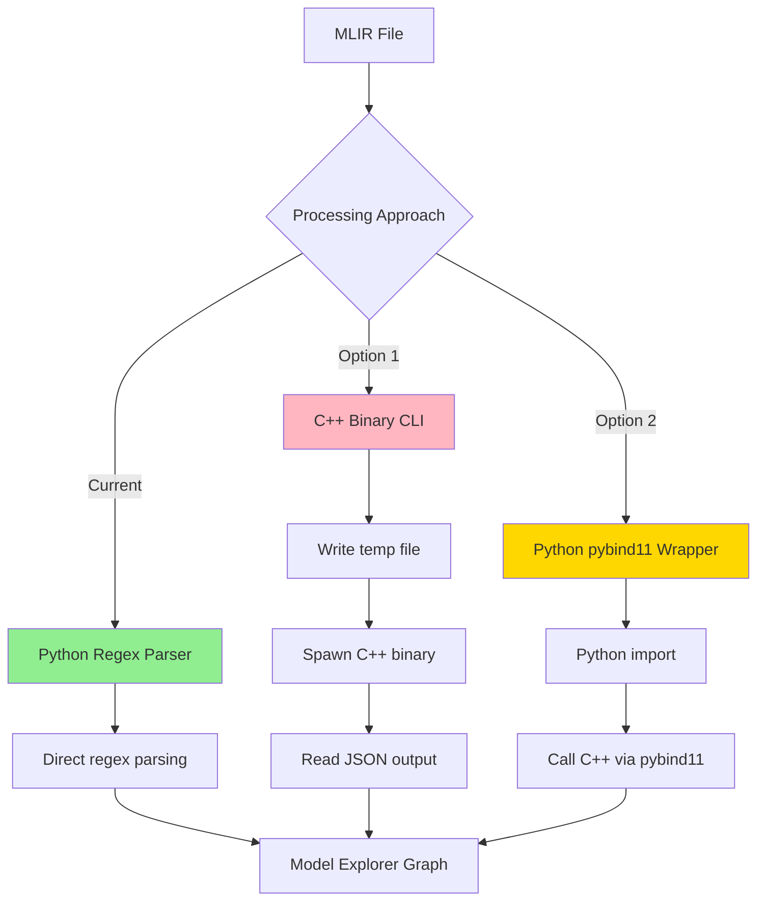

# Model Explorer C++ Binary Investigation

**Date**: 2024
**Investigation**: Can we directly interact with Model Explorer C++ binaries instead of using Python wrapper?

## Executive Summary

**Finding**: Direct C++ binary usage is **not recommended** for our MLIR visualization use case.

**Current architecture** (direct Python regex parser) is superior due to:
- ✅ Universal MLIR dialect support
- ✅ Zero build dependencies
- ✅ Easy distribution
- ✅ Adequate for visualization purposes

---

## Architecture Analysis

### Three Approaches Compared



---

## Current Approach: Direct Python Regex Parser

**Location**: `scripts/parse_mlir.py`

**How it works**:
1. TypeScript calls Python script with MLIR content via stdin
2. Python uses regex to extract operations, inputs, outputs
3. Constructs Model Explorer GraphNode structures directly
4. Returns JSON graph via stdout

**Benefits**:
- ✅ **Universal dialect support**: Treats all MLIR operations uniformly
- ✅ **Zero external dependencies**: Python 3.9+ only
- ✅ **In-memory processing**: No file I/O overhead
- ✅ **Easy distribution**: Ships with npm package
- ✅ **Direct control**: Can customize parsing logic
- ✅ **Preserves SSA order**: Proper edge connections

**Limitations**:
- ⚠️ Regex parsing may miss complex MLIR syntax edge cases
- ⚠️ No official MLIR semantic validation
- ⚠️ Limited to graph topology (sufficient for visualization)

**Performance**: Adequate for files up to 100MB

---

## Option 1: Direct C++ Binary

**Binary**: `models_to_json` (from Model Explorer builtin-adapter)

**Interface**:
```bash
models_to_json --i=model.mlir --o=output.json \
  --const_element_count_limit=16 \
  --disable_mlir=false
```

**How it would work**:
1. TypeScript writes MLIR to temp file
2. Spawn C++ binary process with file paths
3. Read JSON output from file

### Major Problems

#### 1. Build Complexity

**Requirements**:
- Bazel 7.4.1+
- Full TensorFlow/MLIR build environment
- Hours to compile
- Platform-specific binaries

**Dependencies** (from BUILD file):
```python
"@llvm-project//mlir:IR"
"@llvm-project//mlir:TosaDialect"
"@stablehlo//:stablehlo_ops"
"@org_tensorflow//tensorflow/compiler/mlir/lite"
"@com_google_absl//absl/..."
```

#### 2. Hardcoded Dialect Support

The C++ adapter **only recognizes dialects explicitly linked** in the BUILD file:

```cpp
// From third_party/model-explorer/src/builtin-adapter/BUILD
deps = [
    "@llvm-project//mlir:TosaDialect",      // TOSA only
    "@stablehlo//:stablehlo_ops",           // StableHLO only
    "@org_tensorflow//tensorflow/...:tensorflow_lite",  // TFLite only
]
```

**Problem**: Custom or newer dialects require:
- Modifying BUILD file
- Adding new dependencies
- Recompiling entire binary (hours)

**Our Python parser**: Supports **ALL** dialects out of the box.

#### 3. File I/O Overhead

Every parse requires:
1. Write MLIR to temp file (~ms for small files, >100ms for large)
2. Spawn process (~10-50ms)
3. Wait for C++ execution (~100ms-seconds)
4. Read JSON from file (~ms)

**Total overhead**: 200ms-seconds per file

**Python parser**: In-memory processing ~50-200ms

#### 4. Distribution Nightmare

Cannot ship pre-built binaries because:
- Platform-specific (macOS Intel/ARM, Linux x86/ARM64, Windows)
- GLIBC version dependencies (Linux)
- Dynamic library dependencies

**Options**:
1. ❌ Ship binaries for all platforms (impractical)
2. ❌ Require users to build from source (barrier to adoption)
3. ✅ Use Python parser (already works everywhere)

---

## Option 2: Python pybind11 Wrapper

**Location**: `third_party/model-explorer/src/builtin-adapter/python/convert_wrapper/`

**Interface**:
```python
import _pywrap_convert_wrapper

config = _pywrap_convert_wrapper.VisualizeConfig()
config.const_element_count_limit = 16

json_output = _pywrap_convert_wrapper.ConvertMlirToJson(config, model_path)
```

**How it works**:
1. Python imports compiled C extension (.so/.pyd)
2. Calls C++ functions via pybind11 bindings
3. Returns JSON string to Python
4. TypeScript calls Python wrapper

### Benefits vs Direct Binary

- ✅ No file I/O overhead (in-memory)
- ✅ Can be distributed as pip wheel
- ✅ Official MLIR parser with semantic analysis

### Remaining Problems

- ❌ Still requires C++ build (same Bazel complexity)
- ❌ Still has hardcoded dialect restrictions
- ❌ Platform-specific wheels needed
- ❌ Adds Python C extension complexity
- ⚠️ Makes current `parse_mlir.py` redundant

---

## Detailed Comparison

| Feature | Python Regex Parser | C++ Binary | pybind11 Wrapper |
|---------|---------------------|------------|------------------|
| **Dialect Support** | ✅ All dialects | ❌ Hardcoded list | ❌ Hardcoded list |
| **Build Required** | ✅ None | ❌ Bazel + TF | ❌ Bazel + TF |
| **Dependencies** | ✅ Python 3.9+ | ❌ Many | ❌ Many |
| **Distribution** | ✅ npm package | ❌ Per-platform | ⚠️ Per-platform wheels |
| **File I/O** | ✅ In-memory | ❌ Temp files | ✅ In-memory |
| **Process Spawn** | ✅ Once | ❌ Per parse | ✅ None |
| **Semantic Validation** | ⚠️ None | ✅ Full | ✅ Full |
| **Parse Speed** | ✅ 50-200ms | ⚠️ 200ms-sec | ✅ 100-500ms |
| **Custom Dialects** | ✅ Immediate | ❌ Recompile | ❌ Recompile |
| **Maintenance** | ✅ Simple | ❌ Complex | ❌ Complex |

---

## When C++ Binary Makes Sense

The C++ binary is appropriate when you need:

1. **Semantic Validation**: Verify MLIR is syntactically and semantically correct
2. **MLIR Transformations**: Apply optimization passes, lowering, etc.
3. **Well-Known Dialects Only**: Working exclusively with TFLite, StableHLO, Torch-MLIR
4. **Production Pipeline**: Already have build infrastructure

**Example use case**: TensorFlow model conversion pipeline that needs to validate MLIR semantics before deployment.

---

## Recommendation

**Keep the current direct Python regex parser** as the primary approach.

### Rationale

1. **Visualization doesn't need semantic validation**: Graph topology is sufficient
2. **Dialect flexibility is critical**: Users work with many custom dialects
3. **Distribution simplicity**: Works out of the box with npm install
4. **Adequate performance**: 50-200ms parsing is acceptable for visualization
5. **Maintenance burden**: Avoid complex C++ build dependencies

### Optional Enhancement

Consider a **hybrid approach** if advanced features are needed:

```typescript
// Try C++ binary if available, fallback to Python parser
try {
  if (cppBinaryAvailable()) {
    return await useCppBinary(mlirContent);
  }
} catch (error) {
  console.warn('C++ binary failed, using Python parser');
}
return await usePythonParser(mlirContent);
```

**Benefits**:
- Default to fast, universal Python parser
- Optionally use C++ for validation when available
- No regression for users without C++ binary

---

## Code References

### Current Implementation

**TypeScript entry point**:
- `lib/mlir-to-graph.ts`: Spawns Python parser

**Python parser**:
- `scripts/parse_mlir.py`: Direct MLIR regex parsing

### C++ Binary

**Build configuration**:
- `third_party/model-explorer/src/builtin-adapter/BUILD`
- `third_party/model-explorer/src/builtin-adapter/.bazelrc`

**Main entry point**:
- `third_party/model-explorer/src/builtin-adapter/models_to_json_main.cc`

**Conversion library**:
- `third_party/model-explorer/src/builtin-adapter/models_to_json_lib.cc`
- `third_party/model-explorer/src/builtin-adapter/models_to_json_lib.h`

### Python Wrapper

**pybind11 bindings**:
- `third_party/model-explorer/src/builtin-adapter/python/convert_wrapper/convert_wrapper.cc`
- `third_party/model-explorer/src/builtin-adapter/python/convert_wrapper/_pywrap_convert_wrapper.pyi`

**Build script**:
- `third_party/model-explorer/src/builtin-adapter/python/pip_package/build_pip_package.sh`

---

## Technical Details

### C++ Binary Dialect Detection

From `models_to_json_lib.cc`:

```cpp
enum ModelFormat {
  kFlatbuffer,          // TFLite
  kSavedModel,          // TensorFlow SavedModel
  kMlir,                // MLIR textual/bytecode
  kFlatbufferDirect,    // TFLite direct (no MLIR)
  kSavedModelDirect,    // TF direct (no MLIR)
  kGraphDefDirect,      // GraphDef direct
  kMediapipePipeline,   // MediaPipe
};

absl::StatusOr<ModelFormat> GetModelFormat(absl::string_view input_file,
                                           const bool disable_mlir) {
  absl::string_view extension = tsl::io::Extension(input_file);
  if (extension == "mlir" || extension == "mlirbc") {
    return kMlir;  // Uses MLIR parser with hardcoded dialects
  }
  // ...
}
```

### Python Parser Operation Extraction

From `scripts/parse_mlir.py`:

```python
# Quoted operations: %result = "dialect.op"(%inputs) {attrs} : type
quoted_pattern = re.compile(
    r'(%[\w]+(?:,\s*%[\w]+)*)\s*=\s*'  # outputs
    r'"([^"]+)"\s*'  # operation
    r'\(([^)]*)\)\s*'  # inputs
    r'(?:\{([^}]*)\})?\s*'  # attributes (optional)
    r':\s*(?:\([^)]+\)\s*->\s*)?(.+?)(?:\s|$)',  # result type
    re.MULTILINE
)

# Supports ANY dialect: "custom.transform", "mycompany.op", etc.
```

---

## Conclusion

The investigation confirms that **direct Python regex parsing is the optimal approach** for MLIR visualization in this project. The C++ binary and pybind11 wrapper add significant complexity without providing meaningful benefits for the visualization use case.

**Key insight**: Visualization needs graph topology, not semantic validation. The Python parser provides this with universal dialect support and zero build dependencies.
