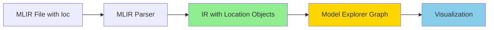

# MLIR Location Information (loc) Support in ai-edge-model-explorer-adapter

## Executive Summary

The `ai-edge-model-explorer-adapter` builtin adapter **can parse MLIR files with location (loc) information**. Location attributes are fully supported during parsing but are not currently extracted or displayed in the Model Explorer visualization.

## What are MLIR Location Attributes?

MLIR location attributes (`loc`) embed source location information into the intermediate representation for debugging and traceability. They appear in MLIR files like this:

```mlir
func.func @example(%arg0: i32) -> i32 loc("example.mlir":10:5) {
  %0 = arith.addi %arg0, %arg0 loc("example.mlir":12:3)
  return %0 loc("example.mlir":13:3)
}
```

### Location Types

- **File-based**: `loc("filename":line:col)`
- **Fused**: Combining multiple locations (e.g., for inlined code)
- **Callsite-based**: For function calls

## Parsing Support

### Core Capability

The `ai-edge-model-explorer-adapter` is built on MLIR's core infrastructure from LLVM, which provides full parsing support for `loc` attributes:

1. **Reading**: The adapter reads `.mlir` files containing `loc` attributes without errors
2. **Parsing**: Location info is parsed into the IR as `Location` objects in the MLIR API
3. **Preservation**: `loc` attributes are maintained in the parsed IR structure

### How Location Info is Handled



#### During Parsing Phase

- Parser scans for `loc(...)` attached to operations and attributes
- Creates `FileLineColLoc` or `FusedLoc` objects in the MLIR context
- Invalid `loc` syntax may log warnings but won't halt parsing

#### During Graph Conversion

- `loc` is treated as **optional metadata** for debugging/tracing
- Not used for computation or graph structure
- Accessible via MLIR API (`op->getLoc()`) but not extracted by current implementation

#### In Current Implementation

Looking at `scripts/parse_mlir_with_adapter.py`:

- Parser focuses on structural elements: nodes, edges, tensor shapes
- Location information is **parsed but not extracted** for visualization
- Graph output does not include `loc` metadata

## Use Cases for Location Information

1. **Debugging**: Trace operations back to source code
2. **Error Reporting**: Show precise locations of problematic operations
3. **Model Tracing**: Map optimized IR back to original model definitions
4. **Development**: Track transformations during compilation passes

## Current Limitations

While the adapter **can parse** location information:

- `loc` attributes are **not extracted** into the JSON graph output
- Model Explorer visualization **does not display** location metadata
- Location info may be **dropped during optimization passes** if not explicitly preserved

## Enhancement Opportunities

To utilize location information in visualizations, the parser could be enhanced:

### Option 1: Extract Location Metadata

Modify `scripts/parse_mlir_with_adapter.py` to extract location attributes from nodes:

```python
def extract_location_info(node: Dict[str, Any]) -> Optional[Dict[str, Any]]:
    """
    Extract location information from node metadata.
    """
    if 'attrs' in node:
        for attr in node['attrs']:
            if attr.get('key') == 'location':
                return {
                    'file': ...,
                    'line': ...,
                    'column': ...
                }
    return None
```

### Option 2: Add Location to Node Labels

Include location info in node labels for display:

```python
if location_info:
    enhanced_label += f"\nloc: {location_info['file']}:{location_info['line']}"
```

### Option 3: Preserve Location in Attributes

Add location as a node attribute in the graph JSON:

```python
node['attrs'].append({
    'key': 'source_location',
    'value': f"{file}:{line}:{col}"
})
```

## Technical Details

### Parser Infrastructure

- **Base**: MLIR core parser from LLVM project
- **Language**: C++ (wrapped via Python bindings)
- **Package**: `ai-edge-model-explorer-adapter>=0.1.13`
- **Location API**: `mlir::Location`, `mlir::FileLineColLoc`, `mlir::FusedLoc`

### Parsing Behavior

| Aspect | Support Level | Notes |
|--------|--------------|-------|
| Reading `.mlir` with `loc` | ✅ Full | No parsing errors |
| Storing `loc` in IR | ✅ Full | Available via API |
| Extracting to JSON | ❌ None | Not implemented |
| Visualization | ❌ None | Not displayed |
| Round-trip preservation | ⚠️ Partial | May be stripped in optimization |

## Testing Location Support

To verify location parsing works:

```bash
# Create test MLIR file with locations
cat > test_loc.mlir << 'EOF'
module {
  func.func @test() loc("test.mlir":1:1) {
    return loc("test.mlir":2:3)
  }
}
EOF

# Parse with adapter
python3 scripts/parse_mlir_with_adapter.py test_loc.mlir < test_loc.mlir
```

Expected: Parsing succeeds without errors (location info is accepted but not in output).

## Recommendations

1. **For Current Use**: Location attributes are safe to include in MLIR files - they won't cause parsing failures
2. **For Enhanced Debugging**: Consider implementing location extraction in the parser script
3. **For Optimization**: If file size is critical, `loc` attributes can be stripped without affecting functionality
4. **For Development**: Keep `loc` attributes during development for better debugging, strip for production

## References

- [MLIR Language Reference - Locations](https://mlir.llvm.org/docs/LangRef/#locations)
- [MLIR Location API Documentation](https://mlir.llvm.org/doxygen/classmlir_1_1Location.html)
- Current implementation: `scripts/parse_mlir_with_adapter.py`
- Graph conversion: `lib/mlir-to-graph.ts`

## Version Information

- **Adapter Version**: ai-edge-model-explorer-adapter>=0.1.13
- **Python Requirement**: 3.9+
- **MLIR Support**: All standard dialects (StableHLO, TensorFlow Lite, etc.)
- **Documentation Date**: 2024

---

**Status**: Location parsing is supported; extraction/visualization is not yet implemented.