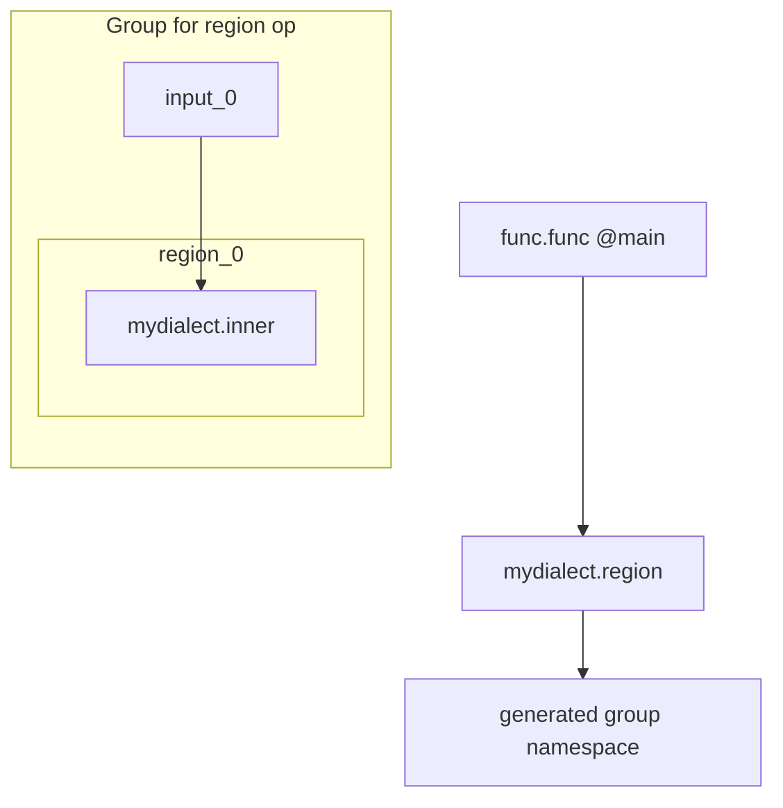

# Custom Dialect Sample & Verification

This repo’s MLIR pipeline accepts unregistered/custom dialects for visualization. A minimal sample is in `devdocs/parser/samples/custom_dialect.mlir`.

Sample
```mlir
module {
  func.func @main(%arg0: tensor<2xf32>) -> tensor<2xf32> {
    %0 = "mydialect.foo"(%arg0) { alpha = 0.5 : f64 } : (tensor<2xf32>) -> tensor<2xf32>
    return %0 : tensor<2xf32>
  }
}
```

Why it works
- Parsing enables `allowUnregisteredDialects(true)`, so unknown dialects parse.
- Unknown ops take a generic path: full op name as node label, attributes printed, edges from operands/results, generic region walk.

Verify conversion to Model Explorer JSON
1) Build the adapter (first time)
- `npm run build:adapter` (requires Bazel + Python 3.9–3.13)
2) Convert MLIR to JSON via Python
- `python - << 'PY'
from ai_edge_model_explorer_adapter import _pywrap_convert_wrapper as me
cfg = me.VisualizeConfig(); cfg.const_element_count_limit = 64
print(me.ConvertMlirToJson(cfg, 'devdocs/parser/samples/custom_dialect.mlir')[:400])
PY`

Expected outcome
- A JSON string with `graphs[0].nodes` including a node labeled `mydialect.foo` and an `Inputs` node feeding it.

Troubleshooting
- Bazel missing: install Bazel/Bazelisk; see `scripts/build_adapter_from_source.sh` for platform flags.
- Python version: ensure `python3 --version` is within 3.9–3.13.
- Large constants: adjust `const_element_count_limit` if tensors are truncated.

Nested region sample
- File: `devdocs/parser/samples/custom_dialect_nested_region.mlir`
- Demonstrates an unregistered op with a nested region and inner ops.

Quick verify
- `python - << 'PY'
from ai_edge_model_explorer_adapter import _pywrap_convert_wrapper as me
cfg = me.VisualizeConfig(); cfg.const_element_count_limit = 32
js = me.ConvertMlirToJson(cfg, 'devdocs/parser/samples/custom_dialect_nested_region.mlir')
print(js[:600])
PY`

Expected
- Graph shows a node for `mydialect.region` pinned to a group; inner ops appear under a generated namespace like `(mydialect.region_<id>)/(region_0)` due to generic region processing, with input helper nodes created for region operands.

Mermaid visualization

