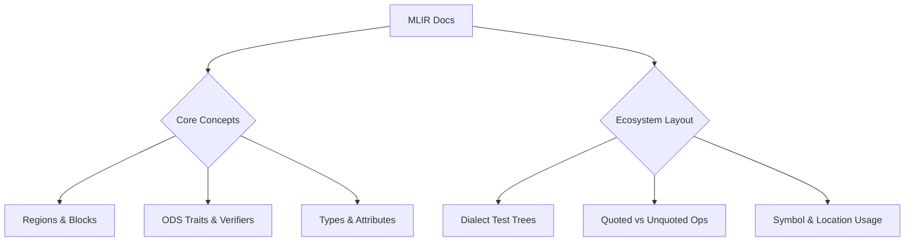
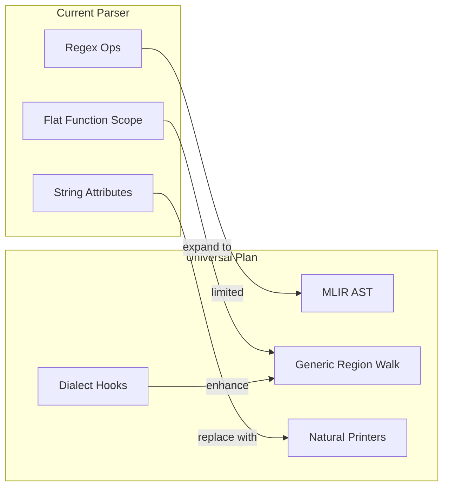

# MLIR Dialect Component Coverage Report

## Inputs Reviewed
- `third_party/mlir-docs/getting_started/DeveloperGuide.md` summarizes core IR building blocks (Regions, Blocks, Operations), verifier guidance, and trait-based invariants such as `SameOperandsAndResultType` for dialect ops (`third_party/mlir-docs/getting_started/DeveloperGuide.md:21`, `third_party/mlir-docs/getting_started/DeveloperGuide.md:82-139`).
- `third_party/mlir-docs/getting_started/TestingGuide.md` documents the test tree structure that mirrors dialect directories under `mlir/include/mlir/`, demonstrating the breadth of dialect-specific operations, types, and transformations that must be covered (`third_party/mlir-docs/getting_started/TestingGuide.md:57-118`).
- Current Python parser implementation in `scripts/parse_mlir.py` for direct MLIR-to-graph conversion (`scripts/parse_mlir.py:60-200`).
- Planned universal parser blueprint in `devdocs/parser/universal-mlir-parser-design.md` detailing the MLIR-based pipeline with generic and dialect-specific hooks (`devdocs/parser/universal-mlir-parser-design.md:5-178`).

## Key MLIR Dialect Components Highlighted in Docs
- **IR Units & Nesting**: Regions, Blocks, and Operations are primary IR constructs; recursion is tolerated specifically for nested regions and composite types (`third_party/mlir-docs/getting_started/DeveloperGuide.md:21-29`). Any parser must therefore traverse nested regions safely.
- **Verifier-Local Invariants**: Dialect ops define operand/result constraints via ODS traits (e.g., `SameOperandsAndResultType`) that are enforced locally during verification (`third_party/mlir-docs/getting_started/DeveloperGuide.md:82-95`). Parsers must preserve operand/result ordering and trait metadata even if they do not execute verification.
- **Type & Attribute Relationships**: The verifier section illustrates expectations about operand/result types (e.g., `tensor.dim` semantics) and the need to keep type expressions intact for downstream passes (`third_party/mlir-docs/getting_started/DeveloperGuide.md:106-135`).
- **Dialect-Specific Coverage**: The test layout mirrors dialect directories (`Dialect/Arith`, `Dialect/Polynomial`, etc.), evidencing that operations often reside in dialect-specific namespaces and may mix quoted (`"tf.Const"`) and unquoted (`arith.addi`) forms (`third_party/mlir-docs/getting_started/TestingGuide.md:57-118`). Parsers must therefore support both syntaxes, optional attributes, and dialect-prefixed operation names.

## Current Python Parser (scripts/parse_mlir.py) Coverage
- **Operation Extraction**: Supports quoted (`"dialect.op"`) and unquoted (`dialect.op`) assignments by regex (`scripts/parse_mlir.py:76-140`). Handles simple SSA result lists but only captures the final result type after splitting on `->`, so tuple and multi-result signatures are flattened to a single entry (`scripts/parse_mlir.py:149-152`).
- **Attributes**: Attribute parsing limits keys to `\w+` and splits on commas (`scripts/parse_mlir.py:141-148`), missing nested dictionaries, dialect-qualified keys (e.g., `tosa.compression`), arrays, or attributes containing braces/commas. Dialect resource handles, symbol refs, or location attributes are therefore dropped or truncated.
- **Function Boundaries**: Only the first `func.func` signature is read, producing positional Inputs nodes (`scripts/parse_mlir.py:165-190`), and returns are inferred from the first `func.return` (`scripts/parse_mlir.py:193-207`), leaving other regions (e.g., nested functions, loops, conditionals) unmodeled.
- **Regions & Blocks**: There is no traversal of nested regions/blocks; operations appearing inside control-flow regions, graph regions, or custom dialect regions are ignored entirely because regex matches do not descend past braces.
- **Type Fidelity**: Input types are captured verbatim from the function signature, but result types for operations other than the final `->` segment are discarded. Composite types (memref, tuple, function) remain as plain strings; no parsing occurs to extract dimension metadata beyond simple substring matches.

## Alignment With Universal Parser Plan
- **Full MLIR AST Access**: The universal plan parses via MLIR C++ APIs with `allowUnregisteredDialects(true)`, ensuring every dialect, including unknown/custom ones, is materialized in the IR tree (`devdocs/parser/universal-mlir-parser-design.md:8-28`).
- **Region Handling**: Known dialect regions (StableHLO, TOSA, SDY) receive dedicated visitors while generic regions fall back to a structured walk, preserving nested operations and namespaces (`devdocs/parser/universal-mlir-parser-design.md:30-42`, `devdocs/parser/universal-mlir-parser-design.md:173-178`).
- **Attribute & Type Preservation**: Attributes are printed using MLIR's native printers with truncation only for large tensors, keeping dialect-qualified attributes and symbol references intact (`devdocs/parser/universal-mlir-parser-design.md:34-38`, `devdocs/parser/universal-mlir-parser-design.md:187-194`).
- **Extensibility Hooks**: Dialect-specific naming, region labeling, and tensor-tag extraction hooks provide a path to encode verifier-style invariants or metadata without losing the generic fallback (`devdocs/parser/universal-mlir-parser-design.md:73-188`).

## Coverage Gaps & Recommendations
- **Nested Structure Support**: Current regex parser omits nested regions and blocks, which are essential IR units per the Developer Guide. Bridging to the universal parser (or enhancing the Python parser to walk braces and indentation) is required to render dialect control-flow correctly.
- **Attribute Fidelity**: Expand attribute parsing to handle dialect qualifiers, nested attributes, arrays, and string dictionaries. Alternatively, migrate to MLIR's attribute printer via the planned universal pipeline to preserve invariants referenced by ODS traits.
- **Multi-Result & Tuple Types**: Enhance result-type collection to keep full tuple signatures and per-result types, aligning with verifier expectations about operand/result relationships.
- **Dialect Discovery & Tests**: Reference the `mlir/test/Dialect/*` layout to assemble fixture suites that exercise dialect-specific syntax (e.g., ops without assignments, region-only ops). These should accompany any parser changes to confirm coverage breadth.
- **Location & Symbol Metadata**: Neither current parser nor docs summary ensures location attributes or symbol references survive. Incorporate extraction to enable diagnostics and graph navigation consistent with MLIR usage expectations.

## Next Steps
- Prioritize integrating the universal MLIR parser into the CLI migration so dialect coverage aligns with MLIR’s IR contracts.
- Backfill targeted regression tests using publicly available dialect samples (Arith, Func, ControlFlow) to prevent regressions when expanding attribute parsing.
- Document remaining edge cases (e.g., PDLL-generated patterns, dialect resources) as the universal parser comes online, using the extensibility hooks to preserve specialized metadata.
