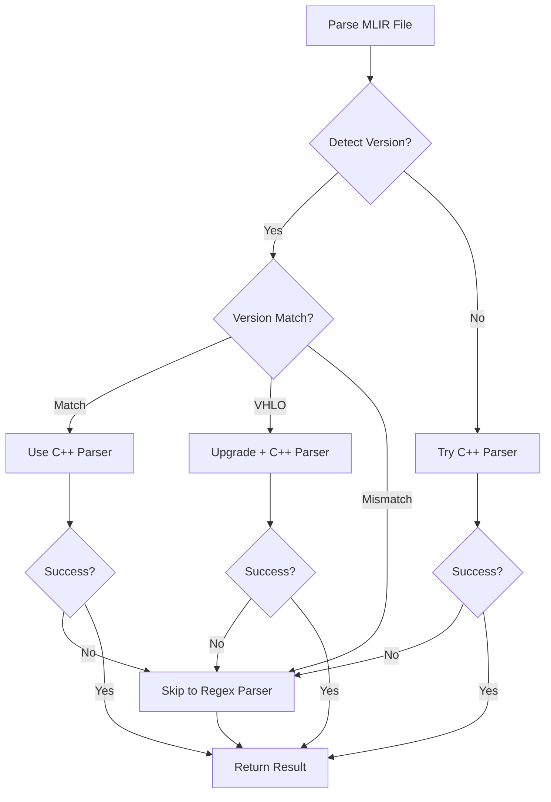

# MLIR Version Handling Plan

## Problem Statement

MLIR files generated with different MLIR versions may be incompatible with the current parser:

- **Dialect API Changes**: Operations change attributes/syntax (e.g., `tensor.expand_shape` output_shape requirement)
- **Version Skew**: Files from MLIR 15.x may fail with MLIR 21.x parser
- **Breaking Changes**: Major version bumps introduce incompatible changes

**Current Status:**

- ✅ MLIR 21.1.3 C++ parser built and working for compatible files
- ✅ Regex parser works as universal fallback (version-agnostic)
- ⚠️ Some files fail C++ parser due to version mismatch

## Refined Strategy Overview

1. **Version-Aware Parser Matrix**
   - Build and distribute `mlir_parser` binaries for each supported LLVM/MLIR release (e.g., `bin/mlir_parser-llvm16`, `…-llvm17`, `…-main`).
   - Record metadata (commit SHA, build flags) in `src/mlir/VERSIONS.json` and expose via `mlir_parser --version`.
   - Default to the preferred binary, but allow per-project pinning and user overrides.

2. **Lightweight Version Detection**
   - Inspect file metadata (`// MLIR Version:`, `#dlti.version<…>`, etc.) before parsing.
   - Fall back to heuristics (presence of `vhlo.`, `tensor.expand_shape` syntax, etc.) when explicit metadata is absent.
   - Cache detected hints per file in `~/.config/devdoc/mlir-versions.json` to avoid repeated scans.

3. **Routing & Overrides**
   - Wrapper chooses the best binary based on detection, with a manual escape hatch (`--mlir-version=llvm17` or `DEVDOC_MLIR_VERSION=llvm17`).
   - Log attempted binaries and reasons for fallback to aid debugging.

4. **Upgrade Hooks (Optional)**
   - When older dialects (e.g., VHLO) are detected, run targeted `mlir-opt` passes (`--vhlo-to-stablehlo`, `--upgrade-*`) before parsing.
   - Cache upgraded IR in `.devdoc/cache/mlir-upgrades/` keyed by SHA + target version.

5. **Diagnostics & Documentation**
   - Emit structured diagnostics when version mismatch occurs (detected version, attempted binaries, suggested fixes).
   - Document the workflow in `src/mlir/README.md` and surface guidance in CLI output.

6. **Automation & Testing**
   - CI matrix builds binaries for each supported MLIR version (Docker images per LLVM release).
   - Fixtures under `tests/fixtures/mlir/<version>/` tagged with minimum version; integration tests run per binary.
   - Collect metrics (success/failure per binary, regex fallback counts) to inform support decisions.

## Implementation Tiers

### Tier 1 — Detection & Routing (Immediate)

- Add `detect_mlir_version()` that combines explicit metadata and heuristics:

```python
def detect_mlir_version(mlir_content: str) -> Optional[str]:
    comment = re.search(r'//\s*MLIR\s+[Vv]ersion:\s*(\d+\.\d+(?:\.\d+)?)', mlir_content)
    if comment:
        return comment.group(1)

    dialect_version = re.search(r'#dlti\.version<(\d+\.\d+(?:\.\d+)?)>', mlir_content)
    if dialect_version:
        return dialect_version.group(1)

    if 'vhlo.' in mlir_content:
        return 'vhlo'

    return None
```

- Route to a binary based on detected version, cached project preference, or user override:

```python
def select_parser_binary(requested: Optional[str], detected: Optional[str]) -> str:
    if requested:
        return requested
    if detected == 'vhlo':
        return 'llvm18'  # first StableHLO-friendly build
    if detected in VERSION_TO_BINARY:
        return VERSION_TO_BINARY[detected]
    return DEFAULT_BINARY
```

- Persist last successful binary per repository (`.devdoc/cache/mlir-parser.json`) to accelerate future runs.

### Tier 2 — Controlled Upgrade Passes (Short-Term)

- Detect when upgrade passes are needed (e.g., VHLO, legacy dialect syntax) and run `mlir-opt` with targeted flags.
- Provide CLI flag `--skip-upgrade` to bypass when the tool is unavailable.
- Log upgrade actions and retain artifacts for audit/debugging.

### Tier 3 — Multi-Binary Distribution (Medium-Term)

- Build and ship parser binaries in CI for each supported LLVM release; install under `third_party/prebuilt/mlir-parser/<version>/`.
- Extend wrapper lookup order:
  1. User override (`--mlir-version`)
  2. Project pin (`.devdoc/mlir-version`)
  3. Detected hint
  4. Default binary
- Ensure binaries self-identify their version (`mlir_parser --version`) for diagnostics.

### Tier 4 — Legacy Fallback (Always-On)

- If all native attempts fail (missing dialect libs, fatal parse errors), fall back to `parse_mlir_regex.py` with a prominent warning.
- Include failure context in warning output (binary attempted, error message, suggested upgrade).

## Implementation Phases

### Phase 1: Immediate (Current State + Smart Fallback) ✅

- ✅ C++ parser for MLIR 21.1.3
- ✅ Regex parser as universal fallback
- ✅ Automatic fallback when C++ parser fails
- **Status**: COMPLETE - Working now

### Phase 2: Detection & Routing Enhancements (2-3 days)

- [ ] Implement combined metadata/heuristic detection helpers
- [ ] Persist last-successful binary per project (`.devdoc/cache/mlir-parser.json`)
- [ ] Add CLI/env overrides and improved logging
- [ ] Surface parser selection summary in CLI output
- **Benefit**: Smarter routing, better diagnostics, less wasted work

### Phase 3: Targeted Upgrade Passes (≈1 week)

- [ ] Integrate optional `mlir-opt` pipeline (VHLO→StableHLO, dialect upgrades)
- [ ] Cache upgraded IR artifacts and expose `--skip-upgrade`
- [ ] Extend fixture suite with legacy IR upgrade cases
- [ ] Document upgrade workflow and failure handling
- **Benefit**: Unlocks older IR with minimal runtime cost

### Phase 4: Multi-Binary Distribution (Optional, 2-4 weeks)

- [ ] Build parser binaries per LLVM release in CI
- [ ] Publish artifacts under `third_party/prebuilt/mlir-parser/<version>/`
- [ ] Expand wrapper lookup order and version reporting
- [ ] Document installation/pinning guidance for teams
- **Benefit**: Production-grade multi-version support for large repos

## Recommended Approach

**For Current Project (devdoc):**

```
Priority 1: Phase 1 (COMPLETE ✅)
  - Current hybrid approach is excellent for development
  - Regex fallback handles all version mismatches
  - No additional complexity

Priority 2: Phase 2 (RECOMMENDED NEXT)
  - Low effort, high value
  - Smarter routing, clearer diagnostics
  - Enables per-project pinning

Priority 3: Phase 3 (IF NEEDED)
  - Great when legacy IR appears frequently
  - Requires `mlir-opt` availability

Priority 4: Phase 4 (PRODUCTION / LARGE TEAMS)
  - Pursue for organizations with multiple MLIR toolchains
  - Adds CI/build complexity
```

## Version Detection Heuristics

**When we CAN'T detect version explicitly:**

```python
def guess_mlir_version(mlir_content: str) -> str:
    """
    Use heuristics to guess MLIR version from syntax.
    """
    indicators = {
        # Version-specific dialect presences
        'vhlo.': '15-18',  # VHLO was used in earlier versions
        'stablehlo.': '18+',  # StableHLO introduced in 18.x

        # Syntax changes
        '"(%\\d+)"': '21+',  # Quoted SSA values (newer)
        '(%\\d+)\\s*=': '15-20',  # Unquoted SSA values (older)

        # Attribute changes
        'output_shape': '15-20',  # tensor.expand_shape old syntax
        'reassociation': '21+',  # tensor.expand_shape new syntax
    }

    scores = {}
    for pattern, version in indicators.items():
        if re.search(pattern, mlir_content):
            scores[version] = scores.get(version, 0) + 1

    # Return most likely version
    return max(scores.items(), key=lambda x: x[1])[0] if scores else 'unknown'
```

## Testing Strategy

**Version Compatibility Test Suite:**

```python
# tests/mlir_version_compatibility_test.py

test_cases = [
    {
        'file': 'fixtures/mlir_v15/legacy_syntax.mlir',
        'expected_version': '15.0',
        'parser_choice': 'regex',  # C++ parser 21.x won't work
    },
    {
        'file': 'fixtures/mlir_v21/modern_syntax.mlir',
        'expected_version': '21.1.3',
        'parser_choice': 'cpp',  # Perfect match
    },
    {
        'file': 'fixtures/mlir_vhlo/needs_upgrade.mlir',
        'expected_version': 'auto-upgrade',
        'parser_choice': 'cpp_with_upgrade',
    }
]
```

## Fallback Decision Tree



## Metrics to Track

```python
parser_metrics = {
    'cpp_success': 0,
    'cpp_failure': 0,
    'cpp_version_match': 0,
    'cpp_version_mismatch': 0,
    'regex_fallback': 0,
    'upgrade_attempted': 0,
    'upgrade_success': 0,
    'version_detected': 0,
    'version_unknown': 0
}
```

## Conclusion

**Recommended Strategy for devdoc:**

1. ✅ **Maintain the hybrid parser setup** (modern C++ parser + regex fallback) as the baseline.
2. 📋 **Implement Phase 2 enhancements next** (detection, routing, overrides, metrics).
3. 🔄 **Adopt Phase 3 upgrade passes** when legacy VHLO/older IR shows up regularly.
4. 🧰 **Plan for Phase 4 multi-binary distribution** only if the team routinely juggles multiple LLVM toolchains.

**Why this roadmap works:**

- Keeps day-to-day parsing fast and accurate while offering graceful degradation.
- Provides users with actionable diagnostics and configuration options.
- Lets us progressively add capability (upgrade passes, multi-binaries) without over-committing early.
- Aligns CI/testing investments with actual usage patterns.
