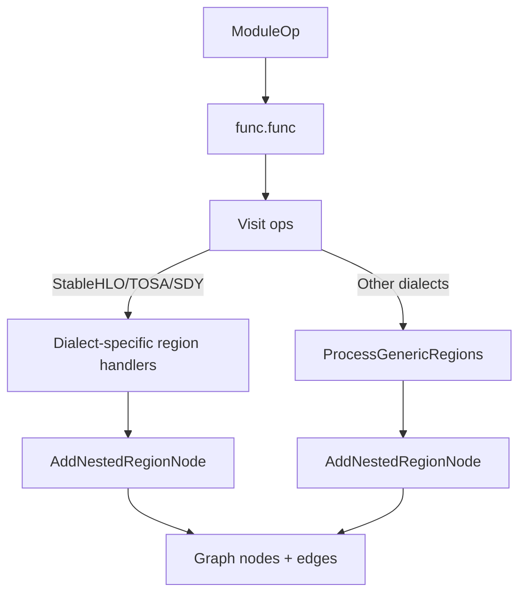
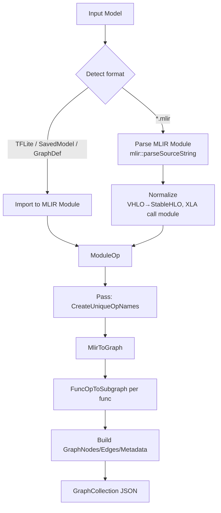

# MLIR Parsing and Graph Conversion (Model Explorer)

Overview
- Location: `third_party/model-explorer/src/builtin-adapter/*` (C++).
- Entry points: `ConvertMlirToJson(...)` and `ModuleOpToJson(...)` in `model_json_graph_convert.cc`.
- Output: a JSON GraphCollection rendered by Model Explorer UI.
- Note: This repository supports textual `*.mlir` only (no `*.mlirbc`).

Parsing Pipeline
- Dialects: registers TF, TFL, StableHLO/chlo/mhlo/vhlo, func, arith, shape, scf, sdy, tosa (`ConvertMlirToJson`).
- Reads `*.mlir` to string and parses with `mlir::parseSourceString<ModuleOp>`; `allowUnregisteredDialects(true)` to tolerate unknown ops.
- Normalization: `DeserializeVhloToStablehlo(...)`; `HasXlaCallModule` → `ConvertToStablehloModule(...)` when present.
- Pre-translate pass: `CreateUniqueOpNamesPass()` ensures deterministic ids (`ModuleOpToJson`).

Graph Construction
- Core: `MlirToGraph(config, module)` and `FuncOpToSubgraph(config, func)` in `translate_helpers.cc`.
- For each `func.func`: add input nodes from block args (name via `tf.entry_function`), then visit ops and build nodes.
- Node builder: `GraphNodeBuilder` sets `id/label/name`, attributes (filtered by `SkipAttr`), edges, outputs metadata.
- Attributes: prints MLIR attributes with limit `const_element_count_limit`; special-cases `value` → `__value` and TFL `custom_options`.
- Edges: from defining op results, or from graph/block arguments (id via `GetArgNodeId(...)`).
- Namespaces: TF uses `FusedLoc` parsing; TFL/StableHLO/JAX/SDY use heuristics (`AddJaxNodeNameAndAttribute`, `GenerateTfliteNodeName`).
- Regions/Subgraphs: processes nested regions per dialect (StableHLO, TOSA, SDY) and falls back to generic region walk; attaches `subgraph_ids` on symbol refs.

Supported Inputs
- `*.mlir` textual MLIR only. TFLite/SavedModel/GraphDef also route through MLIR converters when `disable_mlir=false` (`models_to_json_lib.cc`).
  - Binary MLIR bytecode (`*.mlirbc`) is not supported in this repository.

Notes & Error Handling
- Verifies module; collects diagnostics while parsing; returns `InvalidArgument` on parse failure with message text.
- Debug info detection via `NameLoc` controls some behaviors; skips `NoOp` functions.
- Large constants: truncation via `const_element_count_limit`.

Generic Regions Diagram

Reference
- Parsing context uses `allowUnregisteredDialects(true)` in `third_party/model-explorer/src/builtin-adapter/model_json_graph_convert.cc` to enable custom/unregistered dialect parsing.

Mermaid Overview

