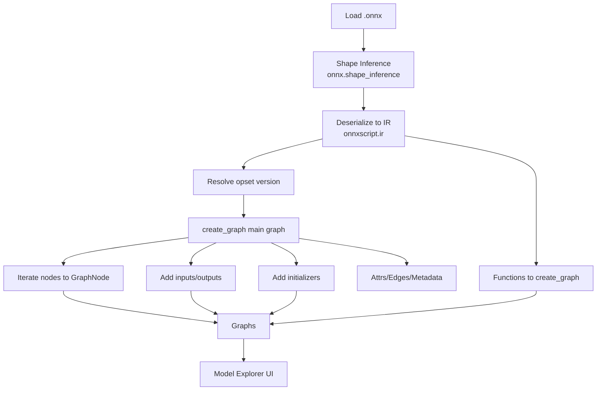

# ONNX Parsing and Graph Conversion (Model Explorer ONNX)

Overview
- Location: `third_party/model-explorer-onnx/src/model_explorer_onnx/*` (Python).
- Entry point: `ONNXAdapter.convert(model_path, settings)` in `main.py`.
- Output: `{ "graphs": Graph[] }` consumed by Model Explorer UI.

Parsing Pipeline
- Load: `onnx.load(model_path, load_external_data=False)`; try `onnx.shape_inference.infer_shapes(..., data_prop=True)`.
- Convert to IR: `onnxscript.ir.serde.deserialize_model(onnx_model)` → `ir.Model` with `graph`, `functions`.
- Determine opset: from `model.opset_imports` with fallback to 18.

Graph Construction
- Create graph for main `ir.Graph` via `create_graph(...)`; also iterate `ir.Function`s and node attributes of type `GRAPH` for subgraphs.
- Nodes: `create_node(...)` builds `GraphNode` with `id=name`, label from `create_op_label(domain, op_type)`, namespace from embedded `metadata_props['namespace']` or path prefix.
- Attributes: iterates `onnx_node.attributes`; tensors serialized to `__value` JSON when size allows; special-cases `Constant` and `Cast(to)`; attaches `[metadata]` props and `doc_string`.
- Edges: `add_incoming_edges(...)` links from producer or graph input (value node `[value] <name>`); outputs metadata include `__tensor_tag`, shape/type, param names (from `onnx.defs.get_schema`).
- Initializers: `add_initializers(...)` emits nodes; co-locates namespace near user nodes via `get_constant_namespace(...)`; attaches value JSON and marks unused.
- Graph I/O: `add_graph_io(...)` creates `Input`/`Output` nodes with metadata and edges.

Settings & Limits
- `Settings(const_element_count_limit=1024)` truncates large tensor JSON; external tensors are not embedded.

Notes & Error Handling
- Names: missing node names default to `<node_i>`; missing main graph name defaults to `<main>` with a warning.
- Shape inference failure logs a warning and proceeds.

Mermaid Overview

