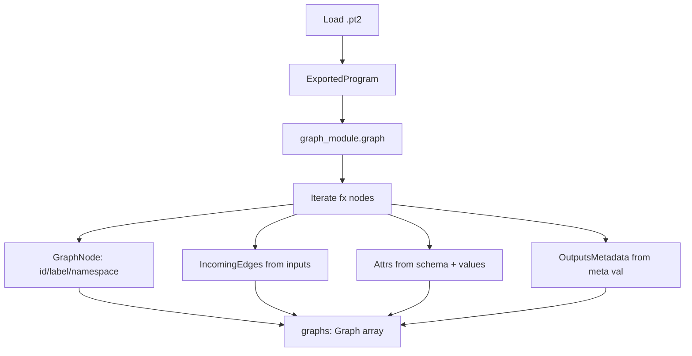

# PyTorch ExportedProgram Parsing (Model Explorer)

Overview
- Location: `third_party/model-explorer/src/server/package/src/model_explorer/builtin_pytorch_exportedprogram_adapter.py`
- Impl: `pytorch_exported_program_adater_impl.py` (walks `torch.fx.Graph` from `ExportedProgram.graph_module`).
- Input: `.pt2` files saved via `torch.export.save(ep, path)`.
- Output: `{ "graphs": Graph[] }` consumed by Model Explorer UI.

Pipeline
- Load: `torch.export.load(model_path)` → `ExportedProgram` with `graph_module` and `graph_signature`.
- Example inputs: uses `ExportedProgram.example_inputs` to enrich placeholders with values (if present).
- Flattening: derives `graph_module` flat inputs from call spec and state dict (params, buffers, lifted constants) for older/newer torch versions.
- Walk FX graph: iterate `gm.graph.nodes` and build `GraphNode`s.

Graph Construction
- Node id: `fx_node.name` (unique in FX graph).
- Label: operator label from `overloadpacket` or `str(target)`; special-case `getitem`.
- Namespace: from `nn_module_stack` in `fx_node.meta` (module path + leaf name), placeholders go under `inputs`.
- Incoming edges: for each operand (`all_input_nodes`), add `IncomingEdge` on the target; compute `sourceNodeOutputId` by the index of the user in producer.users; `targetNodeInputId` is operand index.
- Attributes: if target has `_schema`, dump positional/keyword args; for placeholders, add `target` and `__value` using example inputs (JSON, truncated by settings).
- Outputs metadata: from `fx_node.meta['val']`:
  - Tensor/list/tuple of tensors → `tensor_shape` = `dtype + shape` (JSON-encoded dims); id = result index.
  - Scalar bool → `bool[1]`.

Settings
- `const_element_count_limit` controls JSON embedding of tensors for placeholder `__value`.

Mermaid


## Examples

### Example 1: Simple Linear Layer

**PyTorch Model:**
```python
import torch
import torch.nn as nn

class SimpleModel(nn.Module):
    def __init__(self):
        super().__init__()
        self.linear = nn.Linear(10, 5)

    def forward(self, x):
        return self.linear(x)

model = SimpleModel()
ep = torch.export.export(model, (torch.randn(1, 10),))
torch.export.save(ep, "simple_model.pt2")
```

**FX Graph Nodes → GraphNodes:**
```
FX Node: placeholder(name='arg0_1', target='arg0_1')
  → GraphNode:
     - id: "arg0_1"
     - label: "placeholder"
     - namespace: "inputs"
     - attrs: [{"key": "target", "value": "arg0_1"}, {"key": "__value", "value": "[1, 10] tensor"}]
     - outputsMetadata: [{"id": "0", "attrs": [{"key": "tensor_shape", "value": "Float[1, 10]"}]}]

FX Node: get_attr(name='linear_weight', target='linear.weight')
  → GraphNode:
     - id: "linear_weight"
     - label: "get_attr"
     - namespace: "linear"
     - attrs: [{"key": "target", "value": "linear.weight"}, {"key": "__value", "value": "[5, 10] tensor"}]
     - outputsMetadata: [{"id": "0", "attrs": [{"key": "tensor_shape", "value": "Float[5, 10]"}]}]

FX Node: call_function(name='linear_1', target=torch.nn.functional.linear, args=(arg0_1, linear_weight, linear_bias))
  → GraphNode:
     - id: "linear_1"
     - label: "linear"
     - namespace: "linear" (from nn_module_stack metadata)
     - incomingEdges: [
         {"sourceNodeId": "arg0_1", "sourceNodeOutputId": "0", "targetNodeInputId": "0"},
         {"sourceNodeId": "linear_weight", "sourceNodeOutputId": "0", "targetNodeInputId": "1"},
         {"sourceNodeId": "linear_bias", "sourceNodeOutputId": "0", "targetNodeInputId": "2"}
       ]
     - attrs: [{"key": "input", "value": "Tensor"}, {"key": "weight", "value": "Tensor"}, {"key": "bias", "value": "Optional[Tensor]"}]
     - outputsMetadata: [{"id": "0", "attrs": [{"key": "tensor_shape", "value": "Float[1, 5]"}]}]

FX Node: output(name='output', args=([linear_1],))
  → GraphNode:
     - id: "output"
     - label: "output"
     - incomingEdges: [{"sourceNodeId": "linear_1", "sourceNodeOutputId": "0", "targetNodeInputId": "0"}]
```

### Example 2: Namespace Hierarchy

**PyTorch Model:**
```python
class SubModule(nn.Module):
    def __init__(self):
        super().__init__()
        self.conv = nn.Conv2d(3, 16, 3)

    def forward(self, x):
        return self.conv(x)

class MainModel(nn.Module):
    def __init__(self):
        super().__init__()
        self.sub1 = SubModule()
        self.sub2 = SubModule()

    def forward(self, x):
        x = self.sub1(x)
        x = self.sub2(x)
        return x
```

**Namespace Mapping:**
```
FX Node with nn_module_stack: {'sub1': ('SubModule', 'sub1'), 'sub1.conv': ('Conv2d', 'conv')}
  → namespace: "sub1/conv"

FX Node with nn_module_stack: {'sub2': ('SubModule', 'sub2'), 'sub2.conv': ('Conv2d', 'conv')}
  → namespace: "sub2/conv"
```

This creates a hierarchical layer structure in Model Explorer UI:
```
- inputs/
- sub1/
  - conv/ (Conv2d operations)
- sub2/
  - conv/ (Conv2d operations)
- outputs/
```

### Example 3: Edge Connection with Multiple Users

**Scenario:** One node's output feeds into multiple downstream nodes

```python
def forward(self, x):
    shared = self.conv(x)
    y1 = self.branch1(shared)
    y2 = self.branch2(shared)
    return y1 + y2
```

**Edge Calculation:**
```
FX Node: conv_1 (has 2 users: branch1_1, branch2_1)
FX Node: branch1_1 (user #0 of conv_1)
  → IncomingEdge: sourceNodeId="conv_1", sourceNodeOutputId="0" (first user), targetNodeInputId="0"

FX Node: branch2_1 (user #1 of conv_1)
  → IncomingEdge: sourceNodeId="conv_1", sourceNodeOutputId="1" (second user), targetNodeInputId="0"
```

Note: `sourceNodeOutputId` is the index in the producer's user list, allowing the UI to visually distinguish multiple output connections.

### Example 4: Tensor Metadata

**Various Tensor Types:**
```python
# Single tensor output
FX Node: conv(x) → meta['val'] = Tensor(shape=[1, 16, 32, 32], dtype=float32)
  → outputsMetadata: [{"id": "0", "attrs": [{"key": "tensor_shape", "value": "Float[1, 16, 32, 32]"}]}]

# Tuple of tensors (e.g., split)
FX Node: split(x, 2) → meta['val'] = (Tensor([1, 8, 32, 32]), Tensor([1, 8, 32, 32]))
  → outputsMetadata: [
      {"id": "0", "attrs": [{"key": "tensor_shape", "value": "Float[1, 8, 32, 32]"}]},
      {"id": "1", "attrs": [{"key": "tensor_shape", "value": "Float[1, 8, 32, 32]"}]}
    ]

# Scalar bool
FX Node: condition → meta['val'] = True
  → outputsMetadata: [{"id": "0", "attrs": [{"key": "tensor_shape", "value": "bool[1]"}]}]
```

### Example 5: Attribute Dumping from Schema

**FX Node with `_schema`:**
```python
FX Node: call_function(target=torch.ops.aten.conv2d.default,
                        args=(input, weight),
                        kwargs={'stride': [1, 1], 'padding': [1, 1], 'dilation': [1, 1], 'groups': 1})
```

**Resulting Attributes:**
```json
[
  {"key": "input", "value": "Tensor"},
  {"key": "weight", "value": "Tensor"},
  {"key": "stride", "value": "[1, 1]"},
  {"key": "padding", "value": "[1, 1]"},
  {"key": "dilation", "value": "[1, 1]"},
  {"key": "groups", "value": "1"}
]
```

### Example 6: Constant Value Embedding

**With `example_inputs` present:**
```python
ep = torch.export.export(model, (torch.tensor([[1.0, 2.0, 3.0]]),))
# example_inputs available → constants embedded
```

**Placeholder Node:**
```json
{
  "id": "arg0_1",
  "label": "placeholder",
  "attrs": [
    {"key": "target", "value": "arg0_1"},
    {"key": "__value", "value": "[[1.0, 2.0, 3.0]]"}
  ]
}
```

**Without `example_inputs`:**
```json
{
  "id": "arg0_1",
  "label": "placeholder",
  "attrs": [
    {"key": "target", "value": "arg0_1"}
  ]
}
```
Warning logged: "No example inputs available for constant embedding"

## Notes
- No dialect registry; relies on FX IR metadata for namespaces and types.
- If `example_inputs` is absent, constants won't render; a warning is logged.
- This path is independent from MLIR/ONNX; it directly emits Graphs from FX IR.
