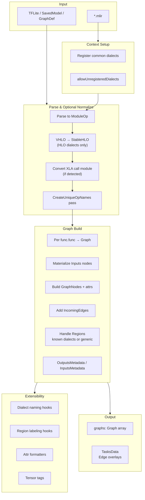

# Universal MLIR Parser & Graphizer Design

## Overview

### Goal
- Robustly parse and visualize any MLIR file (text), including unknown/custom dialects, and produce consistent Model Explorer graphs.

### Key Principles
- **Tolerant parsing**: enable `allowUnregisteredDialects(true)` to accept unknown dialects without execution.
- **Deterministic output**: ensure stable node IDs/names via a uniquing pass.
- **Generic-first graphization**: custom dialects work out-of-the-box with zero configuration. When dialect logic is unknown, fall back to a consistent generic path for nodes, edges, attributes, and regions.
- **Conditional normalization**: normalization (e.g., VHLO→StableHLO) only applies to specific dialect families (HLO). Custom dialects skip normalization entirely.
- **Extensible hooks**: pluggable dialect handlers can augment naming, region labeling, and metadata extraction without breaking the generic path.

## Architecture

### Pipeline Overview
- Input detection: `*.mlir` handled directly; TFLite/SavedModel/GraphDef first import to MLIR, then proceed.
- Context setup:
  - Register common dialects (TF/TFL/StableHLO/CHLO/MHLO/VHLO/func/arith/shape/scf/TOSA/SDY) for better printing.
  - Set `allowUnregisteredDialects(true)` to tolerate unknown ops.
- Parse & optional normalization:
  - Parse textual MLIR into `ModuleOp`.
  - **Conditional normalization** (HLO dialects only):
    - If VHLO detected: normalize VHLO→StableHLO
    - If XLA call module detected: optional XLA call inlining
    - Custom/unknown dialects: skip normalization entirely
  - Run `CreateUniqueOpNamesPass()` to stabilize op IDs.
  - Verify module.
- Graph build (generic-first):
  - For each `func.func`, create a subgraph.
  - Inputs: materialize block arguments as `Inputs` nodes with shape/type metadata.
  - Nodes: for each op, build a `GraphNode`:
    - Label: default to full op name with dialect prefix (e.g., `mydialect.foo`).
    - Name: derive from location (NameLoc/FusedLoc) when present; else empty.
    - Attributes: print MLIR attributes with limit (truncate large constants).
    - Edges: from SSA operands (producer result index) or from block args (index 0).
  - Regions: process known dialect regions (StableHLO/TOSA/SDY). Otherwise walk via `ProcessGenericRegions`:
    - Create a generated namespace `(opLabel_id)`.
    - Add helper `input_i` nodes for region operands.
    - Place inner ops under `(opLabel_id)/(region_i)` namespaces.
  - Outputs: attach per-result metadata (index, `tensor_shape`, optional `tensor_name`).

### Architecture Diagram

## Normalization (HLO-Specific)

**Important**: Normalization is **conditional** and **only applies to HLO dialect family** (VHLO, StableHLO, MHLO, XLA). Custom dialects and other non-HLO dialects skip this step entirely and proceed directly to graphization.

### When Normalization Applies
- **HLO dialects**: VHLO→StableHLO conversion, XLA unwrapping
- **Custom/unknown dialects**: No normalization needed; parsed as-is with `allowUnregisteredDialects(true)`
- **Other standard dialects** (func, arith, scf, etc.): No normalization; used directly

### Rationale for HLO Normalization
- **Canonical dialect**: Converting versioned HLO (VHLO) to StableHLO removes version skew so ops/types print uniformly and downstream logic stays simple.
- **Region handlers**: StableHLO control-flow/dataflow ops (While/If/Reduce/Map/etc.) have dedicated region processors; normalization ensures those hooks apply instead of falling back to generic handling.
- **Unwrapping XLA wrappers**: Lowering constructs like `xla.call_module` exposes inner computations so nested regions are discoverable and rendered as subgraphs rather than opaque nodes.
- **UX and determinism**: Normalization yields richer graphs (named branches/bodies, edge metadata) and more consistent output across toolchains.

### Custom Dialect Handling
Custom dialects bypass normalization and proceed directly through the generic graphization path:
1. Operations are parsed with their full dialect prefix (e.g., `mydialect.custom_op`)
2. Attributes are printed as-is with configurable truncation
3. Regions are handled via `ProcessGenericRegions` (no dialect-specific logic required)
4. All features (graph navigation, search, overlays) work without any normalization

### Code References
- `DeserializeVhloToStablehlo(...)` and `HasXlaCallModule(...)` → `ConvertToStablehloModule(...)` in builtin adapter path.
- StableHLO region processing in `translate_helpers.cc` (`ProcessStablehloRegions`, `MaybeAddNestedRegion`).

## Supported Dialects

### Dialects with Specific Handlers

The following dialects have dedicated support beyond the generic graphization path:

#### HLO Dialect Family
- **VHLO (Versioned HLO)**
  - Normalization: Automatically converted to StableHLO
  - Purpose: Version-agnostic graph representation
  - Handler: `DeserializeVhloToStablehlo(...)`

- **StableHLO**
  - Region processing: Dedicated handlers for control-flow/dataflow ops (While, If, Reduce, Map, etc.)
  - Named regions: `then`/`else`/`body` labels for better UX
  - Handler: `ProcessStablehloRegions(...)`, `MaybeAddNestedRegion(...)`

- **MHLO, CHLO**
  - Registration: Registered for better pretty-printing
  - Region processing: Similar to StableHLO

- **XLA**
  - Call unwrapping: `xla.call_module` constructs are inlined to expose nested computations
  - Handler: `HasXlaCallModule(...)` → `ConvertToStablehloModule(...)`

#### TensorFlow Dialect Family
- **TF (TensorFlow)**
  - Subgraph references: Symbol-ref attribute handling for call ops
  - Tensor tags: Input/output names from op definitions

- **TFL (TensorFlow Lite)**
  - Tensor tags: Per-operation input/output names (`__tensor_tag`)
  - Op definitions: Rich metadata from TFLite op defs

#### Other Specialized Dialects
- **TOSA (Tensor Operator Set Architecture)**
  - Region processing: Dedicated region handlers
  - Handler: Similar to StableHLO region processing

- **SDY (Shardy - Sharding Dialect)**
  - Edge overlays: Sharding propagation edges extracted into `tasksData`
  - Visualization: Special edge overlay rendering for sharding information

#### Standard MLIR Dialects
- **func** (Function dialect)
  - Function processing: `func.func` operations define graph boundaries
  - Subgraph creation: Each function becomes a separate graph

- **arith, shape, scf** (Arithmetic, Shape, Structured Control Flow)
  - Registration: Registered for better pretty-printing
  - Generic processing: Use generic path with registered type/attribute printers

### All Other Dialects

**Custom and unknown dialects** automatically work through the generic graphization path with:
- Full dialect prefix in labels (e.g., `mydialect.custom_op`)
- Generic region handling via `ProcessGenericRegions(...)`
- Attribute printing with configurable truncation
- All visualization features (navigation, search, overlays)
- **No code changes or registration required**

## Extensibility

### Hooks
- Dialect registrar (optional): register additional dialects to improve pretty-printing.
- Naming strategy plug-ins:
  - Per-dialect `GetNodeName(op)` implementations.
  - Per-dialect region naming (`then/else/body`, etc.).
- Attribute formatters: per-attr pretty-printers (e.g., compact arrays) with size limits.
- Tensor tags: per-dialect arg/result names (e.g., TFL op defs) when available.

## Error Handling & Limits

- Collect diagnostics during parse; return structured errors (with text) if parse fails.
- Large constants: `const_element_count_limit` truncation with opt-out.
- Unknown ops/attrs always render with generic fallbacks; no execution is performed.

## Implementation References

### Codebase References
- Tolerant parsing: `allowUnregisteredDialects(true)` in `third_party/model-explorer/src/builtin-adapter/model_json_graph_convert.cc`.
- Generic region walk: `ProcessGenericRegions(...)` and `MaybeAddNestedRegion(...)` in `translate_helpers.cc`.
- Fallback labeling/naming: `AddNodeInfo(...)` uses generic path for unknown dialects.

## Rollout Plan

- **Generic path as default**: Custom dialects work immediately without any code changes or registration.
- **Targeted handlers for known dialects**: Add dialect-specific handlers (like StableHLO region processing) only where it materially improves UX (naming, subgraph labels).
- **No normalization required**: Custom dialect authors do not need to implement normalization passes. HLO normalization is an internal optimization for specific Google dialects.
- **Testing**: Provide samples/tests for custom dialects (see `devdocs/parser/samples/`) to validate generic path coverage.

## Data Model

### Output Data Model (ModelExplorerGraphs)
- Top-level structure returned by extensions: `ModelExplorerGraphs = { graphs: Graph[] }`.
- Built-in MLIR path may also emit a GraphCollection JSON envelope; the UI consumes either form.

### Graph
- `id` (string): Graph name. For MLIR, use function symbol (`func.func @name`) or synthesized names for regions/subgraphs.
- `nodes` (GraphNode[]): All op nodes plus any synthesized helper nodes (e.g., Inputs/region inputs).
- `groupNodeAttributes` (optional): Map of `namespace -> { key: value }` for showing attributes on layer selections. Use `""` for graph-level attributes.
- `tasksData` (optional): Edge overlays and other task payloads; e.g., Shardy propagation edges added as `EdgeOverlaysData`.
- `layoutConfigs` (optional): Node/edge spacing hints.

### GraphNode
- `id` (string): Unique within the graph. Deterministic per parse ordering; created via a counter after `CreateUniqueOpNamesPass()` for stability.
- `label` (string): Op name. Include dialect prefix for unknown/custom ops (e.g., `mydialect.foo`).
- `namespace` (string, optional): Layer path like `parent/child`. Derived from MLIR debug locations and/or generated `(opLabel_id)` for nested regions.
- `subgraphIds` (string[], optional): Links to other graphs (e.g., symbol-ref’d functions, TF call subgraphs).
- `attrs` (KeyValue[], optional): Printed MLIR attributes; special handling for `value` and selected binary blobs. Large constants truncated by `const_element_count_limit`.
- `incomingEdges` (IncomingEdge[]): One entry per operand on the target node.
- `outputsMetadata` (MetadataItem[], optional): Per result index metadata; include:
  - `__tensor_tag` (optional): Tensor name/label.
  - `tensor_shape`: Element type and shape string (e.g., `tensor<2x3xf32>`).
  - Additional dialect-specific entries as available.
- `inputsMetadata` (MetadataItem[], optional): For name tags (`__tensor_tag`) or quantization (when applicable). Do not duplicate info from outputs unless necessary.
- `style` (optional): Visual overrides.
- `config` (optional): `pinToGroupTop=true` for region-root ops with synthesized input helpers.

### IncomingEdge
- `sourceNodeId` (string): Must reference an op/helper node id within the same graph.
- `sourceNodeOutputId` (string, default `"0"`): Which result index of the source feeds this edge.
- `targetNodeInputId` (string, default `"0"`): Which operand index on the target this edge binds to.

### MetadataItem and KeyValue
- `MetadataItem.id`: The output or input id this metadata describes (e.g., result index as string).
- `attrs`: List of KeyValue entries. Supported value types include plain strings and special `node_ids` values for jump links.

### Mapping MLIR → Data Model
- Graph.id: `func.func` symbol; nested subgraphs get synthesized ids (e.g., `[function]...` or `(opLabel_id)/(region_i)` namespaces used for grouping, not as ids).
- Graph.nodes: One node per MLIR op; plus `Inputs` nodes for block arguments and region-input helpers when needed.
- Node.id: Counter-based unique id after uniquing pass to ensure deterministic ordering; independent from MLIR SSA ids.
- Node.label: `operation.getName()` (with dialect) or stripped name per dialect-specific handlers.
- Node.namespace: From `NameLoc`/`FusedLoc` or generated for nested regions; debug info dictates direct names when present.
- Edges: For each operand on a target op, create one `IncomingEdge` from the producer result or from the corresponding input helper/block argument node.
- outputsMetadata: For each result, set `tensor_shape` from MLIR type; optionally attach `__tensor_tag` (e.g., TFL/TF names) when available.
- inputsMetadata: Optionally set `__tensor_tag` to echo known input names for UX; keep lightweight.
- subgraphIds: Populate from symbol references in attributes (e.g., TF call ops) to enable "jump to subgraph".
- tasksData: Add edge overlays extracted from analysis passes (e.g., Shardy propagation edges) to `edgeOverlaysDataListLeftPane`.

## User Guide Feature Attribution

### Navigation & Visualization
- **Graph navigation, expand/collapse layers, popup layers**
  - Enabled by consistent namespaces and region grouping (`DetermineBaseNamespace`, `MaybeAddNestedRegion`) which create layer/layer-like group nodes that the UI can expand/collapse or open in popups.
- **Flatten all layers**
  - Grouping is non-destructive; edges and namespaces permit the UI to recompute a flattened layout without losing connectivity.
- **Show identical layers**
  - Deterministic naming, grouping, and stable op/node IDs make structural equivalence comparisons meaningful across repeated subgraphs.

### Inspection & Analysis
- **Inspect an op (side panel: attributes, inputs, outputs)**
  - Backed by `AppendNodeAttrs`, `AddIncomingEdges`, and `AddOutputsMetadata` capturing node attributes, input/output links, tensor shapes, and names used by the inspector.
- **Toggle highlights for inputs/outputs, trace inputs/outputs**
  - Driven by explicit incomingEdges and outputsMetadata; stable edges allow UI to traverse and highlight ancestors/descendants.
- **Search (label, attributes, inputs, outputs)**
  - Works because node labels include dialect/op name; attributes are printed to strings; inputs/outputs metadata record shapes and tags for regex matching.

### Data Overlay & Visualization
- **Overlay data on nodes/edges (View on node)**
  - Shapes and tags recorded in outputsMetadata/inputsMetadata; attribute printing allows selective display; `const_element_count_limit` bounds values to fit overlay.
- **Edge overlays**
  - Node IDs are stable (CreateUniqueOpNames), enabling overlay JSON to address nodes reliably; parser can also extract edge overlays (e.g., shardy propagation) into tasks data.
- **Custom node data**
  - Stable node IDs and graph IDs allow mapping of external metrics to nodes; recorded shapes/attrs assist in building meaningful overlays.
- **Increase maximum element count for constant tensor values**
  - Directly supported by `VisualizeConfig.const_element_count_limit` used during attribute printing.

### Multi-Model Support
- **Handle multiple models, switch model, jump between graphs**
  - GraphCollection supports multiple graphs and subgraphs (per `func.func`, symbol refs). Subgraph IDs added via symbol references enable "jump to subgraph".
- **Save/restore graph states, permalink**
  - Stability of node IDs/namespaces enables robust serialization of UI state and hyperlinks to specific nodes/layers.
