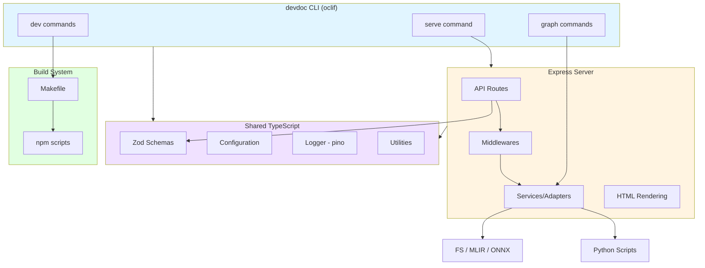
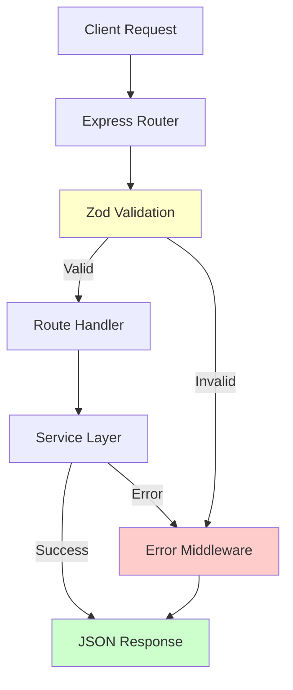

# TypeScript CLI & API Architecture

## Executive Summary

We are committing to a **TypeScript-first** CLI and API architecture that builds on our existing Node.js runtime, maintaining a single language surface for the web server, command tooling, and API endpoints. This decision ensures:

- **Unified Development Experience**: Single language (TypeScript) across CLI, API, and server
- **Shared Type Safety**: Common schemas and types prevent drift between components
- **Streamlined Tooling**: Consistent build, test, and deployment workflows
- **Better Integration**: Native interop with MLIR/ONNX tooling while preserving existing Python scripts where beneficial

### Core Technologies

- **CLI Framework**: `oclif` (composable commands, plugin architecture)
- **API Framework**: `Express` (existing server, rich ecosystem)
- **Build Automation**: `Make/Makefile` (reproducible build/test/deploy tasks)
- **Validation**: `zod` (runtime validation with TypeScript inference)
- **Testing**: `vitest` + `supertest` (unified test framework)

---

## Goals

### CLI Goals
- Preserve all user-facing behaviors (`devdoc serve`, live reload, analytics toggles) while providing a scalable command surface for new features
- Centralize configuration, logging, and telemetry in TypeScript so CLI and server share types, error handling, and utilities
- Offer first-class workflows for MLIR/ONNX interactions by wrapping existing scripts with typed adapters
- Enable automated build tasks (build, lint, test, package) that can run locally or in CI via Make targets

### API Goals
- Maintain compatibility with current markdown browsing and Model Explorer features while exposing structured APIs for automation
- Provide versioned, well-documented endpoints surfaced via generated docs and discoverable through CLI
- Share schema definitions across client/CLI/server to reduce drift and simplify refactors
- Instrument API endpoints with consistent logging, metrics, and error handling

---

## Non-Goals

- Rewriting the Express server or WebSocket/live reload stack (staying in `lib/server.ts`)
- Eliminating Python tooling entirely (will still call `scripts/parse_mlir.py` and friends until TypeScript equivalents are prioritized)
- Shipping native binaries in the near term (distribution continues via npm with optional `npx`/`npm exec`)
- Adding authentication by default (but design allows plugging in later)

---

## Current State Snapshot

### CLI (Before Refactor)
- `bin/devdoc` → `dist/cli.js` → `lib/cli.ts` (yargs-based flags feeding `devdoc.init(flags)`)
- Flags control port/address, verbosity, live reload, directory root, and browser opening
- Tight coupling between CLI and server makes testing and extensibility difficult

### API (Current)
- Express server handles both HTML rendering and API routes; logic is co-located in `lib/server.ts`
- Request validation is ad hoc, often relying on implicit assumptions from the UI
- Tests exist at the integration level but lack coverage for newer API use cases

### Supporting Tooling
- TypeScript project already configured (ESM, tsconfig, vitest, eslint)
- Python scripts (`scripts/parse_mlir.py`, `scripts/infer_onnx_shapes.py`) offer model utilities invoked ad hoc
- Basic Makefile exists but needs expansion for comprehensive build automation

---

## Target Architecture

### High-Level System View



### API Request Flow



---

## Module Layout

### Project Structure

```
src/
  cli/
    index.ts              ← oclif bootstrap
    commands/
      serve.ts            ← wraps server lifecycle
      graph/
        mlir.ts           ← MLIR graph export
        onnx.ts           ← ONNX graph export
      dev/
        build.ts          ← invokes make build
        test.ts           ← invokes make test
        lint.ts           ← invokes make lint
        clean.ts          ← invokes make clean
    config.ts             ← zod schemas + config loader
    services/
      logger.ts           ← pino logger helper
      processes.ts        ← execa wrappers
      python-bridge.ts    ← helpers for Python scripts

lib/
  server.ts               ← existing Express server (reused)
  api/
    index.ts              ← API route registration
    routes/
      files.ts            ← file serving endpoints
      graph.ts            ← MLIR/ONNX graph endpoints
      telemetry.ts        ← analytics endpoints
    schemas/
      graph.ts            ← zod schemas for graph APIs
      files.ts            ← zod schemas for file APIs
    services/
      mlir.ts             ← MLIR processing logic
      onnx.ts             ← ONNX processing logic
      analytics.ts        ← telemetry aggregation
    util/
      errors.ts           ← error handling utilities
      logger.ts           ← shared logger instance

tests/
  cli/*.test.ts           ← vitest CLI runner tests
  api/*.test.ts           ← vitest + supertest API tests

Makefile                  ← Build automation tasks
```

---

## Technology Stack

### CLI Stack

| Concern / Layer                    | Selected Tool                        | Rationale                                                                                             | Alternatives                                      |
| ---------------------------------- | ------------------------------------ | ----------------------------------------------------------------------------------------------------- | ------------------------------------------------- |
| CLI framework                      | [**oclif**](https://github.com/oclif/oclif)                            | Robust, supports subcommands, plugin architecture, well suited for complex CLIs                       | commander.js (lighter), yargs, clipanion          |
| Prompting / interactivity          | [**inquirer.js**](https://github.com/SBoudrias/Inquirer.js)                      | Industry standard for CLI prompts, rich question types, validation support, TypeScript-friendly       | prompts, enquirer, terminal-kit                   |
| Logging                            | [**pino**](https://github.com/pinojs/pino)                             | Fast structured logging, JSON output, shared with server                                              | winston, debug, bunyan                            |
| Configuration / validation         | [**zod**](https://github.com/colinhacks/zod)                              | Schema declarations in TS, runtime and static validation, shared across CLI/API                       | io-ts, class-validator, yup                       |
| Task orchestration                 | Native `Promise` + [**p-queue**](https://github.com/sindresorhus/p-queue)         | Lightweight with bounded concurrency                                                                  | bull, bee-queue (if persistence needed)           |
| Process invocation                 | [**execa**](https://github.com/sindresorhus/execa)                            | Clean interface over child_process with promise support                                               | Native child_process, cross-spawn                 |
| Bundling / packaging               | [**esbuild**](https://github.com/evanw/esbuild) + optional [**nexe**](https://github.com/nexe/nexe)        | Fast bundler; nexe for optional single executable                                                     | tsup, ncc, pkg (deprecated)                       |
| TypeScript toolchain               | [**typescript**](https://github.com/microsoft/TypeScript), [**ts-node**](https://github.com/TypeStrong/ts-node)              | Standard TS compiler with dev convenience                                                             | Babel + TS plugin                                 |
| Testing                            | [**vitest**](https://github.com/vitest-dev/vitest) (with [**@oclif/test**](https://github.com/oclif/test))      | Unified test runner with TS support, CLI runner for command tests                                     | jest + ts-jest, ava                               |

### API Stack

| Concern / Layer                    | Selected Tool                        | Rationale                                                                                             | Alternatives                                      |
| ---------------------------------- | ------------------------------------ | ----------------------------------------------------------------------------------------------------- | ------------------------------------------------- |
| HTTP framework                     | [**Express**](https://github.com/expressjs/express)                          | Already in use, rich ecosystem, easy integration with existing setup                                  | Fastify (faster), Koa (middleware-focused)        |
| Router modularization              | [**express.Router**](https://github.com/expressjs/express) + feature folders   | Keeps route logic isolated, aligns with TypeScript modules                                            | express-promise-router, Fastify plugins           |
| Validation / schema typing         | [**zod**](https://github.com/colinhacks/zod)                              | Shared inference for request/response types, integrates with OpenAPI generation                       | io-ts, yup, @sinclair/typebox                     |
| Error handling                     | Central middleware + [**http-errors**](https://github.com/jshttp/http-errors)   | Consistent JSON error envelopes with status codes                                                     | Custom classes, boom (Hapi style)                 |
| Logging                            | [**pino**](https://github.com/pinojs/pino) (shared util)               | Fast structured logging, shared with CLI/server                                                       | winston, bunyan                                   |
| File system abstraction            | Node [**fs/promises**](https://nodejs.org/api/fs.html#promises-api) + wrappers        | Native, typed, minimal dependencies                                                                   | fs-extra, graceful-fs                             |
| MLIR/ONNX integration              | [**execa**](https://github.com/sindresorhus/execa) adapters to Python scripts   | Keeps current Python parsers accessible with TypeScript orchestration                                 | Future: direct TS parsers or WASM bindings        |
| Testing                            | [**vitest**](https://github.com/vitest-dev/vitest) + [**supertest**](https://github.com/ladjs/supertest)             | Unified test runner; supertest for HTTP assertions                                                    | jest + supertest, node:test + undici              |
| API specification                  | [**zod-openapi**](https://github.com/samchungy/zod-openapi) + [**redoc**](https://github.com/Redocly/redoc)/[**scalar**](https://github.com/scalar/scalar)     | Generates OpenAPI docs from schemas without duplication                                               | ts-json-schema-generator, manual YAML             |
| Build automation                   | [**Make/Makefile**](https://www.gnu.org/software/make/)                    | Cross-platform build tasks, dependency management                                                     | GitHub Actions only, npm scripts only             |

### Shared Dependencies

| Library                            | Usage                                                                                                 |
| ---------------------------------- | ----------------------------------------------------------------------------------------------------- |
| [**typescript**](https://github.com/microsoft/TypeScript) (^5.0)                | Type system and compiler                                                                              |
| [**zod**](https://github.com/colinhacks/zod) (^3.20)                      | Schema validation and type inference (CLI + API)                                                      |
| [**pino**](https://github.com/pinojs/pino) (^8.0)                      | Structured logging (CLI + API + server)                                                               |
| [**execa**](https://github.com/sindresorhus/execa) (^7.0)                     | Process execution wrapper (CLI + API services)                                                        |
| [**vitest**](https://github.com/vitest-dev/vitest) (^1.0)                    | Test framework (all modules)                                                                          |
| [**make**](https://www.gnu.org/software/make/)                             | Build automation (invoked from CLI dev commands)                                                      |

---

## Key Implementation Patterns

### CLI Command Example (serve)

```typescript
// src/cli/commands/serve.ts
import { Command, Flags } from '@oclif/core';
import { execa } from 'execa';
import { logger } from '../services/logger.js';
import { ensureBuildArtifacts } from '../services/build.js';

export default class Serve extends Command {
  static description = 'Start the devdoc development server';

  static flags = {
    port: Flags.integer({ char: 'p', default: 8080 }),
    address: Flags.string({ char: 'a', default: 'localhost' }),
    watch: Flags.boolean({ char: 'w', default: false }),
    verbose: Flags.boolean({ char: 'v', default: false }),
  };

  async run() {
    const { flags } = await this.parse(Serve);

    await ensureBuildArtifacts();

    logger.info('Starting server', { port: flags.port, address: flags.address });

    // Delegate to existing Node server
    const serverProcess = execa('node', ['dist/cli.js', ...process.argv.slice(2)], {
      stdio: 'inherit',
      env: { ...process.env, NODE_ENV: 'development' }
    });

    // Handle lifecycle
    process.on('SIGINT', () => serverProcess.kill('SIGINT'));
    process.on('SIGTERM', () => serverProcess.kill('SIGTERM'));

    await serverProcess;
  }
}
```

### API Route Example (graph export)

```typescript
// lib/api/routes/graph.ts
import { Router } from 'express';
import { z } from 'zod';
import { validateRequest } from '../middleware/validation.js';
import { mlirService } from '../services/mlir.js';
import { logger } from '../util/logger.js';

const router = Router();

// Schema definition
const MLIRGraphRequestSchema = z.object({
  file: z.string().min(1),
  format: z.enum(['json', 'dot']).default('json'),
});

// Route handler with validation
router.post(
  '/graph/mlir',
  validateRequest(MLIRGraphRequestSchema),
  async (req, res, next) => {
    try {
      const { file, format } = req.body;

      logger.info('Processing MLIR graph request', { file, format });

      const graph = await mlirService.parseMLIR(file, format);

      res.json({ success: true, data: graph });
    } catch (error) {
      next(error);
    }
  }
);

export default router;
```

### Shared Schema Example

```typescript
// lib/api/schemas/graph.ts
import { z } from 'zod';

export const GraphNodeSchema = z.object({
  id: z.string(),
  label: z.string(),
  attrs: z.record(z.unknown()).optional(),
  inputs: z.array(z.string()).default([]),
  outputs: z.array(z.string()).default([]),
});

export const GraphSchema = z.object({
  nodes: z.array(GraphNodeSchema),
  edges: z.array(z.object({
    from: z.string(),
    to: z.string(),
    label: z.string().optional(),
  })),
  metadata: z.record(z.unknown()).optional(),
});

export type GraphNode = z.infer<typeof GraphNodeSchema>;
export type Graph = z.infer<typeof GraphSchema>;
```

---

## Makefile Structure Example

### Proposed Makefile Organization

```makefile
.PHONY: help build test lint clean install dev watch

# Default target
help:
	@echo "Available targets:"
	@echo "  make install  - Install dependencies"
	@echo "  make build    - Build TypeScript to dist/"
	@echo "  make test     - Run all tests"
	@echo "  make lint     - Run linters and formatters"
	@echo "  make clean    - Remove build artifacts"
	@echo "  make dev      - Start development server"
	@echo "  make watch    - Watch mode for development"

# Install dependencies
install:
	npm install
	@if [ -f scripts/setup-python-deps.sh ]; then \
		./scripts/setup-python-deps.sh; \
	fi

# Build TypeScript
build:
	npm run build

# Run tests
test:
	npm test

# Run linters
lint:
	npx xo

# Clean build artifacts
clean:
	npm run clean

# Development server
dev: build
	./lib/cli.js

# Watch mode
watch:
	npm run build -- --watch

# CI target (used in GitHub Actions)
ci: install lint test build
```

### Make Target Dependencies

- `dev` depends on `build` (ensures artifacts exist)
- `ci` orchestrates full CI pipeline (install → lint → test → build)
- All targets use `.PHONY` to avoid conflicts with files of the same name
- Portable syntax tested on Linux, macOS, and Windows (WSL)

---

## Key Flows

### CLI: Serve Command
1. Parse flags using oclif
2. Load config from `.devdocrc` and environment
3. Ensure build artifacts exist (trigger `npm run build` if needed)
4. Launch Node server as child process with proper env
5. Forward stdout/stderr with structured logging
6. Handle lifecycle (signals, restarts)
7. Optionally open browser

### CLI: MLIR Graph Export
1. Validate input file path
2. Use Python bridge (execa wrapper) to call `scripts/parse_mlir.py`
3. Parse stdout JSON output
4. Validate against GraphSchema
5. Emit formatted output or write to file
6. Exit with appropriate status code

### API: Graph Endpoint
1. Client sends POST request to `/api/graph/mlir`
2. Validation middleware checks request against schema
3. Route handler invokes service layer
4. Service uses execa to call Python script
5. Service parses and validates response
6. Handler returns JSON response
7. Error middleware catches failures and returns structured errors

### Make Task Invocation
1. CLI command (`devdoc dev test`)
2. Resolve config and validate environment
3. Execute Make target with proper flags
4. Stream output logs with pino
5. Exit with CI-friendly status codes
6. Report build status and errors

---

## Migration Strategy

### Phase 0 — Prep & Scaffolding
- [ ] Add oclif to project as dev dependency
- [ ] Initialize `src/cli` structure alongside existing `lib/cli.ts`
- [ ] Introduce shared config utilities (logger, config schema)
- [ ] Align lint/test tooling for new directory structure
- [ ] Document architecture in this file

### Phase 1 — CLI Command Extraction
- [ ] Recreate current CLI flags in oclif `serve` command
- [ ] Internally call `devdoc.init(flags)` to maintain compatibility
- [ ] Add regression tests using `@oclif/test` and vitest
- [ ] Update `bin/devdoc` to detect new command and fall back to legacy
- [ ] Feature flag rollout (`MARKSERV_USE_NEW_CLI=1`)

### Phase 2 — API Module Extraction
- [ ] Extract API handlers from `lib/server.ts` into `lib/api/routes`
- [ ] Introduce zod schemas for high-traffic endpoints
- [ ] Add validation middleware for request/response
- [ ] Implement centralized error handling
- [ ] Add vitest/supertest coverage for all routes

### Phase 3 — Tooling Commands
- [ ] Implement `graph:mlir`/`graph:onnx` commands with typed adapters
- [ ] Add `dev:*` commands that invoke Make targets (build, lint, test, clean)
- [ ] Create comprehensive Makefile with all build automation tasks
- [ ] Share service layer between CLI and API

### Phase 4 — Consolidation
- [ ] Remove yargs dependency once telemetry confirms parity
- [ ] Move shared flag definitions into common module
- [ ] Incorporate advanced behaviors (live reload, analytics, plugin discovery)
- [ ] Update documentation and examples

### Phase 5 — Expansion
- [ ] Add richer MLIR/ONNX features (dialect listing, attribute inspection)
- [ ] Publish CLI as part of npm package with proper `exports` field
- [ ] Explore plugin architecture for extensibility
- [ ] Generate OpenAPI specs using `zod-openapi`

---

## Testing & Validation

### CLI Testing
- **Unit tests**: Use vitest with `@oclif/test` CLI harness to cover command parsing, flag defaults, error paths
- **Integration tests**: Start server via CLI in GitHub Actions to validate HTTP endpoints and watcher startup
- **Snapshot tests**: For `graph` commands to ensure MLIR/ONNX JSON remains stable

### API Testing
- **Unit tests**: Vitest for service logic
- **Integration tests**: Supertest to exercise routing and validation
- **Contract testing**: Optional OpenAPI snapshots using `zod-openapi` to ensure schema stability
- **Error scenarios**: Test validation failures, file IO errors, unexpected exceptions

### Build Automation Testing
- **Make target tests**: Verify all Makefile targets execute correctly
- **Dependency validation**: Ensure proper task ordering and dependencies
- **Environment parity**: Validate local and CI produce same results

---

## Packaging & Distribution

### Build Process
1. Bundle CLI with `tsup`/`esbuild` into `dist/cli.mjs`
2. Build server and API into `dist/server.js`
3. Copy Python scripts and templates to dist
4. Generate sourcemaps for debugging

### Distribution Channels
- **npm package**: Primary distribution (`npm install -g devdoc`)
- **npx**: Direct execution (`npx devdoc serve`)
- **Docker**: Optional container with automated builds

### Version Management
- Single source of truth in `package.json`
- Automated version bumps via Make targets and CI
- Changelog generation from conventional commits

---

## Risks & Mitigations

| Risk                                  | Mitigation                                                                                       |
| ------------------------------------- | ------------------------------------------------------------------------------------------------ |
| Framework migration churn             | Keep legacy CLI behind feature flag until parity confirmed; add compatibility layer              |
| Python tool dependencies              | Encapsulate script execution in typed adapters with clear error messages                         |
| Make/shell portability issues         | Use portable Make syntax; test on Linux, macOS, Windows (WSL); provide npm script fallbacks     |
| ESM packaging quirks                  | Align build config with current project to avoid dual compilation; add smoke tests               |
| API validation gaps                   | Mandatory zod validation for all public endpoints; reject requests with invalid schemas          |
| Type drift between CLI/API/client     | Share schemas in common module; add contract tests to detect breaking changes                    |
| Test coverage regression              | Require minimum coverage thresholds in CI; block merges below 80% coverage                       |

---

## Open Questions & Future Work

### Near Term
- [ ] Confirm exact feature set of oclif we'll adopt (plugin system, hooks, lifecycle events)
- [ ] Design comprehensive Makefile structure with phony targets and dependencies
- [ ] Establish telemetry requirements for CLI usage (opt-in? offline-first?)
- [ ] Define versioning strategy for API endpoints (path-based? header-based?)

### Long Term
- [ ] Evaluate rewriting watcher stack in TypeScript (e.g., using `chokidar` directly vs current setup)
- [ ] Consider gradual TypeScript rewrites of Python scripts for performance-critical paths
- [ ] Explore native binary packaging (nexe, pkg alternatives) if distribution needs change
- [ ] Assess FastAPI/Starlette as alternative to Express if Python becomes primary language

---

## Architecture Decision Records (ADRs)

### ADR-001: TypeScript over Python for CLI/API
**Status**: Accepted
**Decision**: Standardize on TypeScript for CLI and API implementation
**Rationale**:
- Single language reduces context switching and simplifies onboarding
- Existing server and build tooling already in TypeScript/Node
- Strong type system with shared schemas prevents drift
- Rich ecosystem for CLI (oclif) and API (Express) frameworks
- Python scripts can remain for specialized ML tooling where beneficial

**Consequences**:
- Need TypeScript wrappers for Python scripts (execa adapters)
- Future consideration for porting performance-critical Python to TS or WASM
- Development velocity improves due to unified toolchain

### ADR-002: oclif for CLI Framework
**Status**: Accepted
**Decision**: Use oclif as primary CLI framework
**Rationale**:
- Battle-tested (used by Heroku, Salesforce CLIs)
- Built-in support for plugins, hooks, and extensibility
- Excellent TypeScript support with type-safe command definitions
- Rich ecosystem of plugins for common CLI patterns
- Better than yargs for complex command hierarchies

**Consequences**:
- Migration effort from yargs to oclif
- Learning curve for team unfamiliar with oclif patterns
- Better long-term maintainability and extensibility

### ADR-003: zod for Validation
**Status**: Accepted
**Decision**: Use zod for runtime validation across CLI and API
**Rationale**:
- TypeScript-first with excellent type inference
- Single source of truth for schemas (no duplication)
- Can generate OpenAPI specs automatically
- Better error messages than alternatives
- Active development and strong community

**Consequences**:
- Runtime validation overhead (minimal impact)
- Team training on zod patterns
- Enables type-safe APIs and CLIs with shared schemas

---

## Next Steps

### Immediate (Sprint 1-2)
1. Install oclif and scaffold `src/cli` structure
2. Create prototype `serve` command that delegates to existing server
3. Design and implement comprehensive Makefile with build/test/lint targets
4. Extract first API route (`/api/graph/mlir`) into modular structure

### Short Term (Sprint 3-4)
5. Add vitest + supertest coverage for extracted API routes
6. Implement `graph:mlir` and `graph:onnx` CLI commands
7. Introduce zod schemas for high-traffic endpoints
8. Document migration progress and update team on patterns

### Medium Term (Sprint 5-8)
9. Complete API module extraction from `lib/server.ts`
10. Achieve feature parity between oclif and yargs CLIs
11. Implement `dev:*` commands that invoke Make targets
12. Add contract testing for API schemas

### Long Term (Sprint 9+)
13. Remove yargs dependency once adoption confirmed
14. Generate OpenAPI documentation from zod schemas
15. Explore plugin architecture for extensibility
16. Evaluate performance optimizations and TypeScript rewrites of hot paths

---

## References

### Documentation
- [oclif Official Docs](https://oclif.io/)
- [zod Documentation](https://zod.dev/)
- [Express.js Guide](https://expressjs.com/)
- [GNU Make Manual](https://www.gnu.org/software/make/manual/)
- [Vitest Documentation](https://vitest.dev/)

### Internal Links
- [SIGNALS.md](./SIGNALS.md) - Feature requests and signals
- [features.md](./features.md) - Feature planning
- [model-explorer-toolbar-logic.md](./model-explorer-toolbar-logic.md) - UI integration

### Related Projects
- Python MLIR scripts: `scripts/parse_mlir.py`, `scripts/infer_onnx_shapes.py`
- Model Explorer integration: `lib/mlir-to-graph.ts`
- Current server implementation: `lib/server.ts`
