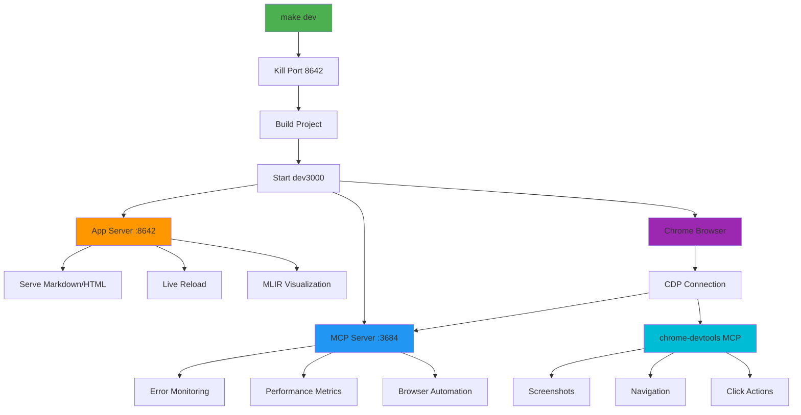
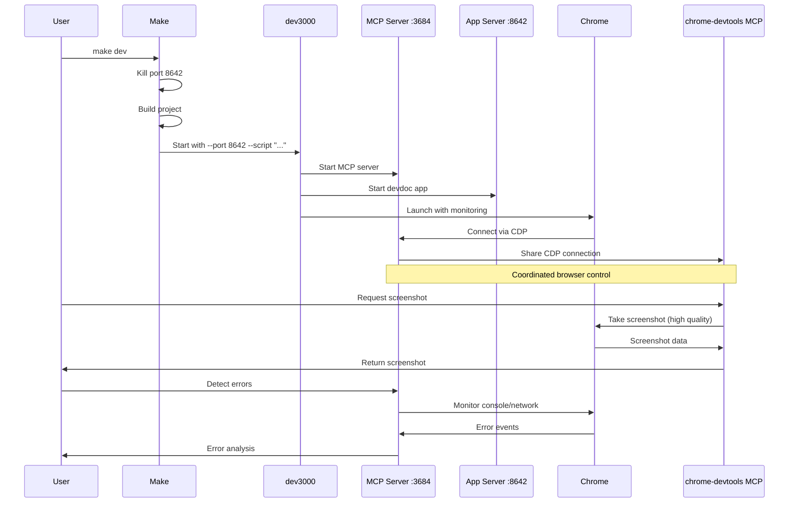

# dev3000 MCP Integration Guide

## Overview

Devdoc is integrated with [dev3000](https://github.com/cline/dev3000), an AI-powered development tool that provides browser monitoring, error detection, and MCP (Model Context Protocol) server capabilities.

### Architecture Diagram



### Integration Flow



## Quick Start

```bash
# Standard development mode with MCP integration
make dev

# This will:
# 1. Kill any processes on port 8642
# 2. Build the project
# 3. Start dev3000 with MCP server on port 3684
# 4. Launch Chrome browser with monitoring
# 5. Serve devdoc on http://localhost:8642
```

## Development Modes

### Standard Mode (`make dev`)

```bash
make dev
```

- ✅ Full dev3000 integration with MCP server
- ✅ Automatic browser launch with monitoring
- ✅ Error detection and performance tracking
- ✅ TUI (Terminal UI) interface
- 📡 MCP server: `http://localhost:3684`
- 🌐 App server: `http://localhost:8642`

### Debug Mode (`make dev-debug`)

```bash
make dev-debug
```

- ✅ All standard mode features
- ✅ Debug logging to console (disables TUI)
- 🔍 Detailed log output for troubleshooting

### Servers-Only Mode (`make dev-no-browser`)

```bash
make dev-no-browser
```

- ✅ MCP and app servers only
- ❌ No browser launch
- 💡 Use with Chrome extension for manual browser control
- 🎯 Ideal for headless development or using your own browser

### Tail Mode (`make dev-tail`)

```bash
make dev-tail
```

- ✅ All standard mode features
- 📜 Consolidated log output (like `tail -f`)
- 🔍 Real-time log monitoring in terminal

## MCP Server Features

When running with dev3000, you get access to powerful MCP tools:

### Error Detection & Monitoring

- **Real-time error capture**: Browser console errors, network failures, uncaught exceptions
- **Performance metrics**: Page load times, rendering performance, Core Web Vitals
- **Visual regression**: Layout shift detection (CLS tracking)

### Browser Automation

- **Coordinated browser control**: Shares Chrome instance with chrome-devtools MCP
- **Smart action routing**: Automatically routes to optimal MCP server
  - Screenshots → chrome-devtools MCP (better quality)
  - Navigation → chrome-devtools MCP (more reliable)
  - Clicks → chrome-devtools MCP (precise coordinates)
  - JavaScript evaluation → chrome-devtools MCP (enhanced debugging)

### Debugging Tools

- **Visual diff analysis**: Compare before/after screenshots for layout debugging
- **Component source finder**: Map DOM elements to source code
- **Console log capture**: Full browser console history
- **Network monitoring**: HTTP requests, responses, and timing

## MCP Server Endpoints

When dev3000 is running, the MCP server exposes these endpoints:

- **MCP Protocol**: `http://localhost:3684`
- **Logs UI**: `http://localhost:3684/logs?project=devdoc`
- **Health Check**: `http://localhost:3684/health`

## Chrome DevTools MCP Coordination

dev3000 automatically coordinates with chrome-devtools MCP server when both are available:

1. **Shared Browser Instance**: Both connect to the same Chrome via CDP (Chrome DevTools Protocol)
2. **Intelligent Routing**: Browser actions route to the best-suited MCP server
3. **No Conflicts**: Prevents duplicate browser instances and state inconsistencies

### Verifying MCP Coordination

```bash
# Start dev3000
make dev

# In another terminal, verify chrome-devtools MCP can connect
# (requires chrome-devtools MCP configured in Claude Code settings)
```

You should see:

```
✓ dev3000 browser monitoring active
✓ chrome-devtools MCP connected to same Chrome instance
```

## Troubleshooting

### Port Already in Use

```bash
# Manually kill processes on port 8642
make port-kill

# Check what's using the port
make port-check
```

### MCP Server Not Starting

```bash
# Kill the MCP server on port 3684
npx dev3000 --kill-mcp

# Then restart
make dev
```

### Browser Not Launching

```bash
# Use servers-only mode and connect manually
make dev-no-browser

# Then navigate to http://localhost:8642 in your browser
```

### Debug Logging

```bash
# Enable debug mode for detailed logs
make dev-debug
```

## Configuration

### Custom Chrome Profile

```bash
# Use a specific Chrome profile directory
npx dev3000 --port 8642 --script "node dist/src/cli/index.js serve" \
  --profile-dir "/path/to/chrome/profile"
```

### Custom Browser

```bash
# Use Arc browser instead of Chrome
npx dev3000 --port 8642 --script "node dist/src/cli/index.js serve" \
  --browser "/Applications/Arc.app/Contents/MacOS/Arc"
```

### Custom MCP Port

```bash
# Use a different port for the MCP server
npx dev3000 --port 8642 --port-mcp 4000 \
  --script "node dist/src/cli/index.js serve"
```

## Best Practices

### Development Workflow

1. **Start with standard mode**: `make dev` for full integration
2. **Use debug mode for issues**: `make dev-debug` when troubleshooting
3. **Servers-only for CI/CD**: `make dev-no-browser` in headless environments
4. **Monitor logs**: Use `make dev-tail` for continuous log monitoring

### Error Detection

- dev3000 automatically captures browser errors
- Check the logs UI at `http://localhost:3684/logs?project=devdoc`
- Use `fix_my_app` MCP tool for automated error analysis

### Performance Monitoring

- Enable Core Web Vitals tracking
- Monitor CLS (Cumulative Layout Shift) for visual stability
- Use `fix_my_jank` MCP tool for performance analysis

### Browser Automation

- Prefer chrome-devtools MCP for standard browser actions
- Use dev3000 MCP for error detection and monitoring
- Both servers coordinate automatically when available

## Integration with Claude Code

When using Claude Code with dev3000:

1. **Automatic Error Detection**: Claude can query dev3000 for recent errors
2. **Browser Automation**: Commands route to optimal MCP server
3. **Visual Debugging**: Screenshot comparison and layout analysis
4. **Code Mapping**: Link browser errors to source code locations

### Example Claude Code Usage

```
User: "Fix any errors in the app"
Claude: [Uses fix_my_app MCP tool to analyze dev3000 error logs]

User: "Why is the page janky?"
Claude: [Uses fix_my_jank to analyze CLS and layout shifts]

User: "Take a screenshot of the homepage"
Claude: [Routes to chrome-devtools MCP for better quality]
```

## Additional Resources

- [dev3000 GitHub Repository](https://github.com/cline/dev3000)
- [MCP Protocol Documentation](https://modelcontextprotocol.io)
- [Chrome DevTools Protocol](https://chromedevtools.github.io/devtools-protocol/)

## Version Compatibility

- **Node.js**: >= 18.0.0
- **dev3000**: >= 1.0.0 (auto-installed via npx)
- **Chrome**: Latest stable version recommended
