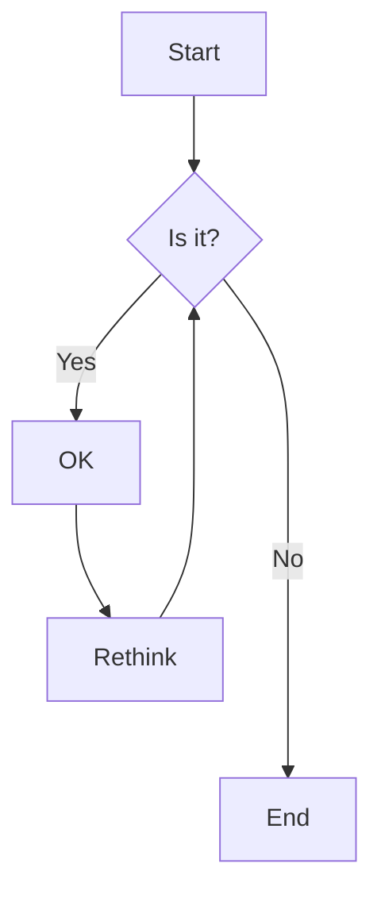
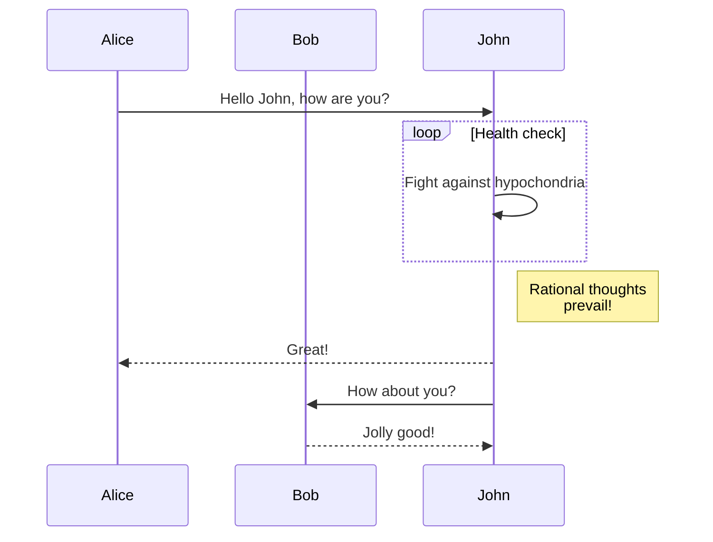
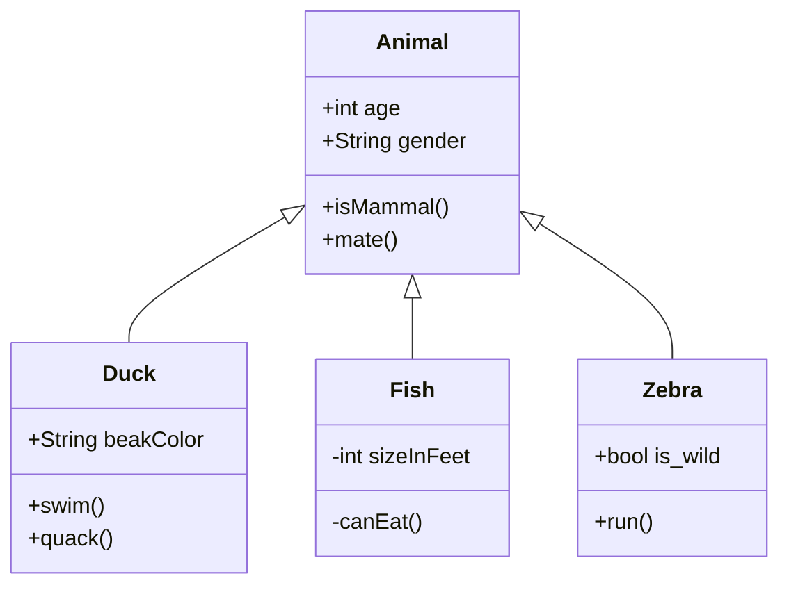

# Mermaid Test File

This file tests Mermaid diagram rendering in markserv.

## Flowchart Example



## Sequence Diagram Example



## Git Graph Example

```mermaid
gitgraph
    commit
    commit
    branch develop
    checkout develop
    commit
    commit
    checkout main
    merge develop
    commit
    commit
```

## Class Diagram Example



If Mermaid is working correctly, you should see rendered diagrams above instead of code blocks.