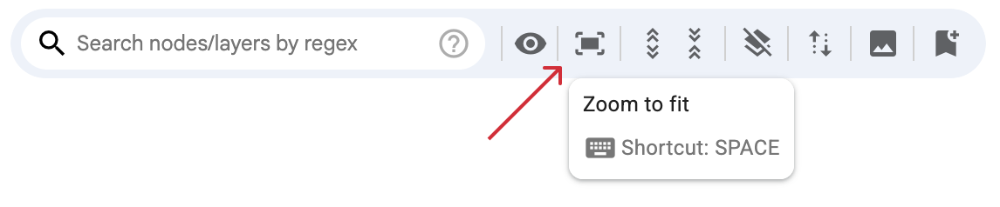
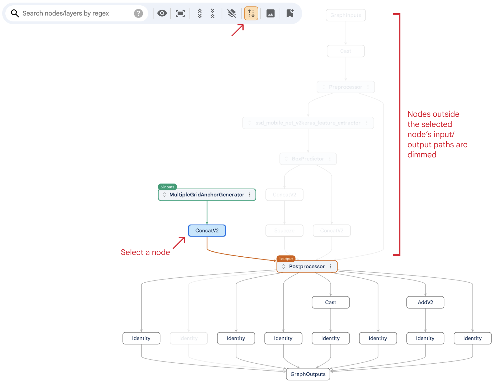
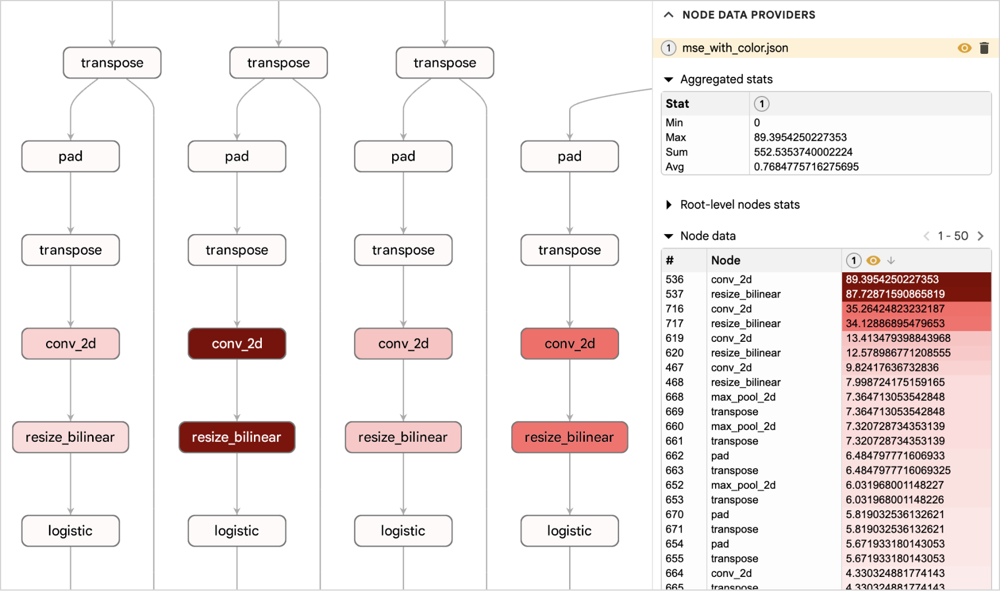

This page walks you through on how to use Model Explorer.

<br>

**Table of Contents**

* [Select models](#select-models)
  * [How to select PyTorch models](#how-to-select-pytorch-models)
* [Visualization UI Overview](#visualization-ui-overview)
* [Model graph and side panel](#model-graph-and-side-panel)
  * [Graph navigation](#graph-navigation)
  * [Node types](#node-types)
  * [Expand/Collapse layers](#expandcollapse-layers)
  * [Show identical layers](#show-identical-layers)
  * [Inspect an op](#inspect-an-op)
  * [Toggle highlights for inputs/outputs](#toggle-highlights-for-inputsoutputs)
  * [Open layer in popup](#open-layer-in-popup)
* [Toolbar](#toolbar)
  * [Search](#search)
  * [Overlay data on nodes/edges](#overlay-data-on-nodesedges)
  * [Expand/collapse all layers](#expandcollapse-all-layers)
  * [Flatten all layers](#flatten-all-layers)
  * [Trace inputs and outputs](#trace-inputs-and-outputs)
  * [Edge overlays](#edge-overlays)
  * [Download graph as PNG](#download-graph-as-png)
  * [Save/restore graph states](#saverestore-graph-states)
* [Handle multiple models](#handle-multiple-models)
  * [Switch model](#switch-model)
  * [Jump from one graph to another](#jump-from-one-graph-to-another)
  * [Split-pane view](#split-pane-view)
  * [Synchronize navigation](#synchronize-navigation)
* [Custom node data](#custom-node-data)
  * [Create custom node data](#create-custom-node-data)
  * [Use custom node data](#use-custom-node-data)
  * [View custom node data on node](#view-custom-node-data-on-node)
* [Misc](#misc)
  * [Node styler](#node-styler)
  * [Settings](#settings)
  * [Increase maximum element count for constant tensor values](#increase-maximum-element-count-for-constant-tensor-values)
  * [Permalink](#permalink)

<br>

# Select models

In the home page, select models to visualize by clicking the "Select from your computer" button, or by entering the absolute model paths (separated by comma) in the text box. You can also drag-and-drop model files onto the home page.

Once you've selected your models, click the "View selected models" button. Model Explorer will process your files and take you to the visualization page.

> [!TIP]
> For faster processing of large models, enter the file path directly instead of using the "select from your computer" button. This avoids the overhead of copying the file to a temporary directory.


<br>
<br>

**A quick note about Adapters**<a id='adapter'></a>

Model Explorer uses "adapters" to transform your model files into an intermediate format that Model Explorer can understand and visualize. The "default" adapter should handle most common use cases. To pick a different adapter, click the adapter drop down menu for a specific model.


## How to select PyTorch models

To visualize a PyTorch model, the corresponding module has to be exported to an `ExportedProgram` by using `torch.export` and save the file with the `pt2` file extension. See the [official doc](https://pytorch.org/docs/stable/export.html#serialization) for instructions.

> [!NOTE]
> `torch.export` is under active development and the exported graph using a older version of PyTorch might not work in newer versions. To ensure compatibility, make sure to use the same version of `torch` installed by `ai-edge-model-explorer`. Alternatively, use the [API](https://github.com/google-ai-edge/model-explorer/wiki/4.-API-Guide#visualize-pytorch-models) in your Python program to directly visualize a PyTorch module.

# Visualization UI overview

Once the model has been loaded and processed successfully, it will be displayed starting from its root layer in the main visualization UI. The UI has the following components:


Sub-sections below will provide detailed explanation for each component.

# Model graph and side panel

## Graph navigation

* **Zoom**
  <br>
  Ctrl + scroll up/down, or pinch on touchpad.

* **Zoom in to an area**
  <br>
  Ctrl or ⌘ (Mac) + mouse drag to drag out an area to zoom in to.

* **Pan**
  <br>
  Drag the graph, scroll the mouse wheel, or pan on the touchpad.

* **Fit to screen**
  <br>
  Press the `SPACE` key, or click on the "Fit to screen" button on the toolbar.
  <br>
  <br>
  

> [!TIP]
> To maintain readability when zoomed out, Model Explorer automatically renders op nodes as color blocks, making it easier to understand your model's structure. An example:


## Node types

There are three types of nodes in Model Explorer:

* **Op nodes**
  <br>
  They have white background. An op node does not have children.

* **Layer nodes**
  <br>
  They have light-blue background colors with action icons. A layer node can have other layer nodes and/or op nodes as its children.

> [!TIP]
> Model Explorer will automatically remove a layer if there is only one op node as its child. You can change this behavior in [settings](#settings) (by turning on the `Keep layers with a single op node child` switch).

* **Artificial layer nodes**
  <br>
  To improve layout latency and readability for large graphs/layers, Model Explorer will automatically partition the large graphs into artificial layers/sections by walking through the graph from roots in a depth-first-search order, ensuring that each section contains no more than a threshold (1000 children by default). These artificial layers will be rendered with a purple border to distinguish them from regular layers.

> [!TIP]
> You can change the threshold of artificial layer node count in [settings](#settings).

<br>


## Expand/Collapse layers

To reveal the content of a layer, Click the  "expand" icon, or double-click the layer node. To collapse an expanded layer, click the  "collapse" icon, or double-click the layer node.

To recursively expand all layers under a layer, open the overflow menu on a layer node and select "expand layer and all sub-layers".


## Show identical layers

When a layer node is selected, Model Explorer will automatically highlight identical layers (in terms of descendant nodes and their connections inside the layer) with light blue color and a label. It will also show the list of identical layers in the side panel.

In the following screenshot, after user selects the BoxPredictor_3 layer, it shows that it is identical to other 4 box predictor layers.


## Inspect an op

When an Op node is selected, its basic info, attributes, inputs, and outputs are displayed in the side panel. Its input and output nodes will also be highlighted in the model graph.

The side panel offers insights into your selected op. Click the  icon to expand the value content when it overflows.

- **Node info**
  <br>
  Basic info of the node, such as id, namespace (which layer the node is located), etc.

- **Attributes**
  <br>
  The attributes (key/value paris) of the node.

- **Inputs**
  <br>
  The selected op's input tensors with key tensor metadata, such as tensor name and shape. Clicking the op name of an input tensor (indicated by a  "locator" icon) will scroll the graph directly to that node's position and expand all its ancestor layers to reveal the node.

- **Outputs**
  <br>
  The selected op's output tensors, their metadata, and the ops they connect to. Clicking the name of a connected op node will locate that op node in the graph.

> [!TIP]
> Using `Alt+Click` on a node row will locate **and** select the node.


<br>
<br>

In the model graph, the selected node and its input and output nodes/edges are highlighted with different colors:

* Blue: selected node.
* Green: input nodes and edges.
* Red: output nodes and edges.

If an input/output node is in a collapsed layer, a label with the number of input/output nodes inside will appear on the corresponding layer node. Clicking the label will expand the layer and automatically locate the input/output node inside. If there are multiple input/output nodes, a menu will appear to let you select which node to locate.


## Toggle highlights for inputs/outputs

Clicking the "eye" icon next to each input or output will toggle the visibility of its highlight in the model graph.

> [!TIP]
> Use `Alt+Click` to highlight a single input/output and hide the rest.


## Open layer in popup

You can open a layer in a movable popup panel by selecting "Open layer in popup" item in a layer node's overflow menu. The selected layer will become the root of the graph in the popup, and you can navigate the graph in the panel the same way as in the main graph. The popup panel can also be moved, resized, and minimized, and you can open multiple popup panels rooted at different layers.


# Toolbar

## Search

You can use regex to search for nodes based on 4 match types:  label,  attributes,  inputs, and  outputs.

* **Label**
  <br>
  The entered regex will try to match the labels being displayed on nodes.

* **Attributes**
  <br>
  The entered regex will try to match the string `{attr_key}={attr_value}` or `{attr_key}:{attr_value}` for each attribute in a node. For example, assume node A has an attribute `padding: SAME`, and node B has an attribute `padding: VALID`. Then:
  * The regex `padding=` will match both nodes.
  * The regex `padding:[SAME|VALID]` will match both nodes too.
  * The regex `SAME` will only mach node A.

* **Inputs**
  <br>
  The entered regex will try to match the label and the tensor's metadata of a node's input nodes. When matching tensor metadata, it will try to match the string `{metadata_key}={metadata_value}` or `{metadata_key}:{metadata_value}`. For example, a regex `shape=.*x3` will match a node with input metadata `shape: 1x64x64x3`.

* **Outputs**
  <br>
  The entered regex will try to match the label and the tensor's metadata of a node's output nodes.

The results will be shown below the search box organized by their location within the graph hierarchy. Each item in the list shows the node label as well as which "match type" of it got matched. Clicking an item will locate the node in the graph. The matching nodes and the part that got matches will be highlighted in the model graph and the side panel.

In the following screenshot, user is searching for "reshape", and the "GraphOutputs" node is a match because one of its inputs is connected to a "reshape" node.


> [!NOTE]
> We're working on supporting multiple search queries for better results filtering. Stay tuned!

## Overlay data on nodes/edges

Use the "View on nodes/edges" button on the toolbar to choose which information you want to be displayed directly on your model graph. Each time you make a selection under the "View on node" section, the graph will automatically re-layout due to node size changes. For node attributes, you can enter a filter (regex) to specify which attribute to show. For node inputs, node outputs, and edge labels, Model Explorer currently only supports showing shapes.

> [!TIP]
> You can change the font size of edge labels in [settings](#settings).


## Expand/collapse all layers

Use the buttons shown below on the toolbar to expand/collapse all the layers (including nested layers) in the graph. Expanding all layers might take some time for large graphs.


## Flatten all layers

Sometimes, the detailed layer structure within a model graph can add visual complexity. If you need a more streamlined view, Model Explorer allows you to flatten all layers. This removes layer groupings, rearranges nodes accordingly, and can help you focus on the core node-to-node connections.

Click the button below to toggle it on/off.


## Trace inputs and outputs

Toggle on the "trace inputs and outputs" button on the toolbar as shown below and Model Explorer will highlight the selected op node's ancestors and descendants nodes and dim the rest.



## Edge overlays

Edge overlays provide a way to visualize additional connections between op nodes in a graph, separate from the original model structure. This is helpful for illustrating flows of information or processes that differ from the underlying graph's connections.


You can define edge overlays using a JSON file. To apply an overlay, click the "Upload" button in the edge overlay dropdown menu and select your file.

- The overlay will then be displayed on the graph whenever you select any of the op nodes specified in the JSON file.
- To quickly view an overlay, click the "View" link next to its name in the dropdown menu. This will automatically select the first op node associated with that overlay.
- You can temporary hide an individual overlay by unchecking the corresponding checkbox.


Here is an example of the edge overlays JSON file for the screenshot above:

```javascript
{
  "type": "edge_overlays",
  "name": "set 1",
  "overlays": [
    {
      "name": "overlay 1",
      "edges": [
        {
          "sourceNodeId": "116",
          "targetNodeId": "117",
          "label": "hello"
        },
        {
          "sourceNodeId": "117",
          "targetNodeId": "95",
          "label": "world"
        }
      ],
      "edgeColor": "red",
      "edgeWidth": 5,
      "edgeLabelFontSize": 10
    }
  ]
}
```

- `type`: must be `edge_overlays`
- `name`: the name of the overlay set, for display purpose.
- `overlays`: an array of overlays.
  - `name`: the name of the overlay.
  - `edges`: an array of edges specifed by source and target node id with optional edge label.
  - `edgeColor`: the color of the edges in this overlay.
  - `edgeWidth`: (optional) the width of the edge. Default to 2.
  - `edgeLabelFontSize`: (optional) the font size for edge labels. Default to 7.5.

## Download graph as PNG

Click the button below to download the model graph as a PNG file. You can select whether to download the graph clipped to the current viewport, or the whole graph. Note that the maximum size of the generated PNG file is 5000px x 5000px.


## Save/restore graph states

You can use the bookmark button on the toolbar shown below to save the current state of the graph. The state includes:

* The selected node
* Expanded/collapsed layers
* Zoom level and pan position
* The selected items to [overlay on nodes/edges](#overlay-data-on-nodesedges)
* Whether the layers are [flattened](#flatten-all-layers) or not

Once you save a state, a numbered button appears on the toolbar. Click this button to restore that view instantly. For even faster access, use number keys (1, 2, 3, etc.) as shortcuts. Hover over a saved state button to preview its screenshot and a button to delete the state. You can save up to 9 states at a time.


# Handle multiple models

## Switch model

When you've [selected multiple models](#select-models), the visualization page will initially show the largest subgraph from your first model. You can easily switch between models and their subgraphs using the model graph selector in the top-right corner. It shows models and subgraphs in a tree-like view, and supports simple filtering for subgraphs.


<br>
<br>

> [!TIP]
> There is a "download" button next to the model graph selector. Clicking it will save the currently visualized graph in a processed JSON format. You can add the downloaded JSON graphs directly in the Model Explorer home page, and they are typically much smaller and process much faster than original model files since they are post-transformed and will bypass the [adapter](#adapter) transformation process.

## Jump from one graph to another

If a model contains multiple connected graphs (e.g., a parent graph with subgraphs), Model Explorer will display a "jump" icon on the node leading to the subgraph. Click the "jump" icon to navigate directly to the associated subgraph. A breadcrumb will appear above the toolbar, allowing you to easily jump back to the previous graph.


> [!TIP]
> Alt-clicking the jump icon will open the subgraph in the split-pane.

## Split-pane view

Split pane view allows users to view two arbitrary model graphs side-by-side for easy comparison. To view different graphs in a split pane view, make sure to select multiple models from the home page.

To open split pane view, select the split pane icon for your desired graph from the model graph selector.


<br>
<br>

A view of the selected graph will appear on your screen. Both views are fully functional. You can switch and close views using the swap and close buttons located in the top right of each panel. You can also resize views by dragging the resizer in the middle.


## Synchronize navigation

The split pane view supports synchronizing navigation by node ids. When enabled, selecting a node in one side of the split pane will automatically select the mapped node(s) in the other side of the split pane (with all its parent layers automatically expanded).

To enable this feature:

1. Click the **sync** button at the top of the split pane divider.

   

1. Choose a **sync mode**.

   - **Match node id**: This mode matches nodes with identical ids. For example, if you select "node1" in one pane, the system will automatically select "node1" in the other pane.
   - **Upload mapping from computer**: This mode allows you to define custom node mappings using a JSON file. This is useful when the node ids don't match exactly between the two panes.

### 1-to-1 mappings

To create a custom 1-to-1 node mappings:

- Create a JSON file with the following format:

  ```javascript
  {
    "type": "sync_navigation",
    "mapping": {
      "node_1": "node_a",
      "layer1/layer2___group___": "layera/layerb___group___"
    }
  }
  ```

- In the JSON file:
  - **type**: Must always be set to `sync_navigation`.
  - **mapping**: Contains key-value pairs that define the node mappings. The keys correspond to the node ids in the left pane, and the values correspond to the node ids in the right pane. To specify a layer node id, use the full layer path and add `___group___` as a suffix (note the triple underscore).

> [!NOTE]
> Any nodes not included in the custom mapping will fall back to the exact node id match. To disable this behavior, set `disableMappingFallback` to true in the json file. Example:
> ```javascript
> {
>   "type": "sync_navigation",
>   "mapping": {
>     ...
>   },
>   "disableMappingFallback": true
> }
> ```

### 1-to-many, many-to-1, and many-to-many mappings

For such mappings, use the more generic `mappingEntries` field. Each entry specifies the node ids in the left pane and the mapped node ids in the right pane. For example, the following entry specifies that the node "root1" in the left pane will map to the node "root3_n1" and "root4_n2" in the right pane.

  ```javascript
  {
    "type": "sync_navigation",
    "mappingEntries": [
      {
        "leftNodeIds": ["root1"],
        "rightNodeIds": ["root3_n1", "root4_n2"],
      }
    ]
  }
  ```

When selecting the "root1" node in the left pane, the "root3_n1" and the "root4_n2" node in the right pane will be highlighted with a colored border, and the graph will automatically be zoomed to fit those two nodes.


The color and the width of the highlight border can be customized using the `relatedNodesBorderColor` and `relatedNodesBorderWidth` field. For example:

  ```javascript
  {
    "type": "sync_navigation",
    "mappingEntries": [...],
    "relatedNodesBorderColor": "cyan",
    "relatedNodesBorderWidth": 10,
  }
  ```

See [code comments](https://github.com/google-ai-edge/model-explorer/blob/1f9e9d252775fea85099b93107fef46de6dd9af8/src/ui/src/components/visualizer/common/sync_navigation.ts#L22) for more details.

### Highlight diffs (deleted and new nodes)

#### From UI

Check the "Highlight deleted and new nodes" checkbox under the "Match node id" sync mode to ask the system to highlight the deleted and new nodes with red and green border. Example:


**Deleted nodes** are those found in the left pane but absent from the right (by id matching). Conversely, **new nodes** are present in the right pane but not in the left.

#### From JSON

Use [these fields](https://github.com/google-ai-edge/model-explorer/blob/6d7c8a7dd20213817961d2a52c987b3a270d77ad/src/ui/src/components/visualizer/common/sync_navigation.ts#L94-L123) in the JSON file to enable this feature and customize the highlight border color and width. The deleted and new nodes will be determined based on the mappings specified in the JSON file.

# Custom node data

To help with debugging model issues, Model Explorer allows you to upload custom node data JSON files. The JSON file provides per-node custom values (e.g. performance latency), as well as color mapping configs so that Model Explorer can automatically color-code nodes based on its custom value. Using custom node data is a powerful way to visualize your own data directly on the model graph, making it easier and more intuitive to find patterns and gain valuable insights into model's behavior.

> [!NOTE]
> The custom data is only for op nodes, not layer nodes.

The following screenshot illustrates a real-world debugging scenario using custom node data. We identified model quantization issues by comparing accuracy differences between a float32 model and its quantized int8 model for each node, then visualized these results directly on the graph using custom node data. The visualization result clearly pinpointed problematic Conv2D nodes located towards the end of the model, providing actionable insights for further investigation.



## Create custom node data

We provide a set of Python APIs to help you create custom node data and serialize it into a JSON file. See the [API guide](https://github.com/google-ai-edge/model-explorer/wiki/4.-API-Guide#create-custom-node-data) for instructions. You can also create this file easily from other languages/tools by using the following JSON schema. Refer to the comments in [node_data_builder.py](https://github.com/google-ai-edge/model-explorer/blob/main/src/server/package/src/model_explorer/node_data_builder.py) as the official documentation.

```typescript
{
  [key: graphId]: {
    results: {
      [key: nodeIdOrAnyOutputTensorName]: {
        value: number;
        bgColor?: string;
        textColor?: string;
      }
    };

    thresholds?: Array<{
      value: number;
      bgColor: string;
      textColor?: string;
    }>;

    gradient?: Array<{
      stop: number;
      bgColor?: string;
      textColor?: string;
    }>;
  }
}
```

## Use custom node data

To upload the custom node data JSON files to Model Explorer, click the "Add per-node data" button in the app bar at the top, then click the "upload" button to upload the JSON files from your computer.


After the files are uploaded and processed, the data will be shown in side panel and in the model graph.

**Data in side panel:**

A new "Node data provider" section will appear in the side panel. What is shown in this section depends on what is currently selected in the graph.


1. **Node data index**:

   A list of all the uploaded node data files. Use the "eye" icon to control which one to be visualized in the model graph. Use the "delete" icon to delete them.

1. **Aggregated stats table**:

   It shows the aggregated stats for all the op nodes under the currently selected layer.

1. **Immediate child nodes stats table**:

   It shows the stats for the immediate child nodes (layers + ops) under the currently selected layer. It supports the following stats:
    - Sum%: the percentage of the summed value for each child relative to the total sum of all the op nodes in the selected layer.

1. **Color-coded op node values table**:

   It shows the individual value for each op node under the currently selected layer. The background and the label colors are calculated from the color configs in the JSON file. You can click on a node label to directly jump to that node in the model graph. Click the "eye" icon on the column header to specify which node data file to be visualized on the graph (same functionality as in the node data index)

1. **Custom node values for the node**:

   When an op node is selected, the section will show the color-coded custom node values from all JSON files.

> [!TIP]
> You can collapse/expand a table by clicking on the triangle icon. All table columns are sortable by clicking on the column header.

**Data in model graph:**


In model graph, op nodes will be rendered with colors calculated from the color mappings and node values in the JSON file, and layer nodes display a color bar representing the distribution of background colors for all op nodes within that layer, providing a quick visual overview of potential hotspots or patterns.

## View custom node data on node

The uploaded custom node data files become available in the "View on node" menu. Selecting them will show the corresponding node data values on nodes directly.


# Misc

## Node styler

Node styler allows you to create "rules" that use custom queries to match nodes and apply styles to them.


The screenshot above shows two rules we created. The first rule matches nodes with the following queries (they are AND'd together):

1. The node should be an op node.
1. The node label should match the "conv_2d" regex.
1. The node should have an attribute "padding" with "VALID" value.

In the "styles" column, we applied a red background color and a white text label to the matched nodes.

The second rule is almost the same as the first rule, but targets nodes with an attribute "padding:SAME", applying a green background instead of red.

The node styler rules persist in browser's local storage, and can be easily exported (to a JSON file) and imported.

## Settings

Click the "settings" icon in the home page for a list of advanced settings. For each setting item, hover over the "help" icon to see how it works. All settings are stored in browser's local storage.

## Increase maximum element count for constant tensor values


## Permalink

Key UI states, such as selected nodes, expanded layers, and split-pane, are encoded directly in the URL. If you accessed your model by providing its full absolute path on the home page, you can bookmark this URL to easily restore both the model graph and the UI states.

> [!NOTE]
> The URL won't work if you loaded the model using the "Select from your computer" button. It also won't work when opened on somebody else's machine since Model Explorer server runs locally on your machine by default.
