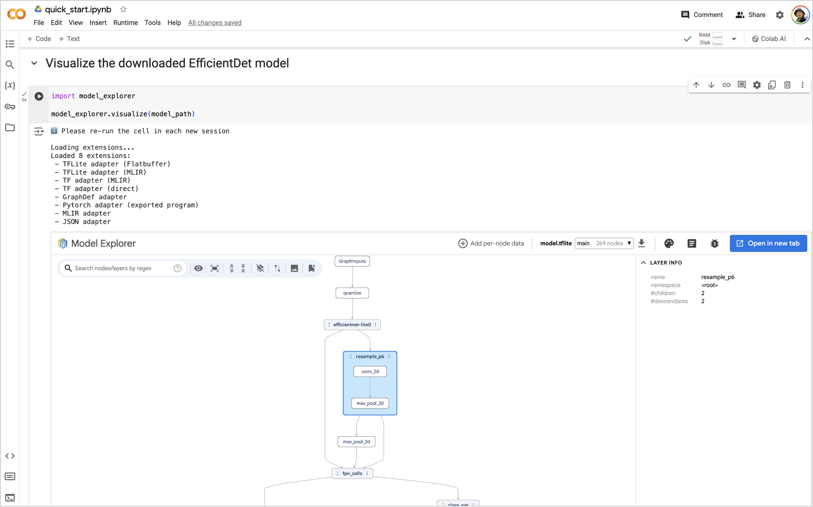

Model Explorer can be used directly in a Google Colab Notebook to visualize models accessible within its runtime. Check out the [quick start](https://github.com/google-ai-edge/model-explorer/blob/main/example_colabs/quick_start.ipynb) Colab.



# Installation

```
!pip install ai-edge-model-explorer
```

For a faster installation, run the following command. It skips the installation of most of the dependency packages which are already included in the default Colab runtime.

```
!pip install --no-deps ai-edge-model-explorer-adapter ai-edge-model-explorer
```

> [!NOTE]
> If you use the Colab **local runtime**, make sure to start it on supported platforms (macOS, Linux, or WSL on Windows)

# Run

You can use the same APIs described in the [API Guide](https://github.com/google-ai-edge/model-explorer/wiki/4.-API-Guide). For example:

```py
import model_explorer

model_explorer.visualize('/path/to/model')
```

After running the cell, Model Explorer will be displayed in an iFrame embedded in a new cell. You can use the [`colab_height`](https://github.com/google-ai-edge/model-explorer/wiki/4.-API-Guide#visualize-models-from-files) parameter to control the height of the UI. In **Chrome**, the UI will also show an "Open in new tab" button that you can click to show the UI in a separate tab.

> [!IMPORTANT]
> Model Explorer UI elements are saved in your notebook but require the generating cell to be re-executed each session to function. Always re-run the relevant cell when reopening the notebook.

> [!NOTE]
> Jupyter Notebook is not supported.
