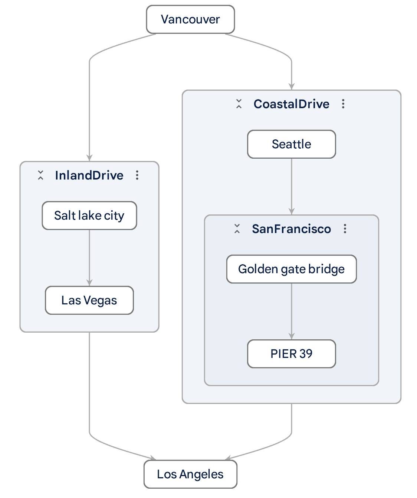
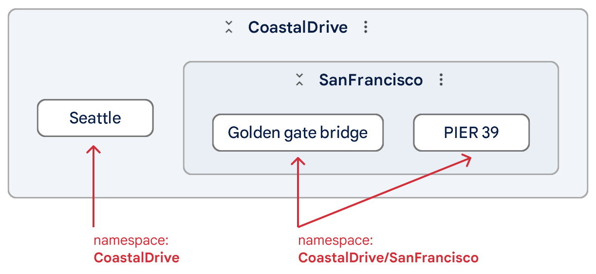
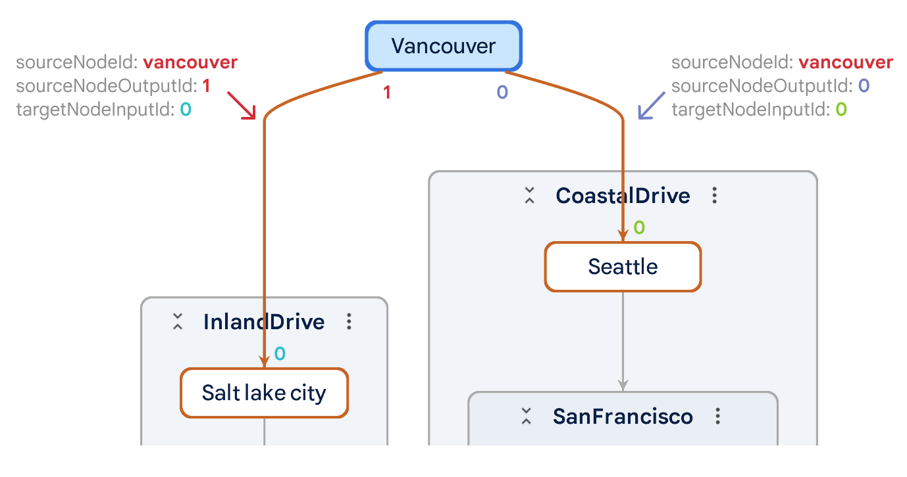
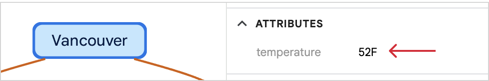
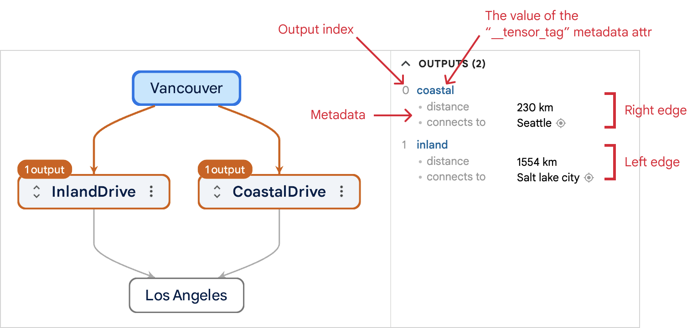
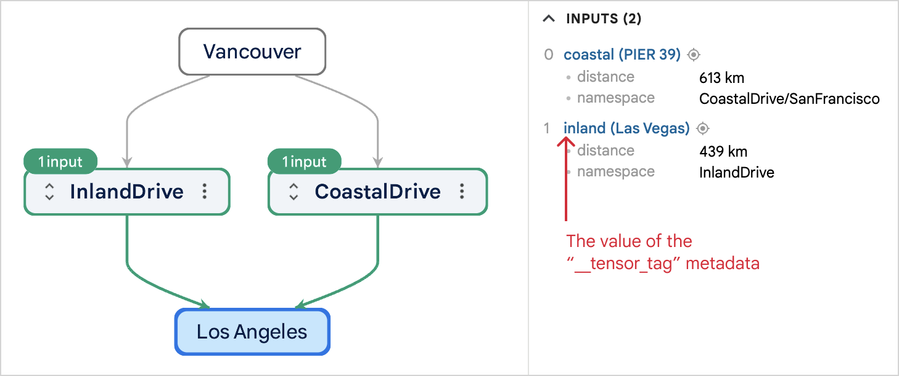

Adapters transform model files into an intermediate format that Model Explorer can understand and visualize. Model Explorer provides a set of built-in adapters for handling TF, TFLite, TFJS, MLIR, and PyTorch model types. You can also create your own adapter extensions to add support for other model types.

<br>

**Table of Contents**

* [Create an adapter extension](#create-an-adapter-extension)
  * [Setup development environment](#setup-development-environment)
  * [Create Python package](#create-python-package)
  * [Create the main adapter class](#create-the-main-adapter-class)
  * [Test the extension locally](#test-the-extension-locally)
  * [Construct `ModelExplorerGraphs`](#construct-modelexplorergraphs)
    * [Create graph](#create-graph)
    * [Add nodes](#add-nodes)
    * [Add edges](#add-edges)
    * [Add node attributes](#add-node-attributes)
    * [Add outputs metadata](#add-outputs-metadata)
    * [Add inputs metadata](#add-inputs-metadata)
    * [Add connections between graphs](#add-connections-between-graphs)
* [Publish and share the extension](#publish-and-share-the-extension)
* [Examples](#examples)


<br>

# Create an adapter extension

In this section, you'll learn how to create your first adapter extension for Model Explorer. To make things simpler, we will focus on the core concepts of adapter extension development without actually parsing the "model" file. The adapter extension we are building will add support for a imaginary `.test` model file type and will always return a hard-coded graph.

Let's get started!

## Setup development environment

Adapter extension is written in Python with version > 3.9. We first need to create a virtual environment and install the `model_explorer` package.

```shell
$ mkdir my_adapter && cd my_adapter
$ python3 -m venv venv
$ source venv/bin/activate
$ pip install ai-edge-model-explorer
```

## Create Python package

Create a Python package for the adapter with the following file structure. We recommend using the [src layout](https://packaging.python.org/en/latest/discussions/src-layout-vs-flat-layout/).

```shell
my_adapter/
├── pyproject.toml
└── src
    └── my_adapter
        └── main.py
```

> [!IMPORTANT]
> The main adapter code is required to be written in a `main.py` file.

Populate the `pyproject.toml` file with the minimum content below. The important part here is that the adapter depends on the `ai-edge-model-explorer` package. You are free to add other dependencies as needed.

```toml
[project]
name = "my-adapter"
version = "0.0.1"

dependencies = [
  "ai-edge-model-explorer"
]
```

To make the development process easier, use pip's [editable mode](https://pip.pypa.io/en/stable/cli/pip_install/#install-editable):

```shell
# Run it under the root "my_adaper" directory.
# Notice the "." at the end.
$ pip install -e .
```

## Create the main adapter class

In `main.py`, create your own adapter class that:

- Extends `model_explorer.Adapter`. By extending this base class, your adapter is automatically registered with Model Explorer when loaded. Make sure to call the `__init__` method of the parent class.
- Sets a `metadata:model_explorer.AdapterMetadata` class variable that provides the metadata of your adapter, such as name, description, source repo, and which file extensions it supports.
- Implements a `convert` method that takes the absolute path of a model and returns a `ModelExplorerGraphs`. See the next section for details on how to construct it.

For now, let's write the following code to create the basic adapter skeleton that just returns an empty graph. We will implement the `convert` method in the next section.

```py
# main.py

from typing import Dict
from model_explorer import Adapter, AdapterMetadata, ModelExplorerGraphs, graph_builder


class MyAdapter(Adapter):

  metadata = AdapterMetadata(id='my_adapter',
                             name='My first adapter',
                             description='My first adapter!',
                             source_repo='https://github.com/user/my_adapter',
                             fileExts=['test'])

  # Required.
  def __init__(self):
    super().__init__()

  def convert(self, model_path: str, settings: Dict) -> ModelExplorerGraphs:
    return {'graphs': []}
```

## Test the extension locally

After writing the skeleton adapter class in the previous section, the extension should already be functional (it will just return an empty graph). To try it out, first create an empty file `model.test`

```shell
$ touch model.test
```

Then run the following command to start Model Explorer and pass the `my_adapter` module through the `--extensions` flag.

```shell
$ model-explorer model.test --extensions=my_adapter
```

> [!NOTE]
> The `--extensions` flag accepts the *module* names, not the package name. The module name is the directory name of the `main.py` file.

If everything works correctly, the console should print that your extension has been successfully loaded, and Model Explorer will be opened in a browser tab showing a "no graphs" message. For any errors, the stack trace will be printed out in the console to help you debug.

```
Loading extensions...
 - ...
 - My first adapter  <-- your adapter's name
 - JSON adapter
```

In the next section, we will construct a graph step by step. After each step, feel free to run this command again to see the results.

## Construct `ModelExplorerGraphs`

In the `convert` method, you would typically parse the model from `model_path` (the absolute path), and construct a `ModelExplorerGraphs` object defined as follows:

```py
ModelExplorerGraphs = TypedDict(
    'ModelExplorerGraphs',
    {'graphs': NotRequired[list[Graph]],
     'graphCollections': NotRequired[list[GraphCollection]]})
```

In most cases, you will only need to populate the `graphs` field with a list of `Graph` objects. The `Graph` object is the internal representation of a graph that Model Explorer can understand and visualize. One model can have one or more `Graph`s. The [`model_explorer.graph_builder`](https://github.com/google-ai-edge/model-explorer/blob/main/src/server/package/src/model_explorer/graph_builder.py) module provides a set of [data classes](https://docs.python.org/3/library/dataclasses.html) to help you easily construct a `Graph`. See the comments there for most up-to-date documentation.

In this adapter, we are **not** going to actually parse the input model file. Instead, we will use the graph builder classes to create a static graph that shows a road trip plan that goes from Vancouver to Los Angeles. The finished graph looks like this:



Let's build this graph step by step:

### Create graph.

A model can have multiple graphs. Their ids should be unique within the model. For this adapter, we will only create one graph.

```py
# Create a graph for my road trip.
graph = graph_builder.Graph(id='road_trip')

# Update the return statement:
return {'graphs': [graph]}
```

### Add nodes

In adapter, the term "node" specifically refers to an "op node". To construct your visualization, you only need to create these op nodes within a graph.

Use the `graph_builder.GraphNode` class to create a node. Use the `namespace` parameter to specify which layer this node is in, and Model Explorer will automatically associate the correct layer for that node.



> [!TIP]
> Model Explorer will automatically remove a layer if there is only one op node as its child. You can change this behavior in [settings](https://github.com/google-ai-edge/model-explorer/wiki/2.-User-Guide#settings) (by turning on the `Keep layers with a single op node child` switch).

Add the following code after the graph is created.

```py
###################
# Add nodes.

# Create start and end node.
#
# They are located at root level hence the empty `namespace` parameter.
vancouver = graph_builder.GraphNode(
    id='vancouver', label='Vancouver', namespace='')
la = graph_builder.GraphNode(id='la', label='Los Angeles', namespace='')

# Create a node for Seattle and put it into a 'coastal drive' layer.
seattle = graph_builder.GraphNode(
    id='seattle', label='Seattle', namespace='CoastalDrive')

# Create San Francisco as a sublayer of the CoastalDrive layer and add some
# tourist sites there.
sf_golden_gate_bridge = graph_builder.GraphNode(
    id='sf_golden_gate_bridge', label='Golden gate bridge',
    namespace='CoastalDrive/SanFrancisco')
sf_pier_39 = graph_builder.GraphNode(
    id='sf_pier_39', label='PIER 39',
    namespace='CoastalDrive/SanFrancisco')

# Create another two cities and put them into an 'inland drive' layer.
salt_lake_city = graph_builder.GraphNode(
    id='salt_lake_city', label='Salt lake city', namespace='InlandDrive')
las_vegas = graph_builder.GraphNode(
    id='las_vegas', label='Las Vegas', namespace='InlandDrive')

# Add all the nodes into graph.
graph.nodes.extend([vancouver, la, seattle, sf_golden_gate_bridge,
                    sf_pier_39, salt_lake_city, las_vegas])
```


### Add edges

Edges are used to connect pairs of Op nodes. You only need to create edges between Op nodes, as Model Explorer will automatically infer the connections between layers based on the links you create between the nodes within those respective layers.

To create an edge, use the `graph_builder.IncomingEdge` class and add each edge to the `incomingEdges` list of its **target node**. Define the edge's source using `sourceNodeOutputId` within the specified `sourceNodeId`, and its destination using `targetNodeInputId` on the target node. As a convention, if not explicitly defined, the default output and input ids are set to "0".



Add the following code after the "add nodes" section.

```py
###################
# Add edges.

# Connect edges along the cities for coastal drive.
la.incomingEdges.append(
    graph_builder.IncomingEdge(sourceNodeId='sf_pier_39'))
sf_pier_39.incomingEdges.append(
    graph_builder.IncomingEdge(sourceNodeId='sf_golden_gate_bridge'))
sf_golden_gate_bridge.incomingEdges.append(
    graph_builder.IncomingEdge(sourceNodeId='seattle'))
seattle.incomingEdges.append(
    graph_builder.IncomingEdge(sourceNodeId='vancouver'))

# Connect edges along the cities for inland drive.
#
# LA has two incoming edges from pier_39 and las_vegas.
# We use targetNodeInputId to identify these two edges. pier_39 goes into
# input id '0' (default), and las_vegas goes into input id '1'.
la.incomingEdges.append(graph_builder.IncomingEdge(
    sourceNodeId='las_vegas', targetNodeInputId='1'))
las_vegas.incomingEdges.append(
    graph_builder.IncomingEdge(sourceNodeId='salt_lake_city'))

# Vancouver has two outgoing edges to seattle and salt_lake_city.
# We use sourceNodeOutputId to identify these two edges. Vancouver's output
# id '0' (default) goes to seattle, and its output id '1' goes to salt_lake_city.
salt_lake_city.incomingEdges.append(
    graph_builder.IncomingEdge(sourceNodeId='vancouver',
                               sourceNodeOutputId='1'))

```

### Add node attributes

Node attributes are key-value pairs attached to a node. They will be displayed in the "Attributes" section in the side panel. In this adapter, let's add a "temperature" attribute for each node to store the place's temperature.

To add an attribute, create a `graph_builder.KeyValue` object and add it to a node's `attrs` list.



Add the following code after the "add edges" section.


```py
#######################
# Add node attributes.

temperatures = ['52F', '74F', '55F', '64F', '65F', '62F', '90F']
for i, node in enumerate(graph.nodes):
    node.attrs.append(graph_builder.KeyValue(
        key="temperature", value=temperatures[i]))
```

### Add outputs metadata

Output metadata is used to attach metadata (KeyValue pairs) to a node's **outgoing** edge identified by the output id. It will be displayed in the "Inputs" and "Outputs" section in the side panel. In this adapter, let's add a "distance" metadata for each outgoing edge to store the distance between two places connected by the edge.

To add outputs metadata, create a `graph_builder.MetadataItem` and add it to a node's `outputsMetadata` list. Each item in `MetadataItem` has an `id` that corresponds to the output id of the edge, and a list of `KeyValue` pairs for the metadata for that edge.

> [!TIP]
> There are several special metadata attribute keys (optional) Model Explorer looks for:
> - `__tensor_tag`: The value for this key will serve as the label of the output in the UI.
> - `shape`: The value for this key will be rendered as edge label when "Tensor shape" is checked in the [View on node](https://github.com/google-ai-edge/model-explorer/wiki/2.-User-Guide#overlay-data-on-nodesedges) menu.



Add the following code after the "add node attributes" section.

```py
#######################
# Add output metadata.

# This is the edge from vancouver to seattle.
vancouver.outputsMetadata.append(graph_builder.MetadataItem(
    # This identifies which output id the metadata attached to.
    #
    # From the "add edges" section we know that output id "0" connects to
    # seattle.
    id='0',
    attrs=[graph_builder.KeyValue(key='distance', value='230 km'),
           # "__tensor_tag" is a special metadata key whose value will be
           # used as output name in side panel.
           graph_builder.KeyValue(key='__tensor_tag', value='coastal')]))

# This is the edge from vancouver to salt_lake_city.
vancouver.outputsMetadata.append(graph_builder.MetadataItem(
    # From the "add edges" section we know that output id "1" connects to
    # salt_lake_city.
    id='1',
    attrs=[graph_builder.KeyValue(key='distance', value='1554 km'),
           graph_builder.KeyValue(key='__tensor_tag', value='inland')]))

# Add other distances
def add_distance_output_metadata(from_node: graph_builder.GraphNode, distance: str):
    from_node.outputsMetadata.append(graph_builder.MetadataItem(
        id='0',
        attrs=[graph_builder.KeyValue(key='distance', value=distance)]))

add_distance_output_metadata(salt_lake_city, '677 km')
add_distance_output_metadata(las_vegas, '439 km')
add_distance_output_metadata(seattle, '1310 km')
add_distance_output_metadata(sf_golden_gate_bridge, '10 km')
add_distance_output_metadata(sf_pier_39, '613 km')
```

### Add inputs metadata

As mentioned in the previous section, the metadata for an edge is stored in its **source node**'s `outputsMetadata`. You don't need to duplicate that data in its **target node**'s `inputsMetadata`.

Some of our built-in adapters store the following fields in `inputsMetadata`:
-  __tensor_tag (optional): The value will serve as the name of a node's inputs shown in the "Inputs" section in the side panel.
- quantization (optional): The quantization related parameters.



<br>
<br>

Add the following code after the "add outputs metadata" section.

```py
#######################
# Add inputs metadata.

la.inputsMetadata.append(graph_builder.MetadataItem(
    id='0', attrs=[graph_builder.KeyValue(key='__tensor_tag', value='coastal')]))
la.inputsMetadata.append(graph_builder.MetadataItem(
    id='1', attrs=[graph_builder.KeyValue(key='__tensor_tag', value='inland')]))
```

### Add connections between graphs

Model Explorer supports jumping from one graph to another if a model contains multiple connected graphs (e.g., a parent graph with subgraphs). See the [guide](https://github.com/google-ai-edge/model-explorer/wiki/2.-User-Guide#jump-from-one-graph-to-another) for more info.

To establish the connections, set the subgraph ids in the `subgraphIds` field in the anchor `GraphNode`.

# Publish and share the extension

Once you are satisfied with the extension, publish the package to PyPI so other users can try it too. A user can use your extension by running the following command:

```shell
$ pip install ai-edge-model-explorer my-adapter
$ model-explorer --extensions=my_adapter
```

# Examples

- [My adapter](https://github.com/google-ai-edge/model-explorer/tree/main/src/example_adapters/my_adapter): this is the adapter used in this guide.
- [GraphViz DOT adapter](https://github.com/google-ai-edge/model-explorer/tree/main/src/example_adapters/graphviz_dot_adapter): add support for the [GraphViz DOT](https://graphviz.org/pdf/dotguide.pdf) format.
- [PyTorch ExportedProgram adapter](https://github.com/google-ai-edge/model-explorer/blob/main/src/server/package/src/model_explorer/builtin_pytorch_exportedprogram_adapter.py): this is one of the built-in adapters in Model Explorer. It converts a `.pt2` file generated by [torch.export](https://pytorch.org/docs/stable/export.html#serialization) to Model Explorer graphs.
